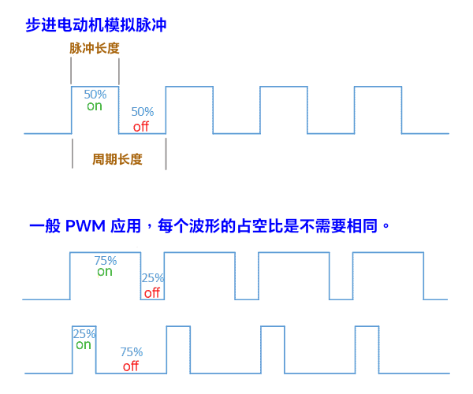

<style>
  table {
    width: 100%
    }
  td {
    vertical-align: center;
  }
  table.inputT{
    margin: 10px;
    width: auto;
    margin-left: auto;
    margin-right: auto;
    border: none;
  }
  input{
    text-align: center;
    padding: 0px 10px;
  }
  iframe{
    width: 100%;
    display: block;
    border-style:none;
  }
</style>


# ESP RMT（远程控制收发器）

ESP32 模组中有个 RMT 类别可以扩展为多功能通用收发器，发送或接收许多其他类型的信号。虽然原用途并不是拿来做 PWM，但因设计上的巧合, 刚好可以用来变造成可自订不同频率的 PWM。

因 RMT 添加到 TX 缓冲区的每个项目都是 32 位的信号。体现在 IO 上也就是高低电平。对于步进机，可使用成对的相同高/低项目。构建成不同频率，而频率时间取决于使用的时钟分频器。

由於 RMT 有 **8** 個通道, 所以就等於有 **8** 個可隨意自訂頻率的 PWM 可以使用。

## 时脉除频器

时脉除频器 (clock divider)，决定 RMT 发射器产生的脉冲长度范围或接收器的判别。通过设置 clk_div 为 **1** 至 **255** 范围内的一个值来选择。RMT 的源时钟通常为APB CLK，默认为 **80Mhz**。

注意，由于 RMT 选择的时钟分频器不同。因此每一個时间刻度为:

$$
一脉冲长度 = \frac {1s} {80MH_z} \times {时脉除频器_{[1..255]}} \\ = 0.0125 \mu s \approx  3.1875 \mu s
$$

注预设指定交替高低电位的持续脉冲长度最長为 **0~32767**。

## RMT 可制作的频率区间

如果要模拟脉冲在步进电动机。一周期为一开一关，需要两个脉冲长度。

$$
一周期长度 = 2 \times 32767 \times \frac {1 \mu s} {80} \times {时脉除频器_{[1..255]}} \\ = 819.175 \mu s \approx  208889.625 \mu s
$$

最慢的频率区间

$$
最慢的频率_{[1..255]} = \frac {80,000,000} {65534 \times 时脉除频器_{[1..255]}} \\
最低频率带宽_{[1..255]} = 1.221 kH_z \approx \color{red}{4.787} H_z
$$

$$
最快的频率_{[1..255]} = \frac {80,000,000} {2 \times 时脉除频器_{[1..255]}} \\
最高频率带宽_{[1..255]} = \color{red}{40} MH_z \approx 156.286 kH_z
$$

即远程控制收发器的频率带宽为：

$$
频率带宽 = \color{red}{40} MH_z \approx \color{red}{4.787} H_z
$$

## 步进电动机模拟脉冲

用 RMT 来设计 PWM 模拟步进电动机所需要的脉冲信号。

- 製作 **1000** Hz 即 **1000** PPS 的信号源, 可以计算出周期为：

$$
\frac {1}{H_z} = \frac {1s}{1000} = 1000 \mu s,
$$

因为是方波信号，所以占空比为 **50%** 也就是

$$
\frac {1000\mu s}{2} = 500 \mu s
$$

为高电平与低电平各自持续的时间。

根据以上公式。如时脉除频器设为**200**。即好下

$$
一脉冲长度 = \frac {1 \mu s} {80} \times {200} \\ = 2.5 \mu s
$$

所以步进电动机就需要 **200** 个脉冲长度正。再 **200** 个脉冲长度负的循环信号脉冲。

## 脉宽调变

PWM (Pulse Width Modulation) 称为脉宽调变，它不是一种汇流排分析协定。主要是利用脉冲宽度之周期对类比电路进行控制的一种非常有效的技术，广泛应用在一些电源控制、转速控制、亮度控制和温度控制等。在电源控制方面，PWM 常被使用于调节电压或功率的应用。



RMT 是描述一个脉冲在 IDF 中类型好下：

```c
typedef union {
    struct {
        uint16_t duration0 : 15;
        uint16_t level0 : 1; 
        uint16_t duration1 : 15; 
        uint16_t level1 : 1; 
    };
uint32_t val; 
} rmt_symbol_word_t;
```

是内联，里面的结构体和 val 的值共用内存。

struct 有四个字段：

 - duration0：第一个电平的时长，后面的冒号和15表示它占 15 位；
 - level0：表示第一个电平值，占一位；
 - duration1：第二个电平的时长，占 15 位；
 - level1：第二个电平的值，占一位。

四个字段加起来是 **32** 位。val 的类型是 uint32 ，无符号32位整数。前面的结构体和 val 是不是大小相同。都是4个字节于是，它们用同一块内存，这个 **rmt_symbol_word_t** 可以用四个字段去设置它，也可以直接用一个整数去设置。C 语言是直接操作内存的，可以强制转换，在后面调用相关函数时，可以取地址直接赋值给 void* （指针）。

这个以字叫 RMT 描述符号。一个符号字只描述一个周期的脉冲。可理解为：一个符号字就是代表一个二进制位。有几个二进制位就得发送几个符号。

ESP 32 新的 IDF 直接配置频率更直观。

## 通信设备开发流程

下面规律，不管用的什么开发板，芯片，平台，大部分外部设备的通信都是这样的流程：

 - 配置参数
 - 初始化
 - 加载驱动（在 init 时就完成，部分台可省略）
 - 读/写数据
 - 清理资源

### 配置阶段 (rmt_tx_channel_config_t)

RMT API 定义专门的结构体，用于配置参数。

```c
typedef struct {
    gpio_num_t gpio_num;
    rmt_clock_source_t clk_src;
    uint32_t resolution_hz; 
    size_t mem_block_symbols;  
    size_t trans_queue_depth; 
    int intr_priority; 
    struct {
        uint32_t invert_out: 1;  
        uint32_t with_dma: 1;    
        uint32_t io_loop_back: 1;
        uint32_t io_od_mode: 1;  
    } flags; 
} rmt_tx_channel_config_t;
```

这是配置发送的，如接收数据，要用 rmt_rx_channel_config_t，注意，接收和发送的函数是分布在两个头文件中的，发送是 **rmt_tx.h**，接收是 **rmt_rx.h**。

 - gpio_num：用来发信号的引脚，GPIO 号。
 - clk_src：振动的时钟源，一般为 RMT_CLK_SRC_DEFAULT 默认 APB 时钟，80MHz。
 - resolution_hz：直接设置频率了，不用分频。
 - mem_block_symbols：分配内存量，常用 64。大小是符号字**rmt_symbol_word_t**，是最以上介绍那个 **32** 位两个阶段那个。
 - trans_queue_depth：队列深度，一般，4 或 8 均可。因数据在传输时是放进一个队列中，然后驱动层会调度这个队列发出。
 - intr_priority：中断的优先值，一般保持默认。

此结构体内嵌了一个 flags 结构体。

 - invert_out：是否电平反向，一般保持默认。
 - with_dma：是否走 DAM 通道，不占用CPU运算资源；
 - io_loop_back：一般没用。
 - io_od_mode：是否设置为开漏模式。

### 初始化阶段 (rmt_new_tx_channel)

配置完相关参数后，调用 rmt_new_tx_channel 函数，用已配置的参数创建通信通道。

```c
esp_err_t rmt_new_tx_channel(const rmt_tx_channel_config_t *config, rmt_channel_handle_t *ret_chan);
```

 - config 引用配置结构体实例，ret_chan 接收创建的通道句柄，后面在发送数据时要用。所以，在调用此函数前，先声明一个 rmt_channel_handle_t 类型的全局变量。

新版 API 虽然精简了许多，缺点是在配置好参数创建通道后，就不能再修改参数，除非重新初始化。


### 启用通道 (rmt_enable)

调用 rmt_enable 函数启用通道。

```c
esp_err_t rmt_enable(rmt_channel_handle_t channel);
```

channel 就是刚刚创建的通道。不启用通道，是无法接收和发送数据的。如果要禁用通道，可以调用 rmt_disable 函数。

```c
esp_err_t rmt_disable(rmt_channel_handle_t channel);
```

### 创建编码器 (rmt_encoder_t)

创建编码器可以在启用通道之前完成，顺序不重要。IDF 内置两个编码器：

 - bytes encoder：就是字节数组转换为符号字 **rmt_symbol_word**
 - copy encoder：是不处理不转换，直接把符号字传给，然后复制到驱动层的内存中，放入队列准备发送。避免内存泄漏的风险。

当然，也可以写独立的编码器。我参考 rmt_encoder_t 结构体。

```c
struct rmt_encoder_t {
    /* 编码时用 */
    size_t (*encode)(rmt_encoder_t *encoder, rmt_channel_handle_t tx_channel, const void *primary_data, size_t data_size, rmt_encode_state_t *ret_state);
    esp_err_t (*reset)(rmt_encoder_t *encoder); // 重置编码器参数时用 
    esp_err_t (*del)(rmt_encoder_t *encoder); // 清理编码器时用
};
```

这个结构体的成员都是函数指针，让它们分别指向定义的函数，实现了自定义编码。为什么函数的输入参数还要 rmt_encoder_t。是因为 C 结构体不能继承，要想实现类继承的功能，就得定义一个更大的结构体，然后大结构体中引用 **rmt_encoder_t**，模拟调用基类成员。

这两个函数都声明在 **rmt_common.h** 头文件中。

```c
typedef struct rmt_bytes_encoder_t {
    rmt_encoder_t base;     // 编码器基类
    size_t last_bit_index;  // 编码字节中编码位位置的索引
    size_t last_byte_index; // 主流中编码字节的索引
    rmt_symbol_word_t bit0; // 位零表示
    rmt_symbol_word_t bit1; // 位一代表
    struct {
        uint32_t msb_first: 1; // 首先编码 MSB
    } flags;
} rmt_bytes_encoder_t;

typedef struct rmt_copy_encoder_t {
    rmt_encoder_t base;       // 编码器基类
    size_t last_symbol_index; // 主流中的符号位置索引
} rmt_copy_encoder_t;
```

是定义一个结构体，然后里面有个 **base**，**base** 就是 **rmt_encoder_t** 类型，这就等于从抽象基类派生出  **rmt_bytes_encoder** 和 **rmt_copy_encoder** 类型，其他成员则用于参数配置。访问 encode、reset、del 函数指针时就通过 S.base.encode(....) 来调用。当然如自订不一定要搞那么复杂，就是按 **rmt_encoder_t** 结构的三个函数指针成员，引用重写的函数就行。

 - 初始化 **bytes encoder** 使用 **rmt_new_bytes_encoder** 函数
 - 初始化 **copy encoder** 使用 **rmt_new_copy_encoder** 函数。

调用函数前，先声明  **rmt_encoder_handle_t** 类型的变量，该变量会引用创建的编码器，由函数的 **ret_encoder** 参数赋值。

```c
esp_err_t rmt_new_bytes_encoder(const rmt_bytes_encoder_config_t *config, rmt_encoder_handle_t *ret_encoder);
esp_err_t rmt_new_copy_encoder(const rmt_copy_encoder_config_t *config, rmt_encoder_handle_t *ret_encoder);
```

创建编码器后用变量保存引用，不需要手动调用，传输数据时会自动调用。

### 发送数据 (rmt_transmit)

发送数据调用 **rmt_transmit** 函数，参数包括：
 - 刚创建的通道
 - 编码器
 - 发送的符号字数组（多个符号字一同推入队列，不必一个一个推）。

调用此函数是把消息放进传输队列，至于是否立即发送，由队列及驱动层自行处理。

如不使用中断，但需要数据发出去了再执行后面的程序代码，那可以调用 **rmt_tx_wait_all_done** 函数，它会等待指定的时间，直到数据发送出去才返回。等待时间可以用最大值 **portMAX_DELAY**。

### 清理

如果程序不是一直发数据，或只是特定时候发送。那传输完数据后应当清理相应的对象。

 - rmt_del_encoder：清除刚创建的编码器。
 - rmt_disable：禁用通道。主流中的符号位置索引
 - rmt_del_channel：清除通道。

## 步进电动机例子

### 声明相关参数

```c
#define GPIO_NUM  25        // 引脚号
#define TICK_FREQ 2000      // 频率 2kHz = 500us
#define STEP_NUM  1         // 步数
```

这里率设置为 **10** MHz，即为 500 us。因为电平时 500us - 1000us，所以把 Tick 精确到 500 us，这样好控制。

### 声明全局变量

```c
static rmt_channel_handle_t txChannel;
static rmt_encoder_handle_t rfEncoder;
static rmt_symbol_word_t zeroSymbol, oneSymbol, resetSymbol;
static rmt_symbol_word_t Step[24 * LED_NUM] = {0};
```

注意符号字数组，大小是灯珠数 * 24。为什么24呢？因为 RGB 数据加起来24位，一个符号字只能描述一个位。

zeroSymbol 表示发送 0 时的电平，表示发送 1 时的电平，resetSymbol 是复位电平，每发完一次数据都要一个复位电平，告诉 WS2812 我这儿发送完了。这几个电平信息的初始化代码：

```c
void init_symbols()
{
    // 0码高电平
    zeroSymbol.duration0 = 0.4 * (TICK_FREQ / 1000000);
    zeroSymbol.level0 = 1;
    // 0码低电平
    zeroSymbol.duration1 = 0.8 * (TICK_FREQ / 1000000);
    zeroSymbol.level1 = 0;

    // 1码高电平
    oneSymbol.duration0 = 0.8 * (TICK_FREQ / 1000000);
    oneSymbol.level0 = 1;
    // 1码低电平
    oneSymbol.duration1 = 0.4 * (TICK_FREQ / 1000000);
    oneSymbol.level1 = 0;

    // 复位信号全为低电平
    resetSymbol.duration0 = 25 * (TICK_FREQ / 1000000);
    resetSymbol.level0 = 0;
    resetSymbol.duration1 = 25 * (TICK_FREQ / 1000000);
    resetSymbol.level1 = 0;
}
```

0 码这里设置的是 高电平持续 0.4 us，低电平持续 0.8 us；1 码相反。这里0.3-0.4，0.7-0.8都可以，老周这里设置大一点的值，不容易抽风。如果设置0.3 和 0.7，在 ESP32 Pico 上有时候会抽风（有的灯珠不亮或颜色不对）。

这个时间算的是 tick 周期计数，我们设的频率是每周期 0.1 us，除以1000000 就是一微秒内会 tick 多少次，这里就是 1 us tick 10 次，那么，0.4 us 就是 tick 0.4 * 10 = 4 次。就是这么算出来的。复位信号全是低电平，按数据手册是最少 50us，这里把50分两段，即电平1=25us，电平2=25us，电平值全为0。

那么，RGB 怎么转为符号字呢？WS 2812c 中是 GRB 排列的，其他的芯片可以查资料，或者多次试验来验证顺序。颜色值总共就 24 位，更简洁的方法是用一个 32 位整数来表示一个颜色。发送时从高位开始处理，每处理一位，就向左移一位。直接看代码。

```c
void set_rgb(int index, uint32_t grb)
{
    if (index < 0 || index > LED_NUM - 1)
    {
        return; // 索引无效
    }
    // 循环的开始和结束索引
    int startIdx = index * 24;
    int endIdx = startIdx + 24;
    for (int i = startIdx; i < endIdx; i++)
    {
        if (grb & 0x00800000)
        {
            // 1
            rgbSymbols[i] = oneSymbol;
        }
        else
        {
            // 0
            rgbSymbols[i] = zeroSymbol;
        }
        // 左移一位
        grb <<= 1;
    }
}
```

index 是某个灯珠的索引，每一次处理都跟 0x00800000 进行“与”运算，就是确定第 24 位（最高）位是否为1，若为1就用 oneSymbol 变量的值，若为0就用 zeroSymbol 变量的值，赋值一轮后，让颜色值左移一位，就能实现从高位到低位发送了。

下面代码初始化发送通道和编码器。

```c
void init_tx_channel()
{
    rmt_tx_channel_config_t cfg = {
        // GPIO
        .gpio_num = GPIO_NUM,
        // 时钟源：默认是APB
        .clk_src = RMT_CLK_SRC_DEFAULT,
        // 分辨率，即频率
        .resolution_hz = TICK_FREQ,
        // 内存大小，指的是符号个数，不是字节个数
        .mem_block_symbols = 64,
        // 传输队列深度，不要设得太大
        .trans_queue_depth = 4
        // 禁用回环（自己发给自己）
        //.flags.io_loop_back=0
    };
    // 调用函数初始化
    ESP_ERROR_CHECK(rmt_new_tx_channel(&cfg, &txChannel));
}

void init_encoder()
{
    // 目前配置不需要参数
    rmt_copy_encoder_config_t cfg = {};
    // 创建拷贝编码器
    ESP_ERROR_CHECK(rmt_new_copy_encoder(&cfg, &rfEncoder));
}
```

调用 API 时，可以嵌套在 ESP_ERROR_CHECK 宏中，它会自动检查调用是否成功，不成功就输出错误。

下面代码发送数据。

```c
void send_data()
{
    // 配置
    rmt_transmit_config_t cfg = {
        .loop_count = 0}; // 不要循环发送
    // 发送
    ESP_ERROR_CHECK(rmt_transmit(txChannel, rfEncoder, rgbSymbols, sizeof(rgbSymbols), &cfg));
    // 等待发送完毕
    // ESP_ERROR_CHECK(rmt_tx_wait_all_done(txChannel, portMAX_DELAY));
    // 发送复位信号
    ESP_ERROR_CHECK(rmt_transmit(txChannel, rfEncoder, &resetSymbol, 1, &cfg));
    // 等待完成
    ESP_ERROR_CHECK(rmt_tx_wait_all_done(txChannel, portMAX_DELAY));
}
```

在 app_main 函数中，先显示红色，一秒后显示蓝色，再过一秒显示绿色。

```c
while (1)
{
    // 红色
    for (i = 0; i < LED_NUM; i++)
    {
        set_rgb(i, COLOR_U32(0xff, 0x0, 0x0));
    }
    send_data();
    // 延时
    vTaskDelay(1000 / portTICK_PERIOD_MS);
    // 蓝色
    for (i = 0; i < LED_NUM; i++)
    {
        set_rgb(i, COLOR_U32(0x0, 0x0, 0xff));
    }
    send_data();
    // 延时
    vTaskDelay(1000 / portTICK_PERIOD_MS);
    // 绿色
    for (i = 0; i < LED_NUM; i++)
    {
        set_rgb(i, COLOR_U32(0x0, 0xff, 0x0));
    }
    send_data();
    // 延时
    vTaskDelay(1000 / portTICK_PERIOD_MS);
}
```

vTaskDelay 是 RTOS 系统移植函数，表示当前任务延时。注意这个延时函数的参数不是秒或毫秒，而是“跑多少圈” Tick。portTICK_PERIOD_MS 表示一毫秒 Tick 的步数。为什么是相除，不是相乘？这个，老周举一个不太恰当的例子：假如你跑一圈有 2000 步，现在我要你跑 8000 步，问你要跑几圈 ？答案就是 8000 / 2000 = 4 圈。就是这样。

这些 RTOS 函数在包含头文件时得小心，你得先包含 FreeRTOS.h，然后再包含其他头文件，否则容易报错。

下面是完整代码：

```c
#include <stdlib.h>
#include <string.h>
#include "driver/rmt_common.h"
#include "driver/rmt_encoder.h"
#include "driver/rmt_types.h"
#include "driver/rmt_tx.h"
#include "freertos/FreeRTOS.h"
#include "freertos/task.h"

// 声明区
#define GPIO_NUM 6             // 引脚号
#define TICK_FREQ 10 * 1000000 // 频率
#define LED_NUM 24             // 灯珠数目
// #define DELAY_MS 20            // 延时

// 将RGB转为GRB整数
#define COLOR_U32(r, g, b) ( \
    (uint32_t)g << 16 |      \
    (uint32_t)r << 8 |       \
    (uint32_t)b)

// 变量区
/* 发送通道 */
static rmt_channel_handle_t txChannel;
/* 编码器 */
static rmt_encoder_handle_t rfEncoder;
/* 消息符号 */
static rmt_symbol_word_t zeroSymbol, oneSymbol, resetSymbol;
/* 要传输的颜色数据 */
static rmt_symbol_word_t rgbSymbols[24 * LED_NUM] = {0};

/************* 自定义函数 ******************/
void init_tx_channel()
{
    rmt_tx_channel_config_t cfg = {
        // GPIO
        .gpio_num = GPIO_NUM,
        // 时钟源：默认是APB
        .clk_src = RMT_CLK_SRC_DEFAULT,
        // 分辨率，即频率
        .resolution_hz = TICK_FREQ,
        // 内存大小，指的是符号个数，不是字节个数
        .mem_block_symbols = 64,
        // 传输队列深度，不要设得太大
        .trans_queue_depth = 4
        // 禁用回环（自己发给自己）
        //.flags.io_loop_back=0
    };
    // 调用函数初始化
    ESP_ERROR_CHECK(rmt_new_tx_channel(&cfg, &txChannel));
}

/* 初始化符号 */
void init_symbols()
{
    // 0码高电平
    zeroSymbol.duration0 = 0.4 * (TICK_FREQ / 1000000);
    zeroSymbol.level0 = 1;
    // 0码低电平
    zeroSymbol.duration1 = 0.8 * (TICK_FREQ / 1000000);
    zeroSymbol.level1 = 0;

    // 1码高电平
    oneSymbol.duration0 = 0.8 * (TICK_FREQ / 1000000);
    oneSymbol.level0 = 1;
    // 1码低电平
    oneSymbol.duration1 = 0.4 * (TICK_FREQ / 1000000);
    oneSymbol.level1 = 0;

    // 复位信号全为低电平
    resetSymbol.duration0 = 25 * (TICK_FREQ / 1000000);
    resetSymbol.level0 = 0;
    resetSymbol.duration1 = 25 * (TICK_FREQ / 1000000);
    resetSymbol.level1 = 0;
}

/* 初始化编码器 */
void init_encoder()
{
    // 目前配置不需要参数
    rmt_copy_encoder_config_t cfg = {};
    // 创建拷贝编码器
    ESP_ERROR_CHECK(rmt_new_copy_encoder(&cfg, &rfEncoder));
}

/* 设置颜色 */
void set_rgb(int index, uint32_t grb)
{
    if (index < 0 || index > LED_NUM - 1)
    {
        return; // 索引无效
    }
    // 循环的开始和结束索引
    int startIdx = index * 24;
    int endIdx = startIdx + 24;
    for (int i = startIdx; i < endIdx; i++)
    {
        if (grb & 0x00800000)
        {
            // 1
            rgbSymbols[i] = oneSymbol;
        }
        else
        {
            // 0
            rgbSymbols[i] = zeroSymbol;
        }
        // 左移一位
        grb <<= 1;
    }
}

/* 发送数据 */
void send_data()
{
    // 配置
    rmt_transmit_config_t cfg = {
        // 不要循环发送
        .loop_count = 0};
    // 发送
    ESP_ERROR_CHECK(rmt_transmit(txChannel, rfEncoder, rgbSymbols, sizeof(rgbSymbols), &cfg));
    // 等待发送完毕
    // ESP_ERROR_CHECK(rmt_tx_wait_all_done(txChannel, portMAX_DELAY));
    // 发送复位信号
    ESP_ERROR_CHECK(rmt_transmit(txChannel, rfEncoder, &resetSymbol, 1, &cfg));
    // 等待完成
    ESP_ERROR_CHECK(rmt_tx_wait_all_done(txChannel, portMAX_DELAY));
}

void app_main(void)
{
    // 1、初始化通道
    init_tx_channel();
    // 2、初始化符号
    init_symbols();
    // 3、初始化编码器
    init_encoder();
    // 4、使能通道
    ESP_ERROR_CHECK(rmt_enable(txChannel));

    int i;
    /* 进入循环 */
    while (1)
    {
        // 红色
        for (i = 0; i < LED_NUM; i++)
        {
            set_rgb(i, COLOR_U32(0xff, 0x0, 0x0));
        }
        send_data();
        // 延时
        vTaskDelay(1000 / portTICK_PERIOD_MS);

        // 蓝色
        for (i = 0; i < LED_NUM; i++)
        {
            set_rgb(i, COLOR_U32(0x0, 0x0, 0xff));
        }
        send_data();
        // 延时
        vTaskDelay(1000 / portTICK_PERIOD_MS);

        // 绿色
        for (i = 0; i < LED_NUM; i++)
        {
            set_rgb(i, COLOR_U32(0x0, 0xff, 0x0));
        }
        send_data();
        // 延时
        vTaskDelay(1000 / portTICK_PERIOD_MS);
    }
}
```

补充一下渐变效果。原理是用RGB的终值减去初值，然后各自除以灯珠数，得到一个平均递变的值。在循环时，除第一个和最后一个灯珠外，其他灯珠的颜色都用初值 + 插值 * 索引，就是每个灯珠都依次递增（减），最终趋近终值。

```c
// 初始值
uint8_t r0 = 255, g0 = 0, b0 = 0;
// 最终值
uint8_t r1 = 0, g1 = 0, b1 = 255;
// 计算要插补的均值
uint8_t ri, gi, bi;
ri = (r1 - r0) / LED_NUM;
gi = (g1 - g0) / LED_NUM;
bi = (b1 - b0) / LED_NUM;
// 循环设置灯珠颜色
for (i = 0; i < LED_NUM; i++)
{
    // 如果是第一个灯，直接用初值
    if (i == 0)
    {
        uint32_t color = COLOR_U32(r0, g0, b0);
        set_rgb(i, color);
        continue;
    }
    // 如果是最后一个灯，直接用终值
    if (i == LED_NUM - 1)
    {
        uint32_t c = COLOR_U32(r1, g1, b1);
        set_rgb(i, c);
        continue;
    }
    // 其他情况，用插值
    uint32_t color = COLOR_U32(
        r0 + i * ri,
        g0 + i * gi,
        b0 + i * bi);
    set_rgb(i, color);
}
// 发送
send_data();
// 等待3秒
vTaskDelay(3000 / portTICK_PERIOD_MS);
// 再来一次
r0 = 204;
g0 = 0;
b0 = 204;
r1 = 0;
g1 = 102;
b1 = 0;
// 计算插入均值
ri = (r1 - r0) / LED_NUM;
gi = (g1 - g0) / LED_NUM;
bi = (b1 - b0) / LED_NUM;
for (i = 0; i < LED_NUM; i++)
{
    if (i == 0)
    {
        uint32_t c = COLOR_U32(r0, g0, b0);
        set_rgb(i, c);
        continue;
    }
    if (i == LED_NUM - 1)
    {
        uint32_t c = COLOR_U32(r1, g1, b1);
        set_rgb(i, c);
        continue;
    }
    uint32_t c = COLOR_U32(
        r0 + i * ri,
        g0 + i * gi,
        b0 + i * bi);
    set_rgb(i, c);
}
// 发送
send_data();
// 等待3秒
vTaskDelay(3000 / portTICK_PERIOD_MS);
```


```c
#include "freertos/FreeRTOS.h"
#include "nvs_flash.h"
#include "driver/gpio.h"
#include "driver/rmt_tx.h"
#include "esp_log.h"
#include "esp_check.h"

#define CW 0
#define CCW 1
#define ON 0
#define OFF 1

struct stepper_pins stepper0; // 步进电机的初始端口
#define STEP_MOTOR_RESOLUTION_HZ 1000 // 1000Hz resolution
static const char *TAG = "example";

struct stepper_pins
{
  uint8_t ENA;
  uint8_t DIR;
  uint8_t PLU;
};

void setEnable(int value)
{
  gpio_set_level(stepper0.ENA, value);
}

void setDirection(int value)
{
  gpio_set_level(stepper0.DIR, value);
}

void setPlus(int steps, int ms)
{
  double delay = (double) ms / portTICK_PERIOD_MS;
  printf("--%lf,%ld",delay, portTICK_PERIOD_MS);
  for (int n = 0; n < steps; n++)
  {
    gpio_set_level(stepper0.PLU, OFF);
    vTaskDelay(delay);
    gpio_set_level(stepper0.PLU, ON);
    vTaskDelay(delay);
  }
}

typedef struct {
    uint32_t resolution;    // Encoder resolution, in Hz
    uint32_t sample_points; // Sample points used for deceleration phase. Note: |end_freq_hz - start_freq_hz| >= sample_points
    uint32_t start_freq_hz; // Start frequency on the curve, in Hz
    uint32_t end_freq_hz;   // End frequency on the curve, in Hz
} stepper_motor_curve_encoder_config_t;

typedef struct {
    rmt_encoder_t base;
    rmt_encoder_handle_t copy_encoder;
    uint32_t sample_points;
    struct {
        uint32_t is_accel_curve: 1;
    } flags;
    rmt_symbol_word_t curve_table[];
} rmt_stepper_curve_encoder_t;

static float convert_to_smooth_freq(uint32_t freq1, uint32_t freq2, uint32_t freqx)
{
    float normalize_x = ((float)(freqx - freq1)) / (freq2 - freq1);
    // third-order "smoothstep" function: https://en.wikipedia.org/wiki/Smoothstep
    float smooth_x = normalize_x * normalize_x * (3 - 2 * normalize_x);
    return smooth_x * (freq2 - freq1) + freq1;
}

static esp_err_t rmt_del_stepper_motor_curve_encoder(rmt_encoder_t *encoder)
{
    rmt_stepper_curve_encoder_t *motor_encoder = __containerof(encoder, rmt_stepper_curve_encoder_t, base);
    rmt_del_encoder(motor_encoder->copy_encoder);
    free(motor_encoder);
    return ESP_OK;
}

static size_t rmt_encode_stepper_motor_curve(rmt_encoder_t *encoder, rmt_channel_handle_t channel, const void *primary_data, size_t data_size, rmt_encode_state_t *ret_state)
{
    rmt_stepper_curve_encoder_t *motor_encoder = __containerof(encoder, rmt_stepper_curve_encoder_t, base);
    rmt_encoder_handle_t copy_encoder = motor_encoder->copy_encoder;
    rmt_encode_state_t session_state = RMT_ENCODING_RESET;
    uint32_t points_num = *(uint32_t *)primary_data;
    size_t encoded_symbols = 0;
    if (motor_encoder->flags.is_accel_curve) {
        encoded_symbols = copy_encoder->encode(copy_encoder, channel, &motor_encoder->curve_table[0],
                                               points_num * sizeof(rmt_symbol_word_t), &session_state);
    } else {
        encoded_symbols = copy_encoder->encode(copy_encoder, channel, &motor_encoder->curve_table[0] + motor_encoder->sample_points - points_num,
                                               points_num * sizeof(rmt_symbol_word_t), &session_state);
    }
    *ret_state = session_state;
    return encoded_symbols;
}

static esp_err_t rmt_reset_stepper_motor_curve_encoder(rmt_encoder_t *encoder)
{
    rmt_stepper_curve_encoder_t *motor_encoder = __containerof(encoder, rmt_stepper_curve_encoder_t, base);
    rmt_encoder_reset(motor_encoder->copy_encoder);
    return ESP_OK;
}

esp_err_t rmt_new_stepper_motor_curve_encoder(const stepper_motor_curve_encoder_config_t *config, rmt_encoder_handle_t *ret_encoder)
{
    esp_err_t ret = ESP_OK;
    rmt_stepper_curve_encoder_t *step_encoder = NULL;
    float smooth_freq;
    uint32_t symbol_duration;
    ESP_GOTO_ON_FALSE(config && ret_encoder, ESP_ERR_INVALID_ARG, err, TAG, "invalid arguments");
    ESP_GOTO_ON_FALSE(config->sample_points, ESP_ERR_INVALID_ARG, err, TAG, "sample points number can't be zero");
    ESP_GOTO_ON_FALSE(config->start_freq_hz != config->end_freq_hz, ESP_ERR_INVALID_ARG, err, TAG, "start freq can't equal to end freq");
     step_encoder = rmt_alloc_encoder_mem(sizeof(rmt_stepper_curve_encoder_t) + config->sample_points * sizeof(rmt_symbol_word_t));
     ESP_GOTO_ON_FALSE(step_encoder, ESP_ERR_NO_MEM, err, TAG, "no mem for stepper curve encoder");
     rmt_copy_encoder_config_t copy_encoder_config = {};
     ESP_GOTO_ON_ERROR(rmt_new_copy_encoder(&copy_encoder_config, &step_encoder->copy_encoder), err, TAG, "create copy encoder failed");
     bool is_accel_curve = config->start_freq_hz < config->end_freq_hz;

     // prepare the curve table, in RMT symbol format
     uint32_t curve_step = 0;
     if (is_accel_curve) {
         curve_step = (config->end_freq_hz - config->start_freq_hz) / (config->sample_points - 1);
        for (uint32_t i = 0; i < config->sample_points; i++) {
            smooth_freq = convert_to_smooth_freq(config->start_freq_hz, config->end_freq_hz, config->start_freq_hz + curve_step * i);
            symbol_duration = config->resolution / smooth_freq / 2;
            step_encoder->curve_table[i].level0 = 0;
            step_encoder->curve_table[i].duration0 = symbol_duration;
            step_encoder->curve_table[i].level1 = 1;
            step_encoder->curve_table[i].duration1 = symbol_duration;
        }
    } else {
        curve_step = (config->start_freq_hz - config->end_freq_hz) / (config->sample_points - 1);
        for (uint32_t i = 0; i < config->sample_points; i++) {
            smooth_freq = convert_to_smooth_freq(config->end_freq_hz, config->start_freq_hz, config->end_freq_hz + curve_step * i);
            symbol_duration = config->resolution / smooth_freq / 2;
            step_encoder->curve_table[config->sample_points - i - 1].level0 = 0;
            step_encoder->curve_table[config->sample_points - i - 1].duration0 = symbol_duration;
            step_encoder->curve_table[config->sample_points - i - 1].level1 = 1;
            step_encoder->curve_table[config->sample_points - i - 1].duration1 = symbol_duration;
        }
    }
    ESP_GOTO_ON_FALSE(curve_step > 0, ESP_ERR_INVALID_ARG, err, TAG, "|end_freq_hz - start_freq_hz| can't be smaller than sample_points");

    step_encoder->sample_points = config->sample_points;
    step_encoder->flags.is_accel_curve = is_accel_curve;
    step_encoder->base.del = rmt_del_stepper_motor_curve_encoder;
    step_encoder->base.encode = rmt_encode_stepper_motor_curve;
    step_encoder->base.reset = rmt_reset_stepper_motor_curve_encoder;
    *ret_encoder = &(step_encoder->base);
    return ESP_OK;
 err:
    if (step_encoder) {
        if (step_encoder->copy_encoder) {
            rmt_del_encoder(step_encoder->copy_encoder);
        }
        free(step_encoder);
    }
    return ret;
}

void app_main(void)
{
  nvs_flash_init();
  stepper0.ENA = 27;
  stepper0.DIR = 26;
  stepper0.PLU = 25;
  gpio_set_direction(stepper0.ENA, GPIO_MODE_OUTPUT);
  gpio_set_direction(stepper0.DIR, GPIO_MODE_OUTPUT);
  gpio_set_direction(stepper0.PLU, GPIO_MODE_OUTPUT);
  setEnable(ON);
  setDirection(CW);
  int ms = 1;
  printf("--->%d", ms);
  setPlus(200, ms);

  const static uint32_t accel_samples = 500;
  rmt_channel_handle_t motor_chan = NULL;
  rmt_tx_channel_config_t tx_chan_config = {
      .clk_src = RMT_CLK_SRC_DEFAULT, 
      .gpio_num = stepper0.PLU,
      .mem_block_symbols = 64,
      .resolution_hz = STEP_MOTOR_RESOLUTION_HZ,
      .trans_queue_depth = 10, 
  };
  rmt_transmit_config_t tx_config = {
      .loop_count = 0,
  };

  stepper_motor_curve_encoder_config_t accel_encoder_config = {
      .resolution = STEP_MOTOR_RESOLUTION_HZ,
      .sample_points = 500,
      .start_freq_hz = 500,
      .end_freq_hz = 1200,
  };
  rmt_encoder_handle_t accel_motor_encoder = NULL;

  ESP_ERROR_CHECK(rmt_new_stepper_motor_curve_encoder(&accel_encoder_config, &accel_motor_encoder));
  ESP_ERROR_CHECK(rmt_new_tx_channel(&tx_chan_config, &motor_chan));
  ESP_ERROR_CHECK(rmt_enable(motor_chan));
  ESP_ERROR_CHECK(rmt_transmit(motor_chan, accel_motor_encoder, &accel_samples, sizeof(accel_samples), &tx_config));    
  ESP_ERROR_CHECK(rmt_tx_wait_all_done(motor_chan, -1));

  vTaskDelay(pdMS_TO_TICKS(1000));
}
```