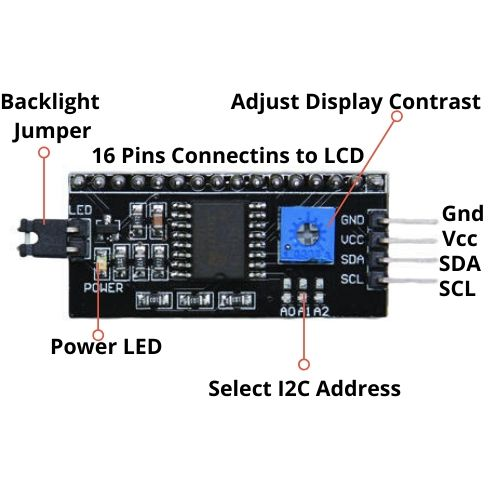

# ESP LCD（1602液晶屏）

**1602A** 的LCD液晶顯示屏，能夠顯示2行文字，每行16字的容量，背部帶有顯示器接駁器，建議在一般情況下都使用有 **PCF8574** 背板的LCD，它是I2C的介面，只要接4條線就能使用。

 - CGROM : 字模存储用空间。显示某个ASCII字符时，要显示字符的字模就存在这里。
 - DDRAM : 显示用RAM。直接和屏幕上的点相对应。屏幕上的一个点和DDRAM中的一个位对应。

CGRAM : 允许用户自建字模区的空间。从CGROM表上可以看到，在表的最左边是一列可 以允许用户自定义的CGRAM，从上往下看着是16个，实际只有8个字节可用。它的字符码 是00000000－00000111这8个地址，表的下面还有8个字节，但因为这个CGRAM的字符码 规定0－2位为地址，3位无效，4－7全为零（表上的高位）。因此CGRAM的字符码只有最 后三位能用也就是8个字节了。等效为0000X111，X为无效位，最后三位为000－111共8 个。

**总结**：DDRAM是用来使液晶屏显示的，CGROM是液晶屏可以显示的内容（在CGROM 表中查看），CGRAM是用来扩展液晶屏可以显示的内容。

**PCF8574** 是一款硅 CMOS 电路。通过两路双向总线（I2C 总线）为大多数微控制器系列提供通用远程 **I/O** 扩展。器件由8位准双向端口和 I2C 总线接口组成。PCF8574具有低电流消耗且包含具备高电流驱动能力的锁存输出，用于直接驱动LED。还具有中断线路(INT)，可连接至微控制器的中断逻辑。通过在此线路发送中断信号，远程I/O可通知微控制器其端口上是否存在输入数据而无需通过 I2C 总线通信。

## LCD 传输模式

 - 8 位模式使用 8 个 I/O 端口引脚传输数据并使用 2 个或 3 个附加 I/O 引脚传输控制数据。
 - 4 位模式使用 4 个 I/O 端口引脚传输数据并使用 2 个或 3 个附加 I/O 引脚传输控制数据。4 位模式要求对发送到显示器的 **每个指令** 和 **每个字符** 进行两次 4 位传输。

