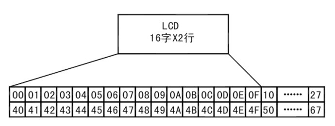

<style>
  table {
    width: 100%
    }
  td {
    vertical-align: center;
  }
  table.inputT{
    margin: 10px;
    width: auto;
    margin-left: auto;
    margin-right: auto;
    border: none;
  }
  input{
    text-align: center;
    padding: 0px 10px;
  }
  iframe{
    width: 100%;
    display: block;
    border-style:none;
  }
</style>

# ESP LCD（1602A 液晶屏）

**1602A** 的LCD液晶顯示屏，能夠顯示2行文字，每行16字的容量，背部帶有顯示器接駁器，建議在一般情況下都使用有 **PCF8574** 背板的LCD，它是I2C的介面，只要接4條線就能使用。

- CGROM : 字模存储用空间。显示某个ASCII字符时，要显示字符的字模就存在这里。
- DDRAM : 显示用RAM。直接和屏幕上的点相对应。屏幕上的一个点和DDRAM中的一个位对应。



## 解释液晶屏地址

事实上往 DDRAM 里的 00H 地址处送一个数据，譬如 0x31 并不能显示 **1** 出来。这是一个很容易出错的地方，原因就是如果想在 DDRAM 的 00H 地址处显示数据，则必须将 00H 加上 **<font color="#FF1000">80H</font>**，即 80H，若要在 DDRAM 的 01H 处显示数据，则必须将 01H 加上 80H 即 81H。依次类推。

 - 因此，C 中的 液晶屏地址可供参考如下

```c
#define LCD_1ST_LINE      0x80    //液晶显示屏第一行地址
#define LCD_2ND_LINE      0xC0    //液晶显示屏第二行地址
```

1602 液晶模块内部的字符发生存储器（CGROM) 已经存储了 160 个不同的点阵字符图形，这些字符有：阿拉伯数字、英文字母的大小写、常用的符号、和日文假名等，每一个字符都有一个固定的代码，比如大写的英文字母 “A” 的代码是 01000001B（41H），显示时模块把地址 41H 中的点阵字符图形显示出来，就能看到字母“A”。 

## 自建字模区的空间

CGRAM 允许用户自建字模区的空间。从 CGROM 表上可以看到，在表的最左边是一列可以允许用户自定义的 CGRAM，从上往下看着是 16 个，实际只有 8 个字节可用。它的字符码是00000000－00000111 这 8 个地址，表的下面还有 8 个字节，但因为这个 CGRAM 的字符码 规定 0－2 位为地址，3 位无效，4－7 全为零（表上的高位）。因此 CGRAM 的字符码只有最后三位能用也就是 8 个字节了。等效为 0000X111，X 为无效位，最后三位为000－111 共 8 个。

## 更新所需的执行时间

B 为 1 时，光标所指字符闪烁。当 f<sub>cp</sub> 或 f<sub>OSC</sub> 为 250 kHz 时，闪烁显示为以 409.6 ms 间隔的速度在所有空白点和显示字符之间切换。光标和闪烁可设置为同时显示。（闪烁频率根据 f<sub>cp</sub> 或 f<sub>OSC</sub> 的倒数而变化。例如，当 f<sub>cp</sub> 为 270 kHz 时，409.6 × 250/270 = 379.2 ms。）

 - f<sub>osc</sub>内部振荡或外部时钟 (Internal oscillation or external 
clock)

**总结**：DDRAM是用来使液晶屏显示的，CGROM是液晶屏可以显示的内容（在CGROM 表中查看），CGRAM是用来扩展液晶屏可以显示的内容。


## PCF8574 I<sup>2</sup>C 控制器

**PCF8574** 是一款硅 CMOS 电路。通过两路双向总线（I<sup>2</sup>C 总线）为大多数微控制器系列提供通用远程 **I/O** 扩展。器件由8位准双向端口和 I<sup>2</sup>C 总线接口组成。PCF8574具有低电流消耗且包含具备高电流驱动能力的锁存输出，用于直接驱动LED。还具有中断线路(INT)，可连接至微控制器的中断逻辑。通过在此线路发送中断信号，远程I/O可通知微控制器其端口上是否存在输入数据而无需通过 I<sup>2</sup>C 总线通信。


## LCD 传输模式

- 8 位模式使用 8 个 I/O 端口引脚传输数据并使用 2 个或 3 个附加 I/O 引脚传输控制数据。
- 4 位模式使用 4 个 I/O 端口引脚传输数据并使用 2 个或 3 个附加 I/O 引脚传输控制数据。4 位模式要求对发送到显示器的 **每个指令** 和 **每个字符** 进行两次 4 位传输。

注意：必须使用 **<font color="#FF1000">5V</font>** 电压，否则不显示内容。


## ESP32 I<sup>2</sup>C

I<sup>2</sup>C 是一种串行、同步、多设备、半双工通信协议，允许同一总线上多个主设备和从设备共存。I2C 使用两条双向开漏线：串行数据线 (**SDA**) 和串行时钟线 (**SCL**)，由电阻上拉。

ESP32 有 2 个 I<sup>2</sup>C 控制器（也称为端口），负责处理 I<sup>2</sup>C 总线上的通信。单个 I<sup>2</sup>C 控制器可以是主设备或从设备。

通常，I<sup>2</sup>C 从设备具有 7 位地址或 10 位地址。ESP32 支持 I2C 标准模式 (Sm) 和快速模式 (Fm)，分别最高可达 100KH<sub>z</sub> 和 400KH<sub>z</sub>。


### 初始  I<sup>2</sup>C 主总线和设备

如果指定了 i2c_master_bus_config_t 中的配置，用户可以调用 i2c_new_master_bus() 来分配并初始化一个 I<sup>2</sup>C 主总线。此函数在正确运行的情况下将返回一个 I<sup>2</sup>C 总线句柄。具体而言，当没有更多可用的 I<sup>2</sup>C 端口时，此函数将返回 ESP_ERR_NOT_FOUND 错误。

#### 预置参数

基本上1602 LCD不是 0x27 就是 0x3F，若顯示不出內容。LCD 背面，I<sup>2</sup>C 轉接卡上有一個可變電組，用來調亮度的，一般出廠時，它都是調到最亮，可能完全看不到字，請用十字起子調整一下。

```c
#define I2C_MASTER_SCL_IO 19
#define I2C_MASTER_SDA_IO 18 
#define SLAVE_ADDRESS_LCD 0x27
```

设置

#### 设置主总线

```c
i2c_master_bus_handle_t bus_handle;
i2c_master_bus_config_t i2c_mst_config = {
    .clk_source = I2C_CLK_SRC_DEFAULT,    // 设置时钟源
    .i2c_port = I2C_NUM_0,                // 设置 I2C 端口编号
    .scl_io_num = I2C_MASTER_SCL_IO,      // SCL 管脚编号
    .sda_io_num = I2C_MASTER_SDA_IO,      // SDA 管脚编号
    .glitch_ignore_cnt = 7,
    .flags.enable_internal_pullup = true,
};
i2c_new_master_bus(&i2c_mst_config, &bus_handle);
```

**注意**: i2c_port = I<sup>2</sup>C 端口号，

- **I2C_NUM_0** 对应 18，19 引脚
- **I2C_NUM_1** 对应 25，26 引脚

#### 设置设备

```c
i2c_master_dev_handle_t dev_handle;
i2c_device_config_t dev_cfg = {
    .dev_addr_length = I2C_ADDR_BIT_LEN_7,  // 7 位地址
    .device_address = SLAVE_ADDRESS_LCD,    // 从机地址
    .scl_speed_hz = 100000,                 // 标准模式 100KH<sub>z</sub> 如上所述
};
i2c_master_bus_add_device(bus_handle, &dev_cfg, &dev_handle);
```

#### I<sup>2</sup>C 主写入

```c
esp_err_t i2c_master_transmit(
  i2c_master_dev_handle_t i2c_dev, 
  const uint8_t *write_buffer, 
  size_t write_size, 
  int xfer_timeout_ms)
```

例如如下：

```c
static uint8_t data_t[2];
i2c_master_transmit(dev_handle, data_t, 4, -1)
```

**注意**:

- write_size: 以字节 (byte) 为单位，data_t = 4 字节
- xfer_timeout_ms: -1 意味着永远等待

#### I<sup>2</sup>C 主读取

```c
esp_err_t i2c_master_receive(
  i2c_master_dev_handle_t i2c_dev,
  uint8_t *read_buffer, 
  size_t read_size, 
  int xfer_timeout_ms)
```

例如如下：

```c
#define DATA_LENGTH 100
i2c_master_receive(dev_handle, data_rd, DATA_LENGTH, -1);
```
#### I<sup>2</sup>C 主先写入後读取


如某设备在读取数据之前需要写入配置，可以使用以下接口。


```c
esp_err_t i2c_master_transmit_receive(
  i2c_master_dev_handle_t i2c_dev, 
  const uint8_t *write_buffer,
  size_t write_size, 
  uint8_t *read_buffer, 
  size_t read_size, 
  int xfer_timeout_ms)
```
例如如下：

```c
uint8_t buf[20] = {0x20};
uint8_t buffer[2];
i2c_master_transmit_receive(dev_handle, buf, sizeof(buf), buffer, 2, -1);
```

#### 取消初始化 I<sup>2</sup>C 主总线及设置设备的句柄并删除。

```c
i2c_master_bus_rm_device(dev_handle);
i2c_del_master_bus(bus_handle);
```
## LCD 初始化


**控制位**

|P2:E | P1:RW | P0:RS |
| :---: | :---: | :---: |
| 0 | 0 | 0 | 

### LCD 初始化 8 位模式 (Function set)

| <font color="#FF1000">D7:P7</font> | D6:P6 | D5:P5 |    D4:P4    | D3 | D2 | D1 | D0 | 
| :---: | :---: | :---: | :---: | :---: | :---: | :---: | :---: | 
| 0  | 0 | 1 | DL=1 | N=0 | F=0 | 0 | 0 |

注：
 - DL = 1，8 位；DL = 0，4 位
 - N = 1，2 行；N = 0，1 行
 - F = 1，5 x 10 点；F = 0，5 x 8 点

**Function set** 指令 RS R/W DB7 DB6 DB5 DB4 DB3 DB2 DB1 DB0 描述设置
 - 接口数据长度 (DL)
 - 显示行数 (N)
 - 字符字体 (F)。

#### 初始化程序

开电要时间启动。所以需要多次进入 8 位元模式。确保启动成功。

  - 通电后等待 15 毫秒 (15000 微秒) 或更长时间
  - 0x30 初始化 (8 位模式)
  - 等待 4100 微秒或更长时间
  - 0x30 初始化 (8 位模式)
  - 等待 4100 微秒或更长时间

### LCD 转换 8 位模式至 4 位模式 (Function set)

| <font color="#FF1000">P7:D7</font> | P6:D6 | P5:D5 | P4:D4 | D3 | D2 | D1 | D0 | 
| :---: | :---: | :---: | :---: | :---: | :---: | :---: | :---: | 
| 0 | 0 | 1 | DL=0 | N=0 | F=0 | 0 | 0 |  

注：
 - DL = 1，8 位；DL = 0，4 位
 - N = 1，2 行；N = 0，1 行
 - F = 1，5 x 10 点；F = 0，5 x 8 点

功能设置 0x20 初始化 (从 8 位到 4 位模式) 忽略行及点。

### 设置 2 行及 5 x 8 点 (Function set)

| <font color="#FF1000">P7:D7</font> | P6:D6 | P5:D5 | P4:D4 | 
|:---: | :---: | :---: | :---: |
| 0 | 0 | 1 | DL=1 | 

| <font color="#FF1000">P7:D3</font> | P6:D2 | P5:D1 | P4:D0 | 
|:---: | :---: | :---: | :---: |
| N=1 | F=0 | 0 | 0 | 

- 功能设置 0x28 初始化 (2 行)

### 显示关闭 (Display on/off control)

| <font color="#FF1000">P7:D7</font> | P6:D6 | P5:D5 | P4:D4 | 
|:---: | :---: | :---: | :---: |
| 0  | 0 | 0 | 0 | 

| <font color="#FF1000">P7:D3</font> | P6:D2 | P5:D1 | P4:D0 | 
|:---: | :---: | :---: | :---: |
| 1 | D=0 |  C=0  |  B=0  |

设置
 - 整个显示屏 开：1/关：0 (D)
 - 光标 开：1/关：0 (C)
 - 光标位置字符的闪烁：1 (B)

- 显示关闭 0x08 显示 (D)、光标 (C)、闪烁 (B)

### 清除整个显示屏 (Clear display)

| <font color="#FF1000">P7:D7</font> | P6:D6 | P5:D5 | P4:D4 | 
|:---: | :---: | :---: | :---: |
| 0 |  0|  0  |  0  |

| <font color="#FF1000">P7:D3</font> | P6:D2 | P5:D1 | P4:D0 | 
|:---: | :---: | :---: | :---: |
| 0 | 0 |  0  |  1  |

清除整个显示并在地址计数器中设置 DDRAM 地址 0。

- 显示清除 0x01 光标位置置 0

### 设置光标移位模式 (Entry mode set)

| <font color="#FF1000">P7:D7</font> | P6:D6 | P5:D5 | P4:D4 | 
|:---: | :---: | :---: | :---: |
| 0 |  0|  0  |  0  |

| <font color="#FF1000">P7:D3</font> | P6:D2 | P5:D1 | P4:D0 | 
|:---: | :---: | :---: | :---: |
| 0 | 1 |  I/D=1  |  S=0  |

设置光标移动方向并指定显示移位。这些操作在数据写入和读取期间执行。

设置
 - 1/D = 1：增加，1/D = 0：减少
 - S = 1：伴随显示移位

- 进入模式设置 0x06 增加光标无移位

### 显示开启 (Display on/off control)

| <font color="#FF1000">P7:D7</font> | P6:D6 | P5:D5 | P4:D4 | 
|:---: | :---: | :---: | :---: |
| 0 |  0|  0  |  0  |

| <font color="#FF1000">P7:D3</font> | P6:D2 | P5:D1 | P4:D0 | 
|:---: | :---: | :---: | :---: |
| 1 | D=1 |  C=0  |  B=0  |

- 输入集 0x0C 增加光标无移位


## C 完整控制代码

```c
#include <stdio.h>
#include "driver/i2c_master.h"
#include "esp_err.h"
#include <unistd.h>
#include "esp_log.h"

#define C_CLEAR           0x01    //清除液晶显示屏
#define C_HOME            0x02    //光标回到首页
#define C_CUR_L           0x04    //输入后光标左移
#define C_RIGHT           0x05    //输入后图片立即移动
#define C_CUR_R           0x06    //输入后光标向右移动
#define C_LEFT            0x07    //输入后图片左移
#define C_OFF             0x08    //关闭液晶显示屏
#define C_ON              0x0C    //打开液晶显示屏
#define C_FLASH           0x0D    //开启 LCD，闪输入
#define C_CURSOR          0x0E    //打开LCD和光标
#define C_FLASH_ALL       0x0F    //打开LCD，光标和闪
#define C_CURSOR_LEFT     0x10    //单光标左移
#define C_CURSOR_RIGHT    0x10    //单光标右移
#define C_BIT8            0x30    //设置数据为 8 位
#define C_BIT4            0x20    //设置数据为 4 位
#define C_L1DOT7          0x30    //8位，一行 5*7 点 
#define C_L1DOT10         0x34    //8位，一行 5*10 点 
#define C_L2DOT7          0x38    //8位，两行 5*7 点阵图
#define C_4bitL2DOT7      0x28    //8位，两行 5*10 点阵图
#define C_CGADDRESS0      0x40    //字模存 RAM 地址 0 (addr=40H+x)
#define C_DDADDRESS0      0x80    //显示用 RAM 地址 0 (addr=80H+x)

#define I2C_MASTER_SCL_IO 19
#define I2C_MASTER_SDA_IO 18 
#define SLAVE_ADDRESS_LCD 0x27    //液晶显示屏地址

#define LCD_1ST_LINE      0x80    //液晶显示屏第一行地址
#define LCD_2ND_LINE      0xC0    //液晶显示屏第二行地址

i2c_master_bus_handle_t bus_handle;
i2c_master_dev_handle_t dev_handle;

i2c_master_bus_config_t i2c_mst_config = {
  .clk_source = I2C_CLK_SRC_DEFAULT,
  .i2c_port = I2C_NUM_0,
  .scl_io_num = I2C_MASTER_SCL_IO,
  .sda_io_num = I2C_MASTER_SDA_IO,
  .glitch_ignore_cnt = 7,
  .flags.enable_internal_pullup = true,
};

i2c_device_config_t dev_cfg = {
  .dev_addr_length = I2C_ADDR_BIT_LEN_7,
  .device_address = SLAVE_ADDRESS_LCD,
  .scl_speed_hz = 100000,
};
//-----------------------
void lcd_send_cmd (char cmd)
{
  char data_u, data_l;
  data_u = (cmd&0xf0);
  data_l = ((cmd<<4)&0xf0);
  uint8_t data_t[4];  
  data_t[0] = data_u|0x0C; //en=1, rs=0 -> bxxxx1100 (D7 D6 D5 D4 X E RW rs)
  data_t[1] = data_u|0x08; //en=0, rs=0 -> bxxxx1000 (D7 D6 D5 D4 X e RW rs)
  data_t[2] = data_l|0x0C; //en=1, rs=0 -> bxxxx1100 (D3 D2 D1 D0 X E RW rs)
  data_t[3] = data_l|0x08; //en=0, rs=0 -> bxxxx1000 (D3 D2 D1 D0 X e RW rs)
  ESP_ERROR_CHECK(i2c_master_transmit(dev_handle, data_t, 4, -1));
}

void lcd_busy (char cmd)
{
  char data_u, data_l;
  data_u = (cmd&0xf0);
  data_l = ((cmd<<4)&0xf0);
  uint8_t data_t[4];  
  data_t[0] = data_u|0x0C; //en=1, RW=0 -> bxxxx1110 (D7 D6 D5 D4 X E RW rs)
  data_t[1] = data_u|0x08; //en=0, RW=1 -> bxxxx1000 (D7 D6 D5 D4 X e RW rs)
  data_t[2] = data_l|0x0C; //en=1, RW=0 -> bxxxx1110 (D3 D2 D1 D0 X E RW rs)
  data_t[3] = data_l|0x08; //en=0, RW=1 -> bxxxx1000 (D3 D2 D1 D0 X e RW rs)
  uint8_t buffer[2];
  ESP_ERROR_CHECK(i2c_master_transmit_receive(dev_handle, data_t, 4, buffer, 2, -1));
}

void lcd_send_data (char data)
{
  char data_u, data_l;
  uint8_t data_t[4];
  data_u = (data&0xf0);
  data_l = ((data<<4)&0xf0);
  data_t[0] = data_u|0x0D; //en=1, rs=1 -> bxxxx1101 (D7 D6 D5 D4 X E RW RS)
  data_t[1] = data_u|0x09; //en=0, rs=1 -> bxxxx1001 (D7 D6 D5 D4 X e RW RS)
  data_t[2] = data_l|0x0D; //en=1, rs=1 -> bxxxx1101 (D3 D2 D1 D0 X E RW RS)
  data_t[3] = data_l|0x09; //en=0, rs=1 -> bxxxx1001 (D3 D2 D1 D0 X e RW RS)
  ESP_ERROR_CHECK(i2c_master_transmit(dev_handle, data_t, 4, -1));
}

void lcd_init (void)
{
  usleep(50000);             //功率上升后至少 40ms
  lcd_send_cmd(C_BIT8);      //设置数据为 8 位
  usleep(4500);              //至少 4.1ms
  lcd_send_cmd(C_BIT8);      //设置数据为 8 位
  usleep(4500);              //至少 4.1ms
  lcd_send_cmd(C_BIT4);      //设置数据为 4 位
  usleep(200);               //至少 40us
  lcd_send_cmd(C_4bitL2DOT7);//8位，两行 5*10 点阵图
  usleep(200);               //至少 40us
  lcd_send_cmd(C_OFF);       //关闭液晶显示屏
  usleep(50);                //至少 40us
  lcd_send_cmd(C_CLEAR);     //清除液晶显示屏至少
  usleep(2000);               //至少 1.64ms
  lcd_send_cmd (C_CUR_R);    //输入后光标向右移动
  usleep(50);                //至少 40us
  lcd_send_cmd(C_ON);        //打开液晶显示屏
  usleep(50);                //至少 40us
}

void lcd_put_cur(uint8_t row, uint8_t col)
{
  switch (row)
  {
    case 0x00:
        col |= LCD_1ST_LINE;
        break;
    case 0x01:
        col |= LCD_2ND_LINE;
        break;
  }
  lcd_send_cmd (col);
}

void lcd_send_string (char *str)
{
  while (*str) lcd_send_data (*str++);
}

void lcd_clear()
{
  lcd_send_cmd(C_CLEAR);
  usleep(5000);
}
//--------------------------------
void app_main(void)
{
ESP_ERROR_CHECK(i2c_new_master_bus(&i2c_mst_config, &bus_handle));
ESP_ERROR_CHECK(i2c_master_bus_add_device(bus_handle, &dev_cfg, &dev_handle));
printf("I2C initialized successfully...\n");
  lcd_init();
  lcd_clear();
  lcd_put_cur(0,0);
  lcd_send_string("0123456789ABCDEF");
  lcd_put_cur(1,0);
  lcd_send_string("FEDCBA9876543210");
  sleep(5);
  lcd_clear();
  lcd_put_cur(0,0);
  lcd_send_string("   Dicky KO");
  lcd_put_cur(1,0);
  lcd_send_string("  Welcome...");
ESP_ERROR_CHECK(i2c_master_bus_rm_device(dev_handle));
ESP_ERROR_CHECK(i2c_del_master_bus(bus_handle));
printf("I2C closed.\n");
}             
```