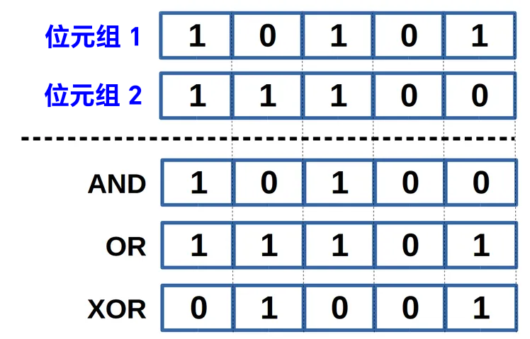

<style>
  table {
    width: 100%
    }
  td {
    vertical-align: center;
  }
  table.inputT{
    margin: 10px;
    width: auto;
    margin-left: auto;
    margin-right: auto;
    border: none;
  }
  input{
    text-align: center;
    padding: 0px 10px;
  }
  iframe{
    width: 100%;
    display: block;
    border-style:none;
  }
</style>

# 位元運算

## C 的位元运算子列表

|名称|符号|	运算子|	说明|
|:---:|:--:|:---:|:---|
|AND|	&|A & B	|仅当两位均为 1 时才返回 1|
|OR	|\||A | B	如果其中一位为 1 则返回 1|
|XOR	|^|A ^ B|	如果两位相同则返回 0，否则返回 1|
|左移	|<<|A << n	|将 A 的每个位元左移 n 位，右方补 0|
|右移|>>	|A >> n|	将 A 的每个位元右移 n 位，右方补 0 或 1 依 A 本来的最高位决定|
|NOT|	~|~A|	返回一位的补码，将 A 为 0 的位元换成 1，为 1 换成 0，也就是取补数|




### 范例


 - 要判断一个数 A 的右方数来第 n 位是 0 还是 1

```c
A & (1 << n) //>0 的話為 1，否則為 0
```

 - 把一个数 A 换成相反数

```c
~A+1
```

 - 把 A 除了最低位的 1 以外的 1 都换成 0

```c
 A & -A
```

XOR 神奇的地方就在于，它具有可逆性，这是其他 AND OR 等逻辑做不到的。

- 举个例子 (二进位表示)

```c
 x = 1001，y = 1010，z = x ^ y
 z = 1001 ^ 1010  = 0011
 z ^ x = 0011 ^ 1001 = 1010 = y
 z ^ y = 0011 ^ 1010 = 1001 = x
```

 一切都来自 XOR 的可逆性。主要有下面两个应用:

 - 进行简单加密

```c
#include<iostream>
using namespace std;
int main()
{
    char ch='A';
    	cout<<"密碼: "<<ch<<"\n";
    	ch=ch^3;
    	cout<<"加密: "<<ch<<"\n";
    	ch=ch^3; 
	    cout<<"解密: "<<ch<<"\n"; 
    return 0;
}
```

 - 利用两个变数来完成交换

```c
void XORswap(int& a,int& b)
{
    a=a^b;
    b=a^b;
    a=a^b;
}
```

以上 XORswap() 函式就是发挥了 XOR 的可逆性，但实际效能其实不比正常的 swap() 函式好，因为做了 3 次的 XOR 运算才得到结果。


## 设置和清除位

```c
#include <stdio.h>
#include <stdbool.h>
void binary(unsigned int n) {
    for (int i = 256; i > 0; i /= 2) {
        if (n & i) 
            printf(" 1");
        else
            printf(" 0");
    }
    printf("\n");
}

bool getBit(int n, int index) {
    return ((n & (1 << index)) > 0);
}

int setBit(int n, int index, bool b) {
    if (b)
        return (n | (1 << index));	
    int mask = ~(1 << index);
    return n & mask;
}

int main() {
    int num = 16, index;

    printf("Input\n");
    for (int i = 7; i >= 0; i--) 
        printf("%d ", getBit(num,i));
    printf("\n");

    /* set bit */
    index = 6;
    printf("# Setting %d-th bit\n", index);
    num = setBit(num, index, true);
    for (int i = 7; i >= 0; i--) 
        printf("%d ", getBit(num,i));
    printf("\n");

    /* unset (clear) bit */
    index = 4;
    printf("# Unsetting (Clearing) %d-th bit\n", index);
    num = setBit(num, index, false);
    for (int i = 7; i >= 0; i--) 
        printf("%d ", getBit(num,i));
    printf("\n");

    return 0;
}
```

### 输出

```c
Input
0 0 0 1 0 0 0 0
# Setting 6-th bit
0 1 0 1 0 0 0 0
# Unsetting (Clearing) 4-th bit
0 1 0 0 0 0 0 0
```


  