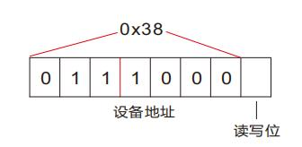
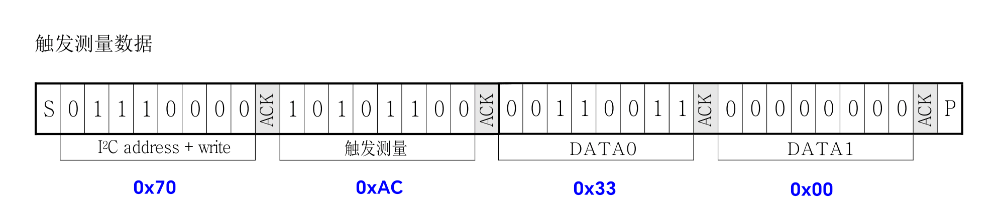
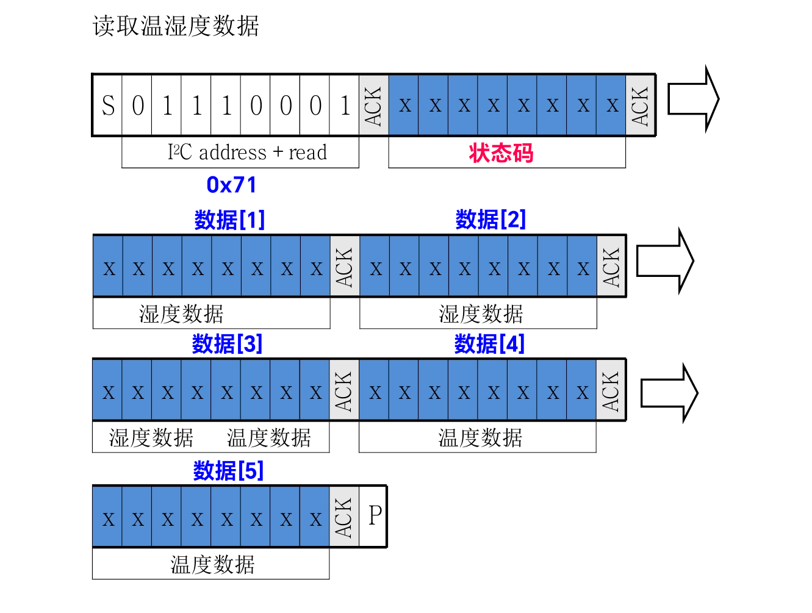
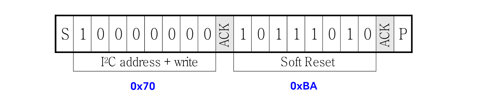

<style>
  table {
    width: 100%
    }
  td {
    vertical-align: center;
    text-align: center;
  }
  table.inputT{
    margin: 10px;
    width: auto;
    margin-left: auto;
    margin-right: auto;
    border: none;
  }
  input{
    text-align: center;
    padding: 0px 10px;
  }
  iframe{
    width: 100%;
    display: block;
    border-style:none;
  }
</style>

# ESP 温湿度传感器

AHT10 配有 ASIC 专用芯片、一个半导体电容式湿度传感元件和一个标准的片上温度传感元件，在恶劣环境下的性能稳定。每一个传感器都经过校准和测试。

  应用范围主要在暖通空调 、除湿器、测试及检测设备、消费品、汽车 、自动控制、数据记录器、气象站、家电、湿度调节、医疗及其他相关温湿度检测控制。

## 器件地址

器件地址为 0x38 ，最后一位是读写位，需要空出一位给读写位 (写=0，读=1)，因此需要左移一位。

- 即写为 0x38 <font color="#FF1000"><<</font> 1 <font color="#FF1000">|</font> 0x00 得到 0x70
- 即读为 0x38 <font color="#FF1000"><<</font> 1 <font color="#FF1000">|</font> 0x01 得到 0x71



## 初始化

- 接驳电源
- 延时 **50**ms 让传感器稳定
- 器件地址左移 **1** 位+写
  - 0x70
- 初始化校准
  - 0xE1
- 正常模式命令
  - 0x08
- 发送数据位
  - 0x00
- 延时 **50**ms 让传感器稳定
- 等待传感器应答

## 要求状态码

因需要以下指令，才能取得最新的状态码



- 器件地址左移 **1** 位+写
  - 0x70
- 发送触发测量命令
  - 0xAC
- 发送数据位
  - 0x33
- 发送数据位
  - 0x00
- 最少延迟 75 ms 再待传感器应答

## 读取状态码



### 状态码比特位说明


|  比特位  |     意义     |                                     描述                                     |
| :-------: | :----------: | :--------------------------------------------------------------------------: |
|  Bit[7]  |   忙闲指示   |             1＝设备忙，处于测量模式<br/>0＝设备闲，处于休眠模式             |
| Bit[6～5] | 读取工作模式 | 00 = 当前处于 NOR 模式<br/>01 = 当前处于 CYC 模式<br/>11 = 当前处于 CMD 模式 |
|  Bit[4]  |     保留     |                                     保留                                     |
|  Bit[3]  |  校准使能位  |                           1＝已校准<br/>0＝未校准                           |
| Bit[2～0] |     保留     |                                     保留                                     |

### 校准仪器完成

- 要求状态码
- 器件地址左移 **1** 位+读
  - 0x71
- 最少等待 75 ms 传感器应答才有效
- 读取 **8** 位数据（状态码）
- 必须状态码 <font color="#FF1000">BIT[3]</font> 为 <font color="#FF1000">1</font> 的温湿度数据才有意义 0x<font color="#FF1000">0</font>00<font color="#00AA00">X</font><font color="#FF1000">1</font>0<font color="#00AA00">XX</font>
- 如 BIT[3] 为 0，则需重启始以上步骤直至成功

### 数据测量成功

- 要求状态码
- 器件地址左移 **1** 位+读
  - 0x71
- 最少等待 75 ms 传感器应答才有效
- 读取 **8** 位数据（状态码）
- 必须状态码 <font color="#FF1000">BIT[7]</font> 为 <font color="#FF1000">0</font>，如不为 0 则。最少再延迟 75 ms 待传感器应答，直至成功

### 读取温度及湿度

- 数据测量成功
- 读取湿度 **8** 位数据
- 读取湿度 **8** 位数据
- 读取 **8** 位数据，湿度 **4** 位和温度 **4** 位
- 读取温度 **8** 位数据
- 读取温度 **8** 位数据
- 停止信号

### 位移获取数据

#### 湿度计算

湿度换算公式：其中 **S<sub>RH</sub>** 等于读取到的 **20** 位湿度数据整合后的数据。

$$
RH({\%}) = \frac {S_{RH}}{2^{20}} \times 100 \\
RH({\%}) = \frac {(S_{RH} \times 10000) >> 20}{100}
$$

- 湿度数据 = 数据[1] <font color="#FF1000"><<</font> 12 <font color="#FF1000">|</font> 数据[2]  <font color="#FF1000"><<</font> 4 <font color="#FF1000"> | </font> 数据[3] <font color="#FF1000">>></font> 4

#### 温度计算

温度换算公式：其中 **S<sub>T</sub>** 等于读取到的 **20** 位温度数据整合后的数据

$$
T(^{\circ} C) = \frac {S_T}{2^{20}} \times 200 - 50 \\
T(^{\circ} C) = \frac {(S_T \times 20000)  >> 20  - 5000} {100}
$$

- 温度数据 = (数据[3] <font color="#FF1000">&</font> 0x0F) <font color="#FF1000"><<</font> 16  <font color="#FF1000">|</font> 数据[4] <font color="#FF1000"><<</font> 8 <font color="#FF1000">|</font> 数据[5]

**注**：因是用移位型式除法，计算结果为整数。所以先乘 100 以保留小数后两位的精确度。

## 软复位

这指令用于在无需关闭和再次打开电源的情况下，重新启动传感器系统。在接收到这个命令之后，传感器系统开始重新初始化，并恢复默认设置状态，软复位所需时间不超过 20毫秒。



- 器件地址左移 **1** 位+写
  - 0x70
- 发送触发测量命令
  - 0xBA
- 少于 20 ms 延迟再待传感器应答

## **C** 源代码如下

```c
#include <freertos/FreeRTOS.h>
#include <esp_log.h>
#include "driver/i2c_master.h"

#define I2C_MASTER_SCL_IO     19
#define I2C_MASTER_SDA_IO     18 
#define SLAVE_ADDRESS_AHT     0x38  
#define SLAVE_ADDRESS_AHT_R   0x71 
#define SLAVE_ADDRESS_AHT_W   0x70 
#define I2C_NUM_0             0

//----- ESP I2C v5.31 --------------
i2c_master_bus_handle_t bus_handle;
i2c_master_bus_config_t i2c_mst_config = {
  .clk_source = I2C_CLK_SRC_DEFAULT,
  .i2c_port = I2C_NUM_0,
  .scl_io_num = I2C_MASTER_SCL_IO,
  .sda_io_num = I2C_MASTER_SDA_IO,
  .glitch_ignore_cnt = 7,
  .flags.enable_internal_pullup = true,
};
// --- 读 / 写 / 写和读功能 ---
void i2c_send_cmd (i2c_master_dev_handle_t handle, 
                   uint8_t* cmd, 
                   uint8_t length)
{
ESP_ERROR_CHECK(i2c_master_transmit(handle, cmd, length, -1));
}

void i2c_get_data (i2c_master_dev_handle_t handle, 
                   uint8_t* data, 
                   uint8_t length)
{
ESP_ERROR_CHECK(i2c_master_receive(handle, data, length, -1));
}

void i2c_cmd_data (i2c_master_dev_handle_t handle, 
                   uint8_t* cmd, 
                   uint8_t cmd_length, 
                   uint8_t* data, 
                   uint8_t data_length)
{
ESP_ERROR_CHECK(i2c_master_transmit_receive(handle, cmd, cmd_length, data, data_length, -1));
}
// ----- AHT10 --------------
i2c_master_dev_handle_t aht10_handle;
i2c_device_config_t aht10_cfg = {
  .dev_addr_length = I2C_ADDR_BIT_LEN_7,
  .device_address = SLAVE_ADDRESS_AHT,
  .scl_speed_hz = 100000,
};
// ----- 杂项功能 --------------
void msleep(int delay_ms)
{
  vTaskDelay(delay_ms/portTICK_PERIOD_MS);
}
void printHex(uint8_t value)
{
  printf("|0x%.8x|\n", value);
}
//-----------------------
void AHT10(float *temperature, float *humidity)
{
  uint8_t calibrate[4] = {SLAVE_ADDRESS_AHT_W, 0xE1, 0x08, 0x00};
  uint8_t measure[4] = {SLAVE_ADDRESS_AHT_W, 0xAC, 0x33, 0x00};
  uint8_t read[1] = {SLAVE_ADDRESS_AHT_W};
  uint8_t data[6] = {0, 0, 0, 0, 0, 0};
  uint8_t reset[2] = {SLAVE_ADDRESS_AHT_W, 0xBA};

  i2c_send_cmd(aht10_handle, &calibrate[0], 4);
  i2c_send_cmd(aht10_handle, &measure[0], 4);
  i2c_send_cmd(aht10_handle, &read[0], 1);
  i2c_get_data(aht10_handle, &data[0], 6);
  while ((data[0] & 0x08) != 0x08)
  {
    i2c_send_cmd(aht10_handle, &reset[0], 2);
    i2c_send_cmd(aht10_handle, &calibrate[0], 4);
    i2c_send_cmd(aht10_handle, &measure[0], 4);
    i2c_cmd_data(aht10_handle, &read[0], 1, &data[0], 6);
    msleep(100);
  } 
  while ((data[0] & 0x80) != 0x80)
  {
    i2c_send_cmd(aht10_handle, &measure[0], 4);
    i2c_cmd_data(aht10_handle, &read[0], 1, &data[0], 6);
    msleep(100);
  } 
  int64_t H1 = (data[1] << 12) | (data[2] << 4) | (data[3] >> 4) ;
  H1 = (H1 * 10000) >> 20;
  int64_t T1 = ((data[3] & 0x0F) << 16) | (data[4] << 8) | data[5];
  T1 = ((T1 * 20000) >> 20) - 5000;
  *temperature = T1 / 100.0;
  *humidity = H1 / 100.0;
}

void app_main(void)
{
  float temperature=0.0;
  float humidity=0.0;
  ESP_ERROR_CHECK(i2c_new_master_bus(&i2c_mst_config, &bus_handle));
  ESP_ERROR_CHECK(i2c_master_bus_add_device(bus_handle, &aht10_cfg, &aht10_handle));
  printf("I2C initialized successfully...\n");
  while(true)
  {
    AHT10(&temperature, &humidity);
    printf("温度:%3.3lf, 湿度:%3.3lf\n", temperature, humidity);
    msleep(10000);
  }
  printf("Success...\n");
  ESP_ERROR_CHECK(i2c_master_bus_rm_device(aht10_handle));
  ESP_ERROR_CHECK(i2c_del_master_bus(bus_handle));
  printf("I2C closed.\n");
}
```
