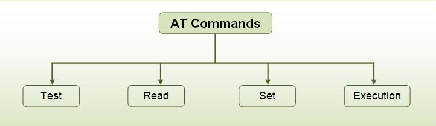

# AT 指令

AT 指令交互通讯组件， 适用于 Modem、WIFI 模块、蓝牙等使用 AT 指令或者 ASCII 命令行通信的场景，它涵盖了大部分 AT 通信形式，如参数设置，查询，二进制数据发送等，同时也支持自定义命令交互管理，由于它的每个命令请求都是异步的，所以对于无操作系统的环境也支持。

|指令|说明|
|:---:|:---|
|AT|测试 AT 启动|
|AT+RST|重启模块|
|AT+GMR|查看版本信息|
|AT+CMD|查询当前固件支持的所有命令及命令类型|
|AT+GSLP|进⼊ Deep-sleep 模式|
|ATE|开启或关闭 AT 回显功能|
|AT+RESTORE|恢复出厂设置|
|AT+SAVETRANSLINK|设置开机 透传模式 信息|
|AT+TRANSINTVL|设置 透传模式 模式下的数据发送间隔|
|AT+UART_CUR|设置 UART 当前临时配置，不保存到 flash|
|AT+UART_DEF|设置 UART 默认配置, 保存到 flash|
|AT+SLEEP|设置 sleep 模式|
|AT+SYSRAM|查询当前剩余堆空间和最小堆空间|
|AT+SYSMSG|查询/设置系统提示信息|
|AT+SYSMSGFILTER|启用或禁用 系统消息 过滤|
|AT+SYSMSGFILTERCFG|查询/配置 系统消息 的过滤器|
|AT+SYSFLASH|查询或读写 flash 用户分区|
|AT+SYSMFG|查询或读写 manufacturing nvs 用户分区|
|AT+RFPOWER|查询/设置 RF TX Power|
|AT+SYSROLLBACK|回滚到以前的固件|
|AT+SYSTIMESTAMP|查询/设置本地时间戳|
|AT+SYSLOG|启用或禁用 AT 错误代码提示|
|AT+SLEEPWKCFG|设置 Light-sleep 唤醒源和唤醒 GPIO|
|AT+SYSSTORE|设置参数存储模式|
|AT+SYSREG|读写寄存器|

|类型|后缀|功能|
|:---:|:---:|:---|
|Read|？|获取调制解调器配置设置|
|Set|=|设置调制解调器配置设置|
|Execute|None|触发调制解调器操作|
|Test|=？|检查调制解调器是否支持命名命令|