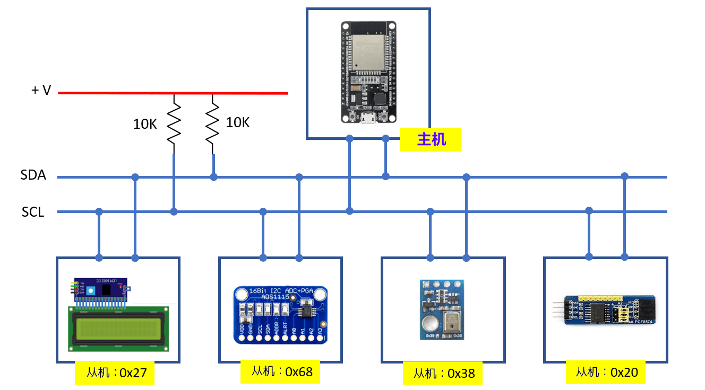
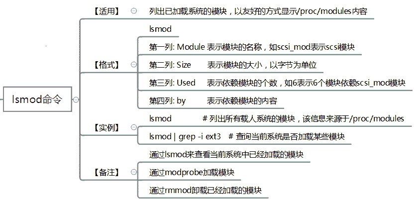
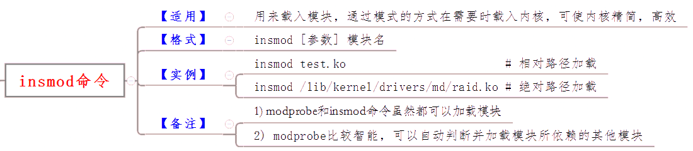
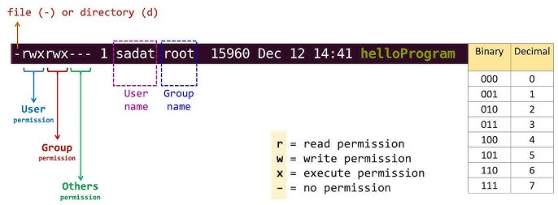

<style>
  table {
    width: 100%
    }
  td {
    vertical-align: center;
    text-align: center;
  }
  table.inputT{
    margin: 10px;
    width: auto;
    margin-left: auto;
    margin-right: auto;
    border: none;
  }
  input{
    text-align: center;
    padding: 0px 10px;
  }
  iframe{
    width: 100%;
    display: block;
    border-style:none;
  }
</style>

# I<sup>2</sup>C 通信总线

I<sup>2</sup>C（Inter-Integrated Circuit）通信总线，嵌入式系统设计中的一个关键组成部分，其灵活性和高效率使其在高级应用中备受青睐。关于 I<sup>2</sup>C 通信总线的深度解析，包括其基本概念、特点、通信协议，以及在不同场景下的高级应用和最佳实践。I<sup>2</sup>C 接口只有 **2** 根信号线，总线上可以连接多个设备，硬件实现简单，可扩展性强。I<sup>2</sup>C 通信协议可以用普通 GPIO 引脚进行软件模拟。I<sup>2</sup>C 接口主要用于通讯速率要求不高，以及多个器件之间通信的应用场景。




I<sup>2</sup>C 协议通信速度：

|模式|速度|
|:---:|:---:|
|   标准模式（Standard Mode）   | 100kb/s |
|     快速模式（Fast Mode）     | 400kb/s |
| 增强快速模式（Fast Mode Plus） |  1Mb/s  |
|  高速模式（High Speed Mode）  | 3.4Mb/s |
|   极速模式（Ultra-FastMode）   |  5Mb/s  |


## Pull-up 电阻

上拉电阻将「微弱地」的输入电压讯号「拉高」。 当外部组件未连接时，对输入端来说，外部「看上去」就是高阻抗的。  这时，通过上拉电阻可以将输入埠处的电压拉高到高电平。在 I<sup>2</sup>C 电路上如链接器件太远，可能需要安装。计算方法请参考以下文章：

[pull-up 电阻设计](https://hkdickyko.github.io/%E7%A9%8D%E9%AB%94%E9%9B%BB%E8%B7%AF/I2C-pull-up-resistance)

## 7-bit 设备的数据传输

在开启信号后的首字节由 **7** 位从机地址和 **1** 位<font color="#FF1000">读/写</font>位组成，结构如下图：


发送完这个字节之后，主机释放 **SDA** 总线等待从机给出 **ACK** 应答。如果从机给出了 **ACK** 应答，表示从机地址正确。并且已知晓是读还是写，便可以开始读写数据。如果从机没有给出 **ACK** 应答，则说明接收设备可能没有收到数据（如寻址的设备不存在或是设备正在忙碌）或无法解析收到的数据，如果是这样，则由主机来决定如何处理（停止或重启）。

## 10-bit 设备的数据传输


在 10 位寻址中，从机地址在前两个字节中发送。第一个字节以特殊保留地址 <font color="#FF1000">1111 0</font>XX 开头，表示正在使用 10 位寻址。地址的 10 位编码在第一个字节的最后 2 位和第二个字节的整个 8 位中。第一个字节的第 8 位保留为 <font color="#FF1000">读/写</font> 标志。

需要了解基本的I2C帧结构：

写数据：


读数据：


## i2c_tools

I2C Tools 是一个简单但非常有用的工具，用于开发 I<sup>2</sup>C 相关应用程序，在 Linux 平台中也很有名。

### Linux 如何编译、加载和删除模块

使用 lsusb 确认硬件 CH341 是否正确安装


对于 I<sup>2</sup>C 设备安装下面的驱动程序

驱动程序链接 : [gschorcht/i2c-ch341-usb](https://github.com/gschorcht/i2c-ch341-usb)

|模组指令|解释|
|:---:|:---:|
|modinfo|显示有关内核模块的信息|
|lsmod|列出已加载的模块|
|insmod|安装可加载内核模块|
|rmmod|卸载可加载模块|
|depmod|处理可加载内核模块的依赖关系描述|
|modprobe|可加载模块的高级处理|



- 要加载编译的内容

  - 使用 make 进行编译
  - 使用 sudo insmod i2c-ch341-usb.ko 进行加载
  - 使用 sudo rmmod i2c-ch341-usb.ko 进行卸载
- 要加载内核模块

  - 使用 sudo modprobe i2c-ch341-usb.ko 进行加载
  - 使用 sudo rmmod i2c-ch341-usb.ko 进行卸载



使用以下命令将模块添加到内核

```
sudo modprobe i2c-dev
```

|参数值|总线速度|
|:---:|:---:|
|0|20 kbps|
|1|100 kbps|
|2|400 kbps|

默认情况下，驱动程序使用 100 kbps 的 I2C 总线速度（speed=0）。

可以在加载模块时使用模块参数 speed 进行更改，如更改速度至 400 kps。

```
sudo modprobe i2c-ch341-usb speed=2
```

使用 dmesg 确认模块是否正确安装


- 根据以上信息，**/dev/i2c-<font color="#FF1000">6</font>** 已安装到 **USB** 设备的 I<sup>2</sup>C 端口 (端口号码为 **<font color="#FF1000">6</font>**)

以下例子只是实现控制台组件的 I<sup>2</sup>C 工具的一些基本功能。共支持五个命令行工具：


- i2cconfig：它将使用特定的 GPIO 编号、端口号和频率配置 I<sup>2</sup>C 总线
- i2cdetect：它将扫描 I<sup>2</sup>C 总线中的设备，并输出一个表格，其中包含总线上检测到的设备列表
- i2cget：它将读取通过 I<sup>2</sup>C 总线可见的寄存器
- i2cset：它将设置通过 I<sup>2</sup>C 总线可见的寄存器
- i2cdump：它将检查通过 I<sup>2</sup>C 总线可见的寄存器

i2c-tools 默认使用 sda=gpio18 和 scl=gpio19。可以使用 i2cconfig 修改 I<sup>2</sup>C 配置。这里将 I<sup>2</sup>C 的两个数据线接到 gpio18 和 gpio19。

## Linux 下不准存在 I<sup>2</sup>C 连接口的解决方法



```
sudo chomd 777 /dev/i2c-6
# 或
usermod -a -G i2c dickyko
```

## 直接 USB 连接电脑 CH341A


注意：如所有地址为可用。可能因为 **SDA** 脚为低电位或 **SDA** 及 **SCL** 转连反转。

Linux 下才有的 i2ctools 指令

- i2ctransfer：一次性读写多个字节指令

## I2C-Tools 的访问 I<sup>2</sup>C

### 适用于 ESP32

- **i2cconfig** [--port=\<0\|1\>] [--freq=\<Hz\>] --sda=\<gpio\> --scl=\<gpio\>

  - --port = \<0\|1\> 设置 I<sup>2</sup>C 总线端口号
  - --freq = \<Hz\>  设置 I<sup>2</sup>C 总线频率(Hz)
  - --sda = \<gpio\> 设置 gpio 为 I<sup>2</sup>C SDA
  - --scl = \<gpio\> 设置 gpio 为 I<sup>2</sup>C SCL

- **i2cdetect** [-y] [-a] [-q|-r] i2cbus [first last] -F i2cbus -V -l
    - -y = 关闭交互模式，该参数不会提示警告信息
    - -a = 扫描总线上的所有设备
    - -q = quick write 命令进行检测，不建议使用
    - r = receive byte 命令进行检测，不建议使用
    - i2cbus = 指定i2c总线的编号
    - first、last：扫描的地址范围
    - 返回值说明
        - – = 表示该地址被检测，但没有芯片应答
        - UU = 表示该地址当前由内核驱动程序使用
        - ** = 表示以十六进制表示的设备地址编号，如 “18”
  - -F = 显示功能
  - -V = 显示版本号
  - -l = 显示巳安装设备


```
sudo i2cdetect -l
```


  - 检测到地址为 **0x38**


```
i2cconfig --sda=18 --scl=19
i2cdetect
```

- **i2cset** -c \<chip_addr\> [-r \<register_addr\>] [\<data\>]...

  - -c, --chip = \<chip_addr\>          指定该总线上芯片的地址
  - -r, --register = \<register_addr\>  指定要读取的芯片上的地址
  - \<data\>                          指定要写入该数据地址的数据

- **i2cget** -c \<chip_addr\> [-r \<register_addr\>] [-l \<length\>]

  - -c, --chip = \<chip_addr\>         指定该总线上芯片的地址
  - -r, --register = \<register_addr\> 指定要读取的芯片上的地址
  - -l, --length = \<length\>          指定从该数据地址读取的长度

以下是温度湿度传感器的程序 : [ESP 温湿度传感器](https://hkdickyko.github.io/%E7%A9%8D%E9%AB%94%E9%9B%BB%E8%B7%AF/aht10)


```
i2cset -c=0x38 -r=0x70 0xe1 0x08 0x00
i2cset -c=0x38 -r=0x70 0xac 0x33 0x00
i2cget -c=0x38 -r=0x71 -l 6
```

- **i2cdump**  -c <chip_addr> [-s <size>]
  - -c, --chip = <chip_addr>  指定该总线上芯片的地址
  - -s, --size = <size>       指定每次读取的大小


### 适用于 Linux

- **i2cdump**


```
sudo i2cdump -f -y 6 0x38
```

- **i2ctransfer**

因为 i2ctransfer 可以读写多字节寄存器地址，可替代 i2cset 和 i2cget。


```
sudo i2ctransfer -f -y 6 w4@0x38 0x70 0xe1 0x08 0x00
sudo i2ctransfer -f -y 6 w4@0x38 0x70 0xac 0x33 0x00
sudo i2ctransfer -f -y 6 w1@0x38 0x71 r6
```

注意 :
  - f ： 强制访问设备
  - y ： 关闭人机交互模式


## 访问 I<sup>2</sup>C 的 **C** 源代码如下

```c
#include <freertos/FreeRTOS.h>
#include <esp_log.h>
#include "driver/i2c_master.h"

#define I2C_MASTER_SCL_IO     19
#define I2C_MASTER_SDA_IO     18 
#define I2C_NUM_0             0
#define SLAVE_ADDRESS         0x38    

//----- ESP I2C v5.31 --------------
i2c_master_bus_handle_t bus_handle;
i2c_master_bus_config_t i2c_mst_config = {
  .clk_source = I2C_CLK_SRC_DEFAULT,
  .i2c_port = I2C_NUM_0,
  .scl_io_num = I2C_MASTER_SCL_IO,
  .sda_io_num = I2C_MASTER_SDA_IO,
  .glitch_ignore_cnt = 7,
  .flags.enable_internal_pullup = true,
};
// --- 读 / 写 / 写和读功能 ---
void i2c_send_cmd (i2c_master_dev_handle_t handle, 
                  uint8_t* cmd, 
                  uint8_t length)
{
ESP_ERROR_CHECK(i2c_master_transmit(handle, cmd, length, -1));
}

void i2c_get_data (i2c_master_dev_handle_t handle, 
                   uint8_t* data, 
                   uint8_t length)
{
ESP_ERROR_CHECK(i2c_master_receive(handle, data, length, -1));
}

void i2c_cmd_data (i2c_master_dev_handle_t handle, 
                   uint8_t* cmd, 
                   uint8_t cmd_length, uint8_t* data, 
                   uint8_t data_length)
{
ESP_ERROR_CHECK(i2c_master_transmit_receive(handle, cmd, cmd_length, data, data_length, -1));
}
// ----- 从机设备参数 --------------
i2c_master_dev_handle_t dev_handle;
i2c_device_config_t dev_cfg = {
  .dev_addr_length = I2C_ADDR_BIT_LEN_7,
  .device_address = SLAVE_ADDRESS,
  .scl_speed_hz = 100000,
};
// ----- 杂项功能 --------------
void msleep(int delay_ms)
{
  vTaskDelay(delay_ms/portTICK_PERIOD_MS);
}

void printHex(uint8_t value)
{
  printf("|0x%.8x|\n", value);
}
//-----------------------
void app_main(void)
{
  ESP_ERROR_CHECK(i2c_new_master_bus(&i2c_mst_config, &bus_handle));
  ESP_ERROR_CHECK(i2c_master_bus_add_device(bus_handle, &dev_cfg, &dev_handle));
  printf("I2C initialized successfully...\n");

  // 程序代码

  ESP_ERROR_CHECK(i2c_master_bus_rm_device(dev_handle));
  ESP_ERROR_CHECK(i2c_del_master_bus(bus_handle));
  printf("I2C closed.\n");
}
```

### 實際參考項目

 - [ESP LCD（1602A 液晶屏）](https://hkdickyko.github.io/%E7%A9%8D%E9%AB%94%E9%9B%BB%E8%B7%AF/lcd)
 - [ESP 温湿度传感器](https://hkdickyko.github.io/%E7%A9%8D%E9%AB%94%E9%9B%BB%E8%B7%AF/aht10)