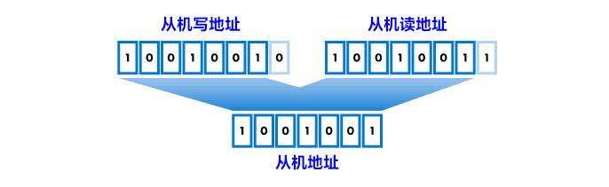

# I2C 通信总线

I2C（Inter-Integrated Circuit）通信总线，嵌入式系统设计中的一个关键组成部分，其灵活性和高效率使其在高级应用中备受青睐。关于 I2C 通信总线的深度解析，包括其基本概念、特点、通信协议，以及在不同场景下的高级应用和最佳实践。I2C 接口只有 **2** 根信号线，总线上可以连接多个设备，硬件实现简单，可扩展性强。I2C 通信协议可以用普通 GPIO 引脚进行软件模拟。I2C 接口主要用于通讯速率要求不高，以及多个器件之间通信的应用场景。

I2C 协议通信速度：

|模式|	速度|
|:---:|:---:|
|标准模式（Standard Mode）|	100kb/s|
|快速模式（Fast Mode）	|400kb/s|
|增强快速模式（Fast Mode Plus）|	1Mb/s|
|高速模式（High Speed Mode）|	3.4Mb/s|
|极速模式（Ultra-FastMode）	|5Mb/s|

## 7-bit 设备的数据传输

在开启信号后的首字节由 **7** 位从机地址和 **1** 位读/写位组成，结构如下图：

发送完这个字节之后，主机释放 **SDA** 总线等待从机给出 **ACK** 应答。如果从机给出了 **ACK** 应答，表示从机地址正确。并且已知晓是读还是写，便可以开始读写数据。如果从机没有给出 **ACK** 应答，则说明接收设备可能没有收到数据（如寻址的设备不存在或是设备正在忙碌）或无法解析收到的数据，如果是这样，则由主机来决定如何处理（停止或重启）。

## 10-bit 设备的数据传输

在 10 位寻址中，从机地址在前两个字节中发送。第一个字节以特殊保留地址 1111 0XX 开头，表示正在使用 10 位寻址。地址的 10 位编码在第一个字节的最后 2 位和第二个字节的整个 8 位中。第一个字节的第 8 位保留为 读/写 标志。