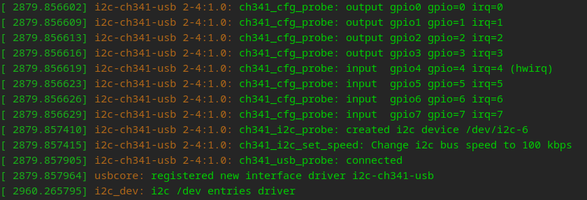
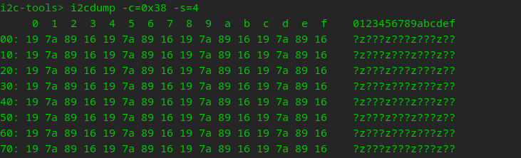
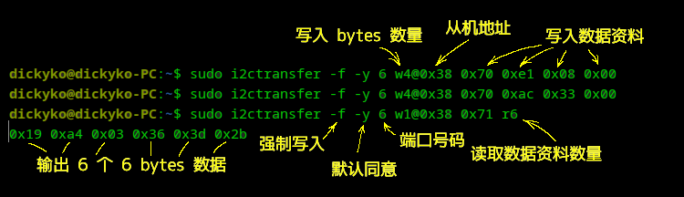

<style>
  table {
    width: 100%
    }
  td {
    vertical-align: center;
    text-align: center;
  }
  table.inputT{
    margin: 10px;
    width: auto;
    margin-left: auto;
    margin-right: auto;
    border: none;
  }
  input{
    text-align: center;
    padding: 0px 10px;
  }
  iframe{
    width: 100%;
    display: block;
    border-style:none;
  }
</style>

# I<sup>2</sup>C 通信总线

I<sup>2</sup>C（Inter-Integrated Circuit）通信总线，嵌入式系统设计中的一个关键组成部分，其灵活性和高效率使其在高级应用中备受青睐。关于 I<sup>2</sup>C 通信总线的深度解析，包括其基本概念、特点、通信协议，以及在不同场景下的高级应用和最佳实践。I<sup>2</sup>C 接口只有 **2** 根信号线，总线上可以连接多个设备，硬件实现简单，可扩展性强。I<sup>2</sup>C 通信协议可以用普通 GPIO 引脚进行软件模拟。I<sup>2</sup>C 接口主要用于通讯速率要求不高，以及多个器件之间通信的应用场景。

I<sup>2</sup>C 协议通信速度：


|              模式              |  速度  |
| :----------------------------: | :-----: |
|   标准模式（Standard Mode）   | 100kb/s |
|     快速模式（Fast Mode）     | 400kb/s |
| 增强快速模式（Fast Mode Plus） |  1Mb/s  |
|  高速模式（High Speed Mode）  | 3.4Mb/s |
|   极速模式（Ultra-FastMode）   |  5Mb/s  |

## 7-bit 设备的数据传输

在开启信号后的首字节由 **7** 位从机地址和 **1** 位<font color="#FF1000">读/写</font>位组成，结构如下图：


发送完这个字节之后，主机释放 **SDA** 总线等待从机给出 **ACK** 应答。如果从机给出了 **ACK** 应答，表示从机地址正确。并且已知晓是读还是写，便可以开始读写数据。如果从机没有给出 **ACK** 应答，则说明接收设备可能没有收到数据（如寻址的设备不存在或是设备正在忙碌）或无法解析收到的数据，如果是这样，则由主机来决定如何处理（停止或重启）。

## 10-bit 设备的数据传输


在 10 位寻址中，从机地址在前两个字节中发送。第一个字节以特殊保留地址 <font color="#FF1000">1111 0</font>XX 开头，表示正在使用 10 位寻址。地址的 10 位编码在第一个字节的最后 2 位和第二个字节的整个 8 位中。第一个字节的第 8 位保留为 <font color="#FF1000">读/写</font> 标志。

需要了解基本的I2C帧结构：

写数据：


读数据：


## i2c_tools

I2C Tools 是一个简单但非常有用的工具，用于开发 I<sup>2</sup>C 相关应用程序，在 Linux 平台中也很有名。

### Linux 如何编译、加载和删除模块

使用 lsusb 确认硬件是否正确安装


对于 I<sup>2</sup>C 设备安装下面的驱动程序

驱动程序链接 : [gschorcht/i2c-ch341-usb](https://github.com/gschorcht/i2c-ch341-usb)

- 要加载编译的内容

  - 使用 make 进行编译
  - 使用 sudo insmod i2c-ch341-usb.ko 进行加载
  - 使用 sudo rmmod i2c-ch341-usb.ko 进行卸载
- 要加载内核模块

  - 使用 sudo modprobe i2c-ch341-usb.ko 进行加载
  - 使用 sudo rmmod i2c-ch341-usb.ko 进行卸载

使用以下命令将模块添加到内核

```
sudo modprobe i2c-dev
```

使用 dmesg 确认模块是否正确安装



- 根据以上信息，**/dev/i2c-6** 已安装到 **USB** 设备的 I<sup>2</sup>C 端口

以下例子只是实现控制台组件的 I<sup>2</sup>C 工具的一些基本功能。共支持五个命令行工具：


- i2cconfig：它将使用特定的 GPIO 编号、端口号和频率配置 I<sup>2</sup>C 总线
- i2cdetect：它将扫描 I<sup>2</sup>C 总线中的设备，并输出一个表格，其中包含总线上检测到的设备列表
- i2cget：它将读取通过 I<sup>2</sup>C 总线可见的寄存器
- i2cset：它将设置通过 I<sup>2</sup>C 总线可见的寄存器
- i2cdump：它将检查通过 I<sup>2</sup>C 总线可见的寄存器

i2c-tools 默认使用 sda=gpio18 和 scl=gpio19。可以使用 i2cconfig 修改 I<sup>2</sup>C 配置。这里将 I<sup>2</sup>C 的两个数据线接到 gpio18 和 gpio19。

Linux 下的 i2ctools 才有的指令

- i2ctransfer：一次性读写多个字节

## I2C-Tools 的访问 I<sup>2</sup>C

### 适用于 ESP32

- **i2cconfig** [--port=<0|1>] [--freq=<Hz>] --sda=\<gpio\> --scl=\<gpio\>

  - --port = \<0|1\> 设置 I<sup>2</sup>C 总线端口号
  - --freq = \<Hz\>  设置 I<sup>2</sup>C 总线频率(Hz)
  - --sda = \<gpio\> 设置 gpio 为 I<sup>2</sup>C SDA
  - --scl = \<gpio\> 设置 gpio 为 I<sup>2</sup>C SCL
- **i2cdetect** 检查在哪个总线地址上，连接上 <sup>2</sup>C 设备。

  - 检测到地址为 **0x38**


- **i2cset** -c \<chip_addr\> [-r \<register_addr\>] [\<data\>]...

  - -c, --chip = \<chip_addr\>          指定该总线上芯片的地址
  - -r, --register = \<register_addr\>  指定要读取的芯片上的地址
  - \<data\>                          指定要写入该数据地址的数据
- **i2cget** -c \<chip_addr\> [-r \<register_addr\>] [-l \<length\>]

  - -c, --chip = \<chip_addr\>         指定该总线上芯片的地址
  - -r, --register = \<register_addr\> 指定要读取的芯片上的地址
  - -l, --length = \<length\>          指定从该数据地址读取的长度

以下是温度湿度传感器的程序 : [ESP 温湿度传感器](https://hkdickyko.github.io/%E7%A9%8D%E9%AB%94%E9%9B%BB%E8%B7%AF/aht10)


- **i2cdump**  -c <chip_addr> [-s <size>]
  - -c, --chip=<chip_addr>  指定该总线上芯片的地址
  - -s, --size=<size>       指定每次读取的大小



### 适用于 Linux

- **i2cdump**


- **i2ctransfer**

因为 i2ctransfer 可以读写多字节寄存器地址，可替代 i2cset 和 i2cget。




注意 :
  - f ： 强制访问设备
  - y ： 关闭人机交互模式