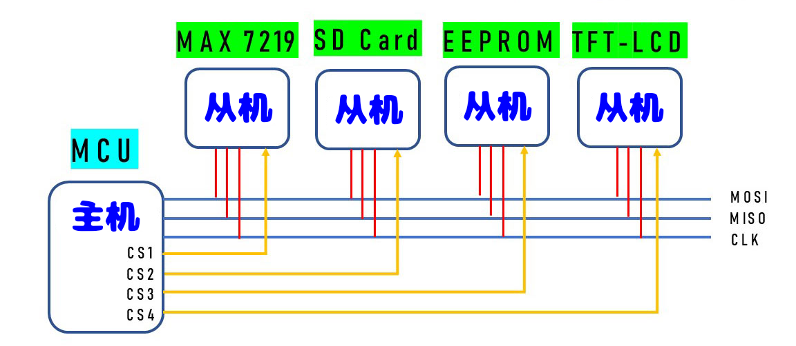

<style>
  table {
    width: 100%
    }
  td {
    vertical-align: center;
    text-align: center;
  }
  table.inputT{
    margin: 10px;
    width: auto;
    margin-left: auto;
    margin-right: auto;
    border: none;
  }
  input{
    text-align: center;
    padding: 0px 10px;
  }
  iframe{
    width: 100%;
    display: block;
    border-style:none;
  }
</style>

# SPI 总线通信

SPI 主机驱动程序负责管理主机与设备间的通信，具有以下特性：

 - 支持多线程环境使用
 - 读写数据过程中 DMA 透明传输
 - 同一信号总线上不同设备的数据可自动时分复用。

SPI 从机驱动程序允许将 SPI 外设作为全双工设备使用。驱动程序可以发送/接收长度不超过 **64** 的字节，或者利用 DMA 来发送/接收更长的字节。



|接脚名称|说明| 
|:---:|:---|
|MISO|主机输入，从机输出，也写作 Q。数据从从机设备发送至主机。|
|MOSI|主机输出，从机输入，也写作 D。数据从主机发送至从机设备。|
|SCLK|串行时钟。由主机产生的振荡信号，使数据位的传输保持同步。|
|CS|片选。允许主机选择连接到总线上的单个从机设备，以便发送或接收数据。如上图需要<font color="#FF1000">每从机一条独立连线</font>。|


## SPI 模式相比 I<sup>2</sup>C

SPI 模式相比 I<sup>2</sup>C 模式占的信号线实在是太多了，所以接线有点麻烦。至少要用 **3** 根。而且每加一设备数据线将加一根），而 I<sup>2</sup>C 模式只需要 **2** 根。但 I<sup>2</sup>C 是全双工，所以传输速度远远追不上 SPI 的传输速度。SPI 一般传输速度能达到 <font color="#FF1000">10</font> Mbps，而 I<sup>2</sup>C 加上高速缓冲区以后 最高也不超过 <font color="#FF1000">3.4</font> Mbps。所以要想获得稳定高度的传输结果，SPI 是个比较理想。

## SPI 传输程序

SPI 总线传输程序由五个阶段构成，但可程序任意省略，如下表：

|阶段名称|描述|
|:---:|:---|
|命令阶段 (Command)|在此阶段，主机向总线发送命令字段，长度为 0-16 位。|
|地址阶段 (Address)|在此阶段，主机向总线发送地址字段，长度为 0-64 位。|
|Dummy 阶段|此阶段可自行配置，用于适配时序要求。|
|写入阶段 (Write)|此阶段主机向设备传输数据，这些数据在紧随命令阶段（可选）和地址阶段（可选）之后。从电平的角度来看，数据与命令没有区别。|
|读取阶段 (Read)|此阶段主机读取设备数据。|


## 传输线模式配置

|模式|命令位宽|地址位宽|数据位宽|传输事务标志信号|总线 IO 设置标志信号|
|:---:|:---:|:---:|:---:|:---:|:---:|
|普通 SPI 模式|1|1|1|0|0|
|双线输出模式|1|1|2|SPI_TRANS_MODE_DIO|SPICOMMON_BUSFLAG_DUAL|
|双线 I/O 模式|1|2|2|SPI_TRANS_MODE_DIO|SPI_TRANS_MULTILINE_ADDR|SPICOMMON_BUSFLAG_DUAL|
|四线输出模式|1|1|4|SPI_TRANS_MODE_QIO|SPICOMMON_BUSFLAG_QUAD|
|四线 I/O 模式|1|4|4|SPI_TRANS_MODE_QIO|SPI_TRANS_MULTILINE_ADDR|SPICOMMON_BUSFLAG_QUAD|


### 中断传输

CPU 可以在传输事务进行过程中切换到其他任务，这能够节约 CPU 时间，会延长传输持续时间。

### 轮询传输事务

它不会阻塞任务，但允许在传输事务进行时轮询。

单个字节数据的典型传输持续时间如下:

 - DMA 的中断传输：28 µs。
 - CPU 的中断传输：25 µs。
 - DMA 的轮询传输：10 µs。
 - CPU 的轮询传输：8 µs。

```c
#define SPI_HOST     SPI2_HOST
#define PIN_NUM_MISO 25
#define PIN_NUM_MOSI 23
#define PIN_NUM_CLK  19
#define PIN_NUM_CS   22

#define PIN_NUM_DC   21

#define PARALLEL_LINES 16
#define TRANSFER_BUFFER PARALLEL_LINES * 320 * 2 + 8
#define SPI_CLOCK 10000000

spi_bus_config_t buscfg = {
  .miso_io_num = PIN_NUM_MISO,
  .mosi_io_num = PIN_NUM_MOSI,
  .sclk_io_num = PIN_NUM_CLK,
  .quadwp_io_num = -1,
  .quadhd_io_num = -1,
  .max_transfer_sz = TRANSFER_BUFFER,
};
    
spi_device_interface_config_t devcfg = {
  .clock_speed_hz = SPI_CLOCK,
  .mode = 0,
  .spics_io_num = PIN_NUM_CS,
  .queue_size = 7,
  .pre_cb = lcd_spi_pre_transfer_callback, 
};

spi_bus_initialize(SPI_HOST, &buscfg, SPI_DMA_CH_AUTO);
spi_bus_add_device(SPI_HOST, &devcfg, &spi);
```