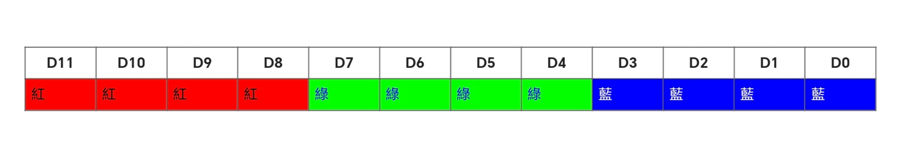
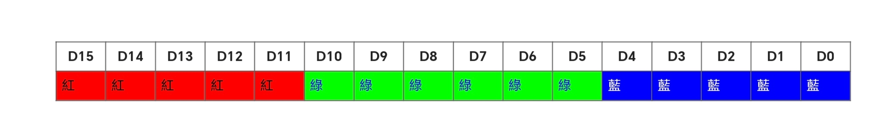
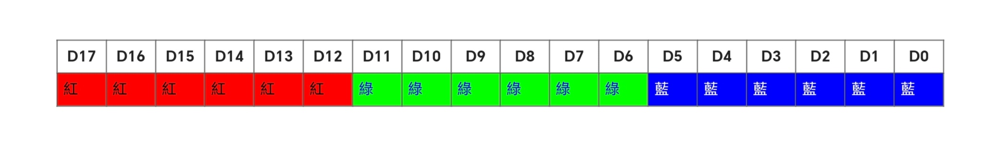

<style>
  table {
    width: 100%
    }
  td {
    vertical-align: center;
    text-align: center;
  }
  table.inputT{
    margin: 10px;
    width: auto;
    margin-left: auto;
    margin-right: auto;
    border: none;
  }
  input{
    text-align: center;
    padding: 0px 10px;
  }
  iframe{
    width: 100%;
    display: block;
    border-style:none;
  }
</style>

# ESP ST7789 显示屏

ST7789 是一款高度集成的液晶显示控制器芯片。它支持RGB565 / 666 / 888格式的彩色显示，最大60帧/秒的刷新率。ST7789 还具有广泛的接口选择，包括SPI和 8/9/16/18 位并行总线接口。

|編號|	名稱|	方向	|功能|
|:---:|:---:|:---:|:---|
|1	|GND	|	|LCD 熒幕 接地<br/>(TFT IPS LCD 引腳)|
|2	|VCC|		|LCD 熒幕 電源，接受 5V<br/>(TFT IPS LCD 引腳)|
|3	|SCL	|輸入|	序列時脈，資料由高至低取值每8位元資料為1週期|
|4	|SDA	|輸入|	序列資料|
|5	|RES	|輸入	|低電壓時，重置所有控制模式的設定值若果不需要重置，保持高電壓<br/>(TFT IPS LCD 引腳)|
|6	|DC|	輸入	|低電壓時，為控制模式高電壓時，為資料模式<br/>(TFT IPS LCD 引腳)|
|7	|CS|	輸入|	低電壓時，為啟動狀態高電壓時，為閒置狀態|
|8|	BLK	||	LED 背光 電源，接受 5V<br/>(TFT IPS LCD 引腳)|

## 顏色深度

數碼顏色深度，通常都使用 24位元 ，即是以 紅、綠、藍 三原色為基礎，各使用 8位元，甚至更高顏色深度雖然 ST7789 可以設定使用 24 位元顏色深度 ，實際上記憶體未能支援
ST7789 還有 12 位元 、 16 位元 、 18 位元 顏色深度，預設是使用 16 位元顏色深度

### 12位元顏色深度

12位元顏色深度 共有4096種顏色，能夠讓紅、綠、藍平均分配，各使用4位元：



## 16位元顏色深度

16位元顏色深度 共有65536種顏色，不能夠讓紅、綠、藍平均分配，紅藍各使用5位元，綠色使用6位元:



## 18位元顏色深度

18位元顏色深度 共有262144種顏色，能夠讓紅、綠、藍平均分配，各使用6位元：



```c
unsigned long convert24to18(unsigned long rgb) {
    unsigned long r = (rgb >> 16) & 0xFF;
    unsigned long g = (rgb >> 8) & 0xFF;
    unsigned long b = rgb & 0xFF;
    r = map(r, 0x00, 0xFF, 0x00, 0x3F) << 16;
    g = map(g, 0x00, 0xFF, 0x00, 0x3F) << 8;
    b = map(b, 0x00, 0xFF, 0x00, 0x3F);
    return r | g | b;
}
 
unsigned long convert24to16(unsigned long rgb) {
    unsigned long r = (rgb >> 16) & 0xFF;
    unsigned long g = (rgb >> 8) & 0xFF;
    unsigned long b = rgb & 0xFF;
    r = map(r, 0x00, 0xFF, 0x00, 0x1F) << 11;
    g = map(g, 0x00, 0xFF, 0x00, 0x3F) << 5;
    b = map(b, 0x00, 0xFF, 0x00, 0x1F);
    return r | g | b;
}
 
unsigned long convert24to12(unsigned long rgb, bool isFirst) {
    unsigned long r = (rgb >> 16) & 0xFF;
    unsigned long g = (rgb >> 8) & 0xFF;
    unsigned long b = rgb & 0xFF;
    if (isFirst) {
        r = map(r, 0x00, 0xFF, 0x00, 0x0F) << 12;
        g = map(g, 0x00, 0xFF, 0x00, 0x0F) << 8;
        b = map(b, 0x00, 0xFF, 0x00, 0x0F) << 4;
    } else {
        r = map(r, 0x00, 0xFF, 0x00, 0x0F) << 8;
        g = map(g, 0x00, 0xFF, 0x00, 0x0F) << 4;
        b = map(b, 0x00, 0xFF, 0x00, 0x0F);
    }
    return r | g | b;
}
```

## TFT IPS 显示屏操作指令

|CD|	RW|HEX|	说明|
|:---:|:---:|:---:|:---|
|0|	0	|0x01|	软件重设<br/>执行重设后，需要等待最少5毫秒才完成|
|0	|0	|0x10	|设定休眠模式<br/>0x00 = 关闭<br/>0x01 = 开启|
|0|	0	|0x20|	设定负片模式<br/>0x00 = 关闭<br/>0x01 = 开启|
 |0|0|	0x26	|设定Gamma修正|
 |1|0|X|(1位元组设定值)|
 |0|	0|		0x28	|设定荧幕状态<br/>0x00 = 关闭<br/>0x01 = 开启|
 |0|	0	|0x2A	|设定写入栏的范围
 |1|0|X|第1位元组第15位元至第8位元栏开始位置<br/>第2位元组第7位元至第0位元栏开始位置<br/>第 3位元组第15位元至第8位元栏结束位置<br/>第4位元组第7位元至第0位元栏结束位置<br/>(4位元组设定值)|
 |0	|0	|0x2B	|设定写入列的范围|
 |1|0|X|第1位元组第15位元至第8位元列开始位置<br/>第2位元组第7位元至第0位元列开始位置<br/>第 3位元组第15位元至第8位元列结束位置<br/>第4位元组第7位元至第0位元列结束位置<br/>(4位元组设定值)|
 |0	|0	|0x2C|	写入内容<br/>位元组数量与写入栏及列的范围相应如果设定写入|
 |1|0|X|栏的范围为0 至9 ，列的范围为0 至4 便需要写入10栏x 5列共50个位元组资料<br/>(多位元组设定值)  |
 |0|	0|	0x33|	设定卷动范围
 |1|0|X|T组：<br/>第1位元组第15位元至第8位元固定的顶部高度<br/>第1位元组第7位元至第0位元 固定的顶部高度<br/>S组：<br/>第2位元组第15位元至第8位元卷动的内容高度<br/>第2位元组第7位元至第0 位元卷动的内容高度<br/>B组：<br/>第3位元组第15位元至第8位元固定的底部高度<br/>第3位元组第7位元至 第0位元固定的底部高度<br/>T + S + B = 320 ，否则无效，会重设(6位元组设定值)|
 |0|	0|	0x34	|设定画面撕裂模式<br/>0x00 = 关闭<br/>0x01 = 开启|
 |0	|0|	0x37	|设定卷动列数|
 |1|0|X|第1位元组为第15位元至第8位元<br/>第2位元组为第7位元至第0位元<br/>(2位元组 设定值)|
 |0	|0|0x38|	设定闲置模式<br/>0x00 = 关闭<br/>0x01 = 开启|
 |0|	0|	0x3A	|设定记忆体用量及颜色深度|
 |1|0|X|前4位元0B0<font color="#FF1000">???</font>0000 为记忆体用量<br/>0x03 - 12位元记忆体<br/>0x05 -  16位元记忆体<br/>0x06 - 18位元记忆体<br/>0x07 - 24位元记忆体<br/>后4位元0B00000<font color="#FF1000">???</font> 为颜色深度<br/>0x03 - 12位元颜色深度<br/>0x05 - 16位元颜色深度<br/>0x06 - 18位元颜色深度<br/>0x07 - 24位元颜色深度<  br/>(1位元组设定值)|
 |0	|0	|0x51|	设定光度数值|
 |1|0|X|(1位元组设定值)|