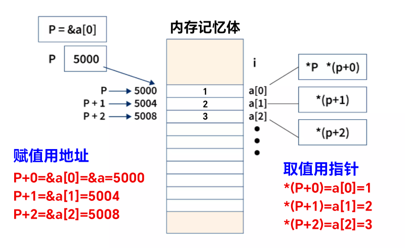

<style>
  table {
    width: 100%
    }
  td {
    vertical-align: center;
    text-align: center;
  }
  table.inputT{
    margin: 10px;
    width: auto;
    margin-left: auto;
    margin-right: auto;
    border: none;
  }
  input{
    text-align: center;
    padding: 0px 10px;
  }
  iframe{
    width: 100%;
    display: block;
    border-style:none;
  }
</style>


# C 指针和数组

## 指針與数组的分别

C 语言中
- 指针的大小可以根据需求调整，也就是说可以在任何时间点分配或释放内存是**动态**的。
- 数组的性质是**静态**的。在运行时，C 语言中数组的大小不能根据用户需求调整。

## 指針

指针 (pointer) 是一个变数的记忆体的地址，在宣告的时候使用 <font color="#FF1000">*</font> 放在变数类型之后。可以被视为一种资料型别的修饰，若宣告了一个指标变数时，就代表其资料类型是指針类型，因此这个变数存的内容就是记忆体地址，不管本身原本是什么型态，只要在程式理面使用该变数(不额外加符号)，就是使用它的记忆体地址。


## 数组

数组 (array) 是一种资料结构，可以储存相同资料型态的变数。以避免宣告一堆变数名称，只要有一个阵列就可以搞定。


## 指针赋值方法



## 多重指针应用

### 单指针

|数组|指针|指针|
|:---:|:---:|:---:|
|char ch[];|char* ptr;<br/>ptr = ch;|char cc;<br/>ptr = &cc|


```c
char ch[] = {"Hello world"};
char *ptr = ch;
printf("%s - %s\n", ch, ptr);
//--- 输出结果 ---
Hello world - Hello world
```

### 两重指针

|数组|指针|指针|
|:---:|:---:|:---:|
|char *ch[];|char **ptr;<br/>ptr = ch;|char *cc;<br/>ptr = &cc;|


```c
char* ch[] = {"Hello","world"};
char** ptr = ch;
printf("%s - %s\n", ch[0], ptr[0]);
printf("%s - %s\n", ch[1], ptr[1]);
//--- 输出结果 ---
Hello - Hello
world - world
```

### 三重指针

|数组|指针|指针|
|:---:|:---:|:---:|
|char  **ch[];|char ***ptr;<br/>ptr = ch;|char **cc;<br/>ptr = &cc;|


```c
char *ch1[] = {"Hello","world"};
char *ch2[] = {"Dicky","KO"};
char **ch[] = {ch1, ch2};
printf("%s\n", ch[0][0]);
printf("%s\n", ch[0][1]);
printf("%s\n", ch[1][0]);
printf("%s\n", ch[1][1]);
printf("* ------------------------- *\n");
char*** ptr = ch;
printf("%s\n", ptr[0][0]);
printf("%s\n", ptr[0][1]);
printf("%s\n", ptr[1][0]);
printf("%s\n", ptr[1][1]);
//--- 输出结果 ---
Hello
world
Dicky
KO
* ------------------------- *
Hello
world
Dicky
KO
```


### 多重指针


|数组|指针|指针|
|:---:|:---:|:---:|
|每个[]添加一个维指针|多维指针为数组指针加一|多维指针与低维指针取地址<br/>相对应 <font color="#FF1000">&</font> 等于一个指针|