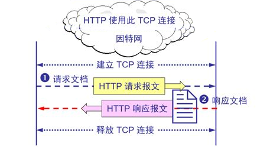
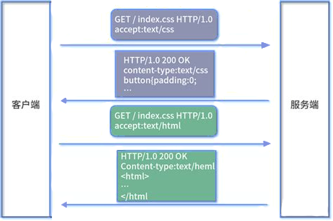
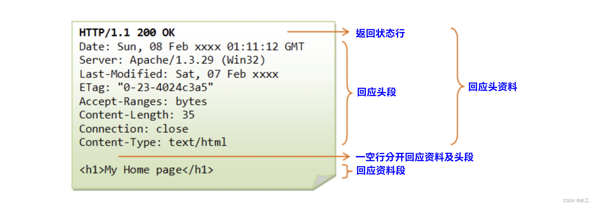

<style>
  table {
    width: 100%
    }
  td {
    vertical-align: center;
    text-align: center;
  }
  table.inputT{
    margin: 10px;
    width: auto;
    margin-left: auto;
    margin-right: auto;
    border: none;
  }
  input{
    text-align: center;
    padding: 0px 10px;
  }
  iframe{
    width: 100%;
    display: block;
    border-style:none;
  }
</style>

# ESP Http 服务器

[下载 HTTP 服务器的源文件](../assets/zip/server.zip)

## WIFI

### ESP32 可以选择以下四种 WiFi 模式

|名稱|說明|語法|
|:---:|:---:|:---:|
|WIFI_STA|以工作站（Station）模式啟動，ESP32用來上網讀取資料，此為預設模式|WiFi.mode(WIFI_STA)|
|WIFI_AP|以熱點（Access Point）模式啟動，讓其他裝置連入ESP32| WiFi.mode(AP)|
|WIFI_AP_STA|混合模式，同時當熱點也當作工作站|WiFi.mode(WIFI_AP_STA)|
|WIFI_OFF|關閉網路，可用於網路不正常時，重啟網路|WiFi.mode(WIFI_OFF)|

#### ESP Wifi 头文件

```c
#ifndef ESP_WIFI_H_
#define ESP_WIFI_H_

#define TAG         "WIFI"
#define STA_SSID    SSID
#define PASSWORD    PASSWORD
#define SNTP_SERVER "stdtime.gov.hk"

const static char http_html_hdr[] = // 200 成功标头
    "HTTP/1.1 200 OK\nContent-Type: application/json\nContent-Length: 19\n{\"success\":\"true\"}";

const static char http_404_hdr[] =  // 404 失败标头
    "HTTP/1.1 404 Not Found\r\nContent-type: text/html\r\n\r\n";

void wifi_connection();
void sntp(char* sntpServer);

#endif /* ESP_WIFI_H_ */
```

#### ESP Wifi 的源文件

```c
#include <stdio.h>              //用于基本 printf 命令
#include <string.h>             //用于处理字符串
#include "freertos/FreeRTOS.h"  //用于 延迟、互斥、信号量 实时操作系统操作
#include "esp_system.h"         //esp_init 函数 esp_err_t
#include "esp_wifi.h"           //esp_wifi_init 函数和 wifi 操作
#include "esp_log.h"            //用于显示日志
#include "esp_event.h"          //用于 wifi 事件
#include "lwip/err.h"           //轻量级 IP 数据包错误处理
#include "lwip/sys.h"           //用于轻量级 IP 应用的系统应用程序
#include "esp_netif_sntp.h"
#include "esp_sntp.h"

#include "../include/wifi.h"

static void wifi_event_handler(void *event_handler_arg, esp_event_base_t event_base, int32_t event_id,void *event_data)
{
  int retry_num=0;
  if(event_id == WIFI_EVENT_STA_START)
  {
    ESP_LOGI(TAG, "WIFI 连接...");
  }
  else if (event_id == WIFI_EVENT_STA_CONNECTED)
  {
    ESP_LOGI(TAG, "WiFi 已连接");
  }
  else if (event_id == WIFI_EVENT_STA_DISCONNECTED)
  {
    ESP_LOGI(TAG, "WiFi 失去连接");
    if(retry_num<5)
    {
      esp_wifi_connect();
      retry_num++;
      ESP_LOGI(TAG, "重试连接...");}
  }
  else if (event_id == IP_EVENT_STA_GOT_IP)
  {
    ESP_LOGI(TAG, "~~~~~~~~~~~~~~~~~~~~~~~~~~~~~~~~~~~~~");
    esp_netif_ip_info_t ip_info;
    esp_netif_get_ip_info(IP_EVENT_STA_GOT_IP,&ip_info);
    ESP_LOGI(TAG,"IP: " IPSTR, IP2STR(&ip_info.ip));
    ESP_LOGI(TAG,"网关: " IPSTR, IP2STR(&ip_info.gw));
    ESP_LOGI(TAG,"网络掩码: " IPSTR, IP2STR(&ip_info.netmask));
    ESP_LOGI(TAG, "~~~~~~~~~~~~~~~~~~~~~~~~~~~~~~~~~~~~~");
  }
}

void wifi_connection()
{
  esp_netif_init();                    // Wi-Fi 配置阶段
  esp_event_loop_create_default();     // 事件循环
  esp_netif_create_default_wifi_sta(); // WiFi 站
  wifi_init_config_t wifi_initiation = WIFI_INIT_CONFIG_DEFAULT();
  esp_wifi_init(&wifi_initiation);      
  esp_event_handler_register(WIFI_EVENT, ESP_EVENT_ANY_ID, wifi_event_handler, NULL);
  esp_event_handler_register(IP_EVENT, IP_EVENT_STA_GOT_IP, wifi_event_handler, NULL);
  wifi_config_t wifi_configuration = {
      .sta = {
        .ssid = STA_SSID,
        .password = PASSWORD,
      }
    };
  ESP_LOGI(TAG, "Kconfig, SSID=%s, PASS=%s", STA_SSID, PASSWORD);
  esp_wifi_set_config(ESP_IF_WIFI_STA, &wifi_configuration);
  esp_wifi_start();                   // Wi-Fi 启动阶段
  esp_wifi_set_mode(WIFI_MODE_STA);
  esp_wifi_connect();                 // Wi-Fi 连接阶段
  ESP_LOGI(TAG, "wifi_init_softap finished. SSID:%s  password:%s",STA_SSID,PASSWORD);
}

void time_sync_notification_cb(struct timeval *tv_now)
{
  ESP_LOGI(TAG, "时间同步通知");
}

void currentTime(struct tm timeinfo)
{
  char strftime_buf[64];
  strftime(strftime_buf, sizeof(strftime_buf), "%c", &timeinfo);
  ESP_LOGI(TAG, "香港的当前日期/时间是: %s", strftime_buf);
}

void sntp(char* sntpServer)
{
  time_t now = 0;
  struct tm timeinfo = { 0 };
  int retry = 0;
  const int retry_count = 15;
  esp_sntp_config_t config = ESP_NETIF_SNTP_DEFAULT_CONFIG(sntpServer);
  config.start = true;                            // 启动 SNTP 服务
  config.server_from_dhcp = false;                // 接受来自 DHCP 服务器的 NTP 提供需要在连接之前启用
  config.renew_servers_after_new_IP = true;       // 在收到 DHCP 租约后更新配置的 SNTP 服务器
  config.index_of_first_server = 1;               // 来自服务器 1 的更新，保留服务器 0 不变
  config.ip_event_to_renew = IP_EVENT_STA_GOT_IP; // 配置我们更新服务器的事件
  config.sync_cb = time_sync_notification_cb;
  config.smooth_sync = false;
  esp_netif_sntp_init(&config);
  while (esp_netif_sntp_sync_wait(20000 / portTICK_PERIOD_MS) == ESP_ERR_TIMEOUT && ++retry < retry_count) 
  {
    ESP_LOGI(TAG, "等待设置系统时间... (%d/%d)", retry, retry_count);
  }
  if(retry < retry_count){
    time(&now);
    setenv("TZ", "CST-8", 1); // 将时区设置为中国标准时间
    tzset();  
    localtime_r(&now, &timeinfo);
    currentTime(timeinfo);
  }else{
    ESP_LOGI(TAG, "时间更新失败!");
  }
  esp_netif_sntp_deinit();
}
```

### ESP STORAGE

#### ESP STORAGE 头文件

```c
#ifndef ESP_STORAGE_H_
#define ESP_STORAGE_H_

#define TAG "SPIFFS"

typedef struct {
    char   *p;
    size_t n;
} fileInfo;

char* concat(const char *s1, const char *s2);
void mount_SPIFFS();
void SPIFFS_Directory(char * path);
bool readFile(char* filename, fileInfo* data);
bool saveFile(char* filename, char* data, bool append);
bool renameFile(char* srcfilename, char* filename);
bool removeFile(char* filename);

#endif /* ESP_STORAGE_H_ */
```
#### ESP STORAGE 的源文件

```c
#include <stdio.h>              //用于基本 printf 命令
#include <string.h>             //用于处理字符串
#include <stdlib.h>
#include "freertos/FreeRTOS.h"  //用于 延迟、互斥、信号量 实时操作系统操作
#include "esp_system.h"         //esp_init 函数 esp_err_t
#include "esp_log.h"            //用于显示日志
#include "esp_event.h"          //用于 wifi 事件
#include "esp_vfs.h"
#include "esp_spiffs.h"

#include "../include/storage.h"

char* concat(const char *s1, const char *s2)
{
    const size_t len1 = strlen(s1);
    const size_t len2 = strlen(s2);
    char *lvalue = malloc(len1 + len2 + 1);
    memcpy(lvalue, s1, len1);
    memcpy(lvalue + len1, s2, len2 + 1);
    return lvalue;
}

void SPIFFS_Directory(char * path) {
  DIR* dir = opendir(path);
  assert(dir != NULL);
  while (true) {
    struct dirent* pe = readdir(dir);
    if (!pe) break;
    ESP_LOGI(TAG, "文件名=%s 节点编号=%d 文件类型=%x", pe->d_name,pe->d_ino, pe->d_type);
  }
  closedir(dir);
}

bool readFile(char* filename, fileInfo* data)
{
  struct stat st;
  char* result = NULL;
  static FILE *file = NULL;
  if (stat(filename, &st) == 0)
  {
    file = fopen(filename, "r");
    if(file != NULL){
      result = (char*) malloc(st.st_size+1 * sizeof(char));
      if(fgets(result, st.st_size, file) != NULL){
        data->p = result;
        data->n = st.st_size;
        fclose(file);
        return true;
      }
    }
    fclose(file);
  }
  ESP_LOGE(TAG, "文件 %s 不存在!", filename);
  return false;
}

bool saveFile(char* filename, char* data, bool append)
{
  static FILE *file = NULL;
  if(append){
    file = fopen(filename, "a");
  }else{
    file = fopen(filename, "w");
  }
  if(file != NULL){
    fprintf(file, data);
    fclose(file);
    return true;
  }
  fclose(file);
  ESP_LOGE(TAG, "文件 %s 写入失败!", filename);
  return false;
}

bool renameFile(char* srcfilename, char* filename)
{
  if (rename(srcfilename, filename) != 0) {
    ESP_LOGE(TAG, "文件 %s 重命名失败!", srcfilename);
    return false;
  }else{
    return true;
  }
}

bool removeFile(char* filename)
{
  struct stat st;
  if (stat(filename, &st) == 0) {
    unlink(filename);
    return true;
  }else{
    ESP_LOGE(TAG, "文件 %s 删除失败!", filename);
    return false;    
  }
}

void mount_SPIFFS()
{
  ESP_LOGI(TAG, "初始化 SPIFFS");
  esp_vfs_spiffs_conf_t conf = {
    .base_path = "/spiffs",
    .partition_label = NULL,
    .max_files = 12,
    .format_if_mount_failed =true
  };
  // 使用上面定义的设置来初始化和挂载 SPIFFS 文件系统
  esp_err_t ret = esp_vfs_spiffs_register(&conf);
  if (ret != ESP_OK) {
    if (ret == ESP_FAIL) {
      ESP_LOGI(TAG, "无法挂载或格式化文件系统");
    } else if (ret == ESP_ERR_NOT_FOUND) {
      ESP_LOGI(TAG, "找不到 SPIFFS 分区");
    } else {
      ESP_LOGI(TAG, "无法初始化 SPIFFS (%s)",esp_err_to_name(ret));
    }
    return;
  }
  size_t total = 0, used = 0;
  ret = esp_spiffs_info(NULL, &total,&used);
  if (ret != ESP_OK) {
    ESP_LOGI(TAG, "无法获取 SPIFFS 分区信息 (%s)",esp_err_to_name(ret));
  } else {
    ESP_LOGI(TAG, "分区大小总计: %d, 已用容量: %d", total, used);
  }
  SPIFFS_Directory("/spiffs/");
}
```

### ESP HTTP 网络服务器



#### HTTP 请求及响应报文



#### HTTP 服务器回应资料介绍



#### ESP HTTP 网络服务器的源文件

```c
#include <stdio.h>              //用于基本 printf 命令
#include <string.h>             //用于处理字符串
#include <stdlib.h>
#include "freertos/FreeRTOS.h"  //用于 延迟、互斥、信号量 实时操作系统操作
#include "esp_system.h"         //esp_init 函数 esp_err_t
#include "esp_wifi.h"           //esp_wifi_init 函数和 wifi 操作
#include "esp_log.h"            //用于显示日志
#include "esp_event.h"          //用于 wifi 事件
#include "nvs_flash.h"          //非易失性存储
#include "lwip/err.h"           //轻量级 IP 数据包错误处理
#include "lwip/sys.h"           //用于轻量级 IP 应用的系统应用程序

#include "freertos/task.h"
#include "freertos/event_groups.h"

#include <lwip/sockets.h>
#include <lwip/sys.h>
#include <lwip/api.h>
#include <lwip/netdb.h>

#include "../component/include/wifi.h"
#include "../component/include/storage.h"

#define TAG "SERVER"

fileInfo result = {NULL, 0};

void msleep(int delay_ms)
{
  vTaskDelay(delay_ms/portTICK_PERIOD_MS);
}

static void http_server_netconn_serve(struct netconn *conn) {
  struct netbuf *inbuf;
  char *buf;
  u16_t buflen;
  err_t err;
  err = netconn_recv(conn, &inbuf);   // 从端口读取数据，如果尚未读取任何数据则阻塞。
  if (err == ERR_OK) {
    netbuf_data(inbuf, (void**) &buf, &buflen);
    // HTTP GET 命令吗？ 仅检查前 5 个字符，因为 GET 还有其他格式
    if (buflen >= 5 && strncmp("GET ",buf,4)==0) {
      char* path = NULL;                     // 解析 URL
      char* line_end = strchr(buf, '\n');
      if( line_end != NULL )
      {                                     // 从 HTTP GET 请求中提取路径
        path = (char*)malloc(sizeof(char)*(line_end-buf+1));
        int path_length = line_end - buf - strlen("GET ")-strlen("HTTP/1.1")-2;
        strncpy(path, &buf[4], path_length );
        path[path_length] = '\0';
        ip_addr_t remote_ip;                // 获取远程 IP 地址
        u16_t remote_port;
        netconn_getaddr(conn, &remote_ip, &remote_port, 0);
        ESP_LOGI(TAG, "[ "IPSTR" ] GET %s\n", IP2STR(&(remote_ip.u_addr.ip4)),path);
      }
      if(path != NULL)   				          	// 发送 HTML 内容
      {
        char* srcpath = concat("/spiffs", path);
        if(readFile(srcpath, &result))
        {
          netconn_write(conn, result.p, result.n - 1,  NETCONN_NOCOPY);
        }else{
          netconn_write(conn, http_404_hdr, sizeof(http_404_hdr) - 1, NETCONN_NOCOPY);
          }
        free(result.p);
        result.p=NULL;
        free(srcpath);
        free(path);
        path=NULL;
      }
    }
  }
  netconn_close(conn);  // 关闭连接
  netbuf_delete(inbuf); // 删除及释放缓冲区
}

static void http_server(void *pvParameters) {
  struct netconn *conn, *newconn;  // 监听线程，newconn 是客户端的新线程
  err_t err;
  conn = netconn_new(NETCONN_TCP);
  netconn_bind(conn, NULL, 80);
  netconn_listen(conn);
  do {
    err = netconn_accept(conn, &newconn);
    if (err == ERR_OK) {
      http_server_netconn_serve(newconn);
      netconn_delete(newconn);
    }
  } while (err == ERR_OK);
  netconn_close(conn);
  netconn_delete(conn);
}

void app_main(void)
{
nvs_flash_init();
mount_SPIFFS();
wifi_connection();
sntp(SNTP_SERVER);
xTaskCreate(&http_server, "http_server", 2048, NULL, 5, NULL);
}
```