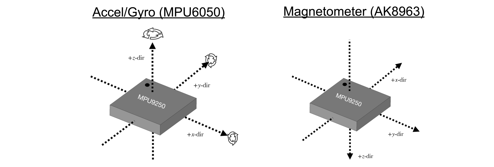
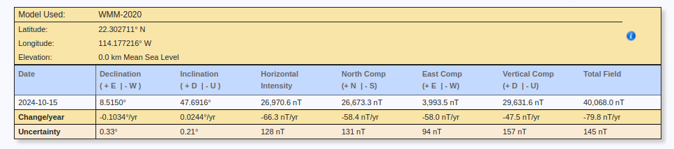
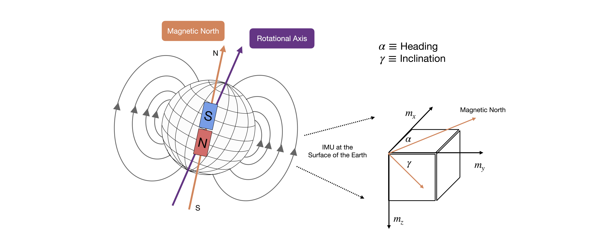

<style>
  table {
    width: 100%
    }
  td {
    vertical-align: center;
    text-align: center;
  }
  table.inputT{
    margin: 10px;
    width: auto;
    margin-left: auto;
    margin-right: auto;
    border: none;
  }
  input{
    text-align: center;
    padding: 0px 10px;
  }
  iframe{
    width: 100%;
    display: block;
    border-style:none;
  }
</style>

# IMU 惯性测量单元介绍

## 一些和惯导相关的开源项目

### IMU

惯性测量单元(Inertial Measurement Unit)是测量物体三轴姿态角(或角速率)以及加速度的装置。一般的 **IMU** 包含了三个单轴的加速度计和三个单轴的陀螺，加速度计检测物体在载体坐标系统独立三轴的加速度信号，而陀螺检测载体相对于导航坐标系的角速度信号，测量物体在三维空间中的角速度和加速度。

### AHRS

航姿参考系统(Attitude and heading reference system)包括基于 MEMS 的三轴陀螺仪，加速度计和磁强计。**AHRS** 是通过与地球参考得出自身姿态，而IMU是相较于自身的初始姿态来进行姿态测量的。

### VRU

VRU 即 Vertical Reference Unit, 垂直参考单元（垂直陀螺）。硬件结构与 IMU 相同，利用卡尔曼滤波算法，在输出 IMU 的数据基础上，增加俯仰，横滚角度输出，有的 **VRU** 也输出相对方位角，也称为欧拉角输出。VRU 能够达到的性能非常依赖于工程师的算法能力。

### GNSS

Global Navigation Satellite System 全球导航卫星系统，包括 GPS (美国)，GLONASS (俄罗斯的格洛纳斯)，北斗卫星导航系统 (BDS)

### INS

全称 Inertial Navigation System 即惯性导航系统。**IMU** 是测量角速度和加速度的装置，INS 是通过测量得出的角速度和加速度的数值可以确定运动载体在惯性参考坐标中的运动。

## 实现传感器数据融合

实现数据融合算法需要以下几个步骤

 - 传感器校准
     - 陀螺仪的零偏校准
     - 加速度计的零偏校准
     - 加速度计的比例校准
     - 磁力计的零偏校准
     - 磁力计的刻度校准
 - 通过陀螺仪获得初始姿态估计，并根据加速度计的测量结果进行积分误差校正。
 - 利用扩展卡尔曼滤波算法进行数据融合，更新状态量和协方差矩阵。

### 简单校准传感器零偏校准

注: 零偏校准：零偏就是传感器的测量值相对于“零点”的偏移量。可以通过平均值修正。比如测量 <font color="#FF1000">100</font> 次静止得到数值再取其平均值。让测量得到的数据比较平稳，不会有大幅度的跃动。传感器静止测量的数值为其零偏离量。只要将测量的数值减静止测量的数值。即可校准这传感器的零偏问题。

### 传感器比例校准 (等比例缩放)

如以 x 轴作参考点。

$$
Y_{correct} =  Y_i \times \frac {X_{max} - X_{min}} {Y_{max} - Y_{min}}\\
Z_{correct} =  Z_i \times \frac {X_{max} - X_{min}} {Z_{max} - Z_{min}}
$$

## 工作原理

### 加速度计工作原理

加速度计的本质是检测力而非加速度，即加速度计的检测装置捕获的是引起加速度的惯性力，随后可利用牛顿第二定律获得加速度值。测量原理可以用一个简单的质量块、弹簧和指示计来表示。加速度计测量值。


$$
a_m = \frac {f}{m} = a - g
$$

为弹簧拉力对应的加速度，$f$ 弹簧拉力，$m$ 物件质量，$a$ 物体在惯性系统下的加速度，$g$ 为重力加速度。加速度计利用电容或者电阻桥等原理测量 $a_m$。

#### 加速度计简单校准

以 z 轴校准为例，步骤如下：

 - 采集数据。将加速度计分别正反放置，保持静止，分别记录 z 方向 N 组加速度计数据，如上图所示；
 - 计算平均值。计算正放、反放的平均值，如正面的平均值 8.51，反面的平均值 -11.46；
 - 计算误差。正放反放的误差为 

$$
\frac {Avg_{+}+Avg_{-}}{2} = \frac {8.51 + (−11.46)}{2} = − 1.475 
$$

 - 计算校准后的值。校准后的z方向的数据都是减去校准误差。 比如
    - 8.51减去 -1.475 变为 9.985
    - -11.46 减去 -1.475 变为 -9.985
 - 映射到 [-g, g] 区间。将校准后的加速度除以模长，再乘 g 即可。校准后，解决了正放、反放绝对值差异大的问题。但是由于手动放平，很难刚好使得正面朝上(x，y 都为 0)，存在一定误差。


$$
A_{roll}= tan^{-1} \left ( \frac {A_y }{A_z} \right )
$$

$$
A_{pitch}= tan^{-1} \left ( \frac {-A_x }{\sqrt{A_y^2+A_z^2}} \right )
$$

### 陀螺仪的工作原理

当一个质点相对于惯性系做直线运动时，因为质点自身惯性，它相对于旋转体系，其轨迹是一条曲线。立足于旋转体系，被认为有一个力驱使质点运动轨迹形成曲线。

$$
\overrightarrow {F}_{向心加速度} = -2m (\overrightarrow {\omega} \times  \overrightarrow {v})
$$

$m$ 物件质量，$v$ 物件速度，$\omega$ 物件旋转体系的角速度。

#### 陀螺仪简单校准

 - 将陀螺仪静止，采集 N 组数据；
 - 计算这 N 组数据的平均值；
 - 将采集后的数据减去这个平均值即可。

校准后，陀螺仪静止时的漂移减小很多。使用这种简单校准的方法，解决了零偏问题，但是还有轴偏没有解决，也即加速度计的坐标轴与磁力计的坐标轴不重合。


$$
G_{roll}=\omega_x \times \delta t \\
G_{pitch}=\omega_y \times \delta t \\
G_{yaw}=\omega_z \times \delta t
$$


### 磁力计的工作原理

地球的磁场象一个条形磁体一样由磁南极指向磁北极。在磁极点处磁场和当地的水平面垂直，在赤道磁场和当地的水平面平行，所以在北半球磁场方向倾斜指向地面。用来衡量磁感应强度大小的单位是 Tesla 或者 Gauss（1Tesla=10000Gauss）。随着地理位置的不同，通常地磁场的强度是 **0.4**-**0.6** Gauss。需要注意的是，磁北极和地理上的北极并不重合，通常他们之间有 **11** 度左右的夹角。

#### 磁力计简单校准

 - 采集数据。各个转动磁力计，采集 x，y，z 方向的 N 组数据（采集原始值即可）。
 - 获取最值。获取各个轴上的最大最小值，比如 x 方向最小值为 -500， 最大值为 473。
 - 计算误差。计算最大最小值的误差，正放反放的误差为 


$$
准误差 = \frac{max-min}{2} = \frac{−500 + 473 }{2} = − 13.5 
$$


 - 计算校准后的值。校准后的数据就是采集的原始数据减去校准误差。 比如 x 方向的磁力计数据都减去 −13.5。

### 角度计算方法

- 磁力计获取角度的方法如下


$$
M_x = m_x cos(A_{pitch})+m_z sin(A_{pitch})
$$

$$
M_y = m_x sin(A_{roll})sin(A_{pitch})+m_y cos(A_{roll}) - m_z sin(A_{roll}) cos(A_{pitch})
$$

$$
M_{yaw} = tan^{-1} \left(\frac {m_y}{m_x}\right)
$$

因真北与磁北之间存在一个磁偏角 $\Delta \varphi$。所以

$$
\varphi = \Delta \varphi + tan^{-1} (\frac {m_y}{m_x})
$$

## 获取角度的方法


### 惯性测量系统中的重要公式

$$
A_{roll}= tan^{-1} \left ( \frac {A_y }{A_z} \right )
$$

$$
A_{pitch}= tan^{-1} \left ( \frac {-A_x }{\sqrt{A_y^2+A_z^2}} \right )
$$

$$
M_{yaw} = tan^{-1} \left(\frac {m_y}{m_x}\right)
$$

$$
G_{roll}=\omega_x \times \delta t \\
G_{pitch}=\omega_y \times \delta t \\
G_{yaw}=\omega_z \times \delta t
$$

- 加速度计获取角度的方法如下

加速度计可以测量到地球的重力，当载体静止或者匀速运动时，重力的方向就是竖直向下的，通过测量重力加速度的方向，可以获取当前载体的俯仰角、滚转角。滚转角（绕X轴转-ROLL）和俯仰角（绕Y轴转-PITCH）发生变化。


```c
//angle_1是加速度计通过三角函数得出的角度
//加速度_y 和 加速度_z 是两个轴的加速度计
angle_1=atan2(acc_y,acc_z)*(180/PI)+90;
//PI 指的是圆周率3.1415926
```

- 陀螺仪获取角度的方法如下

陀螺仪可以获取载体的角速度，由角速度积分，就能得到角度，也就得到了载体的姿态角。


$$
陀螺仪姿态角 = \theta_{gyr} = \omega \times \delta t
$$


```c
//gyroRate 是得出来的那个轴的数据
//dt 是积分的时间间隔，一般是ms，具体多少看实际情况
double integrateGyro(double gyroRate, double dt)
{
    static double gyroAngle = 0.0;
    // 对角速度进行积分得到角度
    gyroAngle += gyroRate * dt;
    // 返回角度
    return gyroAngle;
}
```


陀螺仪可以获取载体的角速度，由角速度积分，就能得到角度，也就得到了载体的姿态。但是，陀螺仪给出的角速度存在测量误差、噪声和漂移，经过积分运算之后，会形成累积误差，这个误差会随着时间延长越来越大，最终导致偏差太大而无法使用。

另一方面，加速度计可以测量到地球的重力，当载体静止或者匀速运动时，重力的方向就是竖直向下的，通过测量重力加速度的方向，可以获取当前载体的俯仰角、滚转角。但是加速度计容易受到高频噪声的干扰，动态响应慢，只在长时间内数据比较有效。

因此，一般我们使用加速度计的数据来修正陀螺仪，以加速度计获取的实时姿态角来修正陀螺仪的累积误差，就能在短时间和长时间内都能获取比较满意的姿态信息。

最后为了让数据更加准确，一般使用一阶互补滤波对加速度计得出的角度和陀螺仪数据得出的角度进行互补滤波

姿态角 = k * 陀螺仪姿态角 + (1-k) * 加速度计姿态角

$$
姿态角 = \theta = k \times \theta_{gyr} + (1+k) \times \theta_{acc}
$$


```c
float acc_ratio = 4.90;  //加速度计比例
float gyro_ratio = 0.45; //陀螺仪比例
float dt = 0.005;        //采样周期。具体多少看实际情况
 
float angle_calc(float angle_m, float gyro_m)
{
    float temp_angle;
    float gyro_now;
    float error_angle;
    static float last_angle;
    static uint8 first_angle;
    if(!first_angle)
    {
        first_angle = 1;
        last_angle = angle_m;
    }
    gyro_now = gyro_m * gyro_ratio;
    error_angle = (angle_m - last_angle)*acc_ratio;
    temp_angle = last_angle + (error_angle + gyro_now)*dt;
    last_angle = temp_angle;
    return temp_angle;
}
```

如要更深一步了解**一阶互补滤波**可参考 [PID 控制](https://hkdickyko.github.io/%E7%A9%8D%E9%AB%94%E9%9B%BB%E8%B7%AF/pid)

## 校准传感器

深入探讨 **加速度计**、**陀螺仪** 和 **磁力计** 的实际校准系数和方法。

**加速度计**/**陀螺仪** 和 **磁力计** 读取的数据。以下是两个传感器的坐标组成：



加速度计坐标系使用有点传统的 **笛卡尔坐标系**。同样，陀螺仪使用逆时针旋转作为正旋转方向。磁力计切换 x 和 y 方向，同时反转 z 方向振幅的方向。这些惯例将在校准过程中发挥作用，并将针对三个传感器中的每一个进行澄清和讨论。

坐标参考对于理解读取的数据和开发校准 IMU 的方法至关重要。

每个传感器的范围：

 - 加速度计 : 将在 0g-2g 范围内校准
 - 陀螺仪 : 将在 0dps - 250dps 范围内校准
 - 磁力计 : 将在 0μT - 4800μT 范围内校准

### 在稳定条件下（不移动）校准陀螺仪

对于陀螺仪，预计它会记录接近零的角速度，这在三个方向上都是大致可见的。当然，这只有在 IMU 处于稳定状态（不移动）时才成立。陀螺仪在当前配置下跨度为 0-250 dps（度/秒），因此可以假设上面观察到的小值是 **噪声**、小**振动**或需要校准的**偏移**。

由于预期读数是在稳定条件下（不移动）输出的，因此陀螺仪是最容易校准的。

当 IMU 不移动时，
 
 - 陀螺仪的三个轴中的每一个都应读取 <font color="#FF0010">0</font> 度/秒 (dps, °/s)。
 
可以通过首先在 IMU 不移动时获取一些读数，然后在将来读取陀螺仪值时使用这些值作为 **偏移量** 来测量偏移量。这只是 IMU 最简单的校准方法，足以满足陀螺仪和 IMU 的大多数日常使用。


有一系列高阶陀螺仪校准程序，可在网上找到。

三轴加速度计的标准校准程序基于其对地球重力场的灵敏度，校准是通过将加速度计敏感轴与重力对齐来执行的，此时标称输出为 +1g 和 −1g。陀螺仪的标准校准程序包括对装有传感器的外壳施加已知旋转 (+90°)；然后积分陀螺仪信号以测量角度偏移，然后测量灵敏度。

误差校准是提高 MEMS 惯性器件精度和稳定性的关键。一般误差有以下几种。

 - 封装错位误差
 - 传感器间非正交性误差
 - 比例因子和偏差
 
对于低精度IMU，由于地球自转速率远小于其偏差输出，因此需要使用转台校准不同位置的误差系数。因此设计了一种简单易行的三位置正向/反向校准方案。并使用 <font color="#FF1000">最小二乘法</font> 校准三轴陀螺仪的误差，这是误差参数估计中最常用的方法。

 ### 通过数值积分验证陀螺仪校准

通过在已知旋转下对角速度值数组随时间的变化进行积分来进一步测试陀螺仪的校准。例如，可以将 惯性测量单元校准块旋转 180°，并对陀螺仪随时间的变化进行积分，以验证陀螺仪是否正常工作。

通过对陀螺仪的角速度进行积分，可以对角位移进行近似：

$$
 \theta_i = \int_{t_1}^{t_2} \omega_i dt 
$$

对于离散点，需要采用数值积分技术，可使用梯形数值积分：

$$
 \theta_i = \int_{t_1}^{t_2} \omega_i dt \approx \sum_{j=1}^{N} \left( \frac {f_i(t_{j-1}) + f_i(t_j)}{2}  \Delta t_j \right)
$$

使用上述公式检查陀螺仪是否准确。如上例中旋转是逆时针进行的。尽管如此，陀螺仪可以被视为零阶校准。加速度计将以类似的方式进行校准，但采用一阶近似，这稍微复杂一些，每个轴都需要三个校准步骤。加速度计也将以与陀螺仪类似的方式通过数值积分进行验证。

### 使用重力校准加速度计

加速度计的校准需要利用重力加速度，可以在惯性测量单元的正向和负向使用重力加速度。还可将 惯性测量单元垂直于重力放置，以获取第三个校准点。这会产生三个唯一值，可以将它们组合起来，形成三个值与加速度计每个轴输出的值之间的线性拟合。

加速度计的校准程序如下（针对每个轴）：


应对 3 个轴分别进行这三次校准。这三个点将允许对加速度计每个轴的 **比例因子** 和 **偏移**（斜率和截距）进行一阶模型的最小二乘拟合。

上述校准表示惯性测量单元连接到校准块，z 方向朝上。这就是为什么看到 z 方向的加速度为 1g，而其他两个方向的加速度接近零。

可以再次从下面的线性拟合中看到校准对每个轴的好处：适用于 +1g、0g、-1g 以下所有加速度计轴的线性拟合。

接下来，将通过将惯性测量单元校准块沿选定方向移动一段已知距离来验证加速度计。加速度计测量的相应加速度将积分两次以近似位移。

### 通过数值积分验证加速度计校准

加速度计校准的验证方式与陀螺仪类似，即通过数值积分。陀螺仪积分与加速度计积分的区别在于，加速度值将被积分两次，以输出惯性测量单元的近似位移，具体积分如下：

$$
a_i = \frac{d^2 x_i}{dt^2} \to \frac{dx_i}{dt} = \int a_i dt \to x_i = \int \left ( \int a_i dt \right) dt 
$$

同样为了使其适合现实世界的运动，上述关系需要离散化，这首先需要将加速度积分为第一个近似速度：

$$
v_i =  \sum_{j=1}^{N} \left( \frac {a(t_{j-1}) + a(t_j)}{2}  \Delta t_j \right)
$$

接下来，必须对速度阵列进行积分，以近似位移：

$$
x_i =  \sum_{j=1}^{N} \left( \frac {v(t_{j-1}) + v(t_j)}{2}  \Delta t_j \right)
$$

以逐步递增的方式实现梯形数值积分。第一次积分给出速度矢量，而第二次积分产生位移数组。

加速度测试的双重积分有几个假设：

 - 物体（IMU 校准块）处于静止状态
 - 样本之间的时间已知（对于 IMU 来说可能不一致）
 - IMU 朝一个方向滑动
 - 加速度轴垂直于重力（重力影响为 0g）

 在这些假设下，加速度计值可以轻松地在一个方向上积分。惯性测量单元校准块以恒定速度沿标尺移动。将测量的位移与两次积分的加速度计数据进行比较，以验证加速度计校准。

可以做出以下几点观察：

 - 加速度不为零，即使校准后也是如此
    - 可能是由于工作台不平衡
 - 加速度开始（加速为正，过零，减速为负）
    - 正确数值
 - 速度始终为正
    - 向前运动
 - 位移为正
    - 向前运动
 - 由于加速度不平衡
    - 工作台不平衡，速度和位移不断变化

通过各种方法探索了陀螺仪和加速度计的校准。通过计算测量样本阵列的平均偏移量，在稳定条件下校准陀螺仪。通过首先对角速度随时间积分并查看已知旋转后的结果来探索陀螺仪的精度。

对加速度计进行了三个校准点范围的测试：+1g、0g 和 -g。

使用最小二乘法将这三个点拟合成线。加速度计也进行了积分，这次是两次，以近似 惯性测量单元在已知位移上的运动。

该方法的精度很容易出错，可能是由于以下因素：
 - 惯性测量单元放置在与重力不完全垂直的桌子上，
 - 双重积分会导致更大的误差。

加速度计也经过滤波以平滑信号（该信号非常嘈杂，特别是在桌子上滑动时）。滤波也可以在陀螺仪上完成。

### 磁力仪的校准

首先访问美国国家环境信息中心 (NCEI) 的 [磁场计算器](https://www.ngdc.noaa.gov/geomag/calculators/magcalc.shtml)

选择标题为 **磁场** 的选项结果

接下来，输入惯性测量单元的当前地理位置坐标（香港 : 纬度 **22.302711** 经度，**114.177216**）



查找标题为 **水平强度** (Horizontal Intensity) 的组件 - 在例子中，它是 26,970nT (26.97μT)

接下来，对 IMU 的 x 和 y 方向输出值求平方：

$$
B_H = \sqrt {B_x^2 + B_y^2}
$$

一般的的情况来说，可以根据惯性测量单元的测量值进行检查。因此，可以验证惯性测量单元相对于地球磁场的表现是否符合预期，如果测量的水平偏角与 NCEI 计算的预期值相近。此时，用户可以验证惯性测量单元在静止条件下是否按预期运行。这结束了校准程序的第一部分。

地球磁场可以近似为一个以地核为中心的偶极子，其相反的磁极与地球表面相交于称为地磁极的点。在描述给定位置的地球磁场时，三轴磁力仪通过将振幅除以磁场的每个分量来计算磁场的水平和垂直分量。下面给出了放置在地球表面的三轴惯性测量单元的示例：



磁力计在水平方向测量的磁场被视为 **航向**，垂直方向有时称为 **磁倾角** 或磁倾角。在大多数情况下，航向用于确定磁北极的方向，可用于地理定位。


  
上述公式可用于使用水平面上的两个磁场分量（x/y 或任何其他组合，具体取决于传感器的方向）来查找磁场强度（水平强度）。同样也可以使用两个水平分量的反正切来近似航向：

$$
B_H = \sqrt {B_x^2 + B_y^2}
$$


因此，使用磁北方向上方的反正切关系，只需使用磁力计测量的磁场的两个分量（假设传感器垂直于表面）即可找到。反正切将用于校准磁力计的所谓   **硬铁偏移**。这将有效地校准磁力计固有的偏移，并确保从反正切近似的角度不受传感器的影响。

#### 磁力仪的硬铁偏移校准

为了找到三轴磁力计的硬铁偏移，惯性测量单元需要至少在两个方向上旋转 **360** 度。了解硬铁效应的最佳方法是首先在 **360** 度旋转期间进行测量，并可视化平面磁力计传感器（与地球垂直磁场平行的传感器）的磁响应。


在抵消硬铁效应之前，很容易看出三个传感器平面之间存在很大差异。传感器绕每个轴旋转 **360** 度应产生一个以原点 (0,0) 为中心的圆，我们在抵消硬铁效应后会看到这个圆。这对于提高磁力计航向近似值的准确性至关重要。因此，在上面得出了三个偏移值，它们近似于系统的硬铁干扰。在使用上一节中给出的反正切计算航向时，应首先从读取的磁力计值中减去硬铁效应。这将提高用于给定惯性测量单元应用的跟踪/方向近似值的准确性和稳定性。