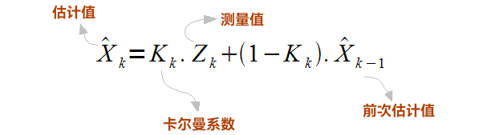

# PID 控制

## 参数调试方法 (PID)

Proportion-Integral-Differential (比例-积分-微分) 方法如下

$$
r(t) -c(t) = e(t) \\
u(t) = K_p \cdot e(t) + K_i \int_{0}^{t}e(\tau) d \tau + K_d \cdot \frac {de(t)}{dt} 
$$

（式中的 $t$ 为时间，$e$ 误差 即对时间积分、微分）如果没有误差，即 $e=0$，
 - 则 $K_p e = 0$； 
 - $ K_d  \frac {\Delta e}{\Delta t} = 0 $；
 - 而 $K_i \int_{0}^{\Delta t}e \Delta t $ 不一定为 $0$。

三项之和不一定为 $0$。如果“误差”存在，**PID** 就会对电机驱动作调整，直到误差 $PID_e=0$。 评价一个控制系统是否优越，有三个指标：快、稳、准。

 - 快，就是要使压力能快速地达到 **命令值**，可以增大 $Kp$ 值。
 - 稳，就是要压力稳定不波动或波动量小，可以增大 $K_d$，值可以减少压力波动。微分控制一般不用于速度很低的物体。如使用可能会出现突然速度改变。
 - 准，就是要求 **命令值** 与 **输出值** 之间的误差 $e$ 小，可以增大 $K_i$ 值。减少静态误差，但仍会存在动态误差。因动态误差是系统的跟踪特性。
 
仔细分析可以得知：这三个指标是相互矛盾的。如果太“快”，可能导致不“稳”；如果太“稳”，可能导致不“快”； 

设置PID参数的建议步骤：

 - 把 $K_i$ 与 $K_d$ 设为 $0$，不要积分与微分；
 - 把 $K_p$ 值从 0 开始慢慢增大，观察压力的反应速度是否在你的要求内； 
 - 当压力的反应速度达到你的要求，停止增大 $K_p$ 值； 
 - 在该 $K_p$ 值的基础上减少 **10**%； 
 - 把 $K_i$ 值从 $0$ 开始慢慢增大；
 - 当压力开始波动，停止增大 $K_i$ 值；
 - 在该 $K_i$ 值的基础上减少 **10**%；
 - 把 $K_d$ 值从 $0$ 开始慢慢增大，观察压力的反应速度是否在要求内。

## 数据平滑

### 卡尔曼滤波（Kalman Filter）

卡尔曼滤波是一种用于状态估计和数据融合的强大数学和统计工具，是一种递归的、最优的状态估计方法，通常用于处理含有噪声的时间序列数据，以估计系统的状态，同时提供估计的不确定性。

卡尔曼滤波的主要用途包括：

 - 状态估计
    - 可以用于估计线性或非线性动态系统的状态变量，尤其是在系统中存在不完全或噪声观测的情况下。这对于跟踪运动物体、导航、定位以及环境感知等应用非常有用。
 - 数据融合
    - 可以将多个传感器提供的信息融合在一起，以提供更准确的估计，降低估计误差。
 - 控制系统
    - 还用于控制系统，以估计系统状态并制定控制策略，从而实现系统的自动控制。

卡尔曼滤波基于状态空间模型，其中系统状态通过线性或非线性动态模型演化，并且由观测模型通过传感器观测进行测量。卡尔曼滤波使用贝叶斯估计方法来不断更新系统状态的估计，考虑了过去的状态估计和新的观测数据，以提供最优的状态估计结果。卡尔曼滤波的主要目标是最小化估计误差的方差，从而提供最优的状态估计结果。

卡尔曼滤波有多个变种，包括扩展卡尔曼滤波（Extended Kalman Filter，EKF）和无迹卡尔曼滤波（Unscented Kalman Filter，UKF），用于处理非线性系统。

#### 卡尔曼滤波需要的统计概念

方差：用于衡量一组数据的离散程度。

$$ \sigma^2 = \frac {\sum (x-\mu)^2}{N}
$$

标准差（Standard Deviation）：是离均差平方的算术平均数的算术平方根。

$$ \sigma = \sqrt {\frac {\sum (x-\mu)^2}{N}}
$$

协方差（Covariance）：用于衡量两个变量的总体误差。
 - 如果两个变量的期望值减去结果值
    - 同一方向，即为正值。 
    - 不同方向，即为负值。

可以理解为：两个变量在变化过程中是同方向变化？还是反方向变化？同向或反向程度如何？

$$
\sigma(x,y) = \frac {1}{N} \sum_{i=1}^{n}(x_i - \bar{x})(y_i - \bar{y})
$$

相关系数（）：是用以反映变量之间相关关系密切程度的统计指标。

$$
p_{xy} = \frac {Cov (x,y)}{\sigma_x \sigma_y} \equiv \frac {\sigma_{xy}^2}{\sigma_x \sigma_y}， -1 \le p_{xy} \le +1
$$

相关系数（Correlation coefficient）：是协方差的归一化 (Normalization)， 消除了两个变量量纲/变化幅度不同的影响。单纯反映两个变量在每单位变化的相似程度。

注意如为采样计算則以上公式的 **N** 改为 **N-1**。

### 小波变换（Wavelet Transform）

小波变换（Wavelet Transform）是一种用于信号处理和数据分析的数学方法。它是一种多尺度分析技术，可以将信号分解成不同尺度和频率的分量，以便更好地理解信号的局部特征和结构。小波变换在许多领域，包括信号处理、图像处理、数据压缩和模式识别等方面都有广泛的应用。

小波变换的主要特点包括：

 - 多尺度分析
    - 能够在不同尺度上分解信号，因此可以检测信号中的局部特征，从高频细节到低频整体。
 - 时频局部性
    - 与傅立叶变换不同，小波变换具有时频局部性，可以在时间和频率上同时分析信号。这使得它在分析非平稳信号和非线性信号时非常有用。
 - 数据压缩
    - 可以用于数据压缩，通过保留主要的小波系数，可以减小数据的存储空间和传输带宽。
 - 特征提取
    - 可以用于从信号中提取特征，用于模式识别、分类和检测任务。

小波变换有两种主要类型：连续小波变换（Continuous Wavelet Transform，CWT）和离散小波变换（Discrete Wavelet Transform，DWT）。

连续小波变换（CWT）是一种在不同尺度上滑动小波函数，对信号进行连续分解的方法。CWT的主要特点是它提供了连续的尺度信息，但计算成本较高。

离散小波变换（DWT）是一种通过滤波和下采样操作将信号分解成不同尺度的方法。DWT通过将信号分解成高频和低频部分，然后继续对低频部分进行分解，从而实现多尺度分析。DWT的计算效率高，适用于实际工程应用。

傅里叶变换 **FFT** 将信号分解为在整个序列中持续存在的振荡。小波变换 **WT** 执行类似的功能，但它们可以将信号分解为空间和时间局部振荡。

小波是一种在时间上局部化的波状振荡；下面提供了一个例子。小波有两个基本属性：尺度和位置。尺度（或膨胀）定义了小波的拉伸或压缩程度。此属性与为波定义的频率有关。位置定义了小波在时间（或空间）中的位置。

上面表达式中的参数 a 设定了小波的尺度。如果降低它的值，小波看起来会更挤压。这反过来可以捕获高频信息。相反，增加 a 的值将拉伸小波并捕获低频信息。

参数 b 定义小波的位置。减小 b 将使小波向左移动。增加 b 将使小波向右移动。位置很重要，因为与波不同，小波仅在短间隔内非零。此外，在分析信号时，不仅对其振荡感兴趣，还对这些振荡发生的位置感兴趣。

基本思想是计算特定尺度和位置的信号中小波的含量。这就是卷积的真正含义。信号与一组不同尺度的小波进行卷积。

如选择一个特定尺度的小波（比如下面的蓝色小波）。然后，将这个小波滑过整个信号（即改变其位置），在每个时间步骤中，将小波与信号相乘。这个乘积的乘积为提供了该特定时间步骤中该小波尺度的系数。然后增加小波尺度（例如红色和绿色小波）并重复该过程。

如果要从信号中提取什么特征形状，那么可以选择多种小波来最好地匹配该形状。

### Savitzky-Golay 滤波器

Savitzky-Golay 平滑滤波是光谱预处理中的常用滤波方法，其核心思想：是对一定长度窗口内的数据点进行k阶多项式拟合，从而得到拟合后的结果。对它进行离散化处理后，S-G 滤波其实是一种移动窗口的加权平均算法，但是其加权系数不是简单的常数窗口，而是通过在滑动窗口内对给定高阶多项式的最小二乘拟合得出。

Savitzky-Golay 平滑滤波被广泛地运用于数据流平滑除噪，是一种在时域内基于局域多项式最小二乘法拟合的滤波方法。这种滤波器的最大特点：在滤除噪声的同时可以确保信号的形状、宽度不变。

使用平滑滤波器对信号滤波时，实际上是拟合了信号中的低频成分，而将高频成分平滑出去了。如果噪声在高频端，那么滤波的结果就是去除了噪声，反之，若噪声在低频段，那么滤波的结果就是留下了噪声。

Savitzky-Golay滤波的主要特点包括：

 - 局部拟合
    - 使用一个固定大小的局部窗口来拟合多项式，通常窗口大小为奇数。对于每个数据点，它使用窗口内的数据点来执行多项式拟合，以获得该点的平滑估计值。
 - 多项式拟合
    - 使用多项式来拟合窗口内的数据点。常用的多项式阶数是2（二次多项式）或4（四次多项式），但可以根据需要选择不同的阶数。
 - 数据平滑
    - 旨在平滑数据，减小数据中的高频噪声和突发波动。它保留了数据中的趋势和主要特征，同时去除了噪声。
 - 适用性
    - 适用于各种领域，包括信号处理、光谱分析、化学分析、生物医学数据处理和图像处理等。它特别适用于光谱数据，因为它可以去除仪器噪声和光谱线的窄化。
 - 平滑度可调
    - 通过调整窗口大小和多项式阶数，可以控制滤波器的平滑度。较大的窗口和较高的多项式阶数可以提供更平滑的结果，而较小的窗口和较低的多项式阶数可以更好地保留数据的细节。