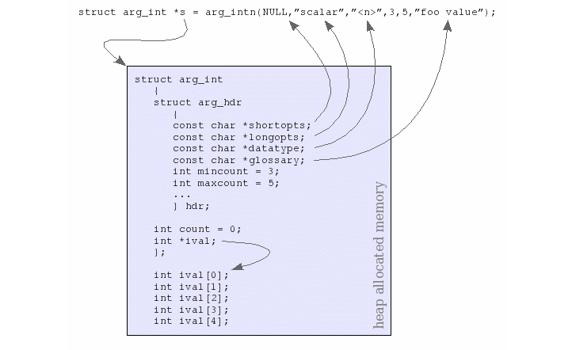

<style>
  table {
    width: 100%
    }
  td {
    vertical-align: center;
    text-align: center;
  }
  table.inputT{
    margin: 10px;
    width: auto;
    margin-left: auto;
    margin-right: auto;
    border: none;
  }
  input{
    text-align: center;
    padding: 0px 10px;
  }
  iframe{
    width: 100%;
    display: block;
    border-style:none;
  }
</style>

# ESP 控制台终端

ESP-IDF 提供了 console 组件，它包含了开发基于串口的交互式控制终端所需要的所有模块，主要支持以下功能：

 - 行编辑
    - 由 linenoise 库具体实现，它支持处理退格键和方向键，支持回看命令的历史记录，支持命令的自动补全和参数提示
 - 将命令行拆分为参数列表
 - 参数解析
    - 由 argtable3 库具体实现，该库提供解析 GNU 样式的命令行参数的 API
 - 用于注册和调度命令的函数。
 - 帮助创建 REPL
    - 环境的函数 (Read-Evaluate-Print-Loop)

## Linenoise 指令

Linenoise 为最小、零配置、BSD 许可、readline 替代品。

 - 单行和多行编辑模式，实现常用的键绑定
 - 历史记录处理
 - 完成
 - 提示（键入时提示右侧的建议）
 - 多路复用模式，带有异步输出的提示隐藏/恢复
 - 大约 850 行的 BSD 许可源代码
 - 仅使用 VT100 与 ANSI.SYS 兼容


**Linenoise** 库不需要显式地初始化，但可能需要对某些配置的默认值稍作修改。

 - linenoiseClearScreen()
    - 清除终端屏幕，并定位光标在左上角
 - linenoiseSetMultiLine()    
    - 在单行和多行编辑模式之间进行切换。默认为单行
 - linenoiseAllowEmpty()
    - 设置收到空行的解析行为，true 为 ""， false 为 NULL。默认为 true
 - linenoiseSetMaxLineLen()
    - 设置每行的最大长度，默认长度为 4096 字节

## 主循环

 - linenoise()
    - 在大多数情况下，控制台应用在某个循环中不断读取输入的内容，然后解析再处理。**linenoise** 是用来获取用户按键输入的函数，当回车键被按下后会便返回完整的一行内容
 - linenoiseFree()
    - 必须调用此函数才能释放从 **linenoise** 函数获取的命令行缓冲区。

基于 ESP-IDF 的 **console** 模块可以实现自定义命令来实现交互式的命令行。

```c
#include "argtable3/argtable3.h"
#include "esp_console.h"


#define CONFIG_CONSOLE_MAX_COMMAND_LINE_LENGTH 4096

//对自定义命令进行参数解析
static int callback(int argc, char **argv)
{
// 处理命令行参数
  if (argc > 1) {
    printf("参数 1: %s\n", argv[1]);
    }
  if (argc > 2) {
    printf("参数 2: %s\n", argv[2]);
    }
  return 0;
}

void add_cmd()
{
// 定义命令的参数
// arg_str1 表示这个参数是必须的用户必须提供
// arg_strn(shortopts,longopts,datatype,1,1,glossary);
struct arg_str *arg1 = arg_str1(NULL, NULL, "<arg1>", "参数 1");
// arg_str0 表示这个参数是可选参数用户可以不提供
// arg_strn(shortopts,longopts,datatype,0,1,glossary);
struct arg_str *arg2 = arg_str0(NULL, NULL, "<arg2>", "参数 2");
// srg_end **2** 为参数的个数
struct arg_end *end = arg_end(2);

// 组合参数和结束符按照实际输入顺序
void *argtable[] = { arg1, arg2, end };

// ESP-IDF注册命令
esp_console_cmd_t cmd = {
   .command = "test",    // 命令名称
   .help = "命令简介",    // 输入一半会提示
   .hint = NULL,         // 命令提示颜色
   .func = &callback,    // 回调函数
   .argtable = argtable  // 参数表
  };
 ESP_ERROR_CHECK(esp_console_cmd_register(&cmd));//注册命令
}

void app_main()
{
esp_console_repl_t *repl = NULL;
esp_console_repl_config_t repl_config = ESP_CONSOLE_REPL_CONFIG_DEFAULT();

// 每行前打印动态可自定义。
repl_config.prompt = "Dicky >";
repl_config.max_cmdline_length = CONFIG_CONSOLE_MAX_COMMAND_LINE_LENGTH;

// 注册命令
esp_console_register_help_command();

// 决定为 Uart 连接模式
esp_console_dev_uart_config_t hw_config = ESP_CONSOLE_DEV_UART_CONFIG_DEFAULT(); ESP_ERROR_CHECK(esp_console_new_repl_uart(&hw_config, &repl_config, &repl)); 

// 加入自定指令 test
add_cmd();

// 开启交互式的命令行
ESP_ERROR_CHECK(esp_console_start_repl(repl));
}
```


Argtable3 提供了一组 arg_xxx 结构，用于它支持的每种类型的参数：文字、整数、双精度、字符串、文件名等。

要定义命令行选项，必须为 arg_xxx 所需的每种类型的参数（文字、整数、双精度、字符串、文件名等）。创建一个结构体，并将它整理到参数表（argument table）的数组中。
参数表中结构的顺序定义了命令行选项的预期顺序。

最基本的一个类型，所有的其他类型都包含这个类型。一一解释下里面的参数的含义:

 - shortopts: 短名称，如 ls -a 中的 **a**
 - longopts: 长名称，如 ls —all 中的 **all**
 - datatype: 显示数据型，如 mincount 为 **0** 则会自动加上 [ ] 在外层。
 - glossary: 参数的描述
 - mincount: 参数最少的个数 ( **0** 为非必须，1…n 为必须)
 - maxcount: 参数最多的个数
 - 其他参数非必须

