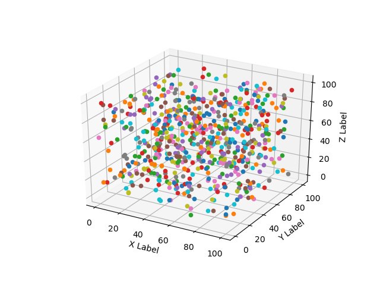
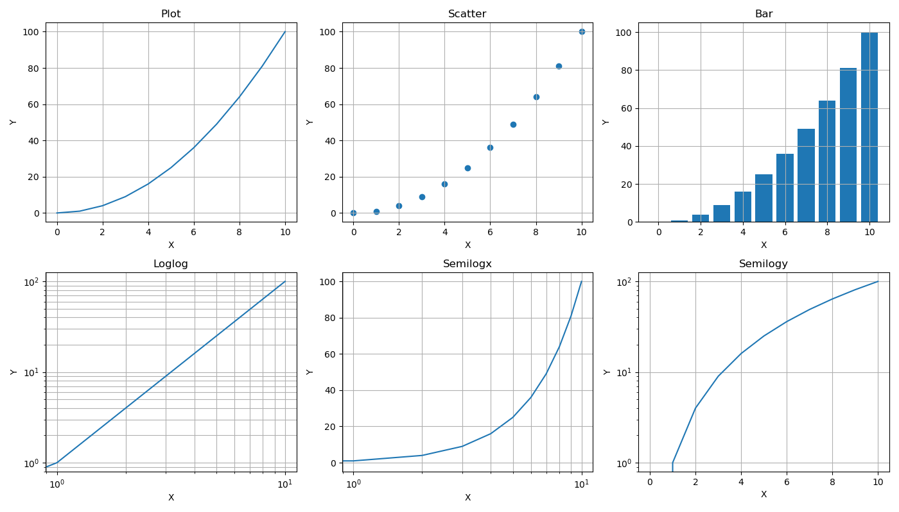

<style>
  table {
    width: 100%
    }
  td {
    vertical-align: center;
    text-align: center;
  }
  table.inputT{
    margin: 10px;
    width: auto;
    margin-left: auto;
    margin-right: auto;
    border: none;
  }
  input{
    text-align: center;
    padding: 0px 10px;
  }
  iframe{
    width: 100%;
    display: block;
    border-style:none;
  }
</style>


# Python 图表


## 3D 图表

```py
# -*- coding: utf-8 -*-

import matplotlib.pyplot as plt

fig = plt.figure()
ax = fig.add_subplot(projection='3d')

f = open('档案名称.csv', 'r')
filelist  = f.read().split("\n")
for items in filelist:
    item = items.split(",")
    if len(item) == 3 :
        ax.scatter(float(item[0]), float(item[1]), float(item[2])) 

ax.set_xlabel('X Label')
ax.set_ylabel('Y Label')
ax.set_zlabel('Z Label')

plt.show()
```



## 2D 图表

```py
# -*- coding: utf-8 -*-

import matplotlib.pyplot as plt

plt.figure(figsize = (14, 8))
x = np.arange(11)
y = x**2

plt.subplot(2, 3, 1)
plt.plot(x,y)
plt.title('Plot')
plt.xlabel('X')
plt.ylabel('Y')
plt.grid()

plt.subplot(2, 3, 2)
plt.scatter(x,y)
plt.title('Scatter')
plt.xlabel('X')
plt.ylabel('Y')
plt.grid()

plt.subplot(2, 3, 3)
plt.bar(x,y)
plt.title('Bar')
plt.xlabel('X')
plt.ylabel('Y')
plt.grid()

plt.subplot(2, 3, 4)
plt.loglog(x,y)
plt.title('Loglog')
plt.xlabel('X')
plt.ylabel('Y')
plt.grid(which='both')

plt.subplot(2, 3, 5)
plt.semilogx(x,y)
plt.title('Semilogx')
plt.xlabel('X')
plt.ylabel('Y')
plt.grid(which='both')

plt.subplot(2, 3, 6)
plt.semilogy(x,y)
plt.title('Semilogy')
plt.xlabel('X')
plt.ylabel('Y')
plt.grid()

plt.tight_layout()
plt.show()
```



## 颜色图标


## Matplotlib 图的组成部分


[网上详细介绍](https://cloud.tencent.com/developer/article/2456246)
