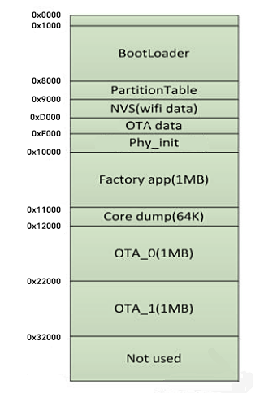
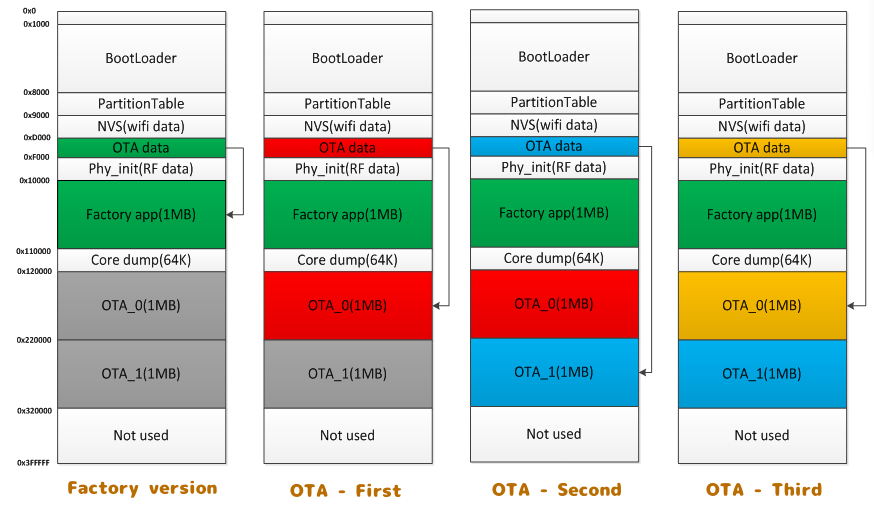

<style>
  table {
    width: 100%
    }
  td {
    vertical-align: center;
    text-align: center;
  }
  table.inputT{
    margin: 10px;
    width: auto;
    margin-left: auto;
    margin-right: auto;
    border: none;
  }
  input{
    text-align: center;
    padding: 0px 10px;
  }
  iframe{
    width: 100%;
    display: block;
    border-style:none;
  }
</style>

# ESP 文件储存



## SPIFFS  

SPIFFS（SPI Flash File System）作为一款专为 SPI NOR 闪存设备设计的文件系统，它以其高效、稳定的设计在众多项目中脱颖而出。以下介绍其应用。

SPIFFS 的核心技术优势在于其针对嵌入式系统特点的优化设计：

 - 低内存消耗：SPIFFS 使用静态大小的 RAM 缓冲区，不依赖于文件数量，有效降低了内存使用。
 - Posix-like API：提供类似于 Posix 的 API 接口，包括 open、close、read、write、seek、stat 等，便于开发者快速上手。
 - 静态磨损均衡：内置的磨损均衡机制延长了闪存设备的使用寿命。
 - 文件系统一致性检查：确保文件系统的完整性和一致性。


### ESP STORAGE 头文件

```c
#ifndef ESP_STORAGE_H_
#define ESP_STORAGE_H_

#define TAG "SPIFFS"

typedef struct {
    char   *p;
    size_t n;
} fileInfo;

char* concat(const char *s1, const char *s2);
void mount_SPIFFS();
void SPIFFS_Directory(char * path);
bool readFile(char* filename, fileInfo* data);
bool saveFile(char* filename, char* data, bool append);
bool renameFile(char* srcfilename, char* filename);
bool removeFile(char* filename);

#endif /* ESP_STORAGE_H_ */
```

### ESP STORAGE 的源文件


```c
#include <stdio.h>              //用于基本 printf 命令
#include <string.h>             //用于处理字符串
#include <stdlib.h>
#include "freertos/FreeRTOS.h"  //用于 延迟、互斥、信号量 实时操作系统操作
#include "esp_system.h"         //esp_init 函数 esp_err_t
#include "esp_log.h"            //用于显示日志
#include "esp_event.h"          //用于 wifi 事件
#include "esp_vfs.h"
#include "esp_spiffs.h"

#include "../include/storage.h"

char* concat(const char *s1, const char *s2)
{
    const size_t len1 = strlen(s1);
    const size_t len2 = strlen(s2);
    char *lvalue = malloc(len1 + len2 + 1);
    memcpy(lvalue, s1, len1);
    memcpy(lvalue + len1, s2, len2 + 1);
    return lvalue;
}

void SPIFFS_Directory(char * path) {
  DIR* dir = opendir(path);
  assert(dir != NULL);
  while (true) {
    struct dirent* pe = readdir(dir);
    if (!pe) break;
    ESP_LOGI(TAG, "文件名=%s 节点编号=%d 文件类型=%x", pe->d_name,pe->d_ino, pe->d_type);
  }
  closedir(dir);
}

bool readFile(char* filename, fileInfo* data)
{
  struct stat st;
  char* result = NULL;
  static FILE *file = NULL;
  if (stat(filename, &st) == 0)
  {
    file = fopen(filename, "r");
    if(file != NULL){
      result = (char*) malloc(st.st_size+1 * sizeof(char));
      if(fgets(result, st.st_size, file) != NULL){
        data->p = result;
        data->n = st.st_size;
        fclose(file);
        return true;
      }
    }
    fclose(file);
  }
  ESP_LOGE(TAG, "文件 %s 不存在!", filename);
  return false;
}

bool saveFile(char* filename, char* data, bool append)
{
  static FILE *file = NULL;
  if(append){
    file = fopen(filename, "a");
  }else{
    file = fopen(filename, "w");
  }
  if(file != NULL){
    fprintf(file, data);
    fclose(file);
    return true;
  }
  fclose(file);
  ESP_LOGE(TAG, "文件 %s 写入失败!", filename);
  return false;
}

bool renameFile(char* srcfilename, char* filename)
{
  if (rename(srcfilename, filename) != 0) {
    ESP_LOGE(TAG, "文件 %s 重命名失败!", srcfilename);
    return false;
  }else{
    return true;
  }
}

bool removeFile(char* filename)
{
  struct stat st;
  if (stat(filename, &st) == 0) {
    unlink(filename);
    return true;
  }else{
    ESP_LOGE(TAG, "文件 %s 删除失败!", filename);
    return false;    
  }
}

void mount_SPIFFS()
{
  ESP_LOGI(TAG, "初始化 SPIFFS");
  esp_vfs_spiffs_conf_t conf = {
    .base_path = "/spiffs",
    .partition_label = NULL,
    .max_files = 12,
    .format_if_mount_failed =true
  };
  // 使用上面定义的设置来初始化和挂载 SPIFFS 文件系统
  esp_err_t ret = esp_vfs_spiffs_register(&conf);
  if (ret != ESP_OK) {
    if (ret == ESP_FAIL) {
      ESP_LOGI(TAG, "无法挂载或格式化文件系统");
    } else if (ret == ESP_ERR_NOT_FOUND) {
      ESP_LOGI(TAG, "找不到 SPIFFS 分区");
    } else {
      ESP_LOGI(TAG, "无法初始化 SPIFFS (%s)",esp_err_to_name(ret));
    }
    return;
  }
  size_t total = 0, used = 0;
  ret = esp_spiffs_info(NULL, &total,&used);
  if (ret != ESP_OK) {
    ESP_LOGI(TAG, "无法获取 SPIFFS 分区信息 (%s)",esp_err_to_name(ret));
  } else {
    ESP_LOGI(TAG, "分区大小总计: %d, 已用容量: %d", total, used);
  }
  SPIFFS_Directory("/spiffs/");
}
```

ESP32 的 flash 可以包含多个应用程序，以及多种不同类型的数据（例如校准数据、文件系统数据、参数存储数据等）。因此，我们在 flash 的 默认偏移地址 **0x8000** 处烧写一张分区表。

## 分区表

分区表的长度为 **0xC00** 字节，最多可以保存 **95** 条分区表条目。MD5 校验和附加在分区表之后，用于在运行时验证分区表的完整性。分区表占据了整个 flash 扇区，大小为 **0x1000** (4 KB)。因此，它后面的任何分区至少需要位于 (默认偏移地址) + 0x1000 处。

分区表中的每个条目都包括以下几个部分：Name（标签）、Type（app、data 等）、SubType 以及在 flash 中的偏移量（分区的加载地址）。

在使用分区表时，最简单的方法就是打开项目配置菜单（<font color="#FF1000">idf.py menuconfig</font>），并在 CONFIG_PARTITION_TABLE_TYPE 下选择一个预定义的分区表：

 - Single factory app, no OTA
 - Factory app, two OTA definitions

在以上两种选项中，出厂应用程序均将被烧录至 flash 的 **0x10000** 偏移地址处。这时，运行 idf.py partition-table ，即可以打印当前使用分区表的信息摘要。


### 内置分区表

以下是 "Single factory app, no OTA" 选项的分区表信息摘要:

```c
# ESP-IDF Partition Table
# Name,   Type, SubType, Offset,  Size,   Flags
nvs,      data, nvs,     0x9000,  0x6000,
phy_init, data, phy,     0xf000,  0x1000,
factory,  app,  factory, 0x10000, 1M,
```

flash 的 0x10000 (64 KB) 偏移地址处存放一个标记为 "factory" 的二进制应用程序，且启动加载器将默认加载这个应用程序。

**注意** 分区的偏移地址必须要与 0x10000 (64K) 对齐。

分区表中还定义了两个数据区域，分别用于存储 NVS 库专用分区和 PHY 初始化数据。

以下是 "Factory app, two OTA definitions" 选项的分区表信息摘要:

```c
# ESP-IDF Partition Table
# Name,   Type, SubType, Offset,  Size, Flags
nvs,      data, nvs,     0x9000,  0x4000,
otadata,  data, ota,     0xd000,  0x2000,
phy_init, data, phy,     0xf000,  0x1000,
factory,  app,  factory, 0x10000,  1M,
ota_0,    app,  ota_0,   0x110000, 1M,
ota_1,    app,  ota_1,   0x210000, 1M,
```

分区表中定义了三个应用程序分区，这三个分区的类型都被设置为 “app”，但具体 app 类型不同。其中，位于 0x10000 偏移地址处的为出厂应用程序 (factory)，其余两个为 OTA 应用程序（ota_0，ota_1）。

新增了一个名为 “otadata” 的数据分区，用于保存 OTA 升级时需要的数据。启动加载器会查询该分区的数据，以判断该从哪个 OTA 应用程序分区加载程序。如果 “otadata” 分区为空，则会执行出厂程序。

### 创建自定义分区表

如果在 **menuconfig** 中选择了 <font color="#FF1000">Custom partition table CSV</font>，则还需要输入该分区表的 CSV 文件及路径。CSV 文件可以根据需要加入任意数量的分区信息。

**CSV** 文件的格式与上面摘要中打印的格式相同，但是在 CSV 文件中并非所有字段都是必需的。例如下面是一个自定义的 storage 分区表的 CSV 文件:


```c
# Name,   Type, SubType,  Offset,   Size,  Flags
nvs,      data, nvs,      0x9000,   0x6000,
phy_init, data, phy,      0xf000,   0x1000,
factory,  app,  factory,  0x10000,  1M,
storage,  data, spiffs,   ,         0xF0000,
```

字段之间的空格会被忽略，以 # 开头的行也会被忽略。

CSV 文件中的每个非注释行均为一个分区定义。

每个分区的 **Offset** 字段可以为空，gen_esp32part.py 工具会从分区表位置的后面开始自动计算并填充该分区的偏移地址，同时确保每个分区的偏移地址正确对齐。





## 非易失性存储 (NVS) 

非易失性存储库主要用于在 flash 中存储键值格式的数据。

```c
#include <stdio.h>
#include "esp_system.h"
#include "nvs_flash.h"
#include "freertos/FreeRTOS.h"
#include "freertos/task.h"

esp_err_t err;
nvs_handle_t my_handle;

bool init_nvs()
{
  err = nvs_flash_init();
  if (err == ESP_ERR_NVS_NO_FREE_PAGES || err == ESP_ERR_NVS_NEW_VERSION_FOUND) {
      nvs_flash_erase();
      nvs_flash_init();
      return false;
  }
  return true;
}

void close_nvs()
{
nvs_close(my_handle);
}

bool save_int(char* space_name, char* key_name, int32_t value)
{
  err = nvs_open(space_name, NVS_READWRITE, &my_handle); 
  if (err == ESP_OK) {
    err = nvs_set_i32(my_handle, key_name, value); 
        if(err == ESP_OK) {
          err = nvs_commit(my_handle);
          if(err == ESP_OK) {
            return true;
          }
        }
  }
  return false;
}

bool read_int(char* space_name, char* key_name, int32_t* value)
{
  err = nvs_open(space_name, NVS_READWRITE, &my_handle); 
  if (err == ESP_OK) {
    err = nvs_get_i32(my_handle, key_name, value); 
    if(err == ESP_OK)  {
      return true;
    }
  }
  return false;
}

bool save_str(char* space_name, char* key_name, char* string)
{
  err = nvs_open(space_name, NVS_READWRITE, &my_handle); 
  if (err == ESP_OK) {
    err = nvs_set_str(my_handle, key_name, string); 
        if(err == ESP_OK) {
          err = nvs_commit(my_handle);
          if(err == ESP_OK) {
            return true;
          }
        }
  }
  return false;
}

bool read_str(char* space_name, char* key_name, char* string, size_t length)
{
  length = length + 1;
  err = nvs_open(space_name, NVS_READWRITE, &my_handle); 
  if (err == ESP_OK) {
    err = nvs_get_str(my_handle, key_name, string, &length); 
    if(err == ESP_OK)  {
      return true;
    }
  }
  return false;
}

void app_main(void)
{
  int32_t value;
  if(init_nvs())
    printf("成功读取...");
  save_int("storage", "restart_counter", 1345678);
  read_int("storage", "restart_counter", &value);
  printf("获取值是: %ld\n", value);
  save_str("storage", "Name", "dickyko");
  char strvalue[8];
  read_str("storage", "Name", strvalue, 7);  
  printf("获取值是: %s-\n", strvalue);
  close_nvs();
}
```

### 键值对

NVS 的操作对象为键值对，其中键是 ASCII 字符串，当前支持最大键长为 **15** 个字符，值可以为以下几种类型：

 - 整数型：uint8_t、int8_t、uint16_t、int16_t、uint32_t、int32_t、uint64_t 和 int64_t；
 - 以 \0 结尾的字符串；
 - 可变长度的二进制数据 (BLOB)

*注：字符串值当前上限为 **4000** 字节，其中包括空终止符。BLOB 值上限为 508,000 字节或分区大小减去 **4000** 字节的 97.6%，以较低值为准。

键必须唯一。为现有的键写入新的值可能产生如下结果：

 - 如果新旧值数据类型相同，则更新值；
 -  如果新旧值数据类型不同，则返回错误。

读取值时也会执行数据类型检查。如果读取操作的数据类型与该值的数据类型不匹配，则返回错误。

### NVS 优势

 - 接口更加安全: NVS 不直接操作 address. 对于终端用户而已, 更加安全。
 - 接口使用接近用户习惯，NVS 接口类似于电脑上操作文件一样:
　　　- 打开文件(nvs_open), 写文件(nvs_set_xxx), 保存文件(nvs_commit), 关闭文件(nvs_close)
　　　- 打开文件(nvs_open), 读取文件(nvs_get_xxx), 关闭文件(nvs_close)

3、擦写均衡, 使 flash 寿命更长，NVS 在操作少量数据上, NVS 分区更大时, 擦写均衡表现的更为明显。

## core dump

Core 就是内存的意思，当程序运行过程中检测到异常程序异常退出时, 系统把程序当前的内存状况存储在一个 core 文件中, 叫 core dumped，也就信息转储，操作系统检测到当前进程异常时将通过信号的方式通知目标进程相应的错误信息。

将核心转储保存到 flash
将核心转储文件保存至 flash 时，这些文件会保存到 flash 上的特殊分区。指定核心转储分区可以在 flash 芯片上预留空间来存储核心转储文件。

使用 ESP-IDF 提供的默认分区表时，核心转储分区会自动声明。但使用自定义分区表时，请按如下示例进行核心转储分区声明：

```
# 名称，   类型，子类型，   偏移量，   大小
# 如增加了引导加载程序大小，请及时更新偏移量，避免产生重叠
nvs,      data, nvs,     0x9000,  0x6000
phy_init, data, phy,     0xf000,  0x1000
factory,  app,  factory, 0x10000, 1M
coredump, data, coredump,,        64K
```

分区命名没有特殊要求，可以根据应用程序的需要选择。但分区类型应为 data，子类型应为 coredump。此外，在选择分区大小时需注意，核心转储的数据结构会产生 20 字节的固定开销和 12 字节的单任务开销，此开销不包括每个 **任务的控制块** (TCB) 和栈的大小。因此，分区大小应至少为 20 + 最大任务数 x（12 + TCB 大小 + 最大任务栈大小） 字节。

