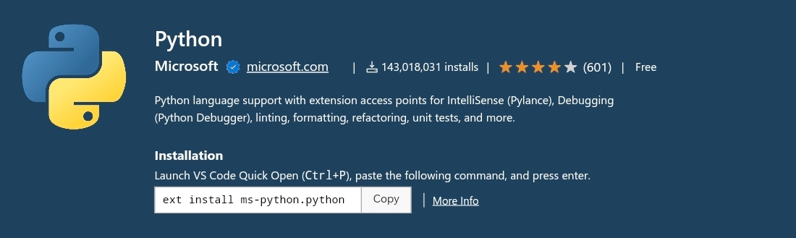
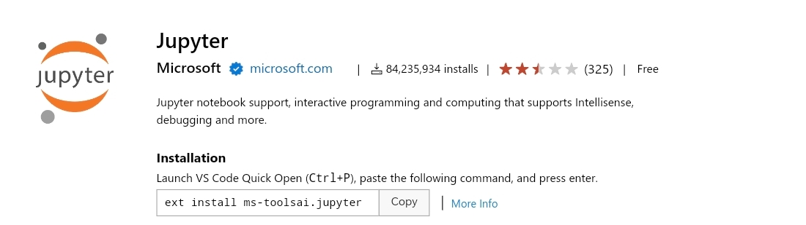
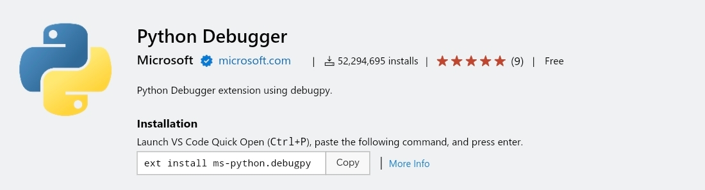

<style>
  table {
    width: 100%
    }
  td {
    vertical-align: center;
    text-align: center;
  }
  table.inputT{
    margin: 10px;
    width: auto;
    margin-left: auto;
    margin-right: auto;
    border: none;
  }
  input{
    text-align: center;
    padding: 0px 10px;
  }
  iframe{
    width: 100%;
    display: block;
    border-style:none;
  }
</style>

# IMU 芯片校正 (I<sup>2</sup>C 接口)

## 工具

僅 I<sup>2</sup>C 驱动程序链接 : [allanbian1017/i2c-ch341-usb](https://github.com/allanbian1017/i2c-ch341-usb) 

用以下方法编译及安装

```
make
sudo insmod i2c-ch341-usb.ko
sudo chmod 777 /dev/i2c-x
```
注 **x** 为 I<sup>2</sup>C 接口编号

## USB 连接电脑 CH341A


## Python (Visual Studio Code)

[网上安装资讯](https://code.visualstudio.com/docs/languages/python)

### 简短叙述

#### 需要安装插件







#### 自动完成和 IntelliSense

**Python** 扩展使用当前选定的解释器支持代码完成和 IntelliSense。 IntelliSense 是许多功能的统称，包括跨所有文件以及内置和第三方模块的智能代码完成（上下文方法和变量建议）。

IntelliSense 可在键入时快速显示方法、类成员和文档。还可以随时使用 **Ctrl+Space** 触发完成。将鼠标悬停在标识符上将显示有关它们的更多信息。

### 安装 **Python** 虚拟环境

**Python** 扩展会自动检测安装在标准位置的 Python 解释器。它还会检测工作区文件夹中的 conda 环境以及虚拟环境。

当前环境显示在 VS Code 状态栏的右侧：


状态栏还会指示是否未选择解释器：


所选环境用于 IntelliSense、自动完成、linting、格式化和任何其他与语言相关的功能。当在终端中运行或调试 Python 时，或者当使用终端：创建新终端命令创建新终端时，也会激活它。

要更改当前解释器（包括切换到 conda 或虚拟环境），请在状态栏上选择解释器名称或使用 Python：选择解释器命令。


## 虚拟环境

虚拟环境是创建环境的内置方式。虚拟环境会创建一个文件夹，其中包含指向特定解释器的副本（或符号链接）。当将软件包安装到虚拟环境中时，它将最终位于这个新文件夹中，从而与其他工作区使用的其他软件包隔离。

注意：虽然可以将虚拟环境文件夹作为工作区打开，但不建议这样做，并且可能会导致使用 Python 扩展时出现问题。

Conda 环境

conda 环境是使用 conda 软件包管理器管理的 Python 环境（请参阅 conda 入门）。在 conda 和虚拟环境之间进行选择取决于的打包需求、团队标准等。

Python 环境工具

下表列出了与 Python 环境相关的各种工具：


|工具|定义和目的|
|:---:|:---:|
|pip|安装和更新软件包的 Python 包管理器。默认情况下，它与 Python 3.9+ 一起安装。如使用 Debian 的操作系统；请安装 python3-pip|
|venv|允许管理不同项目的单独软件包安装，并且默认与 Python 3 一起安装，如使用 Debian 的操作系统；请安装 python3-venv|
|conda| 与 Miniconda 一起安装。它可用于管理软件包和虚拟环境。通常用于数据科学项目。|

创建环境