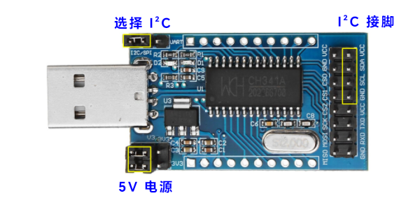
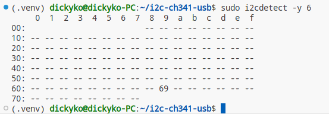
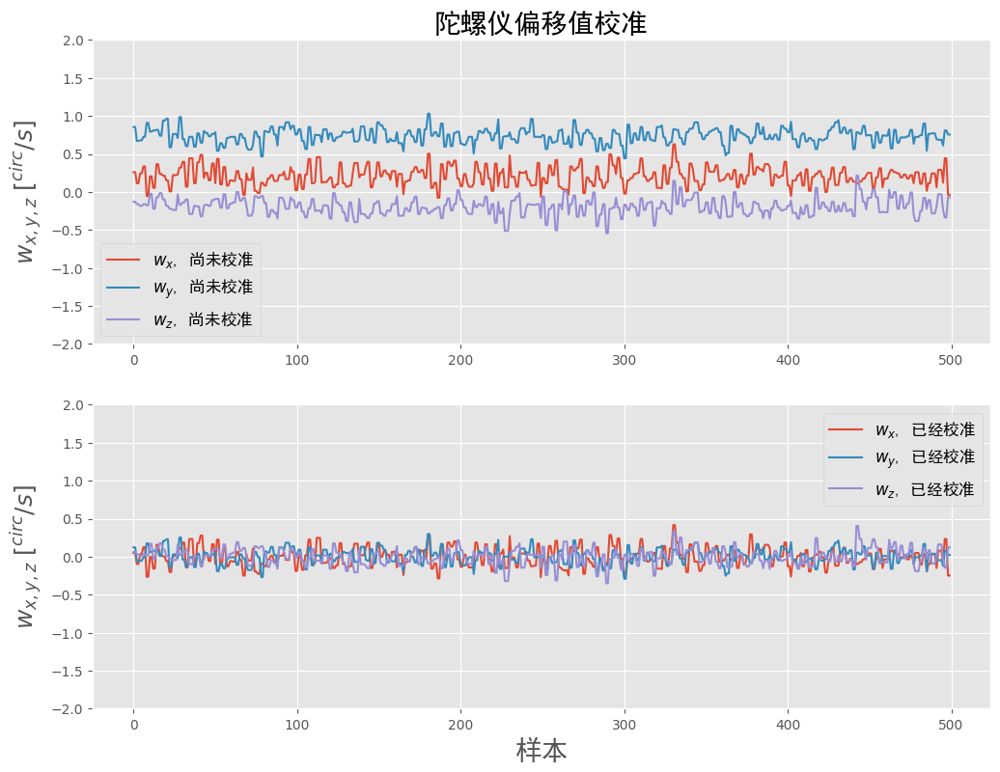
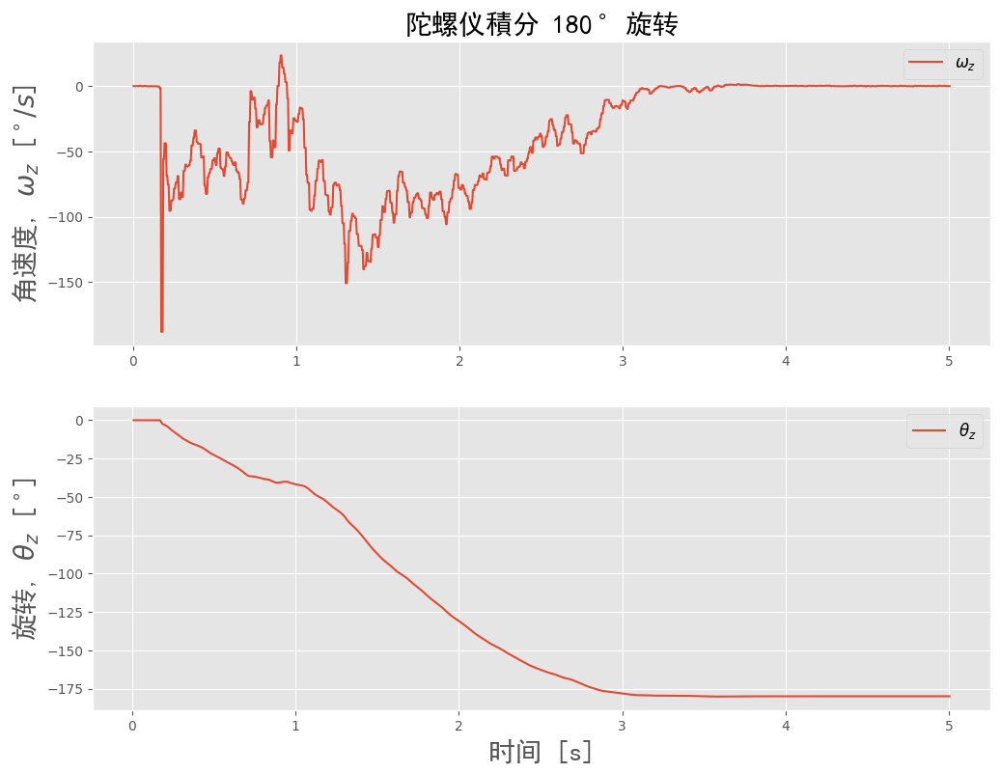
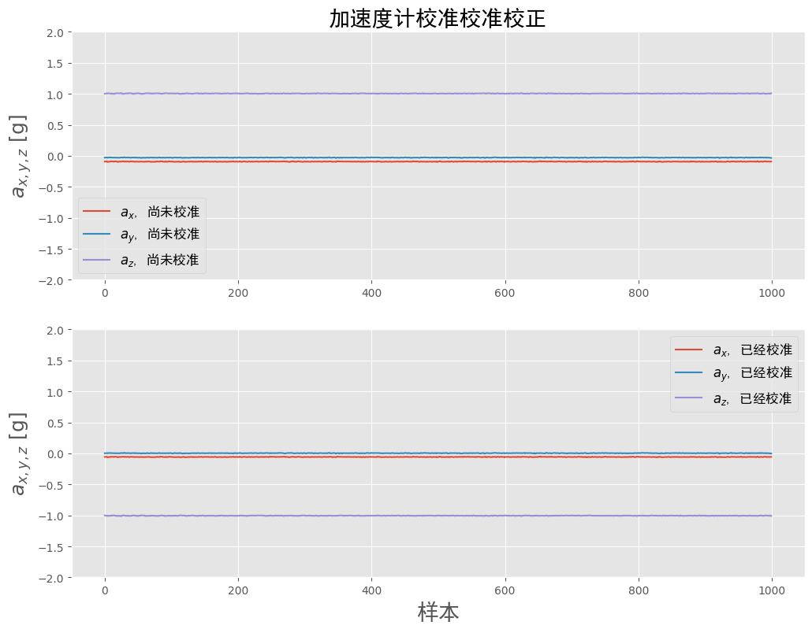
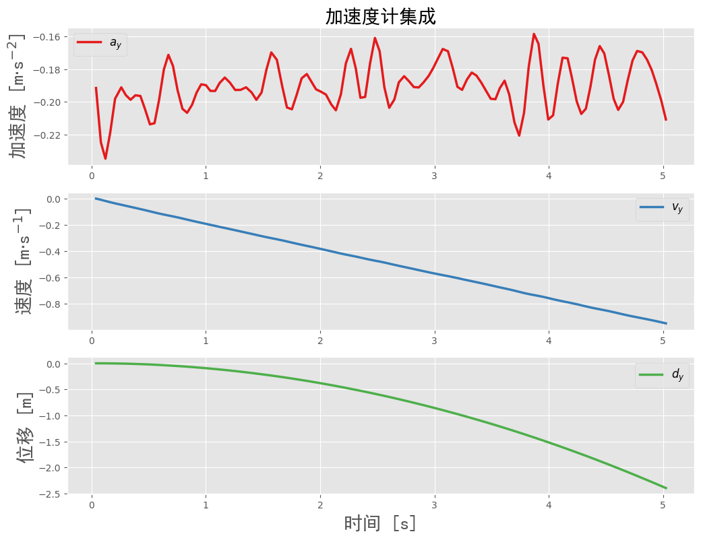

<style>
  table {
    width: 100%
    }
  td {
    vertical-align: center;
    text-align: center;
  }
  table.inputT{
    margin: 10px;
    width: auto;
    margin-left: auto;
    margin-right: auto;
    border: none;
  }
  input{
    text-align: center;
    padding: 0px 10px;
  }
  iframe{
    width: 100%;
    display: block;
    border-style:none;
  }
</style>

# IMU 芯片校正 (I<sup>2</sup>C 接口)

## 工具

僅 I<sup>2</sup>C 驱动程序链接 : [allanbian1017/i2c-ch341-usb](https://github.com/allanbian1017/i2c-ch341-usb) 

|命令|說明|
|:---:|:---:|
|depmod|生成模塊和映射文件|
|insmod|將模塊插入Linux內核|
|lsmod|顯示Linux內核中模塊的狀態|
|modinfo|顯示有關Linux內核模塊的信息|
|modprobe|從Linux內核中添加並刪除模塊|
|rmmod|從Linux內核中刪除模塊|

用以下方法编译及安装

```
cd /home/dickyko/i2c-ch341-usb
make
sudo insmod /home/dickyko/i2c-ch341-usb/i2c-ch341-usb.ko
sudo chmod 777 /dev/i2c-x
sudo apt-get install i2c-tools
```
注 **x** 为 I<sup>2</sup>C 接口编号

## USB 连接电脑 CH341A




## Python (Visual Studio Code)

 - [Python 相关资料](https://hkdickyko.github.io/%E7%B7%A8%E7%A8%8B/python)
 - [NumPy 相关资料](https://hkdickyko.github.io/%E7%B7%A8%E7%A8%8B/numpy)
 - [SciPy 相关资料](https://hkdickyko.github.io/%E7%B7%A8%E7%A8%8B/scipy)

## 检查 IMU 连接

在虚拟环境安装 smbus2 : **pip install smbus2**, 否则 IMU 不能连接成功

```sh
sudo modprobe /home/dickyko/i2c-ch341-usb/i2c-ch341-usb.ko
sudo chmod 777 /dev/i2c-6
sudo i2cdetect -y 6
```




## ICM20948 的 Python 源代码

 - 一字节 (byte) 相等于八位元 (8 bits)

```py
import struct
import time

__version__ = "1.0.0"

CHIP_ID = 0xEA
I2C_ADDR = 0x68
I2C_ADDR_ALT = 0x69
ICM20948_BANK_SEL = 0x7F

ICM20948_I2C_MST_ODR_CONFIG = 0x00
ICM20948_I2C_MST_CTRL = 0x01
ICM20948_I2C_MST_DELAY_CTRL = 0x02
ICM20948_I2C_SLV0_ADDR = 0x03
ICM20948_I2C_SLV0_REG = 0x04
ICM20948_I2C_SLV0_CTRL = 0x05
ICM20948_I2C_SLV0_DO = 0x06
ICM20948_EXT_SLV_SENS_DATA_00 = 0x3B

ICM20948_GYRO_SMPLRT_DIV = 0x00
ICM20948_GYRO_CONFIG_1 = 0x01
ICM20948_GYRO_CONFIG_2 = 0x02

# Bank 0
ICM20948_WHO_AM_I = 0x00
ICM20948_USER_CTRL = 0x03
ICM20948_PWR_MGMT_1 = 0x06
ICM20948_PWR_MGMT_2 = 0x07
ICM20948_INT_PIN_CFG = 0x0F

ICM20948_ACCEL_SMPLRT_DIV_1 = 0x10
ICM20948_ACCEL_SMPLRT_DIV_2 = 0x11
ICM20948_ACCEL_INTEL_CTRL = 0x12
ICM20948_ACCEL_WOM_THR = 0x13
ICM20948_ACCEL_CONFIG = 0x14
ICM20948_ACCEL_XOUT_H = 0x2D
ICM20948_GRYO_XOUT_H = 0x33

ICM20948_TEMP_OUT_H = 0x39
ICM20948_TEMP_OUT_L = 0x3A

# 偏移量，灵敏度及温度测量设定
ICM20948_TEMPERATURE_DEGREES_OFFSET = 21
ICM20948_TEMPERATURE_SENSITIVITY = 333.87
ICM20948_ROOM_TEMP_OFFSET = 21

AK09916_I2C_ADDR = 0x0C
AK09916_CHIP_ID = 0x09
AK09916_WIA = 0x01
AK09916_ST1 = 0x10
AK09916_ST1_DOR = 0b00000010  # 资料溢出位
AK09916_ST1_DRDY = 0b00000001  # 数据就绪位
AK09916_HXL = 0x11
AK09916_ST2 = 0x18
AK09916_ST2_HOFL = 0b00001000  # 磁场溢出位
AK09916_CNTL2 = 0x31
AK09916_CNTL2_MODE = 0b00001111
AK09916_CNTL2_MODE_OFF = 0
AK09916_CNTL2_MODE_SINGLE = 1
AK09916_CNTL2_MODE_CONT1 = 2
AK09916_CNTL2_MODE_CONT2 = 4
AK09916_CNTL2_MODE_CONT3 = 6
AK09916_CNTL2_MODE_CONT4 = 8
AK09916_CNTL2_MODE_TEST = 16
AK09916_CNTL3 = 0x32

class ICM20948:
    def write(self, reg, value): # 写一字节数据资传感器
        self._bus.write_byte_data(self._addr, reg, value)
        time.sleep(0.0001)

    def read(self, reg): # 读传感器一字节数据
        return self._bus.read_byte_data(self._addr, reg)

    def trigger_mag_io(self):
        user = self.read(ICM20948_USER_CTRL)
        self.write(ICM20948_USER_CTRL, user | 0x20)
        time.sleep(0.005)
        self.write(ICM20948_USER_CTRL, user)

    def read_bytes(self, reg, length=1): # 读传感器字节数据
        return self._bus.read_i2c_block_data(self._addr, reg, length)

    def bank(self, value): # 切换寄存器 self.bank
        if not self._bank == value:
            self.write(ICM20948_BANK_SEL, value << 4)
            self._bank = value

    def mag_write(self, reg, value): # 向从属磁力仪写入一个字节
        self.bank(3)
        self.write(ICM20948_I2C_SLV0_ADDR, AK09916_I2C_ADDR)  # 写一字节
        self.write(ICM20948_I2C_SLV0_REG, reg)
        self.write(ICM20948_I2C_SLV0_DO, value)
        self.bank(0)
        self.trigger_mag_io()

    def mag_read(self, reg): # 由从属磁力仪读取一个字节
        self.bank(3)
        self.write(ICM20948_I2C_SLV0_ADDR, AK09916_I2C_ADDR | 0x80)
        self.write(ICM20948_I2C_SLV0_REG, reg)
        self.write(ICM20948_I2C_SLV0_DO, 0xFF)
        self.write(ICM20948_I2C_SLV0_CTRL, 0x80 | 1)  # 读一字节
        self.bank(0)
        self.trigger_mag_io()
        return self.read(ICM20948_EXT_SLV_SENS_DATA_00)

    def mag_read_bytes(self, reg, length=1): # 由从属磁力仪读取最多 24 个字节
        self.bank(3)
        self.write(ICM20948_I2C_SLV0_CTRL, 0x80 | 0x08 | length)
        self.write(ICM20948_I2C_SLV0_ADDR, AK09916_I2C_ADDR | 0x80)
        self.write(ICM20948_I2C_SLV0_REG, reg)
        self.write(ICM20948_I2C_SLV0_DO, 0xFF)
        self.bank(0)
        self.trigger_mag_io()
        return self.read_bytes(ICM20948_EXT_SLV_SENS_DATA_00, length)

    def magnetometer_ready(self): #检查磁力计状态就绪位
        return self.mag_read(AK09916_ST1) & 0x01 > 0

    def read_magnetometer_data(self, timeout=1.0):
        # 触发单次测量
        self.mag_write(AK09916_CNTL2, 0x01)  
        t_start = time.time()
        while not self.magnetometer_ready():
            if time.time() - t_start > timeout:
                raise RuntimeError("等待磁力计就绪超时")
            time.sleep(0.00001)
            
        data = self.mag_read_bytes(AK09916_HXL, 6)
        # 读取 ST2 确认自我读取完成，需要连续模式
        self.mag_read(AK09916_ST2)

        x, y, z = struct.unpack("<hhh", bytearray(data))

        # 磁通密度标尺 "uT" 来自数据表第 3.3 节。此值是恒定的
        x *= 0.15
        y *= 0.15
        z *= 0.15

        return x, y, z

    def read_accelerometer_gyro_data(self):
        self.bank(0)
        data = self.read_bytes(ICM20948_ACCEL_XOUT_H, 12)

        ax, ay, az, gx, gy, gz = struct.unpack(">hhhhhh", bytearray(data))

        self.bank(2)

        # 读取加速度计满量程范围和用它来补偿 gs 的读数
        scale = (self.read(ICM20948_ACCEL_CONFIG) & 0x06) >> 1

        # 比例范围取自数据表第 3.2 节
        gs = [16384.0, 8192.0, 4096.0, 2048.0][scale]

        ax /= gs
        ay /= gs
        az /= gs

        # 读回每秒度数和用它来补偿 dps 的读数
        scale = (self.read(ICM20948_GYRO_CONFIG_1) & 0x06) >> 1

        # 比例范围取自数据表第 3.1 节
        dps = [131, 65.5, 32.8, 16.4][scale]

        gx /= dps
        gy /= dps
        gz /= dps

        return ax, ay, az, gx, gy, gz

    def set_accelerometer_sample_rate(self, rate=125): 
        # 设置加速度计采样率（单位为 Hz) 
        self.bank(2)
        # 125Hz - 1.125 kHz / (1 + rate)
        rate = int((1125.0 / rate) - 1)
        # 用结构来打包然后写入字节
        self.write(ICM20948_ACCEL_SMPLRT_DIV_1, (rate >> 8) & 0xFF)
        self.write(ICM20948_ACCEL_SMPLRT_DIV_2, rate & 0xFF)

    def set_accelerometer_full_scale(self, scale=16):
        # 将加速度计满量程范围设置为 +/- 提供的值
        self.bank(2)
        value = self.read(ICM20948_ACCEL_CONFIG) & 0b11111001
        value |= {2: 0b00, 4: 0b01, 8: 0b10, 16: 0b11}[scale] << 1
        self.write(ICM20948_ACCEL_CONFIG, value)

    def set_accelerometer_low_pass(self, enabled=True, mode=5): 
        # 配置加速度计低通滤波器
        self.bank(2)
        value = self.read(ICM20948_ACCEL_CONFIG) & 0b10001110
        if enabled:
            value |= 0b1
        value |= (mode & 0x07) << 4
        self.write(ICM20948_ACCEL_CONFIG, value)

    def set_gyro_sample_rate(self, rate=125):
        # 设置陀螺仪采样率（单位：赫兹）
        self.bank(2)
        # 125Hz sample rate - 1.125 kHz / (1 + rate)
        rate = int((1125.0 / rate) - 1)
        self.write(ICM20948_GYRO_SMPLRT_DIV, rate)

    def set_gyro_full_scale(self, scale=250):
        # 将陀螺仪满量程范围设置为 +/- 提供的值
        self.bank(2)
        value = self.read(ICM20948_GYRO_CONFIG_1) & 0b11111001
        value |= {250: 0b00, 500: 0b01, 1000: 0b10, 2000: 0b11}[scale] << 1
        self.write(ICM20948_GYRO_CONFIG_1, value)

    def set_gyro_low_pass(self, enabled=True, mode=5):
        # 配置陀螺仪低通滤波器
        self.bank(2)
        value = self.read(ICM20948_GYRO_CONFIG_1) & 0b10001110
        if enabled:
            value |= 0b1
        value |= (mode & 0x07) << 4
        self.write(ICM20948_GYRO_CONFIG_1, value)

    def read_temperature(self):
        # 属性来读取当前 IMU 温度，PWR_MGMT_1 默认保持温度启用
        self.bank(0)
        temp_raw_bytes = self.read_bytes(ICM20948_TEMP_OUT_H, 2)
        temp_raw = struct.unpack(">h", bytearray(temp_raw_bytes))[0]
        temperature_deg_c = (
            (temp_raw - ICM20948_ROOM_TEMP_OFFSET) / ICM20948_TEMPERATURE_SENSITIVITY
        ) + ICM20948_TEMPERATURE_DEGREES_OFFSET
        return temperature_deg_c

    def __init__(self, i2c_addr=I2C_ADDR_ALT, i2c_bus=None):
        self._bank = -1
        self._addr = i2c_addr

        if i2c_bus is None:
            from smbus2 import SMBus

            self._bus = SMBus(6)
        else:
            self._bus = i2c_bus

        self.bank(0)
        if not self.read(ICM20948_WHO_AM_I) == CHIP_ID:
            raise RuntimeError("Unable to find ICM20948")

        self.write(ICM20948_PWR_MGMT_1, 0x80)
        time.sleep(0.01)
        self.write(ICM20948_PWR_MGMT_1, 0x01)
        self.write(ICM20948_PWR_MGMT_2, 0x00)

        self.bank(2)

        self.set_gyro_sample_rate(100)
        self.set_gyro_low_pass(enabled=True, mode=5)
        self.set_gyro_full_scale(250)

        self.set_accelerometer_sample_rate(125)
        self.set_accelerometer_low_pass(enabled=True, mode=5)
        self.set_accelerometer_full_scale(16)

        self.bank(0)
        self.write(ICM20948_INT_PIN_CFG, 0x30)

        self.bank(3)
        self.write(ICM20948_I2C_MST_CTRL, 0x4D)
        self.write(ICM20948_I2C_MST_DELAY_CTRL, 0x01)

        if not self.mag_read(AK09916_WIA) == AK09916_CHIP_ID:
            raise RuntimeError("Unable to find AK09916")

        # 重置磁力计
        self.mag_write(AK09916_CNTL3, 0x01)
        while self.mag_read(AK09916_CNTL3) == 0x01:
            time.sleep(0.0001)

if __name__ == "__main__":
    imu = ICM20948()
  while True:
      x, y, z = imu.read_magnetometer_data()
      ax, ay, az, gx, gy, gz = imu.read_accelerometer_gyro_data()
      print(
          "Accel:{ax:05.2f} {ay:05.2f} {az:05.2f} Gyro:{gx:05.2f} {gy:05.2f} {gz:05.2f} Mag:{x:05.2f} {y:05.2f} {z:05.2f}"
      )
      time.sleep(0.25)
```

## 惯性测量传感器 **IMU** 校准

[IMU 功作原理，数学知识](https://hkdickyko.github.io/%E7%A9%8D%E9%AB%94%E9%9B%BB%E8%B7%AF/imu)

## 陀螺仪偏移校准

```py
from icm20948 import ICM20948
import numpy as np
import matplotlib.pyplot as plt
from matplotlib.font_manager import FontProperties

imu = ICM20948()
time.sleep(2) # 等待 MPU 加载并稳定
font = FontProperties(fname="./SimHei.ttf", size=20)
font1 = FontProperties(fname="./SimHei.ttf", size=12)

def get_gyro():
    _, _, _, wx, wy, wz = imu.read_accelerometer_gyro_data()  
    # 阅读并转换陀螺数据
    return wx, wy, wz

def gyro_cal():
    print("-" * 50)
    print("陀螺仪校准 - 保持IMU稳定")
    [get_gyro() for ii in range(0, cal_size)]  # 校准前清除缓冲
    mpu_array = []
    gyro_offsets = [0.0, 0.0, 0.0]
    while True:
        try:
            wx, wy, wz = get_gyro()  # 获取陀螺仪值
        except:
            continue偏移
        mpu_array.append([wx, wy, wz])
        if np.shape(mpu_array)[0] == cal_size:
            for qq in range(0, 3):
                gyro_offsets[qq] = np.mean(np.array(mpu_array)[:, qq])  # 平均的
            break
    print("陀螺仪校准完成")
    return gyro_offsets

# 陀螺仪抵消计算
gyro_labels = ["w_x", "w_y", "w_z"]
cal_size = 500              # 用于校准的点数量
gyro_offsets = gyro_cal()   # 计算陀螺仪偏移
# 记录新数据
data = np.array([get_gyro() for ii in range(0, cal_size)])  # 新值

# 用偏移和无偏移打印图形
plt.style.use("ggplot")
fig, axs = plt.subplots(2, 1, figsize=(12, 9))
for ii in range(0, 3):
    axs[0].plot(data[:, ii], label="${}$, 尚未校准".format(gyro_labels[ii]))
    axs[1].plot(
        data[:, ii] - gyro_offsets[ii],
        label="${}$, 已经校准".format(gyro_labels[ii]),
    )
axs[0].legend(prop=font1)
axs[1].legend(prop=font1)
axs[0].set_ylabel("$w_{x,y,z}$ [$^{circ}/s$]", fontsize=18)
axs[1].set_ylabel("$w_{x,y,z}$ [$^{circ}/s$]", fontsize=18)
axs[1].set_xlabel("样本", fontproperties=font)
axs[0].set_ylim([-2, 2])
axs[1].set_ylim([-2, 2])
axs[0].set_title("陀螺仪偏移值校准", fontproperties=font)
fig.show()
imu.reset()
```



## 陀螺仪積分测量

```py
from icm20948 import ICM20948
import numpy as np
import matplotlib.pyplot as plt
from matplotlib.font_manager import FontProperties
import time
from scipy.integrate import cumulative_trapezoid

imu = ICM20948()
time.sleep(2) # 等待 MPU 加载并稳定
font = FontProperties(fname="./SimHei.ttf", size=20)
font1 = FontProperties(fname="./SimHei.ttf", size=12)

def get_gyro():
    _, _, _, wx, wy, wz = imu.read_accelerometer_gyro_data()  # 阅读并转换陀螺数据
    return wx, wy, wz

def gyro_cal():
    print("-" * 50)
    print("陀螺仪校准 - 保持IMU稳定")
    [get_gyro() for ii in range(0, cal_size)]  # 校准前清除缓冲
    mpu_array = []
    gyro_offsets = [0.0, 0.0, 0.0]
    while True:
        try:
            wx, wy, wz = get_gyro()  # 获取陀螺仪值
        except:
            continue
        mpu_array.append([wx, wy, wz])
        if np.shape(mpu_array)[0] == cal_size:
            for qq in range(0, 3):
                gyro_offsets[qq] = np.mean(np.array(mpu_array)[:, qq])  # 平均的
            break
    print("陀螺仪校准完成")
    return gyro_offsets

gyro_labels = ["\omega_x", "\omega_y", "\omega_z"]
cal_size = 500              # 用于校准的点数量
gyro_offsets = gyro_cal()   # 计算陀螺仪偏移
input("按 Enter 并旋转陀螺 180 度")
print("记录数据...")
record_time = 5             # 记录多长时间
data, t_vec = [], []
t0 = time.time()
while time.time() - t0 < record_time:
    data.append(get_gyro())
    t_vec.append(time.time() - t0)
samp_rate = np.shape(data)[0] / (t_vec[-1] - t_vec[0])  # 样本率
print("停止记录\n采样率: {0:2.0f} Hz".format(samp_rate))

rot_axis = 2  # 轴旋转 (2 = z-axis)
data_offseted = np.array(data)[:, rot_axis] - gyro_offsets[rot_axis]
integ1_array = cumulative_trapezoid(data_offseted, x=t_vec)  # 積分一次
# 打印出结果
print(
    "積分 {} in {}".format(
        gyro_labels[rot_axis], gyro_labels[rot_axis].split("_")[1]
    )
    + "-dir: {0:2.2f}m".format(integ1_array[-1])
)
# 用角速度及積分打印图形
plt.style.use("ggplot")
fig, axs = plt.subplots(2, 1, figsize=(12, 9))
axs[0].plot(t_vec, data_offseted, label="$" + gyro_labels[rot_axis] + "$")
axs[1].plot(
    t_vec[1:],
    integ1_array,
    label=r"$\theta_" + gyro_labels[rot_axis].split("_")[1] + "$",
)
[axs[ii].legend(prop=font1) for ii in range(0, len(axs))]
axs[0].set_ylabel(
    "角速度, $\omega_{}$ [$^\circ/s$]".format(gyro_labels[rot_axis].split("_")[1]),
    fontproperties=font,
)
axs[1].set_ylabel(
    r"旋转, $\theta_{}$ [$^\circ$]".format(gyro_labels[rot_axis].split("_")[1]),
    fontproperties=font,
)
axs[1].set_xlabel("时间 [s]", fontproperties=font)
axs[0].set_title("陀螺仪積分 180$^\circ$ 旋转", fontproperties=font)
plt.show()
imu.reset()
```




## 加速度计偏移校准

```py
from icm20948 import ICM20948
import numpy as np
import matplotlib.pyplot as plt
from matplotlib.font_manager import FontProperties
from scipy.optimize import curve_fit

imu = ICM20948()
time.sleep(2) # 等待 MPU 加载并稳定
font = FontProperties(fname="./SimHei.ttf", size=20)
font1 = FontProperties(fname="./SimHei.ttf", size=12)

def accel_fit(x_input, m_x, b):
    return (m_x * x_input) + b  # 加速校准方程

def get_accel():
    ax, ay, az, _, _, _ = imu.read_accelerometer_gyro_data()  # 读取并转换加速数据
    return ax, ay, az

def accel_cal():
    print("-" * 50)
    print("加速度计校准")
    mpu_offsets = [[], [], []]  # 偏移阵列打印
    axis_vec = ["z", "y", "x"]  # 轴标签
    cal_directions = [
        "向上",
        "向下",
        "垂直于重力",
    ]  # IMU 计算方向
    cal_indices = [2, 1, 0]  # 轴指数
    for qq, ax_qq in enumerate(axis_vec):
        ax_offsets = [[], [], []]
        print("-" * 50)
        for direc_ii, direc in enumerate(cal_directions):
            input(
                "-" * 8
                + "按Enter 并保持 IMU 稳定以校准加速度计 -"
                + ax_qq
                + "- 轴指向 "
                + direc
            )
            # [
            #     imu.read_accelerometer_gyro_data() for ii in range(0, cal_size)
            # ]  # clear buffer between readings
            mpu_array = []
            while len(mpu_array) < cal_size:
                try:
                    ax, ay, az = get_accel()
                    mpu_array.append([ax, ay, az])  # 加到数组
                except:
                    continue
            ax_offsets[direc_ii] = np.array(mpu_array)[:, cal_indices[qq]]  # 偏移方向

        # 使用三个校准（+1g，-1g，0g）进行线性拟合
        popts, _ = curve_fit(
            accel_fit,
            np.append(np.append(ax_offsets[0], ax_offsets[1]), ax_offsets[2]),
            np.append(
                np.append(
                    1.0 * np.ones(np.shape(ax_offsets[0])),
                    -1.0 * np.ones(np.shape(ax_offsets[1])),
                ),
                0.0 * np.ones(np.shape(ax_offsets[2])),
            ),
            maxfev=10000,
        )
        mpu_offsets[cal_indices[qq]] = popts  # 将斜率放在偏移阵列中
    print("加速度计校准完成")
    return mpu_offsets

accel_labels = ["a_x", "a_y", "a_z"]  # 陀螺式标签
cal_size = 1000  # 用于校准的点数
accel_coeffs = accel_cal()  # 获得加速系数
data = np.array([get_accel() for ii in range(0, cal_size)])

plt.style.use("ggplot")
fig, axs = plt.subplots(2, 1, figsize=(12, 9))
for ii in range(0, 3):
    axs[0].plot(data[:, ii], label="${}$, 尚未校准".format(accel_labels[ii]))
    axs[1].plot(
        accel_fit(data[:, ii], *accel_coeffs[ii]),
        label="${}$, 已经校准".format(accel_labels[ii]),
    )
axs[0].legend(prop=font1)
axs[1].legend(prop=font1)
axs[0].set_ylabel("$a_{x,y,z}$ [g]", fontsize=18)
axs[1].set_ylabel("$a_{x,y,z}$ [g]", fontsize=18)
axs[1].set_xlabel("样本", fontproperties=font)
axs[0].set_ylim([-2, 2])
axs[1].set_ylim([-2, 2])
axs[0].set_title("加速度计校准校准校正", fontproperties=font)
fig.show()
imu.reset()
```



## 加速度计積分校准

```py
from icm20948 import ICM20948
import time
import numpy as np
import matplotlib.pyplot as plt
from matplotlib.font_manager import FontProperties
from scipy.optimize import curve_fit
from scipy.integrate import cumulative_trapezoid
from scipy import signal

imu = ICM20948()
time.sleep(2)  # 等待 MPU 加载并稳定
font = FontProperties(fname="./SimHei.ttf", size=20)
font1 = FontProperties(fname="./SimHei.ttf", size=12)

def accel_fit(x_input, m_x, b):
    return (m_x * x_input) + b  # 加速校准方程

def get_accel():
    ax, ay, az, _, _, _ = imu.read_accelerometer_gyro_data()  # 读取并转换加速数据
    return ax, ay, az

def accel_cal():
    print("-" * 50)
    print("加速度计校准")
    mpu_offsets = [[], [], []]  # 偏移阵列打印
    axis_vec = ["z", "y", "x"]  # 轴标签
    cal_directions = [
        "向上",
        "向下",
        "垂直于重力",
    ]  # IMU 计算方向
    cal_indices = [2, 1, 0]  # 轴指数
    for qq, ax_qq in enumerate(axis_vec):
        ax_offsets = [[], [], []]
        print("-" * 50)
        for direc_ii, direc in enumerate(cal_directions):
            input(
                "-" * 8
                + "按Enter 并保持 IMU 稳定以校准加速度计 -"
                + ax_qq
                + "- 轴指向 "
                + direc
            )
            mpu_array = []
            while len(mpu_array) < cal_size:
                try:
                    ax, ay, az = get_accel()
                    mpu_array.append([ax, ay, az])  # 加到数组
                except:
                    continue
            ax_offsets[direc_ii] = np.array(mpu_array)[:, cal_indices[qq]]  # 偏移方向
        # 使用三个校准（+1g，-1g，0g）进行线性拟合
        popts, _ = curve_fit(
            accel_fit,
            np.append(np.append(ax_offsets[0], ax_offsets[1]), ax_offsets[2]),
            np.append(
                np.append(
                    1.0 * np.ones(np.shape(ax_offsets[0])),
                    -1.0 * np.ones(np.shape(ax_offsets[1])),
                ),
                0.0 * np.ones(np.shape(ax_offsets[2])),
            ),
            maxfev=10000,
        )
        mpu_offsets[cal_indices[qq]] = popts  # 将斜率放在偏移阵列中
    print("加速度计校准完成")
    return mpu_offsets

def imu_integrator():
    data_indx = 1  # 可变索引集成
    dt_stop = 5  # 秒记录和集成的秒
    plt.style.use("ggplot")
    plt.ion()
    fig, axs = plt.subplots(3, 1, figsize=(12, 9))
    break_bool = False
    accel_array, t_array = [], []
    print("启动数据采集")
    [axs[ii].clear() for ii in range(0, 3)]
    t0 = time.time()
    loop_bool = False
    while True:
        try:
            ax, ay, az, wx, wy, wz = (
                imu.read_accelerometer_gyro_data()
            )  # 读取加速度计和陀螺仪数据并转换
            mx, my, mz = imu.read_magnetometer_data()  # 读取和转换磁力计数据
            t_array.append(time.time() - t0)
            data_array = [ax, ay, az, wx, wy, wz, mx, my, mz]
            accel_array.append(
                accel_fit(data_array[data_indx], *accel_coeffs[data_indx])
            )
            if not loop_bool:
                loop_bool = True
                print("开始移动 IMU ...")
        except:
            continue
        if time.time() - t0 > dt_stop:
            print("数据采集​​停止了")
            break

    Fs_approx = len(accel_array) / dt_stop
    b_filt, a_filt = signal.butter(4, 5, "low", fs=Fs_approx)
    accel_array = signal.filtfilt(b_filt, a_filt, accel_array)
    accel_array = np.multiply(accel_array, 9.80665)
    print("样本率: {0:2.0f}Hz".format(len(accel_array) / dt_stop))
    veloc_array = np.append(0.0, cumulative_trapezoid(accel_array, x=t_array))
    dist_approx = np.trapz(veloc_array, x=t_array)
    dist_array = np.append(0.0, cumulative_trapezoid(veloc_array, x=t_array))
    print("位移 y-dir: {0:2.2f}m".format(dist_approx))
    axs[0].plot(
        t_array,
        accel_array,
        label="$" + mpu_labels[data_indx] + "$",
        color=plt.cm.Set1(0),
        linewidth=2.5,
    )
    axs[1].plot(
        t_array,
        veloc_array,
        label="$v_" + mpu_labels[data_indx].split("_")[1] + "$",
        color=plt.cm.Set1(1),
        linewidth=2.5,
    )
    axs[2].plot(
        t_array,
        dist_array,
        label="$d_" + mpu_labels[data_indx].split("_")[1] + "$",
        color=plt.cm.Set1(2),
        linewidth=2.5,
    )
    [axs[ii].legend(prop=font1) for ii in range(0, len(axs))]
    axs[0].set_ylabel("加速度 [m$\cdot$s$^{-2}$]", fontproperties=font)
    axs[1].set_ylabel("速度 [m$\cdot$s$^{-1}$]", fontproperties=font)
    axs[2].set_ylabel("位移 [m]", fontproperties=font)
    axs[2].set_xlabel("时间 [s]", fontproperties=font)
    axs[0].set_title("加速度计集成", fontproperties=font)
    plt.pause(0.01)
    fig.show()


if __name__ == "__main__":
    mpu_labels = ["a_x", "a_y", "a_z"]  # 陀螺式标签
    cal_size = 1000  # 用于校准的点数
    old_vals_bool = True  # 真实使用另一个校准的值
    if not old_vals_bool:
        accel_coeffs = accel_cal()  # 获得加速系数
        print(accel_coeffs)
    else:
        accel_coeffs = [
            np.array([1.00000000e00, 9.77528185e-16]),
            np.array([1.00000000e00, 9.77528185e-16]),
            np.array([-1.63894632e04, -3.33444484e-04]),
        ]
    data = np.array([get_accel() for ii in range(0, cal_size)])  # 新值
    imu_integrator()
    imu.reset()
```

