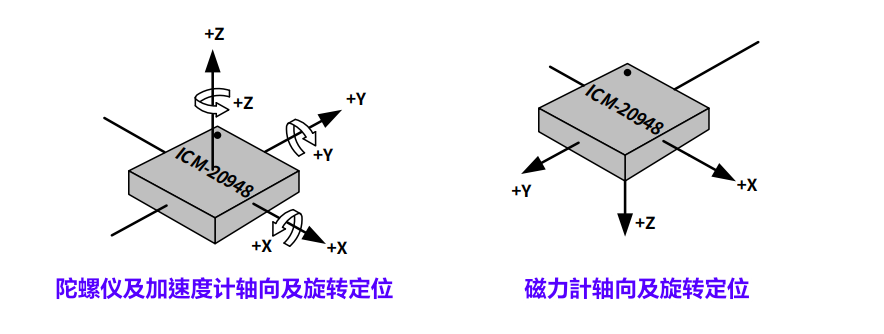

<style>
  table {
    width: 100%
    }
  td {
    vertical-align: center;
    text-align: center;
  }
  table.inputT{
    margin: 10px;
    width: auto;
    margin-left: auto;
    margin-right: auto;
    border: none;
  }
  input{
    text-align: center;
    padding: 0px 10px;
  }
  iframe{
    width: 100%;
    display: block;
    border-style:none;
  }
</style>

# 惯性测量传感器 IMU 检测 (I<sup>2</sup>C 接口)

以下方法是用 Linux 系统检测，惯性测量传感器是否工作正常。以减少在微系统中运作出现问题。

## 工具

僅 I<sup>2</sup>C 驱动程序链接 : [allanbian1017/i2c-ch341-usb](https://github.com/allanbian1017/i2c-ch341-usb) 

|命令|說明|
|:---:|:---:|
|depmod|生成模塊和映射文件|
|insmod|將模塊插入Linux內核|
|lsmod|顯示Linux內核中模塊的狀態|
|modinfo|顯示有關Linux內核模塊的信息|
|modprobe|從Linux內核中添加並刪除模塊|
|rmmod|從Linux內核中刪除模塊|

用以下方法编译及安装

```
cd /home/dickyko/i2c-ch341-usb
make
sudo insmod /home/dickyko/i2c-ch341-usb/i2c-ch341-usb.ko
sudo chmod 777 /dev/i2c-x
sudo apt-get install i2c-tools
```
注 **x** 为 I<sup>2</sup>C 接口编号

## USB 连接电脑 CH341A


## Python (Visual Studio Code)

 - [Python 相关资料](https://hkdickyko.github.io/%E7%B7%A8%E7%A8%8B/python)
 - [NumPy 相关资料](https://hkdickyko.github.io/%E7%B7%A8%E7%A8%8B/numpy)
 - [SciPy 相关资料](https://hkdickyko.github.io/%E7%B7%A8%E7%A8%8B/scipy)

## 检查 IMU 连接

### 在虚拟环境 **venv** 中安装附加套件

在虚拟环境安装 smbus2 : **pip install smbus2**, 否则 IMU 不能连接成功

### 在主环境中安装 USB I<sup>2</sup>C 接口，并更新到所有人能用的权限

```sh
sudo modprobe /home/dickyko/i2c-ch341-usb/i2c-ch341-usb.ko
sudo chmod 777 /dev/i2c-6
sudo i2cdetect -y 6
```


以下用 ICM20948 为例子，只需更换惯性测量传感器的输出代码即可更换至其它惯性测量传感器。输出部份为。**陀螺仪**，**加速计**及**磁力计**的测量结果。在更换其它惯性测量传感器時，请注意测量单位及三轴方向。

## ICM20948 内部架构


## ICM20948 的 Python 源代码

 - 一字节 (byte) 相等于八位元 (8 bits)

```py
import struct
import time

__version__ = "1.0.0"

CHIP_ID = 0xEA
I2C_ADDR = 0x68
I2C_ADDR_ALT = 0x69
ICM20948_BANK_SEL = 0x7F

ICM20948_I2C_MST_ODR_CONFIG = 0x00
ICM20948_I2C_MST_CTRL = 0x01
ICM20948_I2C_MST_DELAY_CTRL = 0x02
ICM20948_I2C_SLV0_ADDR = 0x03
ICM20948_I2C_SLV0_REG = 0x04
ICM20948_I2C_SLV0_CTRL = 0x05
ICM20948_I2C_SLV0_DO = 0x06
ICM20948_EXT_SLV_SENS_DATA_00 = 0x3B

ICM20948_GYRO_SMPLRT_DIV = 0x00
ICM20948_GYRO_CONFIG_1 = 0x01
ICM20948_GYRO_CONFIG_2 = 0x02

# Bank 0
ICM20948_WHO_AM_I = 0x00
ICM20948_USER_CTRL = 0x03
ICM20948_PWR_MGMT_1 = 0x06
ICM20948_PWR_MGMT_2 = 0x07
ICM20948_INT_PIN_CFG = 0x0F

ICM20948_ACCEL_SMPLRT_DIV_1 = 0x10
ICM20948_ACCEL_SMPLRT_DIV_2 = 0x11
ICM20948_ACCEL_INTEL_CTRL = 0x12
ICM20948_ACCEL_WOM_THR = 0x13
ICM20948_ACCEL_CONFIG = 0x14
ICM20948_ACCEL_XOUT_H = 0x2D
ICM20948_GRYO_XOUT_H = 0x33

ICM20948_TEMP_OUT_H = 0x39
ICM20948_TEMP_OUT_L = 0x3A

# 偏移量，灵敏度及温度测量设定
ICM20948_TEMPERATURE_DEGREES_OFFSET = 21
ICM20948_TEMPERATURE_SENSITIVITY = 333.87
ICM20948_ROOM_TEMP_OFFSET = 21

AK09916_I2C_ADDR = 0x0C
AK09916_CHIP_ID = 0x09
AK09916_WIA = 0x01
AK09916_ST1 = 0x10
AK09916_ST1_DOR = 0b00000010  # 资料溢出位
AK09916_ST1_DRDY = 0b00000001  # 数据就绪位
AK09916_HXL = 0x11
AK09916_ST2 = 0x18
AK09916_ST2_HOFL = 0b00001000  # 磁场溢出位
AK09916_CNTL2 = 0x31
AK09916_CNTL2_MODE = 0b00001111
AK09916_CNTL2_MODE_OFF = 0
AK09916_CNTL2_MODE_SINGLE = 1
AK09916_CNTL2_MODE_CONT1 = 2
AK09916_CNTL2_MODE_CONT2 = 4
AK09916_CNTL2_MODE_CONT3 = 6
AK09916_CNTL2_MODE_CONT4 = 8
AK09916_CNTL2_MODE_TEST = 16
AK09916_CNTL3 = 0x32

class ICM20948:
    def write(self, reg, value): # 写一字节数据资传感器
        self._bus.write_byte_data(self._addr, reg, value)
        time.sleep(0.0001)

    def read(self, reg): # 读传感器一字节数据
        return self._bus.read_byte_data(self._addr, reg)

    def trigger_mag_io(self):
        user = self.read(ICM20948_USER_CTRL)
        self.write(ICM20948_USER_CTRL, user | 0x20)
        time.sleep(0.005)
        self.write(ICM20948_USER_CTRL, user)

    def read_bytes(self, reg, length=1): # 读传感器字节数据
        return self._bus.read_i2c_block_data(self._addr, reg, length)

    def bank(self, value): # 切换寄存器 self.bank
        if not self._bank == value:
            self.write(ICM20948_BANK_SEL, value << 4)
            self._bank = value

    def mag_write(self, reg, value): # 向从属磁力仪写入一个字节
        self.bank(3)
        self.write(ICM20948_I2C_SLV0_ADDR, AK09916_I2C_ADDR)  # 写一字节
        self.write(ICM20948_I2C_SLV0_REG, reg)
        self.write(ICM20948_I2C_SLV0_DO, value)
        self.bank(0)
        self.trigger_mag_io()

    def mag_read(self, reg): # 由从属磁力仪读取一个字节
        self.bank(3)
        self.write(ICM20948_I2C_SLV0_ADDR, AK09916_I2C_ADDR | 0x80)
        self.write(ICM20948_I2C_SLV0_REG, reg)
        self.write(ICM20948_I2C_SLV0_DO, 0xFF)
        self.write(ICM20948_I2C_SLV0_CTRL, 0x80 | 1)  # 读一字节
        self.bank(0)
        self.trigger_mag_io()
        return self.read(ICM20948_EXT_SLV_SENS_DATA_00)

    def mag_read_bytes(self, reg, length=1): # 由从属磁力仪读取最多 24 个字节
        self.bank(3)
        self.write(ICM20948_I2C_SLV0_CTRL, 0x80 | 0x08 | length)
        self.write(ICM20948_I2C_SLV0_ADDR, AK09916_I2C_ADDR | 0x80)
        self.write(ICM20948_I2C_SLV0_REG, reg)
        self.write(ICM20948_I2C_SLV0_DO, 0xFF)
        self.bank(0)
        self.trigger_mag_io()
        return self.read_bytes(ICM20948_EXT_SLV_SENS_DATA_00, length)

    def magnetometer_ready(self): #检查磁力计状态就绪位
        return self.mag_read(AK09916_ST1) & 0x01 > 0

    def read_magnetometer_data(self, timeout=1.0):
        # 触发单次测量
        self.mag_write(AK09916_CNTL2, 0x01)  
        t_start = time.time()
        while not self.magnetometer_ready():
            if time.time() - t_start > timeout:
                raise RuntimeError("等待磁力计就绪超时")
            time.sleep(0.00001)
            
        data = self.mag_read_bytes(AK09916_HXL, 6)
        # 读取 ST2 确认自我读取完成，需要连续模式
        self.mag_read(AK09916_ST2)

        x, y, z = struct.unpack("<hhh", bytearray(data))

        # 磁通密度标尺 "uT" 来自数据表第 3.3 节。此值是恒定的
        x *= 0.15
        y *= 0.15
        z *= 0.15

        return x, y, z

    def read_accelerometer_gyro_data(self):
        self.bank(0)
        data = self.read_bytes(ICM20948_ACCEL_XOUT_H, 12)

        ax, ay, az, gx, gy, gz = struct.unpack(">hhhhhh", bytearray(data))

        self.bank(2)

        # 读取加速度计满量程范围和用它来补偿 gs 的读数
        scale = (self.read(ICM20948_ACCEL_CONFIG) & 0x06) >> 1

        # 比例范围取自数据表第 3.2 节
        gs = [16384.0, 8192.0, 4096.0, 2048.0][scale]

        ax /= gs
        ay /= gs
        az /= gs

        # 读回每秒度数和用它来补偿 dps 的读数
        scale = (self.read(ICM20948_GYRO_CONFIG_1) & 0x06) >> 1

        # 比例范围取自数据表第 3.1 节
        dps = [131, 65.5, 32.8, 16.4][scale]

        gx /= dps
        gy /= dps
        gz /= dps

        return ax, ay, az, gx, gy, gz

    def set_accelerometer_sample_rate(self, rate=125): 
        # 设置加速度计采样率（单位为 Hz) 
        self.bank(2)
        # 125Hz - 1.125 kHz / (1 + rate)
        rate = int((1125.0 / rate) - 1)
        # 用结构来打包然后写入字节
        self.write(ICM20948_ACCEL_SMPLRT_DIV_1, (rate >> 8) & 0xFF)
        self.write(ICM20948_ACCEL_SMPLRT_DIV_2, rate & 0xFF)

    def set_accelerometer_full_scale(self, scale=16):
        # 将加速度计满量程范围设置为 +/- 提供的值
        self.bank(2)
        value = self.read(ICM20948_ACCEL_CONFIG) & 0b11111001
        value |= {2: 0b00, 4: 0b01, 8: 0b10, 16: 0b11}[scale] << 1
        self.write(ICM20948_ACCEL_CONFIG, value)

    def set_accelerometer_low_pass(self, enabled=True, mode=5): 
        # 配置加速度计低通滤波器
        self.bank(2)
        value = self.read(ICM20948_ACCEL_CONFIG) & 0b10001110
        if enabled:
            value |= 0b1
        value |= (mode & 0x07) << 4
        self.write(ICM20948_ACCEL_CONFIG, value)

    def set_gyro_sample_rate(self, rate=125):
        # 设置陀螺仪采样率（单位：赫兹）
        self.bank(2)
        # 125Hz sample rate - 1.125 kHz / (1 + rate)
        rate = int((1125.0 / rate) - 1)
        self.write(ICM20948_GYRO_SMPLRT_DIV, rate)

    def set_gyro_full_scale(self, scale=250):
        # 将陀螺仪满量程范围设置为 +/- 提供的值
        self.bank(2)
        value = self.read(ICM20948_GYRO_CONFIG_1) & 0b11111001
        value |= {250: 0b00, 500: 0b01, 1000: 0b10, 2000: 0b11}[scale] << 1
        self.write(ICM20948_GYRO_CONFIG_1, value)

    def set_gyro_low_pass(self, enabled=True, mode=5):
        # 配置陀螺仪低通滤波器
        self.bank(2)
        value = self.read(ICM20948_GYRO_CONFIG_1) & 0b10001110
        if enabled:
            value |= 0b1
        value |= (mode & 0x07) << 4
        self.write(ICM20948_GYRO_CONFIG_1, value)

    def read_temperature(self):
        # 属性来读取当前 IMU 温度，PWR_MGMT_1 默认保持温度启用
        self.bank(0)
        temp_raw_bytes = self.read_bytes(ICM20948_TEMP_OUT_H, 2)
        temp_raw = struct.unpack(">h", bytearray(temp_raw_bytes))[0]
        temperature_deg_c = (
            (temp_raw - ICM20948_ROOM_TEMP_OFFSET) / ICM20948_TEMPERATURE_SENSITIVITY
        ) + ICM20948_TEMPERATURE_DEGREES_OFFSET
        return temperature_deg_c

    def reset(self):
        self.bank(0)
        if not self.read(ICM20948_WHO_AM_I) == CHIP_ID:
            raise RuntimeError("找不到 ICM20948")
        self.write(ICM20948_PWR_MGMT_1, 0x80)
        time.sleep(0.01)
        self.write(ICM20948_PWR_MGMT_1, 0x01)
        self.write(ICM20948_PWR_MGMT_2, 0x00)

    def __init__(self, i2c_addr=I2C_ADDR_ALT, i2c_bus=None):
        self._bank = -1
        self._addr = i2c_addr

        if i2c_bus is None:
            from smbus2 import SMBus

            self._bus = SMBus(6)
        else:
            self._bus = i2c_bus

        self.bank(0)
        if not self.read(ICM20948_WHO_AM_I) == CHIP_ID:
            raise RuntimeError("找不到 ICM20948")

        self.write(ICM20948_PWR_MGMT_1, 0x80)
        time.sleep(0.01)
        self.write(ICM20948_PWR_MGMT_1, 0x01)
        self.write(ICM20948_PWR_MGMT_2, 0x00)

        self.bank(2)

        self.set_gyro_sample_rate(100)
        self.set_gyro_low_pass(enabled=True, mode=5)
        self.set_gyro_full_scale(250)

        self.set_accelerometer_sample_rate(125)
        self.set_accelerometer_low_pass(enabled=True, mode=5)
        self.set_accelerometer_full_scale(16)

        self.bank(0)
        self.write(ICM20948_INT_PIN_CFG, 0x30)

        self.bank(3)
        self.write(ICM20948_I2C_MST_CTRL, 0x4D)
        self.write(ICM20948_I2C_MST_DELAY_CTRL, 0x01)

        if not self.mag_read(AK09916_WIA) == AK09916_CHIP_ID:
            raise RuntimeError("找不到 AK09916")

        # 重置磁力计
        self.mag_write(AK09916_CNTL3, 0x01)
        while self.mag_read(AK09916_CNTL3) == 0x01:
            time.sleep(0.0001)


if __name__ == "__main__":
    imu = ICM20948()
    while True:
        x, y, z = imu.read_magnetometer_data()
        ax, ay, az, gx, gy, gz = imu.read_accelerometer_gyro_data()
        print(
            "Accel:{ax:05.2f} {ay:05.2f} {az:05.2f} \
            Gyro:{gx:05.2f} {gy:05.2f} {gz:05.2f} \
            Mag:{x:05.2f} {y:05.2f} {z:05.2f}"
        )
        time.sleep(0.25)
```

## 惯性测量传感器 **IMU** 校准

[IMU 功作原理，数学知识](https://hkdickyko.github.io/%E7%A9%8D%E9%AB%94%E9%9B%BB%E8%B7%AF/imu)

以下程序只需修改读取及写入数据部分。即可對不同传感器进行校准。但要注意传感器的轴向及旋转定位。



每个 IMU 传感器都可使用以下公式校准。此公式适用于陀螺仪、加速度计和磁力计。对校准过程中收集的数据进行最小二乘拟合，以确定模型中每个参数的值。

$$
\begin{bmatrix} x \\ y \\ z \end{bmatrix} = \begin{bmatrix}
S_x & 0 & 0 \\ 0 & S_y & 0 \\ 0 & 0 & S_z\end{bmatrix} \begin{bmatrix} 1 & \alpha_1 & \alpha_2 \\ \alpha_3 & 1 & \alpha_4  \\ \alpha_5 & \alpha_6 & 1 \end{bmatrix} \left(
\begin{bmatrix} \tilde{x}\\ \tilde{y}\\ \tilde{z} \end{bmatrix}-\begin{bmatrix} b_x\\ b_y \\ b_z \end{bmatrix}
\right)
$$

左侧向量是传感器的输出，该输出已针对任何**比例因子误差**、**错位误差**和**偏差**进行了校准，并且应在校准后与真实数据相匹配。

右侧的两个矩阵分别称为**比例因子矩阵**和**错位矩阵**，其中包含传感器的比例因子和错位校准参数。上面的比例因子矩阵和错位矩阵也可以组合成一个矩阵，而不会失去通用性。最后一项由未校准的测量值和传感器偏差组成。

通常，**偏差**是传感器模型方程中唯一在部件使用寿命内发生显著变化的参数，可能需要用户偶尔进行校准。

**比例因子**是信号的乘数，由测量范围内输出与输入的比率组成。该因子通常随温度变化，必须在工作温度范围内进行校准。

**错位矩阵**是在安装和对准传感器 IMU 时，不可能将它们完全正交地安装在一起。因此，正交性误差是由传感器轴响应应与感测方向正交的输入引起的。正交性误差的两种主要类型是跨轴灵敏度和错位，这两者经常互换使用。

  - **跨轴灵敏度**是指传感器轴对不同轴上的输入敏感而导致的正交性误差。换句话说，x 轴上的输入也可能在 z 轴上被部分感应到。
  - **错位**是由于刚体旋转导致所有轴相对于预期输入轴偏移，同时保持传感轴之间的严格正交性（x 轴与 y 轴和 z 轴保持正交性）而产生的正交性误差。换句话说，内部传感轴与 IMU 外壳上标记的轴不对齐。这种错位误差存在于整个系统中（例如，IMU 外壳安装时与车辆的对齐程度不完全一致，摄像头镜头与摄像头外壳的对齐程度不完全一致等）。因此，大多数高性能应用都需要在整个端到端系统（例如，内部 IMU 传感轴与摄像头镜头）上执行单独的错位校准，而 IMU 的工厂校准错位误差基本上无关紧要。


**偏差**是输出值相对于输入值的恒定偏移。可以测量多种不同类型的偏置参数，包括运行中偏置稳定性、开启偏置稳定性或可重复性以及温度偏置。

个别测试可以忽略错位矩阵如下：

$$
\begin{bmatrix} x \\ y \\ z \end{bmatrix} = \begin{bmatrix}
S_x & 0 & 0 \\ 0 & S_y & 0 \\ 0 & 0 & S_z\end{bmatrix}  \left(
\begin{bmatrix} \tilde{x}\\ \tilde{y}\\ \tilde{z} \end{bmatrix}-\begin{bmatrix} b_x\\ b_y \\ b_z \end{bmatrix}
\right)
$$

从而简化成线性方程，用最小二乘法求解。


## 陀螺仪偏移校准

陀螺仪是单轴角度传感器。用以纪录传感器在一个单轴的角度倾斜的表现。也就是 XYZ 三轴，任取一轴做测量。

<font color="#FF1000">注意：静止放在平面上测量即可。</font>

```py
import time
from icm20948 import ICM20948
import numpy as np
import matplotlib.pyplot as plt
from matplotlib.font_manager import FontProperties

time.sleep(2)  # 等待 MPU 加载并稳定
imu = ICM20948()
font = FontProperties(fname="./SimHei.ttf", size=20)
font1 = FontProperties(fname="./SimHei.ttf", size=12)

def get_gyro():
  _, _, _, wx, wy, wz = imu.read_accelerometer_gyro_data()  # 阅读并转换陀螺数据
  print("Gyro:{:9.5f} {:9.5f} {:9.5f}".format(wx,wy,wz))
  return wx, wy, wz

def gyro_cal():
    print("陀螺仪校准 - 保持IMU稳定")
    [get_gyro() for ii in range(0, cal_size)]  # 校准前清除缓冲
    mpu_array = []
    gyro_offsets = [0.0, 0.0, 0.0]
    while True:
      try:
        wx, wy, wz = get_gyro()  # 获取陀螺仪值
      except:
        continue
      mpu_array.append([wx, wy, wz])
      if np.shape(mpu_array)[0] == cal_size:
        for qq in range(0, 3): # 平均值，[:,qq] : 為所有列， qq 為行數 即 [R,C] 格式
          gyro_offsets[qq] = np.mean(np.array(mpu_array)[:, qq])  
        break
    print("陀螺仪校准完成")
    return gyro_offsets

def gyro_calibration():
  # 记录新数据
  data = np.array([get_gyro() for ii in range(0, cal_size)])  # 新值
  # 用偏移和无偏移打印图形
  plt.style.use("ggplot")
  fig, axs = plt.subplots(2, 1, figsize=(12, 9))
  for ii in range(0, 3):
    axs[0].plot(data[:, ii], label="${}$, 尚未校准".format(gyro_labels[ii]))
    axs[1].plot(
      data[:, ii] - gyro_offsets[ii],
      label="${}$, 已经校准".format(gyro_labels[ii]),
    )
  axs[0].legend(prop=font1)
  axs[1].legend(prop=font1)
  axs[0].set_ylabel("$w_{x,y,z}$ [$^{circ}/s$]", fontsize=18)
  axs[1].set_ylabel("$w_{x,y,z}$ [$^{circ}/s$]", fontsize=18)
  axs[1].set_xlabel("样本", fontproperties=font)
  axs[0].set_ylim([-2, 2])
  axs[1].set_ylim([-2, 2])
  axs[0].set_title("陀螺仪偏移值校准", fontproperties=font)
  fig.show()

if __name__ == "__main__":
  # 陀螺仪抵消计算
  gyro_labels = ["w_x", "w_y", "w_z"]
  cal_size = 100  # 用于校准的点数量
  gyro_offsets = gyro_cal()  # 计算陀螺仪偏移
  gyro_calibration()
  print("------> 陀螺仪偏移係數: {:9.5f}".format(gyro_offsets))  
```

### 图形显示陀螺仪偏移係數修正前后分别


## 陀螺仪的积分测量检查评估

<font color="#FF1000">注意：旋转 360 度，以测量陀螺仪的准确程度。

陀螺仪满量程**范围**和**补偿**。请参照代码。
</font>

```py
import time
from icm20948 import ICM20948
import numpy as np
import matplotlib.pyplot as plt
from matplotlib.font_manager import FontProperties
from scipy.integrate import cumulative_trapezoid

time.sleep(2)  # 等待 MPU 加载并稳定
imu = ICM20948()
font = FontProperties(fname="./SimHei.ttf", size=20)
font1 = FontProperties(fname="./SimHei.ttf", size=12)

def get_gyro():
  _, _, _, wx, wy, wz = imu.read_accelerometer_gyro_data()  # 阅读并转换陀螺数据
  print("Gyro:{:5.2f} {:5.2f} {:5.2f}".format(wx,wy,wz))
  return wx, wy, wz

def gyro_integration():
  gyro_labels = ["\omega_x", "\omega_y", "\omega_z"]
  input("按 Enter 并旋转陀螺 360 度")
  print("记录数据...")
  record_time = 5秒 # 记录多长时间
  data, t_vec = [], []
  t0 = time.time()
  while time.time() - t0 < record_time:
    data.append(get_gyro())
    t_vec.append(time.time() - t0)
  samp_rate = np.shape(data)[0] / (t_vec[-1] - t_vec[0])  # 样本率
  print("停止记录\n采样率: {0:2.0f} Hz".format(samp_rate))
  rot_axis = 2  # 轴旋转 (2 = z-axis)
  data_offseted = np.array(data)[:, rot_axis] - gyro_offsets[rot_axis]
  integ1_array = cumulative_trapezoid(data_offseted, x=t_vec)  # 积分以上5秒內数据
  # 打印出结果
  print(
    "积分 {} in {}".format(gyro_labels[rot_axis], gyro_labels[rot_axis].split("_")[1])
    + "-dir: {0:2.2f}度".format(integ1_array[-1])
  )
  # 用角速度及积分打印图形
  plt.style.use("ggplot")
  fig, axs = plt.subplots(2, 1, figsize=(12, 9))
  axs[0].plot(t_vec, data_offseted, label="$" + gyro_labels[rot_axis] + "$")
  axs[1].plot(
    t_vec[1:],
    integ1_array,
    label=r"$\theta_" + gyro_labels[rot_axis].split("_")[1] + "$",
  )
  [axs[ii].legend(prop=font1) for ii in range(0, len(axs))]
  axs[0].set_ylabel(
    "角速度, $\omega_{}$ [$^\circ/s$]".format(gyro_labels[rot_axis].split("_")[1]),
    fontproperties=font,
  )
  axs[1].set_ylabel(
    r"旋转, $\theta_{}$ [$^\circ$]".format(gyro_labels[rot_axis].split("_")[1]),
    fontproperties=font,
  )
  axs[1].set_xlabel("时间 [s]", fontproperties=font)
  axs[0].set_title("陀螺仪積分 360$^\circ$ 旋转", fontproperties=font)
  plt.show()

if __name__ == "__main__":
  # 陀螺仪偏移係數来自 gyro_calibration.py
  gyro_offsets = [0.027557251908396953, 0.8496946564885495, -0.21557251908396943]
  gyro_integration()
```

### 图形显示陀螺仪積分效果


## 加速度计偏移校准

加速度计是测量物体的加速度及计算瞬时姿态。

<font color="#FF1000">注意：每個角軸心相对于重力有三个方位（軸心向上，軸心向下，軸心直角于重力）作测试校正。
加速度计满量程**范围**和**补偿**。请参照代码。
</font>

```py
from icm20948 import ICM20948
import numpy as np
import matplotlib.pyplot as plt
from matplotlib.font_manager import FontProperties
from scipy.optimize import curve_fit

imu = ICM20948()
font = FontProperties(fname="./SimHei.ttf", size=20)
font1 = FontProperties(fname="./SimHei.ttf", size=12)

def accel_fit(x_input, m_x, b):
  return (m_x * x_input) + b  # 加速校准方程

def get_accel():
  ax, ay, az, _, _, _ = imu.read_accelerometer_gyro_data()  # 读取并转换加速数据
  print("Acc:{:9.5f} {:9.5f} {:9.5f}".format(ax,ay,az))
  return ax, ay, az

def accel_cal():
  print("加速度计校准")
  mpu_offsets = [[], [], []]  # 偏移阵列打印
  axis_vec = ["z", "y", "x"]  # 轴标签
  cal_directions = [
    "向上",
    "向下",
    "垂直于重力",
  ]  # IMU 计算方向
  cal_indices = [2, 1, 0]  # 轴指数
  for qq, ax_qq in enumerate(axis_vec):
    ax_offsets = [[], [], []]
    print("-" * 50)
    for direc_ii, direc in enumerate(cal_directions):
      input(
        "-" * 8
        + "按Enter 并保持 IMU 稳定以校准加速度计 -"
        + ax_qq
        + "- 轴指向 "
        + direc
      )
      print("清除缓冲区...")
      [
        imu.read_accelerometer_gyro_data() for ii in range(0, cal_size)
      ]  # 读数之间的清除缓冲区
      print("记录数据...")
      mpu_array = []
      while len(mpu_array) < cal_size:
        try:
          ax, ay, az = get_accel()
          mpu_array.append([ax, ay, az])  # 加到数组
        except:
          continue
      ax_offsets[direc_ii] = np.array(mpu_array)[:, cal_indices[qq]]  # 偏移方向
    # 使用三个校准（+1g，-1g，0g）进行线性拟合。用最少二乘法求解。
    popts, _ = curve_fit(
      accel_fit,
      np.append(np.append(ax_offsets[0], ax_offsets[1]), ax_offsets[2]),
      np.append(
        np.append(
          1.0 * np.ones(np.shape(ax_offsets[0])),
          -1.0 * np.ones(np.shape(ax_offsets[1])),
        ),
        0.0 * np.ones(np.shape(ax_offsets[2])),
      ),
      maxfev=10000,
    )
    mpu_offsets[cal_indices[qq]] = popts  # 将斜率放在偏移阵列中
  print("加速度计校准完成")
  return mpu_offsets

def accel_calibration():
  data = np.array([get_accel() for ii in range(0, cal_size)])
  plt.style.use("ggplot")
  fig, axs = plt.subplots(2, 1, figsize=(12, 9))
  for ii in range(0, 3):
    axs[0].plot(data[:, ii], label="${}$, 尚未校准".format(accel_labels[ii]))
    axs[1].plot(
      accel_fit(data[:, ii], *accel_coeffs[ii]),
      label="${}$, 已经校准".format(accel_labels[ii]),
    )
  axs[0].legend(prop=font1)
  axs[1].legend(prop=font1)
  axs[0].set_ylabel("$a_{x,y,z}$ [g]", fontsize=18)
  axs[1].set_ylabel("$a_{x,y,z}$ [g]", fontsize=18)
  axs[1].set_xlabel("样本", fontproperties=font)
  axs[0].set_ylim([-2, 2])
  axs[1].set_ylim([-2, 2])
  axs[0].set_title("加速度计校准校准校正", fontproperties=font)
  fig.show()
  
if __name__ == "__main__":
  accel_labels = ["a_x", "a_y", "a_z"]  # 陀螺式标签
  cal_size = 10  # 用于校准的点数
  accel_coeffs = accel_cal()  # 获得加速系数
  accel_calibration()
  print("------> 加速度计係數: {:9.5f}, {:9.5f}, {:9.5f}".format(accel_coeffs[0], \
     accel_coeffs[1], accel_coeffs[2]))
```
### 图形显示加速度计係數修正前后分别


最少测量次数为六次如下:


|测量方法|X平面(重力)|Y平面(重力)|Z平面(重力)|
|:---:|:---:|:---:|:---:|
|X向下|-9.81|0|0|
|X向上|9.81|0|0|
|Y向下|0|-9.81|0|
|Y向上|0|9.81|0|
|Z向下|0|0|-9.81|
|Z向上|0|0|9.81|


注同重力方向法為 <font color="#FF1000">-g</font>，不同重力方向法為 <font color="#FF1000">g</font>，垂直重力方向法為 <font color="#FF1000">0</font>。

用测量的结果及最少二进乘求法解。


## 加速度计積分检查评估

<font color="#FF0010">注意：以一定速度移动传感器。以测量校准后传感器的输出的加速度结果。从而计算速度及距离。用以评估准确度。</font>

```py
import time
import numpy as np
import matplotlib.pyplot as plt
from icm20948 import ICM20948
from matplotlib.font_manager import FontProperties
from scipy.integrate import cumulative_trapezoid
from scipy import signal

imu = ICM20948()

font = FontProperties(fname="./SimHei.ttf", size=20)
font1 = FontProperties(fname="./SimHei.ttf", size=12)

def accel_fit(x_input, m_x, b):
  return (m_x * x_input) + b  # 加速校准方程

def imu_integrator():
  loop_bool = False
  break_bool = False
  data_indx = 1 # 可变索引集成
  dt_stop = 5 # 记录和集成的秒
  accel_array,t_array = [],[]
  while True:
    try:
      if not loop_bool:
         loop_bool = True
         input("按 Enter 開始移動 IMU {} 秒...".format(dt_stop))
         t0 = time.time()
      ax, ay, az, wx, wy, wz = imu.read_accelerometer_gyro_data()
      mx, my, mz = imu.read_magnetometer_data()
      t_array.append(time.time() - t0)
      data_array = [ax, ay, az, wx, wy, wz, mx, my, mz]
      accel_array.append(accel_fit(data_array[data_indx], *accel_coeffs[data_indx]))
      print(
          "IMU:{:9.5f} {:9.5f} {:9.5f},Gyro:{:9.5f} {:9.5f} {:9.5f} ,\
           Mag:{:9.5f} {:9.5f} {:9.5f}".format(ax, ay, az, wx, wy, wz, mx, my, mz)
          )            
    except:
        continue
    if time.time()-t0>dt_stop:
      print("數據採集停止...")
      break
    if break_bool:
      break                
                
  Fs_approx = len(accel_array) / dt_stop
  print("{},{}".format(len(accel_array), Fs_approx))
  w = 0.2 # 標準化頻率
  b_filt, a_filt = signal.butter(4, w, "low", fs=Fs_approx)
  accel_array = signal.filtfilt(b_filt, a_filt, accel_array)
  accel_array = np.multiply(accel_array, 9.80665)
  print("样本率: {0:2.0f}Hz".format(len(accel_array) / dt_stop))
  veloc_array = np.append(0.0, cumulative_trapezoid(accel_array, x=t_array))
  dist_approx = np.trapz(veloc_array, x=t_array)
  dist_array = np.append(0.0, cumulative_trapezoid(veloc_array, x=t_array))
  print("位移 y-dir: {0:2.2f}m".format(dist_approx))
  plt.style.use("ggplot")
  fig, axs = plt.subplots(3, 1, figsize=(12, 9))
  axs[0].plot(
    t_array,
    accel_array,
    label="$" + mpu_labels[data_indx] + "$",
    color=plt.cm.Set1(0),
    linewidth=2.5,
  )
  axs[1].plot(
    t_array,
    veloc_array,
    label="$v_" + mpu_labels[data_indx].split("_")[1] + "$",
    color=plt.cm.Set1(1),
    linewidth=2.5,
  )
  axs[2].plot(
    t_array,
    dist_array,
    label="$d_" + mpu_labels[data_indx].split("_")[1] + "$",
    color=plt.cm.Set1(2),
    linewidth=2.5,
  )
  [axs[ii].legend(prop=font1) for ii in range(0, len(axs))]
  axs[0].set_ylabel("加速度 [m$\cdot$s$^{-2}$]", fontproperties=font)
  axs[1].set_ylabel("速度 [m$\cdot$s$^{-1}$]", fontproperties=font)
  axs[2].set_ylabel("位移 [m]", fontproperties=font)
  axs[2].set_xlabel("时间 [s]", fontproperties=font)
  axs[0].set_title("加速度计集成", fontproperties=font)
  plt.pause(0.01)
  fig.show()

if __name__ == "__main__":
  mpu_labels = ["a_x", "a_y", "a_z"]  # 陀螺式标签
  accel_coeffs = [np.array([1.00160835, 0.01558492]),
                  np.array([1.00255507, 0.02508019]),
                  np.array([-0.99043472, 0.01107469]),
  ] # 加速度计係數来自 accel_calibration.py
  imu_integrator()
```

### 图形显示加速度计係數積分效果


## 磁力计

地球磁场的极点和地理的极点之间并不重合，大概 11° 左右的偏差。磁场计算最大的麻烦就是干扰，这个干扰比加速度和陀螺仪大很多，况且还要探知这么微小的地球磁场。地球的磁场在 0.4-0.6 高斯， 而平时用手机里面扬声器就差不多 4 高斯，微动马达都至少 6 高斯。所以基本上都需要做现场的矫正。磁场矫正方法是测量值减去本地的偏移量。


<font color="#FF0010">注意</font>：将磁力计各轴心以多次 360 度旋转，用以测量附近相对磁干扰的影响。**硬鉄干扰**只会影响轴心中心偏移量。**软铁干扰**比硬鉄干扰小很多，会影响圆形圆度。使测量结果变成椭圆形。


```py
import time
from icm20948 import ICM20948
import numpy as np
import matplotlib.pyplot as plt
from matplotlib.font_manager import FontProperties

imu = ICM20948()
font = FontProperties(fname="./SimHei.ttf", size=20)
font1 = FontProperties(fname="./SimHei.ttf", size=12)

def outlier_removal(x_ii, y_ii):
  x_diff = np.append(0.0, np.diff(x_ii))  # 尋找異常值
  stdev_amt = 5.0  # 標準偏差乘數
  x_outliers = np.where(
    np.abs(x_diff) > np.abs(np.mean(x_diff)) + (stdev_amt * np.std(x_diff))
  )
  y_diff = np.append(0.0, np.diff(y_ii))  # 尋找異常值
  y_outliers = np.where(
    np.abs(y_diff) > np.abs(np.mean(y_diff)) + (stdev_amt * np.std(y_diff))
  )
  if len(x_outliers) != 0:
      x_ii[x_outliers] = np.nan  # 找不到離群值
      y_ii[x_outliers] = np.nan  # 找不到離群值
  if len(y_outliers) != 0:
      y_ii[y_outliers] = np.nan  # 找不到離群值
      x_ii[y_outliers] = np.nan  # 找不到離群值
  return x_ii, y_ii

def mag_cal():
  print("磁力計校準")
  mag_cal_rotation_vec = []  # 校準計算的變量
  for qq, ax_qq in enumerate(mag_cal_axes):
    input("按 Enter 並開始將 IMU 旋轉在 " + ax_qq + "-axis")
    mag_array = []
    t0 = time.time()
    index = 0
    while True:
      try:
        mx, my, mz = imu.read_magnetometer_data()
      except:
        continue
      mag_array.append([mx, my, mz])  # mag array
      print("Mag:{:9.5f} {:9.5f} {:9.5f}".format(mx,my,mz))
      index = index + 1
      if index == cal_size:
        break
    mag_array = mag_array[20:]  # 扔掉前幾個點（緩衝區清除）
    mag_cal_rotation_vec.append(mag_array)  # 校準陣列
    print("Sample Rate: {0:2.0f} Hz".format(len(mag_array) / (time.time() - t0)))

  mag_cal_rotation_vec = np.array(mag_cal_rotation_vec)
  ak_fit_coeffs = []
  indices_to_save = [0, 0, 1]  # 索引保存為偏移
  for mag_ii, mags in enumerate(mag_cal_rotation_vec):
    mags = np.array(mags)
    # 傳感器要分析
    x, y = mags[:, cal_rot_indices[mag_ii][0]], mags[:, cal_rot_indices[mag_ii][1]] 
    x, y = outlier_removal(x, y)  # 離群拆除
    y_0 = (np.nanmax(y) + np.nanmin(y)) / 2.0  # y-偏移值
    x_0 = (np.nanmax(x) + np.nanmin(x)) / 2.0  # x-偏移值
    ak_fit_coeffs.append([x_0, y_0][indices_to_save[mag_ii]])  # 附加以偏移值
  return ak_fit_coeffs, mag_cal_rotation_vec

def mag_cal_plot():
  plt.style.use("ggplot")
  fig, axs = plt.subplots(1, 2, figsize=(12, 7))
  for mag_ii, mags in enumerate(mag_cal_rotation_vec):
    mags = np.array(mags)  # 磁力計陣列
    x, y = mags[:, cal_rot_indices[mag_ii][0]], mags[:, cal_rot_indices[mag_ii][1]]
    x, y = outlier_removal(x, y)  # 離群拆除
    axs[0].scatter(
      x,
      y,
      label="Rotation Around ${0}$-axis (${1},{2}$)".format(
        mag_cal_axes[mag_ii],
        mag_labels[cal_rot_indices[mag_ii][0]],
        mag_labels[cal_rot_indices[mag_ii][1]],
      ),
    )
    axs[1].scatter(
      x - mag_coeffs[cal_rot_indices[mag_ii][0]],
      y - mag_coeffs[cal_rot_indices[mag_ii][1]],
      label="Rotation Around ${0}$-axis (${1},{2}$)".format(
        mag_cal_axes[mag_ii],
        mag_labels[cal_rot_indices[mag_ii][0]],
        mag_labels[cal_rot_indices[mag_ii][1]],
      ),
    )
  axs[0].set_title("硬鐵偏移之前", fontproperties=font)
  axs[1].set_title("硬鐵偏移後", fontproperties=font)
  mag_lims = [
    np.nanmin(np.nanmin(mag_cal_rotation_vec)),
    np.nanmax(np.nanmax(mag_cal_rotation_vec)),
  ]
  mag_lims = [-1.1 * np.max(mag_lims), 1.1 * np.max(mag_lims)]
  for jj in range(0, 2):
    axs[jj].set_ylim(mag_lims)  # 設置限制範圍
    axs[jj].set_xlim(mag_lims)  # 設置限制範圍
    axs[jj].legend(prop=font1)
    axs[jj].set_aspect("equal", adjustable="box")  # 方形軸
  plt.show()

if __name__ == "__main__":
  imu.reset()
  cal_size = 100
  mag_labels = ["m_x", "m_y", "m_z"]
  mag_cal_axes = ["z", "x", "y"]
  cal_rot_indices = [[0, 1], [1, 2], [0, 2]]  # 每個軸的標題索引
  mag_coeffs, mag_cal_rotation_vec = mag_cal()  # 獲取磁力計係數
  mag_cal_plot()
  print("------> 硬鐵偏移係數\nz: {:9.5f}, {:9.5f} \
                            \nx: {:9.5f}, {:9.5f} \
                            \ny: {:9.5f}, {:9.5f}.".format( \
                            mag_coeffs[0], mag_coeffs[1], \
                            mag_coeffs[1], mag_coeffs[2], \
                            mag_coeffs[0], mag_coeffs[2]))
```

由以上结果，在每個轴上取平均最大值，平均最少值。

$$
各轴的硬鉄偏移量校准 = \frac {各轴的平均最大值 + 各轴的平均最少值}{2}
$$


$$
灵敏度调整 = \frac {平均最大值-平均最少值}{IMU 分辨率}
$$

#### 硬鉄偏移量偽程式碼

```py
offset_x = (max(x) + min(x)) / 2
offset_y = (max(y) + min(y)) / 2
offset_z = (max(z) + min(z)) / 2

corrected_x = sensor_x - offset_x
corrected_y = sensor_y - offset_y
corrected_z = sensor_z - offset_z
```

注意：多过五个标准差的数值需要移除。以消除硬鉄量度误差。


先计算硬鉄干扰偏移量来校准硬鉄干扰问题。软铁干扰校准是在校准硬鉄干扰校准后。从传感器的三个轴记录样本计算软铁校准矩阵。得出矩阵更接近 unitary 矩阵即校准。（unitary 矩阵乘以某矩阵后结果为单位矩阵）


### 硬鐵偏移係數修正前后分别


### 軟鐵失真

軟鐵失真不能透過簡單地消除常量偏移來消除。校正軟鐵畸變通常計算成本較高，並涉及 3x3 變換矩陣。

有一種計算成本更便宜的方法，即使用尺度偏差。這種方法也應該給出相當好的結果。下面的範例偽程式碼還包括上一個步驟中的硬鐵偏移。

#### 硬鉄偏移量和軟鐵失真偽程式碼

```py
avg_delta_x = (max(x) - min(x)) / 2
avg_delta_y = (max(y) - min(y)) / 2
avg_delta_z = (max(z) - min(z)) / 2

avg_delta = (avg_delta_x + avg_delta_y + avg_delta_z) / 3

scale_x = avg_delta / avg_delta_x
scale_y = avg_delta / avg_delta_y
scale_z = avg_delta / avg_delta_z

corrected_x = (sensor_x - offset_x) * scale_x
corrected_y = (sensor_y - offset_y) * scale_y
corrected_z = (sensor_z - offset_z) * scale_z
```

### 磁偏角估計值

地磁偏角是指地球上任一處的磁北方向和正北方向之間的夾角。當地磁北向實際偏東時，地磁偏角為正，反之為負。

[磁偏角估計值 - 網路資源](https://www.ngdc.noaa.gov/geomag/calculators/magcalc.shtml#declination)


## 数据融合

因为加速度、磁力计具有高频噪声，需要低通滤波，将加速度、磁力计的信号看成是音频信号，它们的信号会有很多“毛刺“，也就是说它们的瞬时值不够精确，解算出来的姿态会震荡，但长期来看姿态方向是对的。

而陀螺仪具有低频噪声，需要高通滤波，即每个时刻的得到的角速度是比较精确的，使用积分就能得到旋转角度（姿态），但是积分会累积误差，因此积分到后面姿态就不对了，也就是漂移现象。 加速度、磁力计和陀螺仪在频域上的特性互补，可以融合这三种传感器的数据，提高精度和系统的动态特性。


## 数字运动处理器 **DMP**

ICM-20948内的嵌入式数字运动处理器（**DMP**）从主处理器卸载运动处理算法的计算。**DMP** 从加速计、陀螺仪和附加的第三方传感器（如磁力计）获取数据，并对数据进行处理。结果数据可以从 FIFO 读取。**DMP** 可以访问外部引脚，这些引脚可用于生成中断。


**DMP** 的目的是减轻主机处理器的时序要求和处理功耗。通常运动处理算法应该以高速率运行，通常在 **200** Hz 左右，以便以低延迟提供准确的结果。即使应用程序以更低的速率更新，这也是必需的；例如，低功耗用户界面的更新速度可能低至 **5** Hz，但运动处理仍应以 **200** Hz 运行。**DMP** 可用于最小化功耗、简化时序、简化软件架构，并在主机处理器上节省宝贵的  MIPS（以便于主机分配更多算力给应用程序）。


**DMP** 能直接输出四元数，可以减轻外围微处理器的工作负担且避免了繁琐的滤波和数据融合。**DMP** 技术的核心在于实现传感器数据的融合，通过算法将不同传感器的输出进行整合，以获取更准确、更稳定的姿态信息。