<style>
  table {
    width: 100%
    }
  td {
    vertical-align: center;
    text-align: center;
  }
  table.inputT{
    margin: 10px;
    width: auto;
    margin-left: auto;
    margin-right: auto;
    border: none;
  }
  input{
    text-align: center;
    padding: 0px 10px;
  }
  iframe{
    width: 100%;
    display: block;
    border-style:none;
  }
</style>

# Python (Visual Studio Code)

[网上安装资讯](https://code.visualstudio.com/docs/languages/python)

## 需要安装插件

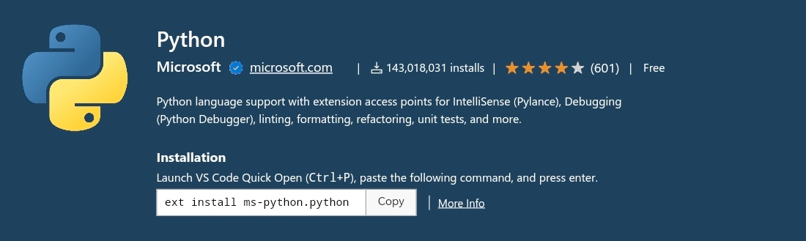

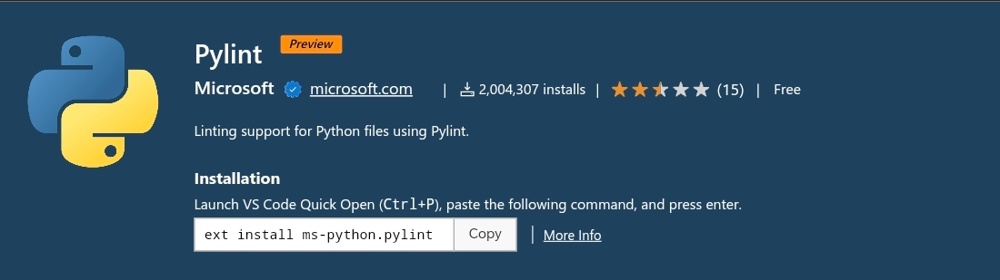

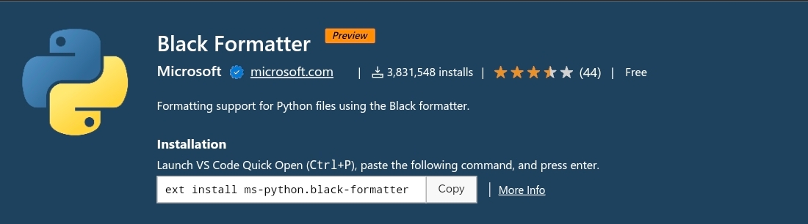

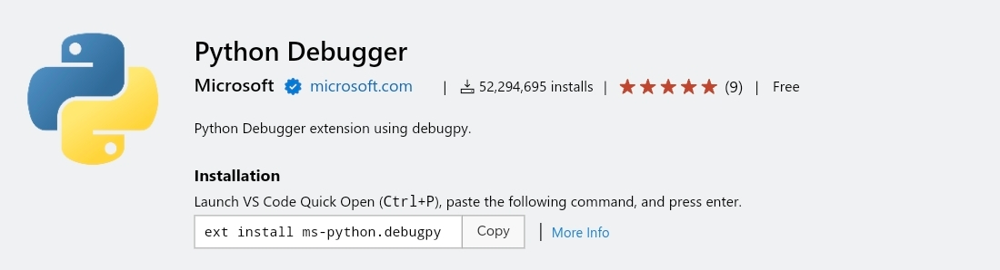

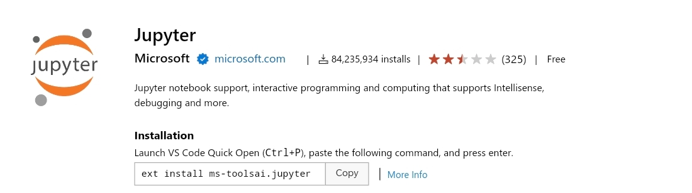


## 自动完成和 IntelliSense

**Python** 扩展使用当前选定的解释器支持代码完成和 IntelliSense。 IntelliSense 是许多功能的统称，包括跨所有文件以及内置和第三方模块的智能代码完成（上下文方法和变量建议）。

IntelliSense 可在键入时快速显示方法、类成员和文档。还可以随时使用 **Ctrl+Space** 触发完成。将鼠标悬停在标识符上将显示有关它们的更多信息。

## 安装 **Python** 虚拟环境

**Python** 扩展会自动检测安装在标准位置的 Python 解释器。它还会检测工作区文件夹中的 conda 环境以及虚拟环境。

当前环境显示在 VS Code 状态栏的右侧：


状态栏还会指示是否未选择解释器：


所选环境用于 IntelliSense、自动完成、linting、格式化和任何其他与语言相关的功能。当在终端中运行或调试 Python 时，或者当使用终端：创建新终端命令创建新终端时，也会激活它。

要更改当前解释器（包括切换到 conda 或虚拟环境），请在状态栏上选择解释器名称或使用 Python：选择解释器命令。


## 虚拟环境

虚拟环境是创建环境的内置方式。虚拟环境会创建一个文件夹，其中包含指向特定解释器的副本（或符号链接）。当将软件包安装到虚拟环境中时，它将最终位于这个新文件夹中，从而与其他工作区使用的其他软件包隔离。

注意：虽然可以将虚拟环境文件夹作为工作区打开，但不建议这样做，并且可能会导致使用 Python 扩展时出现问题。

Conda 环境

conda 环境是使用 conda 软件包管理器管理的 Python 环境（请参阅 conda 入门）。在 conda 和虚拟环境之间进行选择取决于的打包需求、团队标准等。

Python 环境工具

下表列出了与 Python 环境相关的各种工具：


|工具|定义和目的|
|:---:|:---:|
|pip|安装和更新软件包的 Python 包管理器。默认情况下，它与 Python 3.9+ 一起安装。如使用 Debian 的操作系统；请安装 python3-pip|
|venv|允许管理不同项目的单独软件包安装，并且默认与 Python 3 一起安装，如使用 Debian 的操作系统；请安装 python3-venv|
|conda| 与 Miniconda 一起安装。它可用于管理软件包和虚拟环境。通常用于数据科学项目。|

 - 显示命令面板 <font color="#FF1000">Ctrl + Shift + p</font> 
 - 快捷格式化代码 <font color="#FF1000">Alt + Shift + F</font>

## 安装虚拟环境

在 vs code 创建一个空文件夹，选择该文件夹将成为“工作区”。然后打开 **命令面板** <font color="#FF1000">Ctrl + Shift + p</font>，键入 <font color="#FF1000">Create Environment</font> 命令进行搜索，然后选择该命令。该命令显示环境类型列表，Venv 或 Conda。

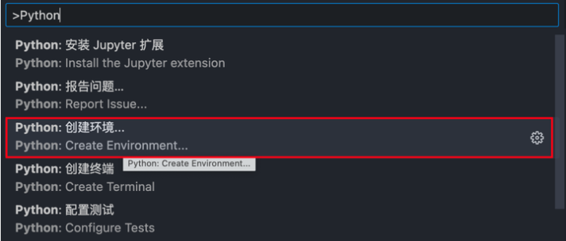

下面以 venv 为例，展示创建虚拟环境的过程，Venv 与 Conda 的过程基本一样：

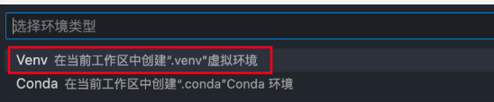

然后选择需要的解释器版本如下：

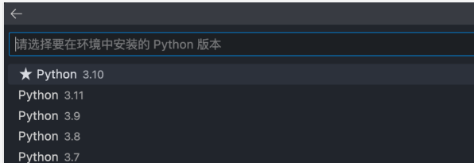


## 安装套件

回到 VS Code 命令面板。开启一个新的 Python Terminal。

```
pip install [package]
```

## 備份已安裝套件版本

```
pip freeze > requirements.txt
```

使用 pip 安装新的 library 前把现有的 libraries 列表汇出到 requirements.txt，那么如果新的 library 不兼容于现专案，可以使用 requirements.txt 还原专案


## 还原已安裝套件版本

```
pip install -r requirements.txt
```

requirements.txt 就是一個橋樑。透過先前匯出的 requirements.txt，可以用於還原所有在該虛擬環境已安裝的 Python library。

## 更新已安裝套件

```
pip install --upgrade [package]
```

留意當更新一個 Library 的時候，其實會同時把它的 dependencies 也更新至 Library 最新版的要求。


## pylint

打开 **命令面板** <font color="#FF1000">Ctrl + Shift + p</font>，启用 pylint:

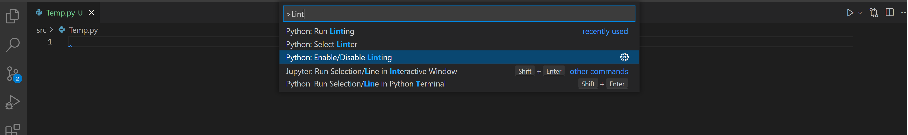

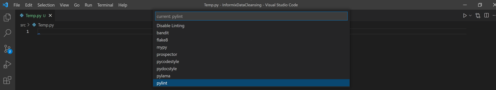

以上步骤相等于直接更改 setting.json 如下:

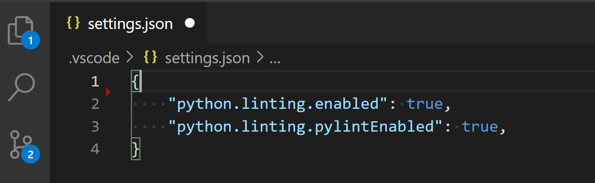

## Black formatter

打开 **命令面板** <font color="#FF1000">Ctrl + Shift + p</font>，直接修改 **setting.json**


 
```
"[python]": {
    "editor.defaultFormatter": "ms-python.black-formatter"
  }
```

## Schema 

- Schema 描述文档的结构。XML Schema 语言也称为 XML Schema Definition（XSD）

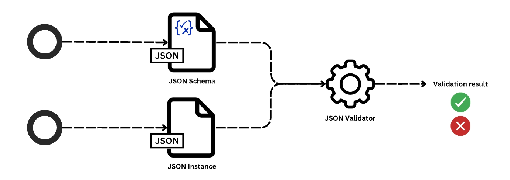

主要目的是定义资料结构。方便观察资料是否正确。例子如下。

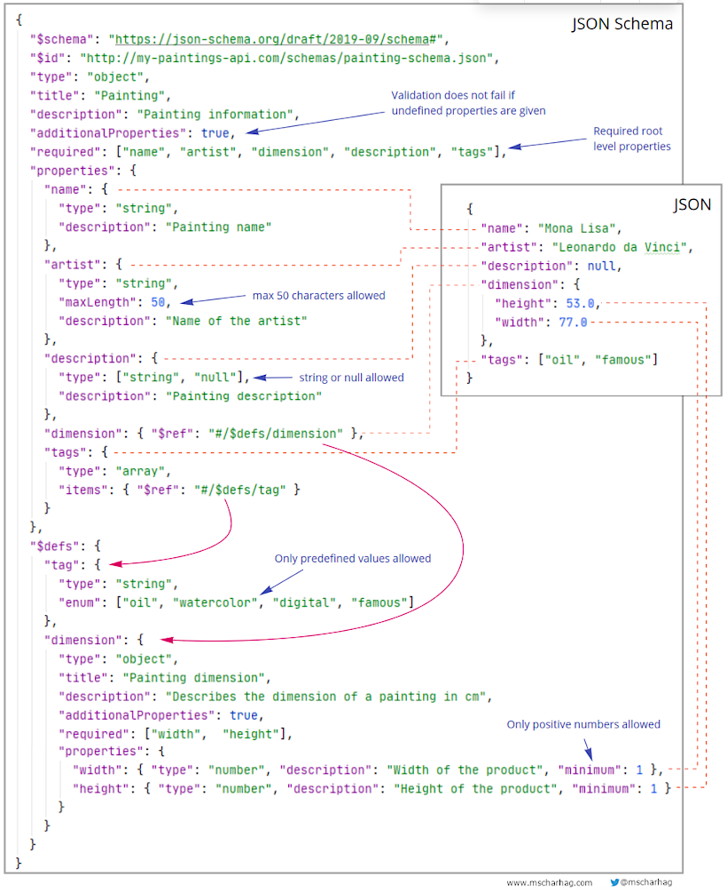


## Python

### Python中 ()，[]，{}

小括号（）：
 - 代表 **tuple** 元祖数据类型，元祖是一种不可变序列。

中括号 []：
 - 代表 **list** 列表数据类型，列表是一种可变序列。
    - 关于 [:j] 或者 [:i]：这是切片操作，在下标 i 或者 j 之前的元素都保留。
    - 关于 [:,j] 或者 [:,i] ：这也是切片操作，不同的是：保留第一个维度所有元素，第二维度元素保留到j；只适用 **numpy** 的科学数据结构。
    - 关于 [::]，[start: end : step ] 操作（高阶用法，可看可不看，一般出现在矩阵数据替换运算）。在 list 中可以用在元素层面，在 **numpy** 的数学数据中可以用在任何层面。

花括号 {}：
 - 代表 **dict** 字典数据类型，字典是Python中唯一内建的映射类型。字典中的值没有特殊的顺序，但都是存储在一个特定的键（key）下。键可以是数字、字符串甚至是元祖。

## Python 组件

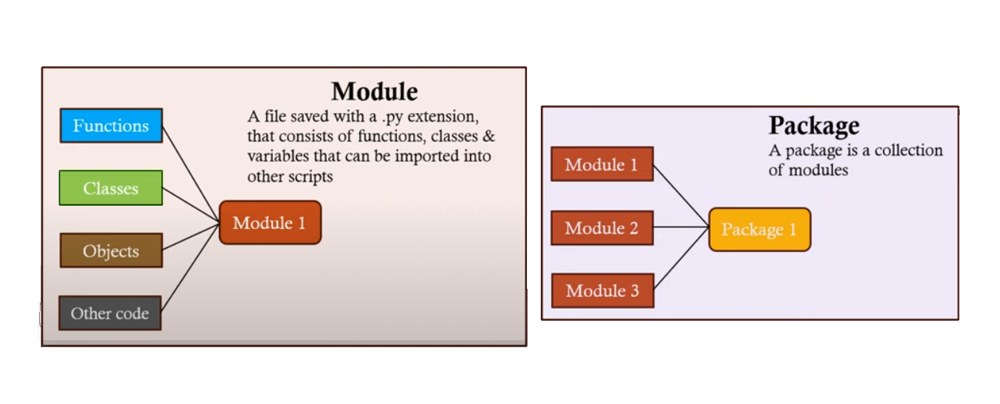

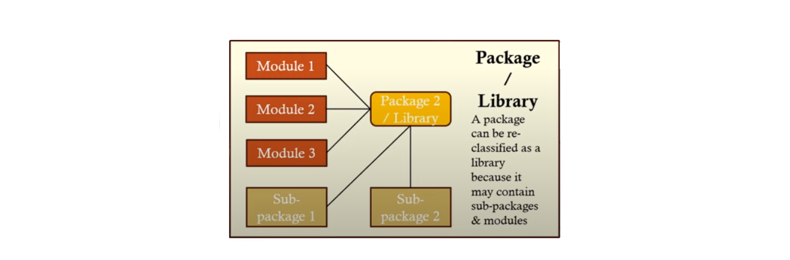

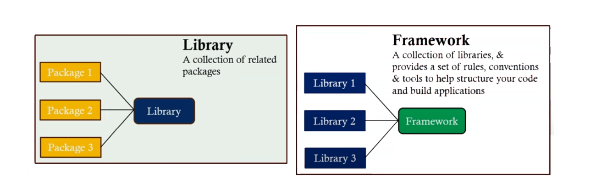

## Python 循环

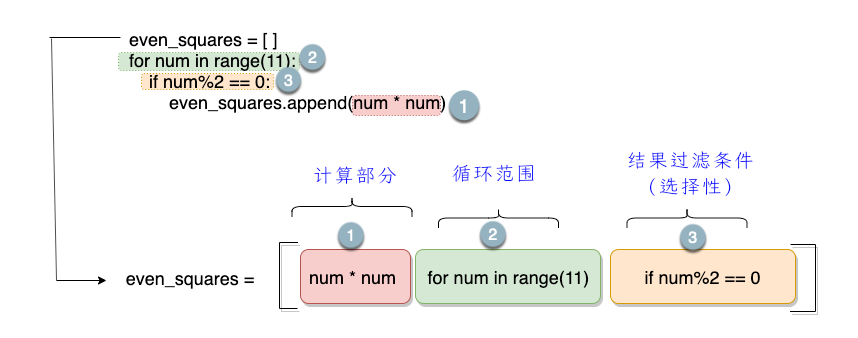

```
# List Comprehension
l = [i for i in range(10)]

# List Comprehension with If Condtion
l = [i for i in range(10) if i %2 = 0]

# List Comprehension with If/Else Condition
l = [i if i%2 = 0 else i*i for i in range(10)]

# Nested Comprehension
l = [(i, j) for i in range(10) for j in range(10)]

# Dictionary Comprehension
d = {key:value for (key,value) in dictonary.items()}
```

- for


-for 及 if

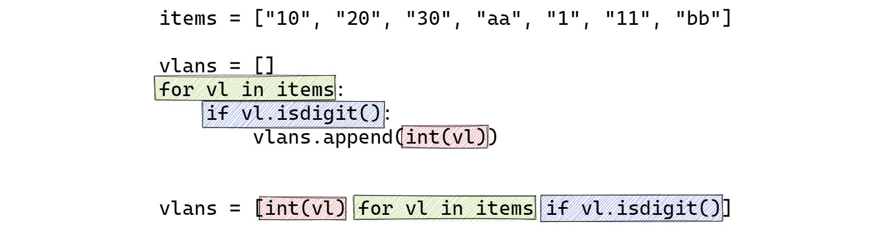

- for 及 for

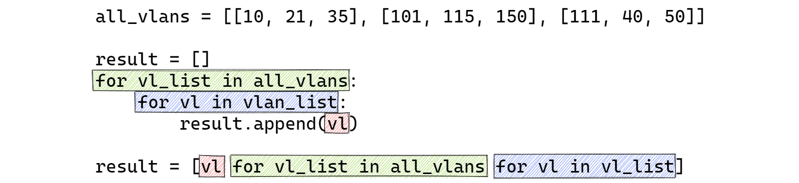

- break

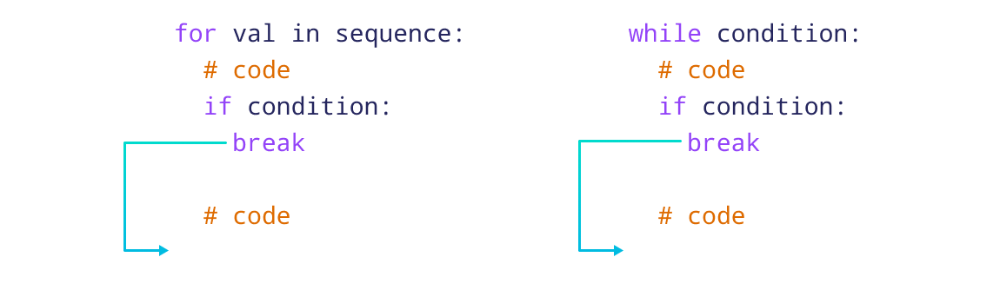

## Python Array

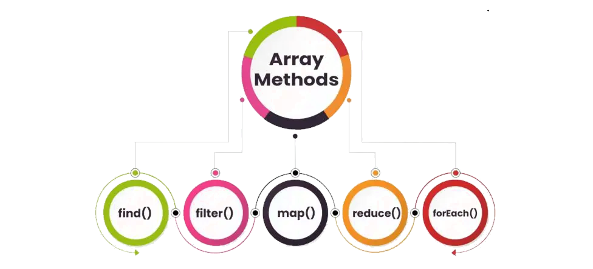

- find():

```py
let numbers = [4, 9, 16, 25];
let firstSquareGreaterThan10 = numbers.find((number) => number > 10);
console.log(firstSquareGreaterThan10); 

# 输出：16
```

 - filter():

```py
let ages = [18, 22, 15, 30];
let adults = ages.filter((age) => age >= 18);
console.log(adults); 

# 输出：[18, 22, 30]
```

 - map():

```py
let numbers = [1, 2, 3, 4];
let squares = numbers.map((number) => number * number);
console.log(squares); 

# 输出：[1, 4, 9, 16]
```

 - reduce():

```py
let numbers = [1, 2, 3, 4];
let sum = numbers.reduce((accumulator, currentValue) => accumulator + currentValue, 0);
console.log(sum); 

# 输出：10
```

- forEach():

```py
let fruits = ['apple', 'banana', 'orange'];
fruits.forEach((fruit) => {
    console.log(fruit);
});

# 输出：apple, banana, orange
```

注意事项

 - 使用 map() 转换数组
 - 链式数组方法让代码更简洁
 - 对于单元素搜索，优先使用 find 而不是 filter
 - 使用 reduce() 聚合数据
 

常见错误

 - 修改 map() 中的原始数组
 - 使用 forEach() 返回新数组
 - 滥用 find() 查找多个元素

## Python zip

zip() 函数用于将可迭代的对象作为参数，将对象中对应的元素打包成一个个元组，然后返回由这些元组组成的列表。


## Python 文字处理

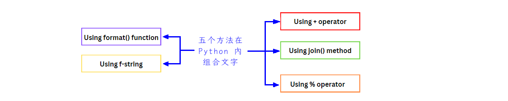

 - \+

```
str1 = 'Python'
str2 = ' Programming'
str3 = ' Language'
concatenated_string = str1 + str2 + str3
print('Joined string:',concatenated_string)

# 输出：Joined string: Python Programming Language
```


 - join

```
first_name = 'Ivaan'
middle_name = 'Vidya'
last_name = 'Sagar'
full_name = ' '.join((first_name, middle_name, last_name))
print("Full name:",full_name)

# 输出：Full name: Ivaan Vidya Sagar
```

 - %

```
first_name = 'John'
last_name = 'Smith'
full_name = "%s %s" % (first_name, last_name)
print('Full name:',full_name)

# 输出：Full name: John Smith
```

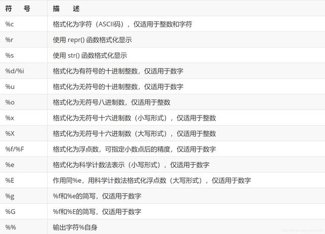


 - format

```
first_name = 'John'
last_name = 'Smith'
full_name = "{} {}".format(first_name, last_name)
print('Full name:',full_name)

# 输出：Full name: John Smith
```

 - f

```
fName = 'John'
sName = 'Smith'
fName = f'{fName} {sName}'
print('Full name:', fName)

# 输出：Full name: John Smith
```