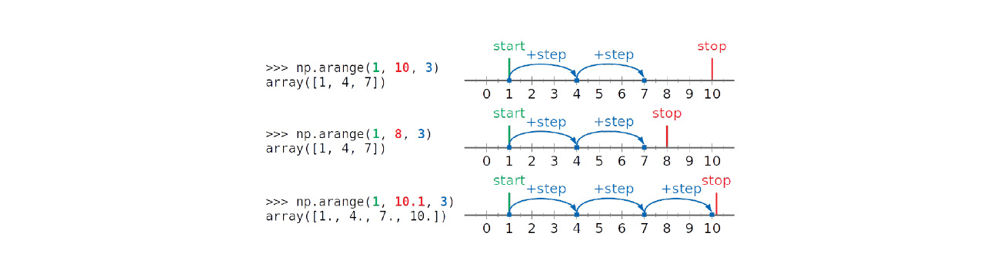

<style>
  table {
    width: 100%
    }
  td {
    vertical-align: center;
    text-align: center;
  }
  table.inputT{
    margin: 10px;
    width: auto;
    margin-left: auto;
    margin-right: auto;
    border: none;
  }
  input{
    text-align: center;
    padding: 0px 10px;
  }
  iframe{
    width: 100%;
    display: block;
    border-style:none;
  }
</style>

# Python NumPy 介绍


## arange



start：序列的起始值（含）。如果省略，则默认为 0。

stop：序列的结束值（不含）。

step：序列中值之间的间距（默认为 1）。它可以是正数或负数。

dtype：数组元素的可选数据类型（默认为浮点数）。

数组从10开始步长为2，所以创建出来数组元素就是10，12，14

```py
import numpy as np
data = np.arange(10,16,2) 
# 10-16 的数据，步长为 2
print(data)
# 输出：[10，12，14]
```

## linspace


线性等分向量（linear space），在一个指定区间内按照指定的步长，将区间均等分，生成的是一个线段类型的数组。生成的线性间隔数据中，是有把区间的两端加进去的

```py
import numpy as np
# 创建线段型数据
data= np.linspace(1,10,20) 
# 开始端 1，结束端 10，且分割成20 个数据，生成线段
print(data)
```            

## 数组 (Array) 


### 一维数组

```py
import numpy as np
data=np.array([1,2,3,4])
print(data)
```

### 二维数组（矩阵）array

```py
import numpy as np
data=np.array([[1,2,3,4],[4,5,6,7]])
print(data)
```

|函数|说明|
|:---:|:---:|
|array|将输入数据（列表、元组、数组或其它序列类型）转换为ndarray。要么推断出dtype，要么特别指定dtype。默认直接复制输入数据|
|asarray|将输入转换为ndarray，如果输入本身就是一个ndarray就不进行复制|
|arange|类似于内置的range，但返回的是一个 ndarray而不是列表|
|ones，ones_like|根据指定的形状和dtype创建一个全1数组。one_like以另一个数组为参数，并根据其形状和dtype创建一个全1数组|
|zeros，zeros like|类似于ones和ones_like，只不过产生的是全0数组而已|
|empty，empty_like|创建新数组，只分配内存空间但不填充任何值|
|full，full like|用fil value中的所有值，根据指定的形状和dtype创建一个数组。full_like 使用另一个数组，用相同的形状和dtype创建|
|eye，identity|创建一个正方的N×N单位矩阵（对角线为1，其余为0）|


### 切片操作的省略方式


|切片参数|含义描述|
|:---:|:---:|
|start : end : step|从 start 开始读取，到 end（**不包含 end**）结束，步长为 step|
|start : end|从 start 开始读取，到 end（**不包含 end**）结束，步长为 1|
|start:|从start开始读取后续所有元素，步长为 1|
|start :: step|从 start 开始读取后续所有元素，步长为 step|
|: end : step|从 0 开始读取，到 end（**不包含 end**）结束，步长为 step|
|: end|从 0 开始读取，到 end（**不包含 end**）结束，步长为 1|
|:: step|从 0 开始读取后续所有元素，步长为 step|
|::|读取所有元素|
|:|读取所有元素|

## 矩阵 (Matrix)  

|函数|说明|
|:---:|:---:|
|diag|以一维数组的形式返回方阵的对角线（或非对角线）元素，或将一维数组转换为方阵（非对角线元素为0）|
|dot|矩阵乘法|
|trace|计算对角线元素的和|
|det|计算矩阵行列式|
|eig|计算方阵的本征值和本征向量|
|inv|计算方阵的逆|
|pinv|计算矩阵的 Moore-Penrose 伪逆|
|gr|计算QR分解|
|svd|计算奇异值分解（SVD）|
|solve|解线性方程组Ax＝b，其中A为一个方阵|
|Istsq|计算Ax＝b的最小二乘解|

### 2D ndarray vs Matrix

线性代数的基本操作对象是矩阵，而矩阵的表示方法主要有两种：

#### numpy.ndarray

 - array生成数组，用np.dot()表示矩阵乘积，（*）号或 <font color="#FF1000">np.multiply() = *</font> 表示点乘

```py
import numpy as np

arr_a = np.array([[1, 1], [1, 1]])
arr_b = np.array([[2, 2], [2, 2]])
print(np.dot(arr_a, arr_b))

# 输出：
[[4 4]
 [4 4]]

print(np.multiply(arr_a, arr_b))

# 输出： 
[[2 2]
 [2 2]]

print(arr_a*arr_b)

# 输出：
[[2 2]
 [2 2]]
```

#### numpy.matrix

 - np.mat生成数组，（*）和 <font color="#FF1000">np.dot() = *</font> 相同，点乘只能用np.multiply()

```py
import numpy as np

a = np.mat([[1, 1], [1, 1]])
b = np.mat([[2, 2], [2, 2]])
print(np.dot(a, b))

# 输出：
[[4 4]
 [4 4]]

print(a*b)

# 输出：
[[4 4]
 [4 4]]

print(np.multiply(a, b))

# 输出：
[[2 2]
 [2 2]]
```
### 求解线性方程组

例如，下列方程组

$$
x + y + z = 6 \\
2y + 5z = -4 \\
2x + 5y - z= 27
$$

的解为：

```py
import numpy as np 
a = np.array([[1,1,1],[0,2,5],[2,5,-1]]) 
print 'Array a:'
print a 

ainv = np.linalg.inv(a) 
print 'Inverse of a:' 
print ainv  

print ' 矩阵 B is:' 
b = np.array([[6],[-4],[27]]) 
print b 

print '解线性方程 Ax = B:' 
x = np.linalg.solve(a,b) 
print x 

# 输出：
Array a:
[[1 1  1]
 [0 2  5]
 [2 5 -1]]

反矩阵 a:
[[ 1.28571429 -0.28571429 -0.14285714]
 [-0.47619048  0.14285714  0.23809524]
 [ 0.19047619  0.14285714 -0.0952381]]

矩阵 B：
[[ 6]
 [-4]
 [27]]

解线性方程 Ax = B:
[[ 5.]
 [ 3.]
 [-2.]]
# 线性方程的解 x=5, y=3, z=-2
```