<style>
  table {
    width: 100%
    }
  td {
    vertical-align: center;
    text-align: center;
  }
  table.inputT{
    margin: 10px;
    width: auto;
    margin-left: auto;
    margin-right: auto;
    border: none;
  }
  input{
    text-align: center;
    padding: 0px 10px;
  }
  iframe{
    width: 100%;
    display: block;
    border-style:none;
  }
</style>

# Python SciPy 介绍

|模块名|应用领域|
|:---:|:---:|
|scipy.cluster|向量计算/Kmeans|
|scipy.constants|物理和数学常量|
|scipy.fftpack|傅立叶变换|
|scipy.integrate|积分程序|
|scipy.interpolate|插值|
|scipy.io|数据输入输出|
|scipy.linalg|线性代数程序|
|scipy.ndimagen|维图像包|
|scipy.odr|正交距离回归|
|scipy.optimize|优化|
|scipy.signal|信号处理|
|scipy.sparse|稀疏矩阵|
|scipy.spatial|空间数据结构和算法|
|scipy.special|一些特殊的数学函数|
|scipy.stats|统计|

### 傅立叶变换

快速傅立叶变换 (fast Fourier transform, FFT) 是一种用来计算离散傅立叶变换 (discrete Fourier transform, DFT) 及其逆变换的计算方法，目前常用的是库利－图基演算法 (Cooley-Tukey FFT algorithm ）算法。快速傅立叶变换通常被用在分析讯号的频率及强度，以下是使用 SciPy 提供的工具计算 FFT 的方法。

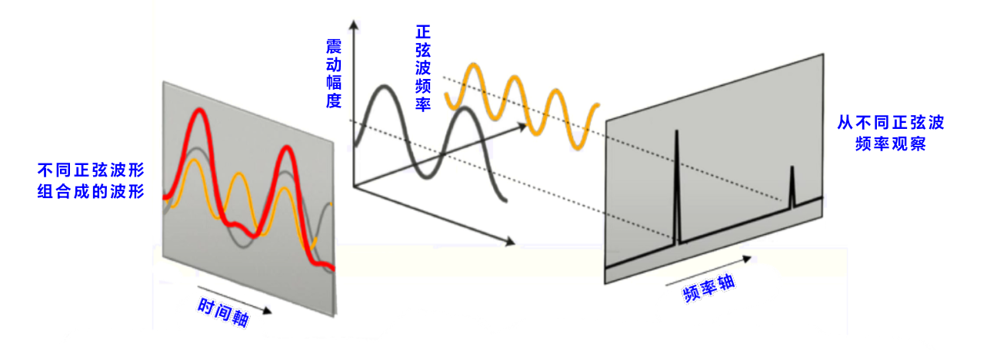

$$
y = A_1 \sin(2 \pi f_1 t) + A_2 \sin(2 \pi f_2 t) + A_3 \sin(2 \pi f_3 t) + A_4 \sin(2 \pi f_4 t) + A_5 \sin(2 \pi f_5 t)
$$

```py
import matplotlib.pyplot as plt
import numpy as np
from scipy.fft import fft, fftfreq, ifft

N = 4096
f1, f2, f3, f4, f5 = 10, 30, 50, 70, 90
A1, A2, A3, A4, A5 = 0.5, 0.4, 0.3, 0.2, 0.1
dt = 2/f1/N
t = np.linspace(0, 2/f1, N, endpoint=False)
y = A1*np.sin(2*np.pi*f1*t) + A2*np.sin(2*np.pi*f2*t) + A3*np.sin(2*np.pi*f3*t) + \
    A4*np.sin(2*np.pi*f4*t) + A5*np.sin(2*np.pi*f5*t)
# 从提供的公式创建图像
plt.figure(figsize=(15,4), dpi=72)
plt.plot(t, y, linestyle='-', color='blue')
plt.grid()
plt.xlabel('t (s)', fontsize=14)
plt.ylabel('amplitude', fontsize=14)
plt.show()
```


#### fft

使用 scipy.fft.fft 由 y 计算对应的强度并储存于 yf，使用 scipy.fft.fftfreq 由 N 及 dt 计算对应的频率并储存于 xf，绘制强度 intensity - 频率 f 关系图。从图中可以看出峰值对应的频率分别为10、30、50、70、90 Hz，峰值对应的强度分别为0.5、0.4、0.3、0.2、0.1，和产生的资料相符。

```py
# 从 FFT 找到频率
plt.figure(figsize=(15,4), dpi=72)
yf = fft(y)
xf = fftfreq(N, dt)
# 提供的值创建图像
plt.plot(xf[:N//128], 2/N*np.abs(yf[:N//128]), linestyle='-', color='blue')
plt.grid()
plt.xlabel('frequency (Hz)', fontsize=14)
plt.ylabel('intensity', fontsize=14)
```
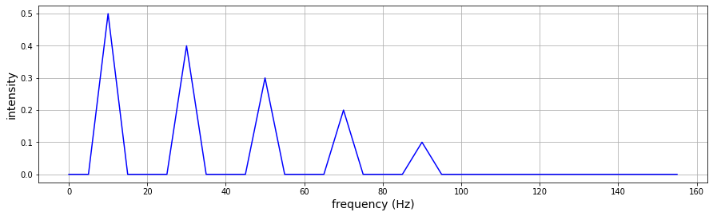

#### ifft

使用 scipy.fft.ifft 由 yf 进行逆变换并储存于 yif，绘制振幅 amplitude - 时间 t 关系图，可以看出这张图与第一张图相同。

```py
# 从 iFFT 找到曲线
yif = ifft(yf)
# 提供的值创建图像
plt.figure(figsize=(15, 4), dpi=72)
plt.plot(t, yif.real, linestyle="-", color="blue")
plt.grid()
plt.xlabel("t (s)", fontsize=14)
plt.ylabel("amplitude", fontsize=14)
plt.show()
```

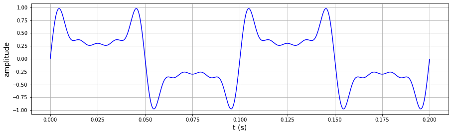

### 积分

[网上资源](https://www.alphacodingskills.com/scipy/scipy-integrate.php)

#### 积分给定公式

|功能名称|描述|
|:---:|:---:|
|quad|计算确定的积分|
|dblquad|计算确定的双积分|
|nquad|计算确定的多个变量上积分|
|fixed_quad|使用固定高斯正交正交计算确定的积分|
|quadrature|使用固定耐受性高斯正交正交计算确定的积分|

$$
  I = \int_{0}^{2} x^3 dx 
$$

```py
from scipy.integrate import quad

f = lambda x: x**3 # 创建一个（intemband）
I = quad(f, 0, 2) # 积分
print(I)

# 输出 : 
# (4.0, 4.440892098500626e-14)
```

$$
I(a,b)) = \int_{0}^{2} (ax^2 + bx + c) dx 
$$

```py
from scipy.integrate import quad

def func(x, a, b, c):
  return a*x**2 + b*x + c
# x*x + 2x + 3
I1 = quad(func, 0, 2, args=(1, 2, 3))
# 2*x*x + 5x + 7 
I2 = quad(func, 0, 2, args=(2, 5, 7))
print(I1[0])
print(I2[0])

# 输出 : 
# 12.666666666666666
# 29.333333333333336
```

#### 积分给定样本值

|功能名称|描述|
|:---:|:---:|
|trapezoid|梯形规则|
|cumulative_trapezoid|梯形规则累积计算积分|
|simpson|辛普森的规则|
|cumulative_simpson|辛普森规则累积计算积分|

$$
I(f) = \int_{0}^{2} \sqrt xdx
$$

```py
from scipy import integrate
import numpy as np

def f(x):
    return np.sqrt(x)
x = np.linspace(0, 2, 10)
y = f(x)
v = integrate.trapezoid(y, x)
z = integrate.cumulative_trapezoid(y, x)
print(v)
print(z)

# 输出 : 
# 1.8652953655957172
# [0.05237828 0.17883063 0.34362655 0.53910495 0.76098291 1.00640436 1.27328433 1.56001238 1.86529537]
``` 


### 插值

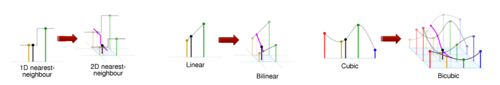

|候选值|作用|
|:---:|:---:|
|＇zero＇＇nearest＇|阶梯插值，相当于0阶B样条曲线|
|＇slinear＇＇linear＇|线性插值，用一条直线连接所有的取样点，相当于一阶B样条曲线
|＇quadratic＇ ＇cubic＇|二阶和三阶B样条曲线，更高阶的曲线可以直接使用整数值描定甲小伙|

例子

```py
import numpy as np
from scipy.interpolate import interp1d
import matplotlib.pyplot as plt

x = np.linspace(0, 10, num=11, endpoint=True)
y = np.cos(-(x**2) / 9.0)
f = interp1d(x, y)
f1 = interp1d(x, y, kind="quadratic")
f2 = interp1d(x, y, kind="cubic")

xnew = np.linspace(0, 10, num=41, endpoint=True)

plt.figure().set_figwidth(3)
plt.figure().set_figheight(2)
plt.plot(x, y, "o", xnew, f(xnew), "-", xnew, f1(xnew), "--", xnew, f2(xnew), "-.")
plt.legend(
    ["data", "linear", "quadratic", "cubic"],
    bbox_to_anchor=(1, 1),
    fancybox=True,
    shadow=True,
)
plt.show()
```

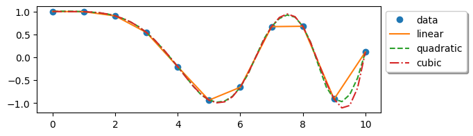

### 正交距离回归

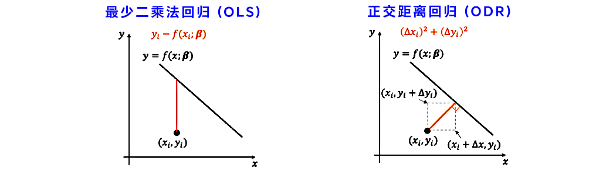

例子

$$
  y = \beta_0 + \beta_1 x + \beta_2 x^3
$$

```py
import numpy as np
from scipy.odr import ODR, Model, Data, RealData
import matplotlib.pyplot as plt

def func(beta, x):
    y = beta[0] + beta[1] * x + beta[2] * x**3
    return y

npts = 100
np.random.seed(160810)
x = np.linspace(-3, 2, npts)
y = func([-2.3, 7.0, -4.0], x)
x += np.random.normal(scale=0.3, size=100)
y += np.random.normal(scale=0.3, size=100)
data = RealData(x, y, 0.3, 0.1)
model = Model(func)
odr = ODR(data, model, [1, 0, 0])
# 最小平方法 (Ordinary least squares)
odr.set_job(fit_type=0)
lsq_output = odr.run()
# 正交距离回归 (Orthogonal distance regression)
odr.set_job(fit_type=2)
odr_output = odr.run()

xn = np.linspace(-3, 2, 50)

plt.figure().set_figwidth(4)
plt.figure().set_figheight(3)
plt.plot(x, y, marker="o", label="data", linestyle="", markersize=2)
plt.plot(xn, func(lsq_output.beta, xn), ls="--", label="Ordinary least squares")
plt.plot(xn, func(odr_output.beta, xn), label="Orthogonal distance regression")
plt.legend()
```

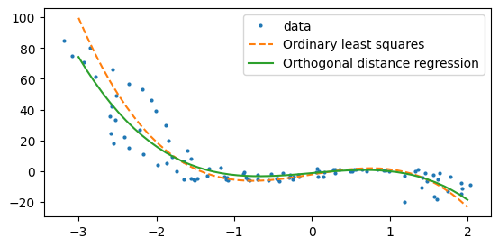

### 信号处理

- 低通滤波器：低通滤波器允许低于一定频率阈值的信号通过在此阈值以上的信号时通过。
 - 高通滤波器：相反，高通滤波器允许高于一定频率阈值的信号通过，同时减轻低于此阈值的信号。
 - 带通滤波器：带通滤波器代表了低通和高通特性的组合，可以在指定的频带内通过信号，同时衰减该频段以外的信号。

|参数名称|选择|备注|
|:---:|:---:|:---:|
|btype|bandpass, lowpass, highpass, bandstop| 默认值是 bandpass|
|ftype|butter, cheby1, cheby2, ellip, bessel||

#### IIR 低通滤波器

```py
import numpy as np
import scipy.signal

np.random.seed(42)                  # 可重复随机值
fs = 30                             # 采样率，Hz
ts = np.arange(0, 5, 1.0 / fs)      # 时间矢量-5秒
ys = np.sin(2 * np.pi * 1.0 * ts)   # 信号 1.0 Hz，没有噪音
yerr = 0.5 * np.random.normal(size=len(ts))   # 高斯噪音
yraw = ys + yerr

# IIR 滤波器
b, a = scipy.signal.iirfilter(4, Wn=2.5, fs=fs, btype="lowpass", ftype="butter")
# 低通滤波器
y_lfilter = scipy.signal.lfilter(b, a, yraw)
# 零相位差滤波器
y_filtfilt = scipy.signal.filtfilt(b, a, yraw)

from matplotlib import pyplot as plt
plt.figure(figsize=[8.4, 2.4])
plt.plot(ts, yraw, label="Raw signal")
plt.plot(ts, y_lfilter, alpha=0.8, lw=3, label="lfilter")
plt.plot(ts, y_filtfilt, alpha=0.8, lw=3, label="filtfilt")
plt.xlabel("Time/s")
plt.ylabel("Amplitude")
plt.legend(loc="lower center", bbox_to_anchor=[0.5, 1], ncol=3, fontsize="smaller")
```

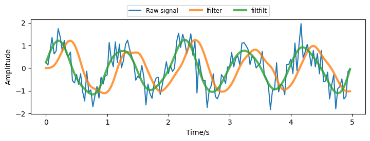

#### 带通滤波器

```py
from scipy.signal import butter, lfilter

def butter_bandpass(lowcut, highcut, fs, order=5):
    return butter(order, [lowcut, highcut], fs=fs, btype="bandpass")

def butter_bandpass_filter(data, lowcut, highcut, fs, order=5):
    b, a = butter_bandpass(lowcut, highcut, fs, order=order)
    y = lfilter(b, a, data)
    return y

if __name__ == "__main__":
    import numpy as np
    import matplotlib.pyplot as plt
    from scipy.signal import freqz

    # 采样率和截止频率（Hz）
    fs = 5000.0
    lowcut = 500.0
    highcut = 1250.0

    # 绘制一些不同频率响应
    plt.figure().set_figwidth(10)
    plt.figure().set_figheight(1)
    plt.figure(1)
    plt.clf()
    for order in [3, 6, 9]:
        b, a = butter_bandpass(lowcut, highcut, fs, order=order)
        w, h = freqz(b, a, fs=fs, worN=2000)
        plt.plot(w, abs(h), label="order = %d" % order)

    plt.plot([0, 0.5 * fs], [np.sqrt(0.5), np.sqrt(0.5)], "--", label="sqrt(0.5)")
    plt.xlabel("Frequency (Hz)")
    plt.ylabel("Gain")
    plt.grid(True)
    plt.legend(loc="best")
```
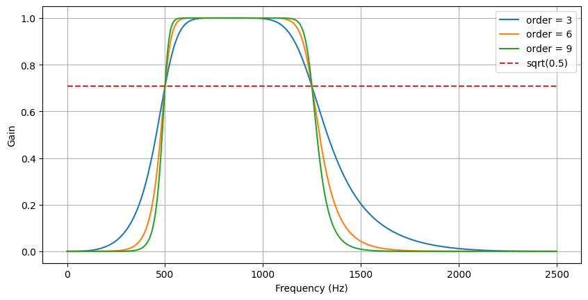

#### IIR 高通滤波器

```py
import numpy as np
import scipy.signal

np.random.seed(42)  # 可重复随机值
fs = 10  # 采样率，Hz
ts = np.arange(0, 3, 1.0 / fs)  # 时间矢量-5秒
ys = np.sin(2 * np.pi * 1.0 * ts)  # 信号 1.0 Hz，没有噪音
yerr = 0.5 * np.random.normal(size=len(ts))  # 高斯噪音
yraw = ys + yerr

# IIR 滤波器
b, a = scipy.signal.iirfilter(4, Wn=2.5, fs=fs, btype="highpass", ftype="butter")
# 高通滤波器
y_lfilter = scipy.signal.lfilter(b, a, yraw)
# 零相位差滤波器
y_filtfilt = scipy.signal.filtfilt(b, a, yraw)

from matplotlib import pyplot as plt

plt.figure(figsize=[8.4, 2.4])
plt.plot(ts, yraw, label="Raw signal")
plt.plot(ts, y_lfilter, alpha=0.8, lw=1, label="lfilter")
plt.plot(ts, y_filtfilt, alpha=0.8, lw=1, label="filtfilt")
plt.xlabel("Time/s")
plt.ylabel("Amplitude")
plt.legend(loc="lower center", bbox_to_anchor=[0.5, 1], ncol=3, fontsize="smaller")
```

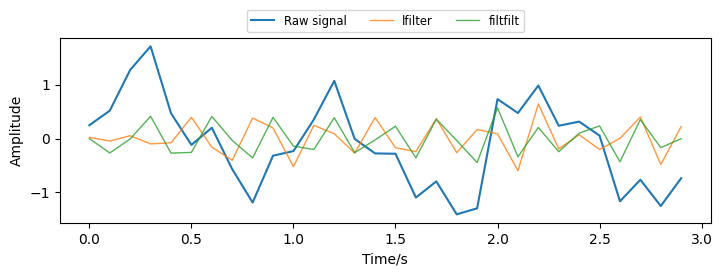

#### 帶阻濾波器

```py
from scipy.signal import butter, lfilter

def butter_bandpass(lowcut, highcut, fs, order=5):
    return butter(order, [lowcut, highcut], fs=fs, btype="bandstop")

def butter_bandpass_filter(data, lowcut, highcut, fs, order=5):
    b, a = butter_bandpass(lowcut, highcut, fs, order=order)
    y = lfilter(b, a, data)
    return y

if __name__ == "__main__":
    import numpy as np
    import matplotlib.pyplot as plt
    from scipy.signal import freqz

    # 采样率和截止频率（Hz）
    fs = 5000.0
    lowcut = 500.0
    highcut = 1250.0

    # 绘制一些不同频率响应
    plt.figure().set_figwidth(10)
    plt.figure().set_figheight(1)
    plt.figure(1)
    plt.clf()
    for order in [3, 6, 9]:
        b, a = butter_bandpass(lowcut, highcut, fs, order=order)
        w, h = freqz(b, a, fs=fs, worN=2000)
        plt.plot(w, abs(h), label="order = %d" % order)

    plt.plot([0, 0.5 * fs], [np.sqrt(0.5), np.sqrt(0.5)], "--", label="sqrt(0.5)")
    plt.xlabel("Frequency (Hz)")
    plt.ylabel("Gain")
    plt.grid(True)
    plt.legend(loc="best")
```

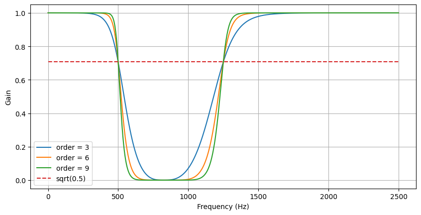

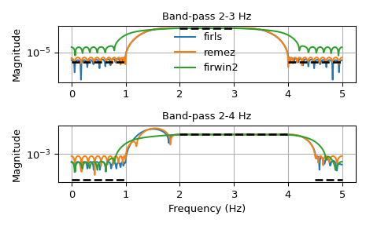


[Matplotlib 网上资源](https://medium.com/@hi-sushanta/master-matplotlib-a-step-by-step-guide-for-beginners-to-experts-e76195edff1f)