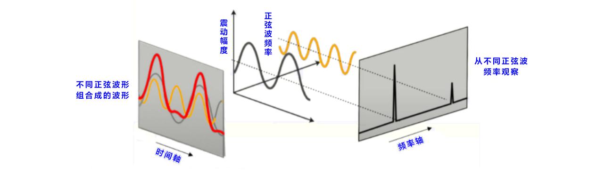
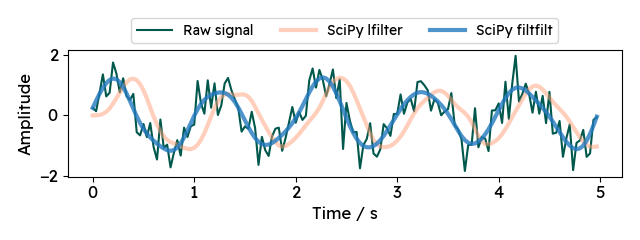

<style>
  table {
    width: 100%
    }
  td {
    vertical-align: center;
    text-align: center;
  }
  table.inputT{
    margin: 10px;
    width: auto;
    margin-left: auto;
    margin-right: auto;
    border: none;
  }
  input{
    text-align: center;
    padding: 0px 10px;
  }
  iframe{
    width: 100%;
    display: block;
    border-style:none;
  }
</style>

# Python SciPy 介绍

|模块名|应用领域|
|:---:|:---:|
|scipy.cluster|向量计算/Kmeans|
|scipy.constants|物理和数学常量|
|scipy.fftpack|傅立叶变换|
|scipy.integrate|积分程序|
|scipy.interpolate|插值|
|scipy.io|数据输入输出|
|scipy.linalg|线性代数程序|
|scipy.ndimagen|维图像包|
|scipy.odr|正交距离回归|
|scipy.optimize|优化|
|scipy.signal|信号处理|
|scipy.sparse|稀疏矩阵|
|scipy.spatial|空间数据结构和算法|
|scipy.special|一些特殊的数学函数|
|scipy.stats|统计|

### 傅立叶变换

快速傅立叶变换 (fast Fourier transform, FFT) 是一种用来计算离散傅立叶变换 (discrete Fourier transform, DFT) 及其逆变换的计算方法，目前常用的是库利－图基演算法 (Cooley-Tukey FFT algorithm ）算法。快速傅立叶变换通常被用在分析讯号的频率及强度，以下是使用 SciPy 提供的工具计算 FFT 的方法。



$$
y = A_1 \sin(2 \pi f_1 t) + A_2 \sin(2 \pi f_2 t) + A_3 \sin(2 \pi f_3 t) + A_4 \sin(2 \pi f_4 t) + A_5 \sin(2 \pi f_5 t)
$$

```py
import matplotlib.pyplot as plt
import numpy as np
from scipy.fft import fft, fftfreq, ifft

N = 4096
f1, f2, f3, f4, f5 = 10, 30, 50, 70, 90
A1, A2, A3, A4, A5 = 0.5, 0.4, 0.3, 0.2, 0.1
dt = 2/f1/N
t = np.linspace(0, 2/f1, N, endpoint=False)
y = A1*np.sin(2*np.pi*f1*t) + A2*np.sin(2*np.pi*f2*t) + A3*np.sin(2*np.pi*f3*t) + \
    A4*np.sin(2*np.pi*f4*t) + A5*np.sin(2*np.pi*f5*t)
# 从提供的公式创建图像
plt.figure(figsize=(15,4), dpi=72)
plt.plot(t, y, linestyle='-', color='blue')
plt.grid()
plt.xlabel('t (s)', fontsize=14)
plt.ylabel('amplitude', fontsize=14)
plt.show()
```


#### fft

使用 scipy.fft.fft 由 y 计算对应的强度并储存于 yf，使用 scipy.fft.fftfreq 由 N 及 dt 计算对应的频率并储存于 xf，绘制强度 intensity - 频率 f 关系图。从图中可以看出峰值对应的频率分别为10、30、50、70、90 Hz，峰值对应的强度分别为0.5、0.4、0.3、0.2、0.1，和产生的资料相符。

```py
# 从 FFT 找到频率
plt.figure(figsize=(15,4), dpi=72)
yf = fft(y)
xf = fftfreq(N, dt)
# 提供的值创建图像
plt.plot(xf[:N//128], 2/N*np.abs(yf[:N//128]), linestyle='-', color='blue')
plt.grid()
plt.xlabel('frequency (Hz)', fontsize=14)
plt.ylabel('intensity', fontsize=14)
```


#### ifft

使用 scipy.fft.ifft 由 yf 进行逆变换并储存于 yif，绘制振幅 amplitude - 时间 t 关系图，可以看出这张图与第一张图相同。

```py
# 从 iFFT 找到曲线
yif = ifft(yf)
# 提供的值创建图像
plt.figure(figsize=(15, 4), dpi=72)
plt.plot(t, yif.real, linestyle="-", color="blue")
plt.grid()
plt.xlabel("t (s)", fontsize=14)
plt.ylabel("amplitude", fontsize=14)
plt.show()
```


### 积分


### 插值


### 信号处理




