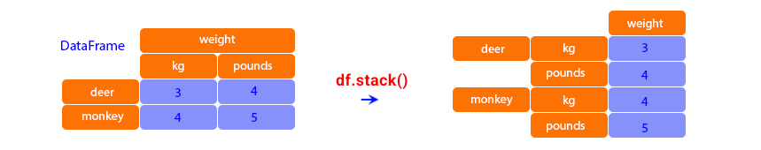
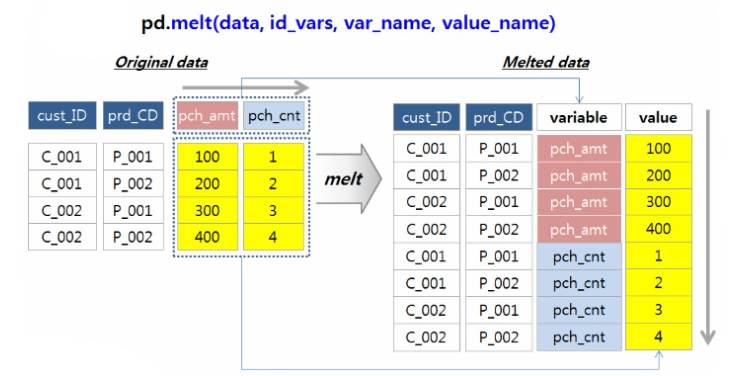

<style>
  table {
    width: 100%
    }
  td {
    vertical-align: center;
    text-align: center;
  }
  table.inputT{
    margin: 10px;
    width: auto;
    margin-left: auto;
    margin-right: auto;
    border: none;
  }
  input{
    text-align: center;
    padding: 0px 10px;
  }
  iframe{
    width: 100%;
    display: block;
    border-style:none;
  }
</style>

# Python Matplotlib 介绍

```py
import numpy as np
import matplotlib.pyplot as plt
from matplotlib.font_manager import FontProperties

font = FontProperties(fname="./SimHei.ttf", size=18)
font1 = FontProperties(fname="./SimHei.ttf", size=12)

def setText(plt, title, xlabel, ylabel, fontsize=18):
    plt.title(title, fontproperties=font, color="blue")
    plt.xlabel(xlabel, fontproperties=font1)
    plt.ylabel(ylabel, fontproperties=font1)

def plot(plt, x, y, legend, lwidth=1, lstyle="-"):
    plt.plot(x, y, linewidth=lwidth, ls=lstyle, label=legend)

def setPlotView(plt, width, height):
    plt.figure().set_figwidth(width)
    plt.figure().set_figheight(height)

x = [1, 2, 3, 4, 5, 6]
y = [7, 8, 9, 10, 11, 12]
y1 = [3, 7, 2, 1, 8, 3]
y2 = [2, 5, 8, 6, 2, 5]
y3 = [4, 6, 7, 5, 7, 10]

setPlotView(plt, 5, 3)
setText(plt, "樣品圖", "X-軸", "Y-軸")
plot(plt, x, y, "數據-1", 1)
plot(plt, x, y1, "數據-2", 2, "--")
plot(plt, x, y2, "數據-3", 1, "-.")
plot(plt, x, y3, "數據-4", 3, ":")
plt.legend(bbox_to_anchor=(1, 1), fancybox=True, shadow=True, prop=font1)
plt.grid(linestyle=":")
plt.show()
```


[Matplotlib 网上资源](https://medium.com/@hi-sushanta/master-matplotlib-a-step-by-step-guide-for-beginners-to-experts-e76195edff1f)

# Python Pandas 介绍

## Tidy data (长表) vs Messy data (宽表)

**长表** 行多列少，每行代表一个观测值。由于灵活性，长表通常更适合用于分析和数据库使用。

**宽表** 列多行少，每行代表一条完整记录或一系列相关数据点。宽表则更方便在电子表格中输入数据和快速查找。

### 宽表转换至长表

**stack**

 - stack 寬轉長。除了被 set_index 的欄位 level 0 保留原始 index，其他所有 columns 轉換成 level 1 內層 index。
 - set_index()：将不想被 reshape 的所有栏位都设为 index。
 - reset_index()：将 index column 转换为一般的 column。
 - rename()：把栏位名改成需要的名称。
 




**melt**

 - melt 寬轉長。（比  stack 使用上更为弹性）含以下三个重要参数：
    - id_vars：指定不进行重塑的栏位。
    - value_vars：指定要将哪些栏位重塑成单一栏位。
    - var_name 与 value_name：直接设定转换出来的栏位名称。



### 长表转换至宽表

**unstack**

 - unstack 長轉寬。把 level 1 index 转换回宽资料的栏位。
 - set_index()：设定好 level 0 跟 level 1 index。
 - reset_index()：把 index 重置回原始样态（取消 ‘flight_count’ 这个 index）。
 - rename_axis()：设置索引或列的轴名称（在此为把 index 栏位名称设定为 None）。


**pivot** & **pivot_table**

 - pivot 長轉寬，含以下三个重要参数：
    - index：不重塑的栏位。
    - columns：指定栏位的「值」。
    - values：要重塑的栏位，并展开成值。
 - reset_index()：把 index 重置回原始样态。
 - rename_axis()：设置索引或列的轴名称（把 index 栏位名称设定为 None）。


## 资料聚合计算 (groupby)

Pandas 中的 **groupby** 方法是一个非常强大的工具，可以帮助你有效且深入地洞察数据集。只需几行简单易懂的代码，你就能以极其简单直接且强大的方式聚合数据。


### 聚合数据方法

|聚合方法|描述|
|:---:|:---|
|count()|	非空记录的数量|
|sum()|值的总和|
|mean()	|值的算术平均值|
|median()|	值的中位数|
|min()|该组的最小值|
|max()|该组的最大值|
mode()|组中最常见的值|
|std()|组的标准差|
|var()|组的方差|

## 移动窗口计算 (rolling)

Pandas 中的 **rolling** 方法主要指滚动窗口计算，尤其是在 Pandas 库中，用于分析序列数据。以下介绍移动平均法加入高斯窗及应用方法。

$$
\text{new_values}_{\text{mean}} = \text{values} \times \text{normalized_weights} \tag{1}\label{1}
$$


$$
\text{new_values}_{\text{mean}} = \text{values} \times \text{weights} \tag{2}\label{2}
$$


## 删除资料 (drop)


Pandas 中的 **drop** 从行或列中删除指定的标签。通过指定标签名称和相应的轴，或直接指定索引或列名称来删除行或列。使用多索引时，可以通过指定级别来删除不同级别的标签。


## 匿名函数 (lambda)

Pandas 中的 **assign** 方法用于在 DataFrame 中创建新列或修改现有列。它返回一个包含所有原始列以及新分配的列的新 DataFrame 对象，而原始 DataFrame 保持不变。这使得它适合方法链和函数式编程范式。

