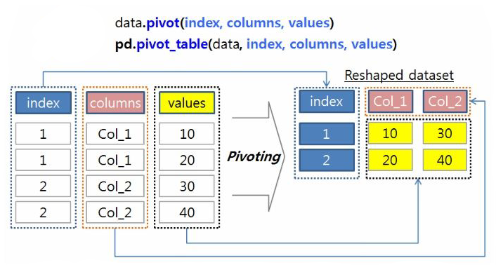
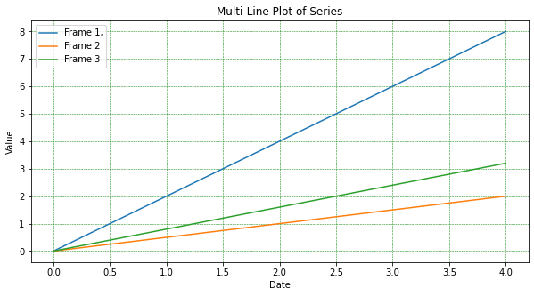
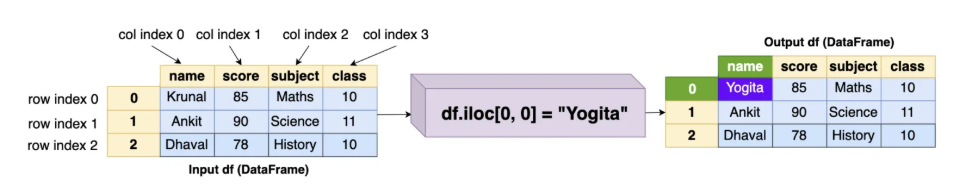
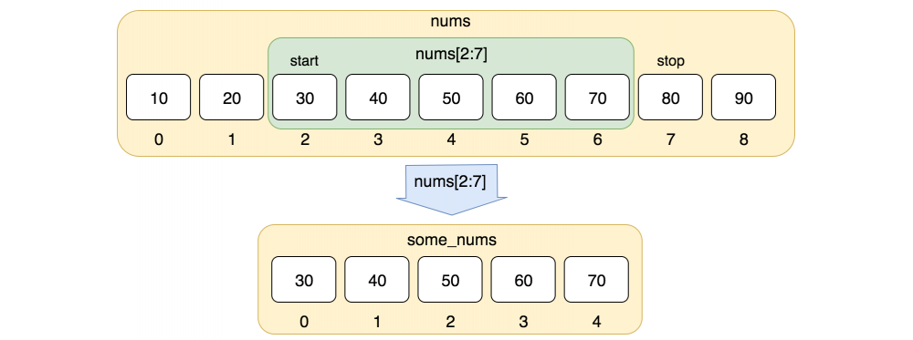
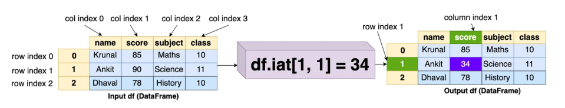

<style>
  table {
    width: 100%
    }
  td {
    vertical-align: center;
    text-align: center;
  }
  table.inputT{
    margin: 10px;
    width: auto;
    margin-left: auto;
    margin-right: auto;
    border: none;
  }
  input{
    text-align: center;
    padding: 0px 10px;
  }
  iframe{
    width: 100%;
    display: block;
    border-style:none;
  }
</style>

# Matplotlib 介绍

```py
import numpy as np
import matplotlib.pyplot as plt
from matplotlib.font_manager import FontProperties

font = FontProperties(fname="./SimHei.ttf", size=18)
font1 = FontProperties(fname="./SimHei.ttf", size=12)

def setText(plt, title, xlabel, ylabel, fontsize=18):
    plt.title(title, fontproperties=font, color="blue")
    plt.xlabel(xlabel, fontproperties=font1)
    plt.ylabel(ylabel, fontproperties=font1)

def plot(plt, x, y, legend, lwidth=1, lstyle="-"):
    plt.plot(x, y, linewidth=lwidth, ls=lstyle, label=legend)

def setPlotView(plt, width, height):
    plt.figure().set_figwidth(width)
    plt.figure().set_figheight(height)

x = [1, 2, 3, 4, 5, 6]
y = [7, 8, 9, 10, 11, 12]
y1 = [3, 7, 2, 1, 8, 3]
y2 = [2, 5, 8, 6, 2, 5]
y3 = [4, 6, 7, 5, 7, 10]

setPlotView(plt, 5, 3)
setText(plt, "樣品圖", "X-軸", "Y-軸")
plot(plt, x, y, "數據-1", 1)
plot(plt, x, y1, "數據-2", 2, "--")
plot(plt, x, y2, "數據-3", 1, "-.")
plot(plt, x, y3, "數據-4", 3, ":")
plt.legend(bbox_to_anchor=(1, 1), fancybox=True, shadow=True, prop=font1)
plt.grid(linestyle=":")
plt.show()
```


[Matplotlib 网上资源](https://medium.com/@hi-sushanta/master-matplotlib-a-step-by-step-guide-for-beginners-to-experts-e76195edff1f)

# Pandas 介绍

## Tidy data (长表) vs Messy data (宽表)

**长表** 行多列少，每行代表一个观测值。由于灵活性，长表通常更适合用于分析和数据库使用。

**宽表** 列多行少，每行代表一条完整记录或一系列相关数据点。宽表则更方便在电子表格中输入数据和快速查找。

### 宽表转换至长表

**stack**

 - stack 寬轉長。除了被 set_index 的欄位 level 0 保留原始 index，其他所有 columns 轉換成 level 1 內層 index。
 - set_index()：将不想被 reshape 的所有栏位都设为 index。
 - reset_index()：将 index column 转换为一般的 column。
 - rename()：把栏位名改成需要的名称。
 


**melt**

 - melt 寬轉長。（比  stack 使用上更为弹性）含以下三个重要参数：
    - id_vars：指定不进行重塑的栏位。
    - value_vars：指定要将哪些栏位重塑成单一栏位。
    - var_name 与 value_name：直接设定转换出来的栏位名称。


### 长表转换至宽表

**unstack**

 - unstack 長轉寬。把 level 1 index 转换回宽资料的栏位。
 - set_index()：设定好 level 0 跟 level 1 index。
 - reset_index()：把 index 重置回原始样态（取消 ‘flight_count’ 这个 index）。
 - rename_axis()：设置索引或列的轴名称（在此为把 index 栏位名称设定为 None）。


**pivot** & **pivot_table**

 - pivot 長轉寬，含以下三个重要参数：
    - index：不重塑的栏位。
    - columns：指定栏位的「值」。
    - values：要重塑的栏位，并展开成值。
 - reset_index()：把 index 重置回原始样态。
 - rename_axis()：设置索引或列的轴名称（把 index 栏位名称设定为 None）。





## 资料聚合计算 (groupby)

Pandas 中的 **groupby** 方法是一个非常强大的工具，可以帮助你有效且深入地洞察数据集。只需几行简单易懂的代码，你就能以极其简单直接且强大的方式聚合数据。


### 聚合数据方法

|聚合方法|描述|
|:---:|:---|
|count()|	非空记录的数量|
|sum()|值的总和|
|mean()	|值的算术平均值|
|median()|	值的中位数|
|min()|该组的最小值|
|max()|该组的最大值|
mode()|组中最常见的值|
|std()|组的标准差|
|var()|组的方差|

## 移动窗口计算 (rolling)

Pandas 中的 **rolling** 方法主要指滚动窗口计算，尤其是在 Pandas 库中，用于分析序列数据。以下介绍移动平均法加入高斯窗及应用方法。

$$
\text{new_values}_{\text{mean}} = \text{values} \times \text{normalized_weights} \tag{1}\label{1}
$$


$$
\text{new_values}_{\text{mean}} = \text{values} \times \text{weights} \tag{2}\label{2}
$$


 - win_type (scipy.signal 库提供的加权非矩形窗口)
    - 以下函数中的输入参数 M[, sym, xp, device]

|函数格式|功能说明|
|:---:|:---|
|bartlett()|Bartlett 窗|
|barthann()|修正的 Bartlett-Hann 窗|
|blackman()|Blackman 窗|
|blackmanharris()|最小 4 项的 Blackman-Harris 窗|
|bohman()|Bohman 窗|
|boxcar()|箱型 boxcar 或矩形窗|
|cosine()|简单余弦形状的窗|
|flattop()|平顶窗|
|hamming()|Hamming 窗|
|hann()|Hann窗|
|nuttall()|根据 Nuttall 最小 4 项的 Blackman-Harris 窗|
|parzen()|Parzen 窗|
|triang()|三角窗|

 - win_type (scipy.signal 特殊功能)

|函数格式|功能说明|
|:---:|:---|
|gaussian(M, std[, sym, xp, device])|高斯窗, 应包括 std 内容|
|general_gaussian(M, p, sig[, sym, xp, device])|广义高斯形状的窗, 应包括 sig 内容|
|kaiser(M, beta[, sym, xp, device])|Kaiser 窗, 应包括 beta 内容|
|slepian(M, width[, sym, xp, device])|slepian 窗, 应包括 width 内容|

## 删除资料 (drop)


Pandas 中的 **drop** 从行或列中删除指定的标签。通过指定标签名称和相应的轴，或直接指定索引或列名称来删除行或列。使用多索引时，可以通过指定级别来删除不同级别的标签。

### 用名称选择


### 用索引选择


## 匿名函数 (lambda)

Pandas 中的 **assign** 方法用于在 DataFrame 中创建新列或修改现有列。它返回一个包含所有原始列以及新分配的列的新 DataFrame 对象，而原始 DataFrame 保持不变。这使得它适合方法链和函数式编程范式。


## 制图函数 （Plot）

Pandas 中的 **plot** 方法提供了一种直接从 Series 和 DataFrames 可视化数据的便捷方法，充当 Matplotlib 的包装器。

```python
import pandas as pd
import numpy as np
import matplotlib.pyplot as plt

# 使用随机数据和日期索引创建制图
df1 = pd.DataFrame({'Frame 1,':np.arange(5)*2},index=np.arange(5))
df2 = pd.DataFrame({'Frame 2':np.arange(5)*.5},index=np.arange(5))
df3 = pd.DataFrame({'Frame 3':np.arange(5)*.8},index=np.arange(5))

# 绘制数据
ax = df1.plot(label='df1', figsize=(10,5))
df2.plot(ax=ax)
df3.plot(ax=ax)
ax.grid(axis = 'y')
plt.grid(color = 'green', linestyle = '--', linewidth = 0.5)
plt.title("Multi-Line Plot of Series")
plt.xlabel("Date")
plt.ylabel("Value")
plt.show()
```



### 绘图参数

除了 x 和 y 之外，plot 方法还有几个参数，可以通过调整这些参数来改变绘图效果。

 - x 和 y：参数指定 x 和 y 列所需的值。
 - figsize：指定图形对象的大小。
 - title：图表使用的标题。
 - legend：放置在轴心子图上。
 - Title：放置在轴子图上的图例。
 - Style：每列的 matplotlib 线条样式。
 - xlabel 和 ylabel：x 轴和 y 轴标签的名称。
 - Subplots：为每列创建单独的子图。
 - Kind：要生成的绘图类型。
    - area：表示面积图
    - bar：表示垂直条形图
    - barh：表示水平条形图
    - box：表示箱线图
    - hexbin：表示六边形箱线图
    - hist：表示直方图
    - kde：表示核密度估计图
    - density：是 kde 的别名
    - line：表示折线图
    - pie：表示饼图
    - scatter：表示散点图


## 索引和切片 (Indexing vs Slicing)

Python 对于 loc、iloc、at、iat 有点混乱，针对这几种用法进行整理如下所示:


 - ix 索引器已弃用，并在最近的版本中被移除。弃用原因是 ix 索引器同时允许基于标签和基于整数位置的索引，这可能会导致歧义，并使代码更难阅读和维护，尤其是在混合索引或基于整数的索引的情况下。因此以下不作介绍。

### loc vs iloc

Pandas 中，**loc** 和 **iloc** 都可以用于从数据框中选择数据，但它们在标识行和列的方式上有所不同：


 - loc（基于标签的索引）：
   - 使用行和列的实际标签（名称）来选择数据
   - 需要提供行标签和列标签作为参数
   - 可用于选择单个元素、数据片段、标签列表或布尔数组（用于条件选择）
 - 示例：df.loc['行标签', '列标签'] 或 df.loc[df['列名'] > 10, '另一个列名']
 - 包含性：使用 .loc 进行切片时，起始和结束标签均包含在结果中




 - iloc（基于整数位置的索引）：
   - 使用行和列的整数位置来选择数据，类似于Python列表的索引方式
   - 需要提供整数位置作为参数，其中 <font color="#FF1000">0</font> 表示第一行/列，1表示第二行/列，以此类推
   - 可用于选择单个元素、数据片段或整数位置列表
 - 示例：df.iloc[0, 1]（第一行，第二列）或 df.iloc[0:5, 2:4]（前五行，索引为 2 和 3 的列）
 - 不包含性：使用 .iloc 进行切片时，结束位置不包含在结果中（即，结束位置处的元素不包含在结果中）




### at vs iat

Pandas 中 **at** 和 **iat** 都可以用于快速访问 DataFrame 或 Series 中的单个标量值（获取或设置单个值）。二者的主要区别在于如何指定位置。

 - df.at[row_label, col_label]：该方法使用标签索引。需提供行标签（行索引名称）和列标签（列名称），即可定位到特定的单元格。它针对按标签快速访问单个值进行了优化
 
 

 - df.iat[行索引值, 列索引值]：该方法使用整数索引。需提供行和列的 <font color="#FF1000">0</font> 起始整数索引值即可定位到目标单元格。这种方法在通过整数索引快速访问单个值时性能最佳

