<style>
  table {
    width: 100%
    }
  td {
    vertical-align: center;
    text-align: center;
  }
  table.inputT{
    margin: 10px;
    width: auto;
    margin-left: auto;
    margin-right: auto;
    border: none;
  }
  input{
    text-align: center;
    padding: 0px 10px;
  }
  iframe{
    width: 100%;
    display: block;
    border-style:none;
  }
</style>


# Linux 内核模块

内核模块是内核可以根据需要加载和卸载的代码组件。用于扩展内核的功能，而无需重新启动系统。内核模块的主要应用之一是编写设备驱动程序。下文展示如何编写和编译一个简单的内核模块，该模块将警报写入内核日志。

以下展示用 C 编写的内核模块。需要两个主要组件：模块的源代码和用于编译模块的 makefile。模块的总体思路是在模块加载和从内核中删除时执行代码。添加模块时，我们将在内核日志中打印 “Hello World” 作为警报。删除模块时，我们将在内核日志中打印  “Goodbye World” 作为警报。

### 最基本 C 内核模块例子

```c
#include <linux/init.h>
#include <linux/module.h> // 所有模块都需要
#include <linux/kernel.h> // KERN_INFO 所需

static int init_module(void) { 
printk(KERN_INFO "Hello world 1.\n"); // 返回非 0 表示 init_module 失败；无法加载模块 
return 0;
}

static void cleanup_module(void) { printk(KERN_INFO "Goodbye world 1.\n");
}

module_init(init_module);
module_exit(cleanup_module);

MODULE_AUTHOR("example <abc@example.com>");
MODULE_LICENSE("GPL2");
MODULE_DESCRIPTION("Driver module");
MODULE_VERSION("1.5.0");
```

从代码顶部开始，需要将 linux/init.h 和 linux/module.h 导入到代码中，以便提供加载和删除内核模块所需的组件。

### 一般会用到的宏

 - MODULE_AUTHOR：作者简介
 - MODULE_LICENSE：版权类型
 - MODULE_DESCRIPTION：程式介绍
 - MODULE_VERSION：版本号码
 - MODULE_DEVICE_TABLE：热插拔设备资料

**MODULE_DEVICE_TABLE** 一般用于动态加载驱动也就是热插拔的时候使用，这是为什么大部分教程不讲这个驱动的原因。
这函数第一个参数是设备的类型，如果是 **USB** 设备，那自然是 **usb**（如果是 **PCI** 设备，那将是 **pci**，这两个子系统用同一个宏来注册所支持的设备。
后面一个参数是设备表，这个设备表的最后一个元素是空的，用于标识结束。

例如代码定义了 USB_SKEL_VENDOR_ID 是 0xfff0，USB_SKEL_PRODUCT_ID 是 0xfff0，也就是说，当有一个设备接到集线器时，usb 子系统就会检查这个设备的 **vendor ID** 和 **product ID**，如果他们的值是 0xfff0 时，那么子系统就会调用这个模块作为设备的驱动。

### 必备函数

 - init_module(void) 函数是当模块**加载到内核**时将调用的函数
 - cleanup_module(void) 函数是当模块从**内核中删除**时将调用的函数。

如下图，将这些函数链接到它们相应的事件。

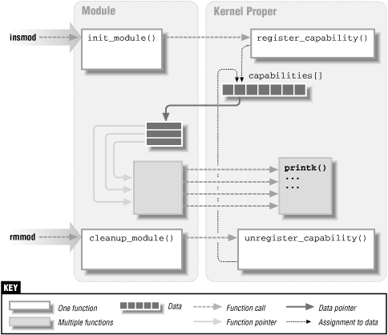


 - <font color="#FF1000">module_init</font> 接受一个函数，并将其链接到模块加载事件。
 - <font color="#FF1000">module_exit</font> 接受一个函数并将其链接到模块删除事件。
在任何一个事件发生时，都会执行链接的函数。


#### SPI

```c
static const struct spi_device_id foo_id_table[] = {
    {"foo", 0},
    {"bar", 1}, 
    {},
};
MODULE_DEVICE_TABLE(spi, foo_id_table);
```

#### I <sup>2</sup>C

```c
static const struct i2c_device_id mpu3050_ids[] = {
    {"mpu3050", 0},
    {},
};
MODULE_DEVICE_TABLE(i2c, mpu3050_ids);
```

#### USB

```c
static const struct usb_device_id ch341_usb_table[] = {
    {USB_DEVICE(0x1a86, 0x5512)},
    {},
};
MODULE_DEVICE_TABLE(usb, ch341_usb_table);
```

**USB_DEVICE**(vend, prod)
 - vend：16 位 USB 供应商 ID
 - prod：16 位 USB 产品 ID


### 最基本 C USB 内核模块驱动例子

```c
#include <linux/init.h>
#include <linux/module.h> 
#include <linux/usb.h>

// 定义 USB 的 ID 表格
static const struct usb_device_id usbtest[] = { 
 { // 制造商 ID 和产品 ID 
   USB_DEVICE(0x148f, 0x760b), 
 }, 
};

// USB 设备信息与驱动端匹配成功的时候调用。
static int usb_probe(struct usb_interface *intf,const struct usb_device_id *id) 
{ // 资源探索函数 
  printk("USB 驱动匹配成功!\n");
  return 0;
}

// USB 断开的时候调用
static void usb_disconnect(struct usb_interface *intf) 
{
  printk("USB 设备释放成功!\n");
} 

// 定义 USB 驱动结构体 
static struct usb_driver usbtest_driver = {
  .name = "linux_usb_drv",      // 资源名称
  .id_table = usbtest,          // 资源匹配驱动
  .probe = usb_probe,          // 资源探测函数 - 匹配成功调用
  .disconnect = usb_disconnect // 资源断开连接调用
};

// 注册 USB 设备驱动
static int __init usbtest_init(void) 
{    
  usb_register(&usbtest_driver);
  return 0;
} 
module_init(usbtest_init);

// 注销 USB 设备驱动
static void __exit usbtest_exit(void) {
  usb_deregister(&usbtest_driver);
} 
module_exit(usbtest_exit);

MODULE_AUTHOR("Dicky KO");
MODULE_LICENSE("MIT");
MODULE_DESCRIPTION("Driver module template");
MODULE_VERSION("1.0.0");
```


**module_usb_driver(usb_driver)** : USB 驱动程序的辅助宏，在模块初始化/退出中不执行任何特殊操作。每个模块只能使用一次此宏，调用它替换 **module_init** 和 **module_exit**。


#### 相关 USB 头文件函数

```c
// 注册 USB 设备 
#define usb_register(driver) usb_register_driver(driver, THIS_MODULE, KBUILD_MODNAME)

// 注销 USB 设备 
void usb_deregister(struct usb_driver *driver)

// 需要添加的头文件 
#include <linux/usb.h>
```


## C 的内核模块 API

### printk

```c
void printk(fmt, ...);
```

函数的实际逻辑并不是太复杂。函数 printk 是 print 的一个特殊实现，它将提供的文本写入内核日志。

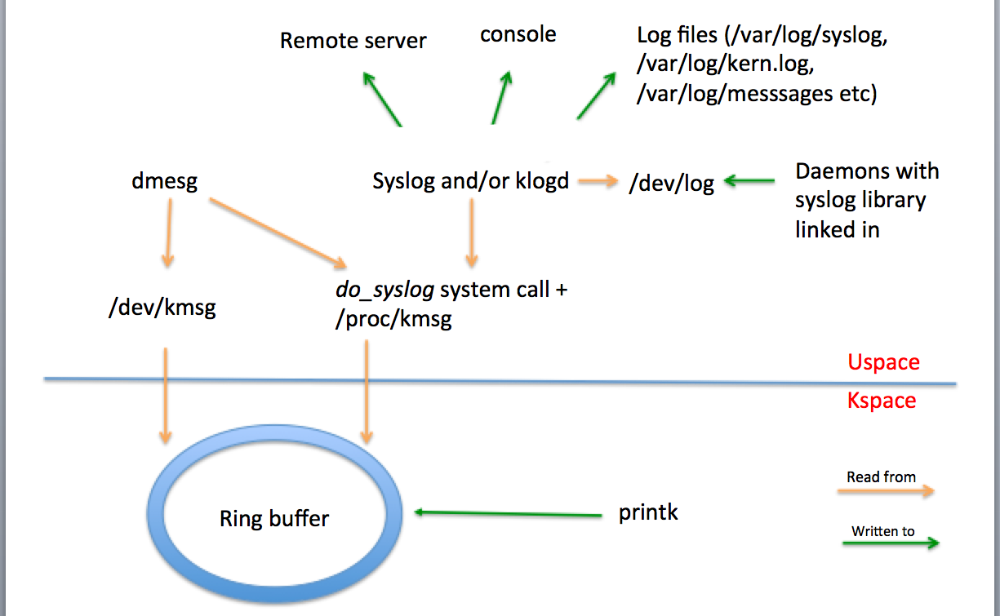

KERN_ALERT 定义要打印的文本的格式，即警报级别日志行。使用它是因为 printf 函数在内核模式下不可用，因此使用 printk 打印到日志是下一个最佳选择。


### kmalloc

```c
void *kmalloc(size_t size, gfp_t flags);
```

kmalloc 申请的内存位于物理内存映射区域，而且在物理上也是连续的，它们与真实的物理地址只有一个固定的偏移，因为存在较简单的转换关系，所以对申请的内存大小有限制，不能超过**128KB**。


```c
#include <linux/slab.h>

string = kmalloc (string_len + 1, GFP_KERNEL);
if (!string) {
    //report error: -ENOMEM;
}
```

第一个参数表示分配区域的大小（以字节为单位，8 bits）。该函数返回一个指向可在内核中直接使用的内存区域的指针，如果无法分配内存，则返回 NULL。

第二个参数指定应如何进行分配，最常用的值是：

 - GFP_ATOMIC：分配内存的过程是一个原子过程，分配内存的过程不会被（高优先级进程或中断）打断可以随时使用。；
 - GFP_KERNEL：正常分配内存；
 - GFP_DMA：给 DMA 控制器分配内存，需要使用该标志（DMA要求分配虚拟地址和物理地址连续）

**kmalloc** 函数的对应函数是 **kfree**，该函数接收由 kmalloc() 分配的区域作为参数。此函数不会暂停当前进程，因此可以从任何上下文中调用。


### kmalloc 与 kzalloc 相比

```c
static inline void *kzalloc(size_t size, gfp_t flags);
```

kzalloc 函数与 kmalloc 非常相似，参数及返回值是一样，是后者的一个变种，因为 kzalloc 实际上只是额外附加了 __GFP_ZERO 标志。所以它除了申请内核内存外，还会对申请到的内存内容清零。

### kmalloc 与 vmalloc 相比 

```c
void *vmalloc(unsiged long size);
```

**kmalloc** 特殊之处在于它分配的内存是物理上连续的,这对于要进行DMA的设备十分重要. 而用 **vmalloc** 分配的内存只是线性地址连续,物理地址不一定连续,不能直接用于DMA。

区别大概可总结为：

 - vmalloc 分配的一般为高端内存，只有当内存不够的时候才分配低端内存；kmallco 从低端内存分配。
 - vmalloc 分配的物理地址一般不连续，而 kmalloc 分配的地址连续，两者分配的虚拟地址都是连续的
 - vmalloc 分配的一般为大块内存，而 kmalloc 一般分配的为小块内存，（一般不超过128k)
 - 用 **vfree** 释放已分配内存


### lists

由于经常使用链表，Linux 内核 API 提供了一种统一的列表定义和使用方法。列表节点的结构中使用 struct list_head 元素。struct list_head 与操作列表的所有其它函数一起在 **include/linux/list.h*** 中定义。以下代码显示了 struct list_head 的定义。

```c
struct list_head { struct list_head *next, *prev; };
```


使用列表的通常例程如下：

|函数名称|功能介绍|
|:---:|:---:|
|LIST_HEAD(name)|声明列表|
|INIT_LIST_HEAD(struct list_head *list)()|在进行动态分配时初始化列表，方法是将下一个和上一个的值设置为列表字段|
|list_add(struct list_head *new, struct list_head *head)() |在 head 元素后添加新元素|
|list_del(struct list_head *entry)() |删除其所属列表的条目地址处的项目|
|list_entry(ptr, type, member)| 返回类型为 type 的结构，该结构包含列表中的元素 ptr，结构内的名称为 member。|
|list_for_each(pos, head)| 使用 pos 作为游标对列表进行迭代|
|list_for_each_safe(pos, n, head)| 使用 pos 作为游标、n 作为临时游标对列表进行迭代。此宏用于从列表中删除某项。|


应用例子如下：

```c
#include <linux/slab.h>
#include <linux/list.h>

struct pid_list {
    pid_t pid;
    struct list_head list;
};

LIST_HEAD(my_list);

static int add_pid(pid_t pid)
{
    struct pid_list *ple = kmalloc(sizeof *ple, GFP_KERNEL);
    if (!ple)
        return -ENOMEM;
    ple->pid = pid;
    list_add(&ple->list, &my_list);
    return 0;
}

static int del_pid(pid_t pid)
{
    struct list_head *i, *tmp;
    struct pid_list *ple;
    list_for_each_safe(i, tmp, &my_list) {
        ple = list_entry(i, struct pid_list, list);
        if (ple->pid == pid) {
            list_del(i);
            kfree(ple);
            return 0;
        }
    }
    return -EINVAL;
}

static void destroy_list(void)
{
    struct list_head *i, *n;
    struct pid_list *ple;
    list_for_each_safe(i, n, &my_list) {
        ple = list_entry(i, struct pid_list, list);
        list_del(i);
        kfree(ple);
    }
}
```
以下创建 makefile 来编译

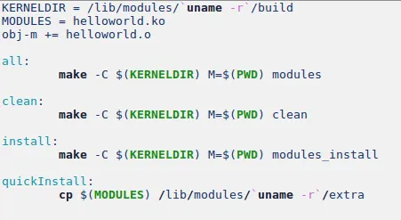

当 make 的目标为 all 时，

-C $(KERNELDIR) 指明跳转到源码目录下读取那里的 Makefile；

M=$(PWD) 表明然后返回到当前目录继续读入、执行当前的 Makefile。

makefile 是将构建过程指向内核目录。如果输入 uname -r，将看到该命令写入 Linux 内核版本。运行此 makefile 时，它​​会生成启用此模块所需的正确文件。


现在有了所需的文件，可以将它们加载到内核中。

 - 要将模块加载到内核中，需要使用 insmod 命令。
 - 要删除在内核中的模块，需要使用 rmmod 命令。

请注意，要运行这些命令，必须使用 root 帐户。


要查看此内核模块的结果，需要到内核日志并读取它。

```
dmesg
```

在大多数 Linux 系统上，可以在 /var/log/kern.log 找到它。在这里面应该看到 Hello world 和 Goodbye world 消息。

## 准备工作

使用如下命令查看自己Linux的内核版本

```
uname -r

结果如下：
Linux VM-73-203-debian 4.9.0-6-amd64
```

## 安装编译工具

```
sudo apt update
sudo apt install make binutils gcc
```

如果将源代码放置在带有空间的路径下，则内核模块将无法编译。请不要在目录或文件名中使用空格。


## 安装内核模块需要的头文件：

```
apt-get install build-essential linux-headers-`uname -r`
```

## 使用如下命令查看系统模块

```
cat /proc/modules
```

## Linux 启动次序

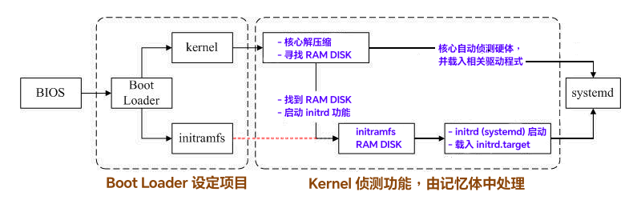

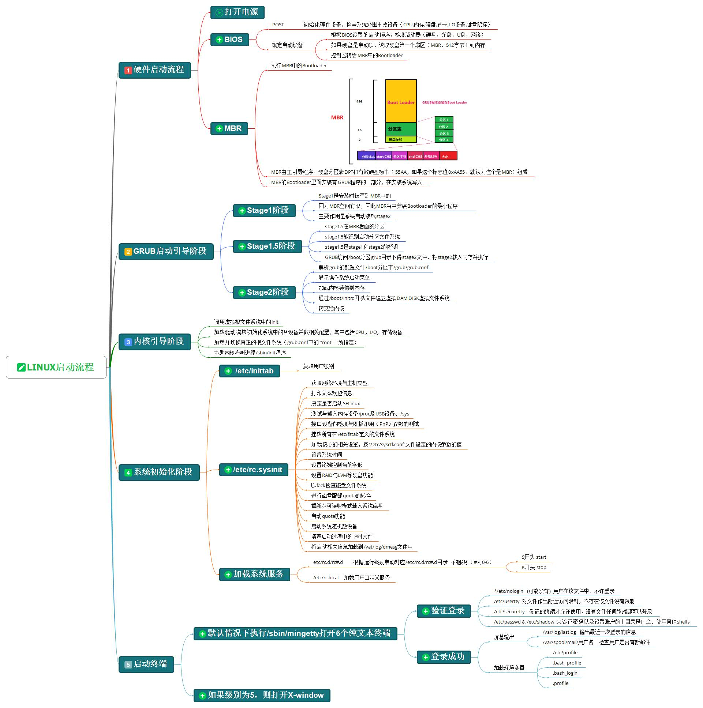

## Linux 一般目录

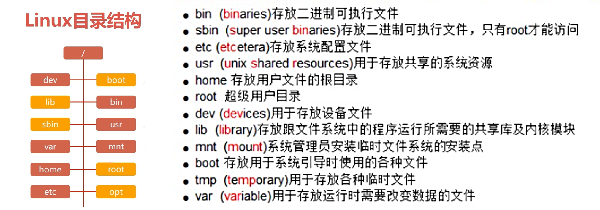

## Linux 基本指令

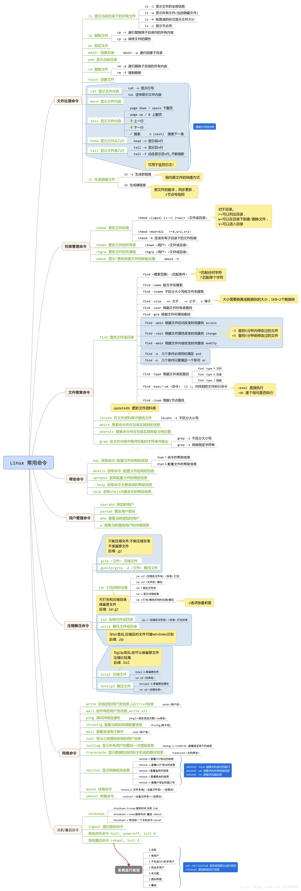

## 文件系统架构

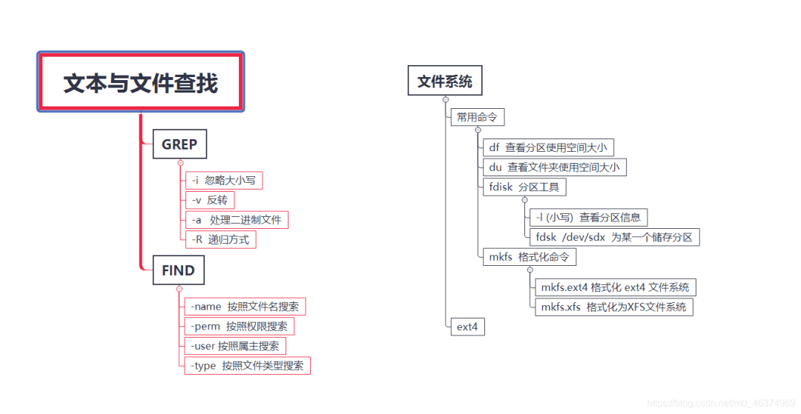

## Linux 内核模块命令

### insmod：安装内核模块

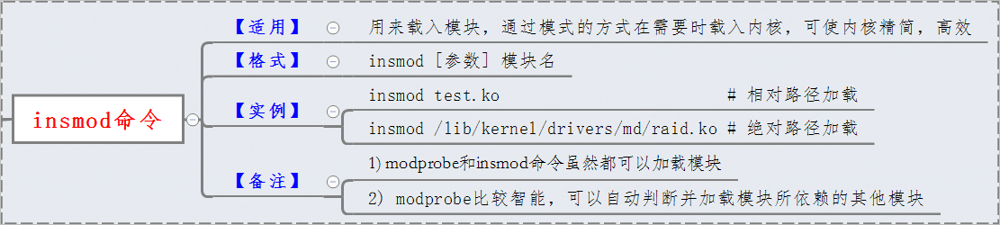

### rmmod：卸载内核模块

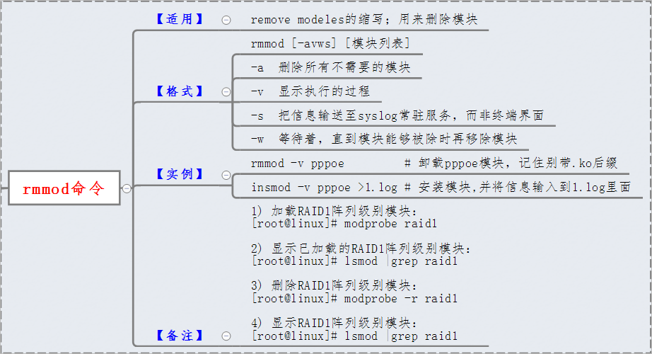

### modprobe：添加和删除内核模块

**modprobe** 工具值不同在于 **insmod**,它会查看要加载的模块,看是否它引用了当前内核没有定义的符号.如果发现有 modprobe 在定义相关符号的当前模块搜索路径中寻找其他模块. 当 modprobe 找到这些模块(要加载模块需要的), 它也把它们加载到内核.

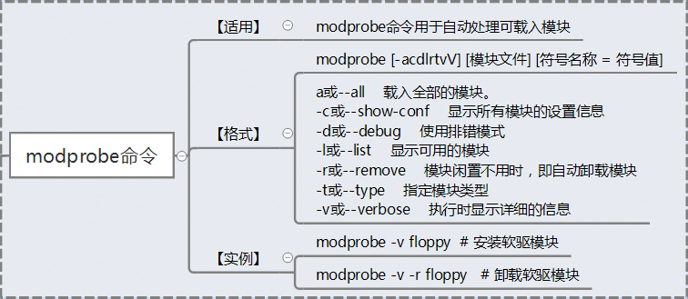

### lsmod：显示已加载的内核模块列表

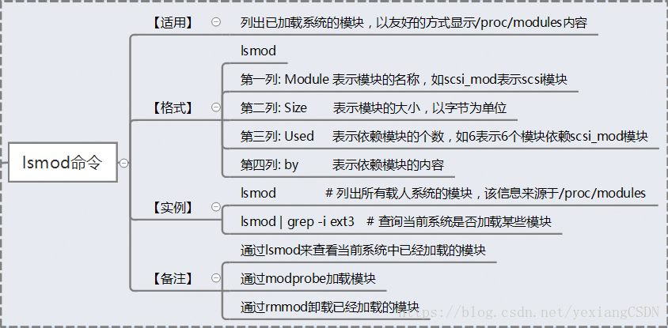

### modinfo：显示内核模块的详细信息


### depmod：分析可加载模块的依赖性


注册一个字符设备的经典方法是使用:

```c
int register_chrdev(unsigned int major, const char *name, struct file_operations *fops); 
```

 - major 是感兴趣的主编号 
 - name 是驱动的名子(出现在 /proc/devices)
 -fops 是缺省的 file_operations 结构 
 
 一个对 register_chrdev 的调用为给定的主编号注册 0 - 255 的次编号, 并且为每一个建立一个缺省的 cdev 结构.使用这个接口的驱动必须准备好处理对所有 256 个次编号的 open 调用(不管它们是否对应真实设备),它们不能使用大于 255 的主或次编号.

从系统中去除你的设备的正确的函数是: 

```c
int unregister_chrdev(unsigned int major, const char *name); 
```

请注意: major 和 name 必须和传递给 register_chrdev 的相同, 否则调用会失败.


|档名|文件内容|
|:---:|:---:|
|/proc/cmdline|加载 kernel 时所下达的相关参数！查阅此文件，可了解系统是如何启动|
|/proc/cpuinfo|本机的 CPU 的相关资讯，包含时脉、类型与运算功能等|
|/proc/devices|这个文件记录了系统各个主要装置的主要装置代号，与mknod有关|
|/proc/filesystems|目前系统已经加载的文件系统|
|/proc/interrupts|目前系统上面的IRQ分配状态|
|/proc/ioports|目前系统上面各个装置所配置的 I/O 位址|
|/proc/kcore|这个就是内存的大小|
|/proc/loadavg|还记得 top 以及 uptime吧？没错！上头的三个平均数值就是记录在此|
|/proc/meminfo|使用 free 列出的内存资讯，在这里也能够查阅到|
/proc/modules|目前 Linux 已经加载的模块列表，也可以想成是驱动程序|
/proc/mounts|系统已经挂载的数据，就是用 mount 这个命令呼叫出来的|
/proc/swaps|到底系统挂加载的内存在哪里？使用掉的 partition 就记录在此|
/proc/partitions|使用 fdisk-1 会出现目前所有的 partition .在这个文件当中也有纪录|
/proc/pci|在 PCI 汇流排上面，每个装置的详细情况！可用 lspci 来查阅|
/proc/uptime|就是用 uptime 的时候，会出现的资讯|
/proc/version|核心的版本，就是用 uname -a 显示的内容|
|/proc/bus/＊|一些汇流排的装置，还有 U 盘的装置也记录在此|


## 权限设定

### chmod：权限位或权限符号设置

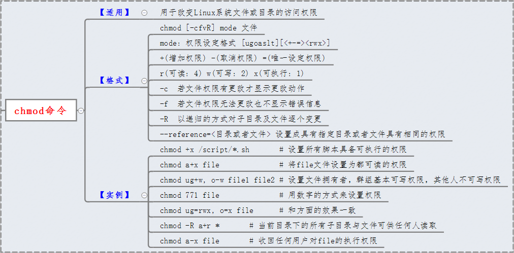


## 系统信息

 - uname：显示系统信息
 - dmesg：显示内核相关日志
 - lsusb：列出USB设备


## 内核模块储存目录

**/lib/modules/kernel-version/** 目录存储了 Linux 操作系统下所有已编译的驱动程序。可以使用 modprobe 命令智能地从 Linux 内核中添加或删除模块。
modprobe 命令在模块目录 **/lib/modules/$(uname -r)** 中查找所有模块和其他文件，但可选的 /etc/modprobe.conf 配置文件和 /etc/modprobe.d 目录除外。


```
ls -l /lib/modules/$(uname -r)
```

## systemctl 常用管理命令

传统上的 Linux 都是靠 System V 的 init 来启动各项系统服务，而后来新的 Systemd 出现之后，许多主流的 Linux 发行版都改用 Systemd 来管理系统服务，新的 Systemd 跟传统 System V 的 init 相比，开机速度更快、效能更好、具有相依性检查功能。

在 Systemd 中每一個系統服務就稱為一個服務單位(unit)，而服務單位又可以區分為 service、socket、target、path、snapshot、timer 等多種不同的類型(type)，可以從設定檔的附檔名來判斷該服務單位所屬的類型，最常見的就是以 .service 結尾的系統服務，大部分的伺服器都是屬於這種。


|指令|解释|
|:---:|:---:|
|systemctl start + name.service |开启|
|systemctl stop + name.service |关闭|
|systemctl restart + name.service |重启|
|systemctl status + name.service |查看状态|
|systemctl is-active + name.service |查看激活与否|
|systemctl enable + name.service |设置开机启动|
|systemctl disable + name.service |禁止开机启|
|systemctl is-enabled + name.service |查看是否开机自启|
|systemctl kill + name.service |杀死进程|
|systemctl  mask + name.service |禁止自动和手动启动|
|systemctl unmask + name.service |取消禁|
|systemctl list-dependencies + name.service |查看服务的依赖关系|
|systemctl 名字 -reload |重新加载配置文件|
|systemctl poweroff |关机|
|systemctl reboot|重启|