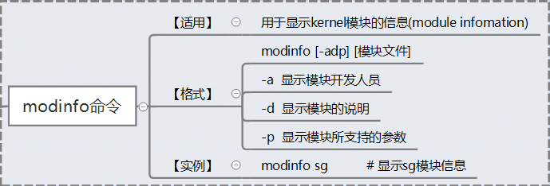

<style>
  table {
    width: 100%
    }
  td {
    vertical-align: center;
    text-align: center;
  }
  table.inputT{
    margin: 10px;
    width: auto;
    margin-left: auto;
    margin-right: auto;
    border: none;
  }
  input{
    text-align: center;
    padding: 0px 10px;
  }
  iframe{
    width: 100%;
    display: block;
    border-style:none;
  }
</style>


# Linux 内核模块

内核模块是内核可以根据需要加载和卸载的代码组件。用于扩展内核的功能，而无需重新启动系统。内核模块的主要应用之一是编写设备驱动程序。下文展示如何编写和编译一个简单的内核模块，该模块将警报写入内核日志。

以下展示用 C 编写的内核模块。需要两个主要组件：模块的源代码和用于编译模块的 makefile。模块的总体思路是在模块加载和从内核中删除时执行代码。添加模块时，我们将在内核日志中打印 “Hello World” 作为警报。删除模块时，我们将在内核日志中打印  “Goodbye World” 作为警报。

```c
#include <linux/init.h>
#include <linux/module.h> // 所有模块都需要
#include <linux/kernel.h> // KERN_INFO 所需

static int init_module(void) { 
printk(KERN_INFO "Hello world 1.\n"); // 返回非 0 表示 init_module 失败；无法加载模块 
return 0;
}

static void cleanup_module(void) { printk(KERN_INFO "Goodbye world 1.\n");
}

module_init(init_module);
module_exit(cleanup_module);

MODULE_AUTHOR("example <abc@example.com>");
MODULE_LICENSE("GPL2");
MODULE_DESCRIPTION("Driver module");
MODULE_VERSION("1.5.0");
```

从代码顶部开始，需要将 linux/init.h 和 linux/module.h 导入到代码中，以便提供加载和删除内核模块所需的组件。

MODULE_LICENSE 行并不是特别重要，它只是通知内核该模块是开源的。初始设置之后，定义两个函数。

 - init_module(void) 函数是当模块加载到内核时将调用的函数
 - cleanup_module(void) 函数是当模块从内核中删除时将调用的函数。

为了将这些函数链接到它们相应的事件，需要使用 

 - <font color="#FF1000">module_init</font> 接受一个函数，并将其链接到模块加载事件。
 - <font color="#FF1000">module_exit</font> 接受一个函数并将其链接到模块删除事件。
在任何一个事件发生时，都会执行链接的函数。


函数的实际逻辑并不是太复杂。函数 printk 是 print 的一个特殊实现，它将提供的文本写入内核日志。


KERN_ALERT 定义要打印的文本的格式，即警报级别日志行。使用它是因为 printf 函数在内核模式下不可用，因此使用 printk 打印到日志是下一个最佳选择。以下创建 makefile 来编译它。


makefile 是将构建过程指向内核目录。如果输入 uname -r，将看到该命令写入 Linux 内核版本。运行此 makefile 时，它​​会生成启用此模块所需的正确文件。


现在有了所需的文件，可以将它们加载到内核中。要将模块加载到内核中，需要使用 insmod 命令。要删除模块，我们使用 rmmod 命令。请注意，要运行这些命令，必须使用 root 帐户。


要查看此内核模块的结果，需要到内核日志并读取它。在大多数 Linux 系统上，可以在 /var/log/kern.log 找到它。在这里面应该看到 Hello world 和 Goodbye world 消息。

## 准备工作

使用如下命令查看自己Linux的内核版本

```
uname -r

结果如下：
Linux VM-73-203-debian 4.9.0-6-amd64
```


## 安装内核模块需要的头文件：

```
apt-get install build-essential linux-headers-`uname -r`
```

## 使用如下命令查看系统模块

```
cat /proc/modules
```

## Linux 启动次序


## Linux 一般目录


## Linux 基本指令


## 文件系统架构


## Linux 内核模块命令

### insmod：安装内核模块


### rmmod：卸载内核模块


### modprobe：添加和删除内核模块


### lsmod：显示已加载的内核模块列表


### modinfo：显示内核模块的详细信息



### depmod：分析可加载模块的依赖性


## 权限设定

### chmod：权限位或权限符号设置


## 系统信息

 - uname：显示系统信息
 - dmesg：显示内核相关日志
 - lsusb：列出USB设备


## 内核模块储存目录

**/lib/modules/kernel-version/** 目录存储了 Linux 操作系统下所有已编译的驱动程序。可以使用 modprobe 命令智能地从 Linux 内核中添加或删除模块。
modprobe 命令在模块目录 **/lib/modules/$(uname -r)** 中查找所有模块和其他文件，但可选的 /etc/modprobe.conf 配置文件和 /etc/modprobe.d 目录除外。


```
ls -l /lib/modules/$(uname -r)
```


## systemctl 常用管理命令

|指令|解释|
|:---:|:---:|
|systemctl start + name.service |开启|
|systemctl stop + name.service |关闭|
|systemctl restart + name.service |重启|
|systemctl status + name.service |查看状态|
|systemctl is-active + name.service |查看激活与否|
|systemctl enable + name.service |设置开机启动|
|systemctl disable + name.service |禁止开机启|
|systemctl is-enabled + name.service |查看是否开机自启|
|systemctl kill + name.service |杀死进程|
|systemctl  mask + name.service |禁止自动和手动启动|
|systemctl unmask + name.service |取消禁|
|systemctl list-dependencies + name.service |查看服务的依赖关系|
|systemctl 名字 -reload |重新加载配置文件|
|systemctl poweroff |关机|
|systemctl reboot|重启|