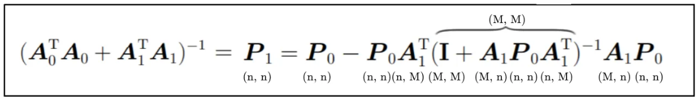

# 最小二乘算法

​二乘其实是指平方的意思，为什么用平方呢？因为平方可以消除误差正负方向上的差异，单纯的只比较长度。

如上图所示：蓝点是真实数据，黄点是每个真实数据的估计值，红线的长短即代表真实与估计距离，目标就是找到一条直线（模型）使得所有红线累和最短，推广到多维空间，就是找到一个超平面，而这个超平面是有数学公式解的！以下就是该公式一般化的推导过程。

基本方程为：

$$
y= mx + c
$$

调整后之最佳方式：

$$
\begin{bmatrix} y_1\\.\\y_n\end{bmatrix} = \begin{bmatrix} x_1 & 1\\.&.\\x_n & 1\end{bmatrix} \cdot \begin{bmatrix} m \\ c \end{bmatrix}
$$

其最优解为：

$$
b = \begin{bmatrix} m \\ c \end{bmatrix} = (X^T X)^{-1}X^T y
$$

其中
 - $Y$ 为求解函数 $f(x) $ 的测量值。
 - $X$ 为样本输入矩阵的测量值。
 - $b$ 为求向量函数。

例子：

$$
y=mx+c
$$

假设数据。$n$ 个数字的平均值：

$$
Y = X b \\
X^T Y  = X^T X b \\
b = (X^TX)^{-1}X^T Y
$$

$$
\begin{bmatrix} y_1 \\ y_2\\ . \\ . \\ y_{n-1} \\ y_n \end{bmatrix}=\begin{bmatrix} x_1 & 1 \\ x_2 & 1 \\ . & . \\ . & . \\ x_{n-1} & 1 \\ x_n & 1\end{bmatrix} \cdot \begin{bmatrix} m \\ c \end{bmatrix}
$$

$$
\begin{bmatrix} m \\ c \end{bmatrix} = \left( \begin{bmatrix} x_1 & x_2 & . & . & . & x_{n-1} & x_n \\1 & 1 & . & . & . & 1 & 1 \end{bmatrix} \cdot \begin{bmatrix} x_1 & 1 \\ x_2 & 1 \\ . & . \\ . & . \\ x_{n-1} & 1 \\ x_n & 1 \end{bmatrix} \right)^{-1} \begin{bmatrix}  x_1 & x_2 & . & . & . & x_{n-1} & x_n \\1 & 1 & . & . & . & 1 & 1 \end{bmatrix} \begin{bmatrix} y_1\\ y_2\\ . \\ . \\ y_{n-1} \\ y_n \end{bmatrix}
$$

备注：$ X, Y$  是已知矩阵 $ b = \begin{bmatrix} m \\ c \end{bmatrix} $ 是需要计算矩阵。

其最优解如上。

$$
b = (X^T X)^{-1}X^T y \Rightarrow  P \cdot Z_n
$$

$$
P = (X^T X)^{-1}，\\
Z_n = X^T y
$$

备注：很多时候都会讲到最小二乘，它又叫做最小平方法，即求得其的最小平方和，比如通过最小二乘，得到模型的残差 **bias** 最小, 即最小化目标值与模型预估值的距离的平方和。

# 递归最小二乘算法

标量测量 $x$ 和 $y$ 以及未知参数 $m$ 和 $c$ 为 

$$ y=mx + c$$ 

上文最小二乘算法公式（10，11）可得，

$$
b = (X^T X)^{-1}X^T y \Rightarrow  P \cdot Z_n
$$

$$
P = (X^T X)^{-1}，\\
Z_n = X^T y
$$

假设 $x$ 具有为由 $x_1，x_2，x_3，...，x_{n-1}，x_n ：$

$$
\left(A_{n-1}^TA_{n-1} + A_n^TA_n\right)^{-1} = P_n = P_{n-1}-P_{n-1} \cdot X_n^T\left (I+X_n \cdot P_{n-1} \cdot X_n^T\right)^{-1}X_n \cdot P_{n-1}
$$

$$
K_n = P_n \cdot X_n^T
$$

$$
A_n = A_{n-1}+ K_n \left (y_n-X_n \cdot A_{n-1}\right)
$$

在讨论矢量之前需要先理解以人上公式。首先证明单一公式函数。假设想找到 n-1 个数字的平均值。称之为 $A_{n-1}$

$$
A_{n-1} = \frac{x_1+x_2+\cdots x_{n-1}}{n-1}
$$

想象一下已经计算出 $A_{n-1}$，并且现在收到一个新数据。$n$ 个数字的平均值是多少？

$$
A_{n} = \frac{x_1+x_2+\cdots x_{n-1}+x_{n}}{n}
$$

关键在于不必从计算 $A_{n}$ 。也可以将上述等式重写为:

$$
\sum_{i=1}^{n} x_i=x_1+x_2+\cdots x_{n-1}+x_{n} \\
= \left(x_1+x_2+\cdots x_{n-1}\right)+x_{n}\Rightarrow(n-1)\times A_{n-1}+x_{n}
$$

重新排列并简化后得到

$$
A_{n}= A_{n-1} + \frac{1}{n}\left(x_{n}-A_{n-1}\right)
$$

这是递归定义。它显示了如何使用每个新数据值更新平均值。

$$
A_{n} = A_{n-1} + \frac{1}{n \cdot m} \left(m \cdot x_{n} - m \cdot A_{n-1}\right) 
\Rightarrow A_{n-1} + \frac{1}{n \cdot m} \left(y_n - m \cdot A_{n-1}\right)\\
A_{n} = A_{n-1} + K_n \left(y_n - m \cdot A_{n-1}\right)，K_n=\frac{1}{n \cdot m}
$$

上面的等式有两个重要部分。
 - $K_n$ 称为增益，$K_n$ 取决于已经处理的样本数量。
 - $ y_n - m \cdot A_{n-1} $ 称为创新是期望的值和实际值之间的差值。

用于计算 $ A_n $，参数的值 $ A_{n-1}，m，n $ 是已知，$ y_n $ 刚刚被测量。

在现实中，新的数据往往会比旧的数据更有意义，所以需要引入一个遗忘因子 $\lambda \in [0,1]$（一般在 **0.98** 到 **1** 之间选择），来评估数据对当前模型的影响，使得越往后数据影响越大（这个实际是加权最小二乘的内容）。

---
## 递归最小二乘算法公式

$$
y_n= m_nx+c_n
$$

$$
A_n=A_{n-1}+K_n(y_n-m_nA_{n-1})
$$

基本递归最小二乘算法公式如上。

$$
R_{n+1} = \lambda R_n + x_{n+1} \cdot (x_{n+1})^{-1}
$$

在以上表达式中，比较麻烦的是求 $(R_{n+1})^{-1} $，如果得到它，那么就能成功求得需要计算的线性模型。

$$
K_n = \frac{P_n\,\phi_{n+1}}{1 + \phi_{n+1}^\top\,P_n\,\phi_{n+1}}
$$

$$
P_{n+1} = P_n - K_n\\phi_{n+1}^\top\,P_n
$$

$$
\hat{\theta}_{n+1} =
$$

$$
\hat{\theta}_{n} + K_n (z_{n+1} - \phi_{n+1}^\top\,\hat{\theta}_n)
$$

现在对于递归线性方程（将写为 $ y=mx+c $），具有相同的结构：

$$
\begin{bmatrix}m_{n+1} \\ c_{n+1} \end{bmatrix}=\begin{bmatrix}m_n \\ c_n \end{bmatrix} +
\begin{bmatrix} K_{11} & K_{12} \\ K_{21} & K_{22}\end{bmatrix}\left(y_{n+1} - (m_n x_{n+1} + c_n)\right)
$$

基本上是用已计的数 $ m_n，c_n $ 求出新的 $ m_{n+1}，c_{n+1} $。只需要输入 $ y_{n+1} $ 即测量值及 $ x_{n+1} $ 即可。

$K$ 的公式使用矩阵求逆引理，该引理给出了 $K$ 的递归公式。实际计算非常繁琐。给你概念是与任何算法一样，实际细节都是代数。以下是过程：
 - 写出 $n$ 个数据点的公式和 $n+1$ 个数据点的公式。
 - 在 $n+1$ 个数据点的公式中，用 $n$ 个数据点的公式替换所有涉及前 $n$ 个数据点的表达式
 - 重新排列并简化
 - 最终会得到形式为表达式，其中 $v$ 是一个向量如下。 

$$
H^{-1}-(H+v v^T)^{-1}
$$
 - 利用矩阵求逆引理得到公式如下，事实上，写出 $H^{−1}$ 的递归关系。

$$
H^{-1}-(H+v v^T)^{-1}=\frac{H^{-1}vv^TH^{-1}}{(1+v^T H^{-1} v)}
$$

矩阵增益 $K$ 可以用 $H$ 的形式写出。

递归最小二乘算法是最佳线性无偏估计的一个特例，又是卡尔曼滤波器的一个特例。在更广泛的背景下提出了递归公式。

当在 $ n+1 $ 时如下：

$$ A_{n+1} =  (R_{n+1})^{-1} z_{n+1} = (m_{n+1}^T m_{n+1})^{-1}m_{n+1}^T y_{n+1} $$

