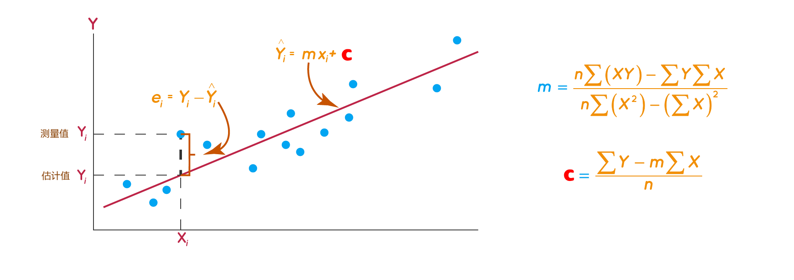

# 最小二乘算法

​二乘其实是指平方的意思，为什么用平方呢？因为平方可以消除误差正负方向上的差异，单纯的只比较长度。

如上图所示：蓝点是真实数据，黄点是每个真实数据的估计值，红线的长短即代表真实与估计距离，目标就是找到一条直线（模型）使得所有红线累和最短，推广到多维空间，就是找到一个超平面，而这个超平面是有数学公式解的！以下就是该公式一般化的推导过程。

基本方程为:

$$
y=mx
$$

调整后之最佳方式:

$$
\tilde{y} = m \tilde{x}
$$

误差方程为:

$$
\epsilon = y - \tilde{y} = y - m \tilde{x}
$$

$$
\epsilon(\tilde{x} |m, y)=(m \tilde{x} -y)^T(m \tilde{x} -y)
$$

其最优解为:

$$
\tilde{x} = (m^T m)^{-1}m^T y
$$

其中
 - $m$ 为样本输入矩阵。
 - $y$ 向量为求解函数 $f(x)$。
 -  $\tilde{y}$ 向量为调整后之最佳方式 y 值。
 - $\tilde{x}$ 向量为调整后之最佳方式 x 值。

# 递归最小二乘算法

标量测量 x 和 y 以及未知参数 m 和 c 为 

$$
y=\hat{m}x+\hat{c}
$$

在讨论矢量之前需要先理解以人上公式。

假设想找到 n 个数字的平均值。称之为 $A_n$

$$
A_n = \frac{x_1+x_2+\cdots x_n}{n}
$$

现在想象一下已经计算出 $A_n$，并且现在收到一个新数据。n+1 个数字的平均值是多少？

$$
A_{n+1} = \frac{x_1+x_2+\cdots x_n+x_{n+1}}{n+1}
$$

关键在于不必从计算 $$A_{n+1}$$。也可以将上述等式重写为:

$$
(n+1) A_{n+1} = x_1+x_2+\cdots x_n+x_{n+1} \\
= \left(x_1+x_2+\cdots x_n\right)+x_{n+1}=n\times A_n+x_{n+1}
$$

重新排列并简化后得到

$$
A_{n+1}= A_n + \frac{1}{n+1} \left(x_{n+1}-A_n\right)
$$

这是递归定义。它显示了如何使用每个新数据值更新平均值。

$$
A_{n+1}  = A_{n} + K \left(A_n - x_{n+1}\right)
$$

上面的等式有两个重要部分。K 称为增益。$ (A_n - x_{n+1}) $ 称为创新，是期望的值和实际值之间的差值。注意：K 取决于已经处理的样本数量。

现在对于递归线性方程（将写为 $ y=\hat{m}x+\hat{c} $），具有相同的结构

$$
\pmatrix{m_{n+1} \\ c_{n+1} }=\pmatrix{m_n \\ c_n } +
\pmatrix{K_{11} & K_{12} \\ K_{21} & K_{22}} \left(y_{n+1} - (m_n x_{n+1} + c_n)\right)
$$

基本上是用已计的数 $ m_n，c_n $ 求出新的 $ m_{n+1}，c_{n+1} $。只需要输入 $ y_{n+1} $ 即测量值及 $ x_{n+1} $ 即可。

**K** 的公式使用矩阵求逆引理，该引理给出了 **K** 的递归公式。实际计算非常繁琐。给你概念是与任何算法一样，实际细节都是代数。以下是过程：
 - 写出 n 个数据点的公式和 n+1 个数据点的公式。
 - 在 n+1 个数据点的公式中，用 n 个数据点的公式替换所有涉及前 n 个数据点的表达式
 - 重新排列并简化
 - 最终会得到形式为表达式，其中 v 是一个向量如下。 

$$
H^{-1}-(H+v v^T)^{-1}
$$
 - 利用矩阵求逆引理得到公式如下，事实上，写出 $H^{−1}$ 的递归关系。

$$
H^{-1}-(H+v v^T)^{-1}=\frac{H^{-1}vv^TH^{-1}}{(1+v^T H^{-1} v)}
$$

矩阵增益 K 可以用 H 的形式写出。

递归最小二乘算法是最佳线性无偏估计的一个特例，又是卡尔曼滤波器的一个特例。在更广泛的背景下提出了递归公式。