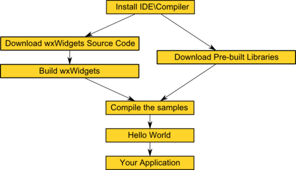
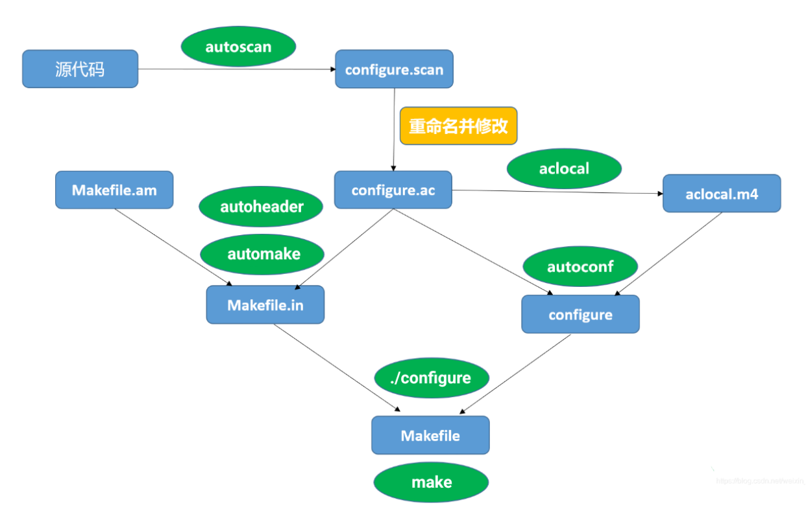

<style>
  table {
    width: 100%
    }
  td {
    vertical-align: center;
    text-align: center;
  }
  table.inputT{
    margin: 10px;
    width: auto;
    margin-left: auto;
    margin-right: auto;
    border: none;
  }
  input{
    text-align: center;
    padding: 0px 10px;
  }
  iframe{
    width: 100%;
    display: block;
    border-style:none;
  }
</style>

# wxWidgets 

## 下载

[wxWidgets - 网路资源](https://www.wxwidgets.org/downloads/)


## 安装方法

[wxWidgets - 安装方法](https://wiki.wxwidgets.org/Compiling_and_getting_started)

wxWidgets 是一个跨平台系统，它不会隐藏平台。当在不同系统中从源代码编译 wxWidgets 时，安装在不同的操作系统之间会略有不同。这在 Linux 衍生平台和 Windows 平台之间处理编译库的方式上尤为明显。以下是并排的不同结构。请注意，使用的是相同的源。以下是库结构作为示例（它仅显示相关文件夹）。



可以使用上面的 wxWidgets 框图来了解编程细节

安装所有必要的构建工具，包括 g++ 和 autotools。在许多发行版中，执行此操作的一种简单方法是安装 **build-essential** 包。

```sh
sudo apt install build-essential
sudo apt install libgtk2.0-dev             
sudo apt install libgtk-3-dev
```

## 编译构建库

将压缩文件解压到 **~/Desktop/wxWidgets-3.2.7** 文件夹中

```
cd ~/Desktop/wxWidgets-3.2.7
mkdir gtk-build              
cd gtk-build
../configure                # 构建 unicode、共享库
make -j3                    
sudo make install          
sudo ldconfig               # 并非每个系统都要求
```

## 测试安装

```sh
wx-config --version  # 3.2.7
wx-config --list     # gtk3-unicode-3.21
```

## wxWidgets 类层次


# Linux ./configure、make、make install 命令详解 

这些都是典型使用 **GNU** 的 **AUTOCONF** 和 **AUTOMAKE** 产生的程序的安装步骤

## 基本信息

 - ./configure 是用来检测安装平台的目标特征的。比如它会检测是不是有 CC 或 GCC，不需要 CC 或 GCC，它是一个 shell 脚本。
 - make 是用来编译的，它从 Makefile 中读取指令，然后编译。
 - make install 是用来安装的，它也从 Makefile 中读取指令，安装到指定的位置。

注意：**AUTOMAKE** 和 **AUTOCONF** 对于发布 C 程序的东西非常有用。

## 详细解释

### configure命令

  - 这一步一般用来生成 Makefile，为下一步的编译做准备，通过在 configure 后加上参数来对安装进行控制，比如代码: ./configure –prefix=/usr 意思是将该软件安装在 /usr 下面，执行文件就会安装在 /usr/bin (而不是默认的 /usr/local/bin),资源文件就会安装在 /usr/share (而不是默认的 /usr/local/share)。同时一些软件的配置文件通过指定 –sys-config= 参数进行设定。有一些软件还可以加上 –with、–enable、–without、–disable 等等参数对编译加以控制，通过允许 ./configure –help 察看详细的说明帮助。

### make

  - 这一步就是编译，大多数的源代码包都经过这一步进行编译 (当然有些perl或python编写的软件需要调用 perl 或 python 来进行编译)。如果在 make 过程中出现 error ，要记下错误代码（注意不仅仅是最后一行），然后可以向开发者提交 bugreport (一般在 INSTALL 里有提交地址)，或者系统少了一些依赖库等，这些需要仔细研究错误代码。
 - 可能遇到的错误：make *** 没有指明目标并且找不到 makefile。 停止。问题很明了，没有Makefile，怎么办，原来是要先 ./configure 一下，再 make。

### make install

 - 这条命令来进行安装(当然有些软件需要先运行 make check 或 make test 来进行一些测试)，这一步一般需要有 root 权限（因为要向系统写入文件）。

## 扩展说明

 - Linux 的用户可能知道，在Linux下安装一个应用程序时，一般先运行脚本 configure，然后用 make 来编译源程序，在运行 make install，最后运行 make clean 删除一些临时文件。使用上述三个自动工具，就可以生成 configure 脚本。运行 configure 脚本，就可以生成 Makefile 文件，然后就可以运行 make、make install 和 make clean。

## configure

**configure** 是一个 shell 脚本，它可以自动设定源程序以符合各种不同平台上 Unix 系统的特性，并且根据系统叁数及环境产生合适的 Makefile 文件或是 **C** 的头文件 (header file)，让源程序可以很方便地在这些不同的平台上被编译连接。

这时可运行 configure 脚本了，运行 configure 脚本，就可产生出符合 GNU 规范的 Makefile 文件了： 

```sh
$ ./configure
$ make
$ make install    # 注：运行这个要有足够的权限
$ make clean
```

到此时，就可以运行 make 进行编译，在运行 make install 进行安装了，最后运行 make clean 删除临时文件。

利用 **configure** 所产生的 **Makefile** 文件有几个预设的目标可供使用，其中几个重要的简述如下：

 - make all：产生我们设定的目标，即此范例中的可执行文件。只打 make 也可以，此时会开始编译原始码，然后连结并产生可执行文件。
 - make clean：清除编译产生的可执行文件及目标文件 (object file，*.o)。
 - make distclean：除了清除可执行文件和目标文件外，把 configure 所产生的 Makefile 也清除掉。

**make install**
  - 将程序安装至系统中。如果原始码编译无误，且执行结果正确，便可以把程序安装至系统预设的可执行文件存放路径。如果用 **bin_PROGRAMS** 宏的话，程序会被安装至 /usr/local/bin 这个目录。

**make dist**
  - 将程序和相关的档案包装成一个压缩文件以供发布。执行完在目录下会产生一个以 PACKAGE-VERSION.tar.gz 为名称的文件。 PACKAGE 和 VERSION 这两个变数是根据 configure.in 文件中 AM_INIT_AUTOMAKE (PACKAGE，VERSION) 的定义。在此范例中会产生 test-1.0.tar.gz 的档案。

**make distcheck**
  - 和 **make dist** 类似，但是加入检查包装后的压缩文件是否正常。这个目标除了把程序和相关文件包装成 tar.gz 文件外，还会自动把这个压缩文件解开，执行  configure，并且进行 make all 的动作，确认编译无误后，会显示这个 tar.gz 文件可供发布了。这个检查非常有用，检查过关的包，基本上可以给任何一个具备 GNU 开发环境-的人去重新编译。

## 整个过程分为三步

- 配置
  configure 脚本负责在使用的系统上准备好软件的构建环境。确保接下来的构建和安装过程所需要的依赖准备好，并且搞清楚使用这些依赖需要的东西。Unix 程序一般是用 C 语言写的，所以通常需要一个 C 编译器去构建它们。在这个例子中 configure 要做的就是确保系统中有 C 编译器，并确定它的名字和路径。

- 构建
  当 configure 配置完毕后，可以使用 make 命令执行构建。这个过程会执行在 Makefile 文件中定义的一系列任务将软件源代码编译成可执行文件。下载的源码包一般没有一个最终的 Makefile 文件，一般是一个模版文件 Makefile.in 文件，然后 configure 根据系统的参数生成一个定制化的 Makefile 文件。

- 安装
  现在软件已经被构建好并且可以执行，接下来要做的就是将可执行文件复制到最终的路径。make install 命令就是将可执行文件、第三方依赖包和文档复制到正确的路径。这通常意味着，可执行文件被复制到某个 PATH 包含的路径，程序的调用文档被复制到某个 MANPATH 包含的路径，还有程序依赖的文件也会被存放在合适的路径。因为安装这一步也是被定义在 Makefile 中，所以程序安装的路径可以通过 configure 命令的参数指定，或者 configure 通过系统参数决定。如果要将可执行文件安装在系统路径，执行这步需要赋予相应的权限，一般是通过 sudo。

安装过程简单说就是 **configure** 脚本根据系统信息将 **Makefile.in** 模版文件转换为 **Makefile** 文件，但是 **configure** 和 **Makefile.in** 文件是怎么产生的呢？

如果曾经试着打开 **configure** 或者 **Makefile.in** 文件，会发现超长而且复杂的 shell 脚本语言。有时候这些脚本代码比它们要安装的程序源代码还要长。

如果想手动创建一个这样的 **configure** 脚本文件是非常可怕的，好消息是这些脚本是通过代码生成的。

通过这种方式构建的软件通常是通过一个叫做 **autotools** 的工具集打包的。这个工具集包含 **autoconf** 、**automake** 等工具，所有的这些工具使得维护软件生命周期变得很容易。最终用户不需要了解这些工具，但却可以让软件在不同的 **Unix** 系统上的安装步骤变得简单。



## 一个简单 Makefile 例子

以下将介绍如何使用 **autoconf** 和 **automake** 两个工具来帮助自动地生成符合自由软件惯例的 **Makefile**，这样就可以象常见的 GNU 程序一样，只要使用 **./configure**，**make**，**make instal** 就可以把程序安装到 Linux 系统中去了。这将特别适合想做开放源代码软件的程序开发人员，如果写些小的程序，那么以下文章会有很大的帮助。

### 基本例子设置 (helloworld)

```sh
mkdir helloword
cd helloworld
touch helloworld.c
tourch Makefile.am
```

### helloworld.c 内容

```c
#include <stdio.h>
int main(int argc, char** argv)
{
printf("Hello, Linux World! ");
return 0;
}
```

### Makefile.am 内容

```
AUTOMAKE_OPTIONS=foreign        # 只检测必须的文件
bin_PROGRAMS=helloworld         # 要生成的可执行文件名，如多个可用空格隔开
helloworld_SOURCES=helloworld.c # 要生成程序所需要的原始文件，如多个可用空格隔开
```

## 创建如下过程

```sh
autoscan
```

**autoscan** 用于创建 configure.scan 后，需要修改内容如下并重命名为 configure.ac 如下

```
# -*- Autoconf -*-
# 使用 autoconf 处理此文件以生成配置脚本.

AC_PREREQ(2.69)                 # 需要的最低autoconf版本
AC_INIT(helloworld, 1.0)        # 这个宏用来检查源代码所在的路径
AC_CONFIG_SRCDIR(helloworld.c)  # 确认某些关键文件在正确的目录
AC_CONFIG_HEADERS(config.h)     # 创建头文件
AM_INIT_AUTOMAKE                # 必须要的，指定编译参数
AC_PROG_CC                      # 这个宏将检查系统所用的 C 编译器
AC_CONFIG_FILES(Makefile)       # 这个宏是输出 Makefile 的名字
AC_OUTPUT                       # 必须的宏,用以输出需要产生的文件

# 检查库.
# 检查头文件
# 检查类型定义、结构和编译器特性
# 检查库函数

```

注意：**文件末尾必须添加一行**
 
### configure.ac 常用宏总结 

<table>
    <thead>
        <tr>
            <th>标签名</th>
            <th>说明</th>
        </tr>
    </thead>
    <tbody>
        <tr>
            <td>AC_PREREQ</td>
            <td>声明 autoconf 要求的版本号</td>
        </tr>
        <tr>
            <td>AC_INIT</td>
            <td>定义软件名称、版本号、联系方式</td>
        </tr>
        <tr>
            <td>AM_INIT_AUTOMAKE</td>
            <td>必须要的, 指定编译参数</td>
        </tr>
        <tr>
            <td>AC_CONFIG_SRCDIR</td>
            <td>用来侦测所指定的源码文件是否存在, 来确定源码目录的有效性</td>
        </tr>
        <tr>
            <td>AC_CONFIG_HEADER</td>
            <td>指定产生的配置文件名称(一般是 config.h),用于生成 config.h 文件, 以便 autoheader 命令使用</td>
        </tr>
        <tr>
            <td>AC_PROG_CC</td>
            <td>用以探测当前系统的C编译器</td>
        </tr>
        <tr>
            <td>AC_PROG_RANLIB</td>
            <td>用于生成静态库</td>
        </tr>
        <tr>
            <td>AC_PROG_LIBTOOL</td>
            <td>用于生成动态库</td>
        </tr>
        <tr>
            <td>AM_PROG_AR</td>
            <td>生成静态库时使用, 用于指定打包工具, 一般指ar</td>
        </tr>
        <tr>
            <td>AC_CONFIG_FILES</td>
            <td>告知 autoconf 本工程生成哪些相应的 Makefile 文件, 不同文件夹下的 Makefile 通过空格分隔</td>
        </tr>
        <tr>
            <td>AC_OUTPUT</td>
            <td>最后一个必须的宏, 用以输出需要产生的文件</td>
        </tr>
        <tr>
            <td>AC_PROG_CXX</td>
            <td>用于探测系统的 c++ 编译器</td>
        </tr>
        <tr>
            <td>AC_CHECK_LIB</td>
            <td>探测工程中出现的库文件及库文件中的方法</td>
        </tr>
        <tr>
            <td>PKG_CHECK_MODULES</td>
            <td>利用 pkg-config 生成 _CFLAGS _LIBS</td>
        </tr>
        <tr>
            <td>AC_SUBST</td>
            <td>输出能够被 Makefile.am 使用的变量</td>
        </tr>
    </tbody>
</table>

```sh
aclocal
```

**aclocal** 用于创建 **aclocal.m4**。如果要生成 configure 文件，必须告诉 autoconf 如何找到所用的宏。方式是使用 aclocal 程序来生成 aclocal.m4。

```sh
autoconf
```

**autoconf** 从 **configure.in** 这个列举编译软件时所需要各种参数的模板文件中创建 configure。autoconf 需要 GNU m4 宏处理器来处理 aclocal.m4，生成 configure 脚本。


```sh
autoheader
```

**autoheader** 命令用于从 **configure.ac** 文件中生成 **config.h.in** 文件。config.h.in 是一个模板文件，它包含了在编译时可能需要根据平台或配置选项进行调整的宏定义。当 configure 脚本运行时，它会根据用户的配置选项和平台特性，从 config.h.in 生成最终的 config.h 文件。


**automake** 会根据写的 **Makefile.am** 来自动生成 Makefile.in 。Makefile.am 中定义的宏和目标,会指导 automake 生成指定的代码。例如，宏bin_PROGRAMS 将导致编译和连接的目标被生成。

```sh
automake --add-missing
configure.ac:9: installing './compile'
configure.ac:8: installing './install-sh'
configure.ac:8: installing './missing'
Makefile.am: installing './depcomp'
```

**configure** 生成 **Makefile**

```sh
./configure
checking for a BSD-compatible install... /usr/bin/install -c
checking whether build environment is sane... yes
checking for a thread-safe mkdir -p... /usr/bin/mkdir -p
checking for gawk... gawk
checking whether make sets $(MAKE)... yes
checking whether make supports nested variables... yes
checking for gcc... gcc
checking whether the C compiler works... yes
checking for C compiler default output file name... a.out
checking for suffix of executables... 
checking whether we are cross compiling... no
checking for suffix of object files... o
checking whether we are using the GNU C compiler... yes
checking whether gcc accepts -g... yes
checking for gcc option to accept ISO C89... none needed
checking whether gcc understands -c and -o together... yes
checking whether make supports the include directive... yes (GNU style)
checking dependency style of gcc... gcc3
checking that generated files are newer than configure... done
configure: creating ./config.status
config.status: creating Makefile
config.status: creating config.h
config.status: executing depfiles commands
```

在符合 **GNU Makefie** 惯例的 Makefile 中，包含了一些基本的预先定义的操作：

 - make
  根据 Makefile 编译源代码，连接，生成目标文件，可执行文件。
 - make clean　　
  清除上次的 make 命令所产生的 object 文件（后缀为 .o 的文件）及可执行文件。
 - make install
  将编译成功的可执行文件安装到系统目录中，一般为 /usr/local/bin 目录。
 - make dist
  产生发布软件包文件(即 distribution package)。这个命令将会将可执行文件及相关文件打包成一个 tar.gz 压缩的文件用来作为发布软件的软件包。它会在当前目录下生成一个名字类似 PACKAGE-VERSION.tar.gz 的文件。PACKAGE和 VERSION，是我们在 configure.in 中定义的 AM_INIT_AUTOMAKE(PACKAGE, VERSION)。
 - make distcheck
  生成发布软件包并对其进行测试检查，以确定发布包的正确性。这个操作将自动把压缩包文件解开，然后执行 configure 命令，并且执行 make，来确认编译不出现错误，最后提示你软件包已经准备好，可以发布了。
 - make distclean
  类似 make clean，但同时也将 configure 生成的文件全部删除掉，包括 Makefile。


### 尝试运行执行文件以确认输出创建成功

```sh
make
./helloworld
>> Hello, Linux World!
```
