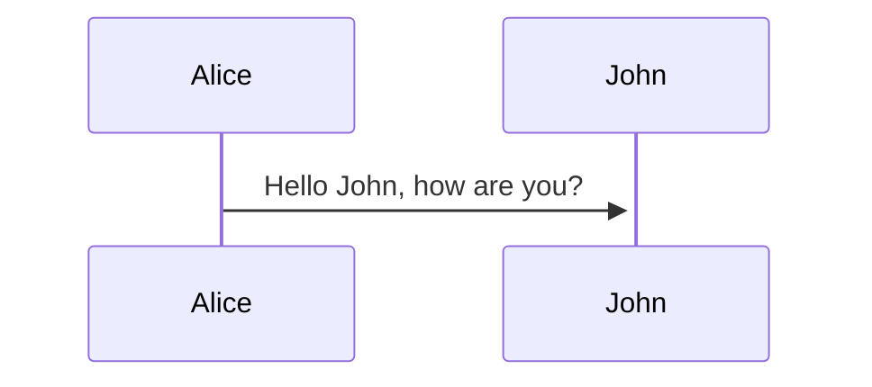

# Markdown 图

sequenceDiagram;
    Alice->>+John: Hello John, how are you?;
    Alice->>+John: John, can you hear me?;
    John-->>-Alice: Hi Alice, I can hear you!;
    John-->>-Alice: I feel great!;

