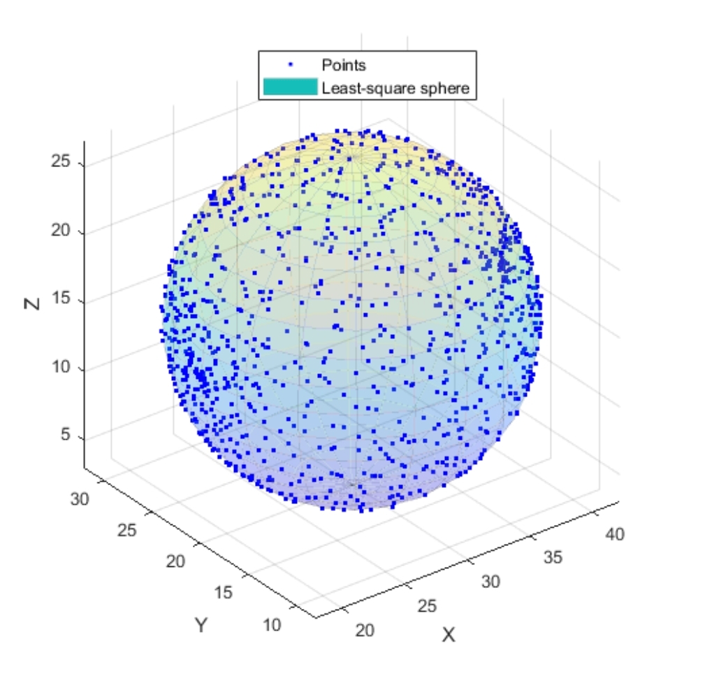

# 球體的最小平方法擬合

点云由 $n$ 个点给出，坐标分别为 $x_i, y_i, z_i$。目标是估计与这些点最匹配的球体参数 $x_c, y_c, z_c$ 和 $r$：

 - $X_c$ 是球心的 x 坐标
 - $Y_c$ 是球心的 y 坐标
 - $Z_c$ 是球心的 z 坐标
 - $r$ 是球体的半径

理想球体的方程为:

$$
(x_i-x_c)^2 + (y_i-y_c)^2  + (z_i-z_c)^2 = r^2
$$

上述方程重写为：

$$
x_i^2 + x_c^2 - 2x_ix_c + y_i^2 + y_c^2 - 2y_iy_c + z_i^2 + z_c^2 - 2z_iz_c = r^2
$$

$$
2x_cx_i + 2y_cy_i  + 2z_cz_i + r^2 - x_c^2 - y_c^2 - z_c^2 = x_i^2 + y_i^2 + z_i^2
$$

$$
ax_i + by_i + cz_i + d  = x_i^2 + y_i^2  + z_i^2
$$

$$
a = 2x_c,b = 2y_c,c = 2z_c,,d = r^2 - x_c^2 - y_c^2 - z_c^2
$$

整个系统（针对所有点）可以重写为：

$$
\begin{array}{rcl} ax_1 + by_1 + cz_1 + d & = & x_1^2 + y_1^2 + z_1^2 \\
ax_2 + by_2 + cz_2 + d & = & x_2^2 + y_2^2 + z_2^2 \\
& ... & \\
ax_n + by_n + cz_n + d & = & x_n^2 + y_n^2 + z_n^2 \\
\end{array}
$$

该系统的矩阵形式为：

$$
\left[ \begin{matrix} x_1 & y_1 & z_1 & 1 \\
x_2 & y_2 & z_2 & 1 \\
... & ... & ... & ... \\
x_n & y_n & z_3 & 1 \\
\end{matrix} \right].\left[ \begin{matrix}
a \\
b \\
c \\
d
\end{matrix} \right] = \left[ \begin{matrix}
x_1^2 + y_1^2 + z_1^2 \\
x_2^2 + y_2^2 + z_2^2 \\
... \\
x_n^2 + y_n^2 + z_n^2 \\
\end{matrix} \right]
$$

讓我們定義 A、B 和 X：

$$
\begin{matrix}
A=\left[ \begin{matrix}
x_1 & y_1 & z_1 & 1 \\
x_2 & y_2 & z_1 & 1 \\
... & ... & ... \\
x_n & y_n & z_1 & 1 \\
\end{matrix} \right]
&
B=\left[ \begin{matrix} x_1^2 + y_1^2 + z_1^2 \\  x_2^2 + y_2^2 + z_2^2  \\...  \\  x_n^2 + y_n^2 + z_n^2  \\ \end{matrix} \right]
&
X=\left[ \begin{matrix} a \\ b \\ c \\ d \end{matrix} \right]
\end{matrix}
$$

该系统现在由以下公式给出：

$$
A.X=B
$$

## 求解系统公式

$$
\hat{x}=A^{+}.B = A^{T}(A.A^{T})^{-1}.B
$$

其中 $A^{+}$ 是 $A$ 的伪逆。$A^{+}$ 可以通过以下公式计算：

$$
A^{+}=A^{T}(A.A^{T})^{-1}
$$

由於變數發生了變化，因此只需計算 $X_c、y_c、z_c$ 和 $r$：

$$ x_c = \dfrac{a}{2} $$

$$ y_c = \dfrac{b}{2} $$

$$ z_c = \dfrac{c}{2} $$

$$ r = \dfrac{ \sqrt{4d + a^2 + b^2 + c^2}}{2} $$

并获取球体的参数：

