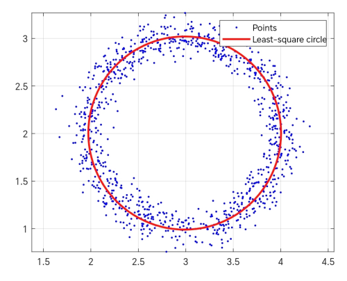

<style>
  table {
    width: 100%
    }
  td {
    vertical-align: center;
    text-align: center;
  }
  table.inputT{
    margin: 10px;
    width: auto;
    margin-left: auto;
    margin-right: auto;
    border: none;
  }
  input{
    text-align: center;
    padding: 0px 10px;
  }
  iframe{
    width: 100%;
    display: block;
    border-style:none;
  }
</style>


# 最小平方法

## 二次多项式

理想二次多项式的方程为:

$$
y(x)=ax^2+bx+c
$$

点云由坐标为 $x_i$ ， $y_i$ 的 $n$ 个点给出。目标是估计 $a$、$b$ 和 $c$，其中 $y(x)=ax^2+bx+c$ 尽可能拟合点云。目标是希望最小化每个点 $x_i$ 的 $y_i$ 和 $y(x_i)$ 之间的差异。


$$\sum \limits_{i=1}^n{(y_i-y(x_i))^2}$$

该系统的矩阵形式为：

$$
\left[\begin{matrix} {x_1}^2 & x_1 & 1 \\
{x_2}^2 & x_2 & 1 \\
... & ... & ... \\
{x_n}^2 & x_n & 1 \\
\end{matrix} \right].
\left[ \begin{matrix}
a \\
b \\
c \end{matrix} \right] = \left[ \begin{matrix} y_1 \\
y_2 \\
... \\
y_n \\
\end{matrix} \right]
$$

定義 $A$、$B$ 和 $X$：

$$
\begin{matrix}
A=\left[ \begin{matrix}
{x_1}^2 & x_1 & 1 \\
{x_2}^2 & x_2 & 1 \\
... & ... & ... \\
{x_n}^2 & x_n & 1 \\
\end{matrix} \right]
&
B=\left[ \begin{matrix} y_1 \\ y_2 \\...  \\ y_n \\ \end{matrix} \right]
&
X=\left[ \begin{matrix} a \\ b\\ c \end{matrix} \right]
\end{matrix}
$$

该系统发展为以下公式：

$$
A.X=B
$$


## 圆形

点云由 $n$ 个点组成，坐标分别为 $x_i$，$y_i$。目标是估算与这些点最匹配的圆的参数 $x_c$，$y_c$ 和 $r$：

 - $x_c$ 是圆心的 $x$ 坐标
 - $y_c$ 是圆心的 $y$ 坐标
 - $r$ 是圆的半径

理想圆的方程如下：

$$
(x_i-x_c)^2 + (y_i-y_c)^2 = r^2
$$

上述方程重写为：

$$
x_i^2 + x_c^2 - 2x_ix_c + y_i^2 + y_c^2 - 2y_iy_c = r^2
$$

$$
2x_cx_i + 2y_cy_i + r^2 - x_c^2 - y_c^2 = x_i^2 + y_i^2
$$

$$
ax_i + by_i + c  = x_i^2 + y_i^2
$$

$$
a = 2x_c, b = 2y_c, c = r^2 -  x_c^2 - y_c^2
$$

整个系统所有点可以重写为：

$$
\begin{array}{rcl}
ax_1 + by_1 + c & = & x_1^2 + y_1^2 \\
ax_2 + by_2 + c & = & x_2^2 + y_2^2 \\
& ... & \\
ax_n + by_n + c & = & x_n^2 + y_n^2 \\
\end{array}
$$

该系统的矩阵形式为：

$$
\left[ \begin{matrix}
x_1 & y_1 & 1 \\
x_2 & y_2 & 1 \\
... & ... & ... \\
x_n & y_n & 1 \\
\end{matrix} \right].
\left[ \begin{matrix}
a \\
b \\
c
\end{matrix} \right] =
\left[ \begin{matrix}
x_1^2 + y_1^2 \\
x_2^2 + y_2^2 \\
... \\
x_n^2 + y_n^2 \\
\end{matrix} \right]
$$

定義 $A$、$B$ 和 $X$：

$$
\begin{matrix}
A=\left[ \begin{matrix}
x_1 & y_1 & 1 \\
x_2 & y_2 & 1 \\
... & ... & ... \\
x_n & y_n & 1 \\
\end{matrix} \right]
&
B=\left[ \begin{matrix} x_1^2 + y_1^2 \\  x_2^2 + y_2^2  \\...  \\  x_n^2 + y_n^2  \\ \end{matrix} \right]
&
X=\left[ \begin{matrix} a \\ b \\ c \end{matrix} \right]
\end{matrix}
$$

该系统发展为以下公式：

$$
A.X=B
$$

由於變數發生了變化，因此只需計算 $x_c$、$y_c$、和 $r$ ：

$$
x_c = \dfrac{a}{2}
$$


$$
y_c = \dfrac{b}{2}
$$

$$
r = \dfrac{ \sqrt{4c + a^2 + b^2 }}{2}
$$




## 球體

点云由 $n$ 个点给出，坐标分别为 $x_i, y_i, z_i$。目标是估计与这些点最匹配的球体参数 $x_c, y_c, z_c$ 和 $r$：

 - $X_c$ 是球心的 x 坐标
 - $Y_c$ 是球心的 y 坐标
 - $Z_c$ 是球心的 z 坐标
 - $r$ 是球体的半径

理想球体的方程为:

$$
(x_i-x_c)^2 + (y_i-y_c)^2  + (z_i-z_c)^2 = r^2
$$

上述方程重写为：

$$
x_i^2 + x_c^2 - 2x_ix_c + y_i^2 + y_c^2 - 2y_iy_c + z_i^2 + z_c^2 - 2z_iz_c = r^2
$$

$$
2x_cx_i + 2y_cy_i  + 2z_cz_i + r^2 - x_c^2 - y_c^2 - z_c^2 = x_i^2 + y_i^2 + z_i^2
$$

$$
ax_i + by_i + cz_i + d  = x_i^2 + y_i^2  + z_i^2
$$

$$
a = 2x_c, b = 2y_c, c = 2z_c, d = r^2 - x_c^2 - y_c^2 - z_c^2
$$

整个系统所有点可以重写为：

$$
\begin{array}{rcl} ax_1 + by_1 + cz_1 + d & = & x_1^2 + y_1^2 + z_1^2 \\
ax_2 + by_2 + cz_2 + d & = & x_2^2 + y_2^2 + z_2^2 \\
& ... & \\
ax_n + by_n + cz_n + d & = & x_n^2 + y_n^2 + z_n^2 \\
\end{array}
$$

该系统的矩阵形式为：

$$
\left[ \begin{matrix} x_1 & y_1 & z_1 & 1 \\
x_2 & y_2 & z_2 & 1 \\
... & ... & ... & ... \\
x_n & y_n & z_3 & 1 \\
\end{matrix} \right].\left[ \begin{matrix}
a \\
b \\
c \\
d
\end{matrix} \right] = \left[ \begin{matrix}
x_1^2 + y_1^2 + z_1^2 \\
x_2^2 + y_2^2 + z_2^2 \\
... \\
x_n^2 + y_n^2 + z_n^2 \\
\end{matrix} \right]
$$

定義 $A$、$B$ 和 $X$：

$$
\begin{matrix}
A=\left[ \begin{matrix}
x_1 & y_1 & z_1 & 1 \\
x_2 & y_2 & z_1 & 1 \\
... & ... & ... \\
x_n & y_n & z_1 & 1 \\
\end{matrix} \right]
&
B=\left[ \begin{matrix} x_1^2 + y_1^2 + z_1^2 \\  x_2^2 + y_2^2 + z_2^2  \\...  \\  x_n^2 + y_n^2 + z_n^2  \\ \end{matrix} \right]
&
X=\left[ \begin{matrix} a \\ b \\ c \\ d \end{matrix} \right]
\end{matrix}
$$

该系统发展为以下公式：

$$
A.X=B
$$

由於變數發生了變化，因此只需計算 $x_c、y_c、z_c$ 和 $r$：

$$ x_c = \dfrac{a}{2} $$

$$ y_c = \dfrac{b}{2} $$

$$ z_c = \dfrac{c}{2} $$

$$ r = \dfrac{ \sqrt{4d + a^2 + b^2 + c^2}}{2} $$

并获取球体的参数：


# 求解以上系统公式 (伪逆)


以上所有示例可以发展为以下公式表达：

$$
A.X=B
$$

基于以上原因，只须求解以上方程。即可找到示例相关答案。但一般情况下。以上得出的公式不为方阵，所以要用 **<font color="#FF0010">伪逆</font>** 求解以上方程。

伪逆和矩阵逆之间没有“区别”，因为如果一个矩阵有逆，那么它也一定有一个唯一的伪逆，并且与逆相同。但许多矩阵没有逆。如非方阵及行列式为零的方阵（“不可逆”）。所有这些矩阵，甚至包括全零的矩形矩阵，都有伪逆。所以要用伪逆作为计算方法。

伪逆 $A^{+}$ 常见用作计算无精确解的线性方程组的“最佳拟合”（最小二乘）近似解。

$$
\hat{x}=A^{+}.B = A^{T}(A.A^{T})^{-1}.B
$$

其中 $A^{+}$ 是 $A$ 的伪逆。$A^{+}$ 可以通过以下公式计算：

$$
A^{+}=A^{T}(A.A^{T})^{-1}
$$

## 对角矩阵 

如果 $ A_{n \cdot m} $ 为对角矩阵，则所计算出来的 $A^{+}$ 乘的位置取决于矩阵 行($n$) 和 列($m$) 小的那边。


$$
m \ge n \Rightarrow A^{+}A=I_{n}, \\
m \le n \Rightarrow AA^{+}=I_{m}
$$

以上偽逆是非奇異方陣逆的概念向奇異矩陣和矩形矩陣的擴展。它是眾多廣義逆之一，但由於它具有許多特殊性質，因此在實踐中最有用。

如下動畫說明 $A$ 转换至 $A^{T}$ 可源自透過主對角線的反射。


逆距陣求法：

$$
D=A.A^{T}
$$

$$
D^{-1}= \frac {1}{|D|} \cdot Adj  D
$$

$$
A^{+}=A^{T}(D)^{-1}
$$

$$
A.X=B \Rightarrow
A^{+}A.X = A^{+}.B \Rightarrow
I.X = A^{+}.B
$$

$$
\left[ \begin{matrix}
a \\
b \\
c \\
d
\end{matrix} \right] = \hat{x}=A^{+}.B = A^{T}D^{-1}.B
$$

## 总结需要留意地方

- 以下<font color="#FF0010">最少值</font>为 **行** 或 **列** 中比较少的数值。例如 $nxm$ 矩阵中。$n$ 或 $m$ 较少那個。
- 计算逆時。先要计算最少值边的方阵，这取决于**转置矩阵乘矩阵**或**矩阵乘转置矩阵**。再用方阵计算出矩阵的逆。
- 在计算矩阵的偽逆時，行为最少值。这取决于**转置矩阵乘矩阵的逆**或**矩阵的逆乘转置矩阵**。


## 求逆矩阵 **D** 的 C 源代码

```c
#include <stdio.h>
#define MAX_SIZE 10

// 讀取矩陣元素的函數
void readMatrix(float matrix[MAX_SIZE][MAX_SIZE], int n, int m)
{
  printf("Enter the elements row of the %dx%d matrix:\n", n, m);
  for (int j = 0; j < m; j++)
  {
    for (int i = 0; i < n; i++)
    {
      printf("Enter element [%d][%d]: ", i, j);
      scanf("%f", &matrix[i][j]);
    }
  }
}

// 顯示浮點矩陣的函數（用於逆）
void displayMatrix(float matrix[MAX_SIZE][MAX_SIZE], int n, int m)
{
  for (int i = 0; i < n; i++)
  {
    for (int j = 0; j < m; j++)
    {
      printf("%.6f\t", matrix[i][j]);
    }
    printf("\n");
  }
  printf("\n");
}

// 將矩陣元素初始化為 0
void init(float result[MAX_SIZE][MAX_SIZE], int n, int m)
{
  int max = (n > m ? n : m);
  for (int i = 0; i < max; ++i)
  {
    for (int j = 0; j < max; ++j)
    {
      result[i][j] = 0;
    }
  }
}

// 計算转置矩阵的函數
void transpose(float matrix[MAX_SIZE][MAX_SIZE], int n, int m, float tr[MAX_SIZE][MAX_SIZE])
{
  init(tr, n, m);
  for (int i = 0; i < n; i++)
  {
    for (int j = 0; j < m; j++)
    {
      tr[j][i] = matrix[i][j];
    }
  }
}

// 獲取函數餘因子 matrix[p][q] in temp[][]
void getCofactor(float matrix[MAX_SIZE][MAX_SIZE], float temp[MAX_SIZE][MAX_SIZE], int p, int q,
         int n)
{
  int i = 0, j = 0;
  for (int row = 0; row < n; row++)
  {
    for (int col = 0; col < n; col++)
    {
      if (row != p && col != q)
      {
        temp[i][j++] = matrix[row][col];
        if (j == n - 1)
        {
          j = 0;
          i++;
        }
      }
    }
  }
}

// 遞歸函數找出矩陣的行列式
int determinant(float matrix[MAX_SIZE][MAX_SIZE], int n)
{
  int det = 0;
  if (n == 1)
    return matrix[0][0];
  float temp[MAX_SIZE][MAX_SIZE];
  int sign = 1;
  for (int f = 0; f < n; f++)
  {
    getCofactor(matrix, temp, 0, f, n);
    det += sign * matrix[0][f] * determinant(temp, n - 1);
    sign = -sign;
  }
  return det;
}

// 計算矩陣伴隨的函數
void adjoint(float matrix[MAX_SIZE][MAX_SIZE], float adj[MAX_SIZE][MAX_SIZE], int n)
{
  if (n == 1)
  {
    adj[0][0] = 1;
    return;
  }
  int sign = 1;
  float temp[MAX_SIZE][MAX_SIZE];
  for (int i = 0; i < n; i++)
  {
    for (int j = 0; j < n; j++)
    {
      // 獲取的餘因子 matrix[i][j]
      getCofactor(matrix, temp, i, j, n);
      // 若行和列索引之和為偶數，則 adj[j][i]
      // 的符號為正
      sign = ((i + j) % 2 == 0) ? 1 : -1;
      // 交換行和列以獲得餘因子矩陣的轉置
      adj[j][i] = sign * determinant(temp, n - 1);
    }
  }
}

// 計算矩陣逆的函數
int inverse(float matrix[MAX_SIZE][MAX_SIZE], float inv[MAX_SIZE][MAX_SIZE], int n)
{
  // 求矩陣的行列式
  int det = determinant(matrix, n);
  // 如果行列式為零，則矩陣不可逆
  if (det == 0)
  {
    printf("Matrix is not invertible as determinant is zero.\n");
    return 0;
  }
  // 求矩陣的伴隨
  float adj[MAX_SIZE][MAX_SIZE];
  adjoint(matrix, adj, n);
  // 將伴隨式除以行列式來求逆
  for (int i = 0; i < n; i++)
  {
    for (int j = 0; j < n; j++)
    {
      inv[i][j] = adj[i][j] / (float)det;
    }
  }
  return 1;
}

void mult(float A[MAX_SIZE][MAX_SIZE], int n0, int m0, float B[MAX_SIZE][MAX_SIZE], int n1, int m1,
      float D[MAX_SIZE][MAX_SIZE])
{
  init(D, n0, m1);
  for (int i = 0; i < n0; ++i)
  {
    for (int j = 0; j < m1; ++j)
    {
      for (int k = 0; k < m0; ++k)
      {
        D[i][j] += A[i][k] * B[k][j];
      }
    }
  }
}

void pseudo(float A[MAX_SIZE][MAX_SIZE], int n, int m, float result[MAX_SIZE][MAX_SIZE])
{
  float tr[MAX_SIZE][MAX_SIZE];
  float inv[MAX_SIZE][MAX_SIZE];
  float D[MAX_SIZE][MAX_SIZE];
  init(tr, m, n);
  transpose(A, n, m, tr);
  init(D, n, m);
  init(inv, n, m);
  if (n < m)
  {
    mult(A, n, m, tr, m, n, D);
    inverse(D, inv, n);
    mult(tr, m, n, inv, n, n, result);
    displayMatrix(result, m, n);
  }
  else
  {
    mult(tr, m, n, A, n, m, D);
    inverse(D, inv, m);
    mult(inv, m, m, tr, m, n, result);
    displayMatrix(result, m, n);
  }
}

int main()
{
  float A[MAX_SIZE][MAX_SIZE];
  float result[MAX_SIZE][MAX_SIZE];
  int n, m;
  // 取得矩陣大小
  printf("Pseudo Inverse Calculator\n");
  printf("=========\n");
  printf("Enter the size of the  matrix (1-%d) in R,C: ", MAX_SIZE);
  scanf("%d,%d", &n, &m);
  // 驗證矩陣大小
  int max = (n > m ? n : m);
  if (max <= 0 || max > MAX_SIZE)
  {
    printf("Invalid matrix size. Please enter a size between 1 and %d.\n", MAX_SIZE);
    return 1;
  }
  // 讀取矩陣元素
  readMatrix(A, n, m);
  // 顯示原始矩陣
  printf("\nOriginal:\n");
  displayMatrix(A, n, m);
  // 計算並顯示行列式
  pseudo(A, n, m, result);
  displayMatrix(result, m, n);
  return 0;
}
```

## 求逆矩阵 **D** 的动态版本 C 代码

```c
#include <stdio.h>
#include <stdlib.h>

float **createMatrix(int r, int c)
{
  float **matrix = (float **)malloc(r * sizeof(float *));
  for (int i = 0; i < r; i++)
    matrix[i] = (float *)malloc(c * sizeof(float));
  return matrix;
}

void freeMatrix(float **matrix, int r)
{
  for (int i = 0; i < r; i++)
    free(matrix[i]);
  free(matrix);
}

// 讀取矩陣元素的函數
void readMatrix(float **matrix, int r, int c)
{
  printf("Enter the elements row of the %dx%d matrix:\n", r, c);
  for (int j = 0; j < c; j++)
    for (int i = 0; i < r; i++)
    {
      printf("Enter element [%d][%d]: ", i, j);
      float value;
      scanf("%f", &value);
      matrix[i][j] = value;
    }
}

// 顯示浮點矩陣的函數（用於逆）
void displayMatrix(float **matrix, int r, int c)
{
  for (int i = 0; i < r; i++)
  {
    for (int j = 0; j < c; j++)
      printf("%.6f\t", matrix[i][j]);
    printf("\n");
  }
  printf("\n");
}

// 計算转置矩阵的函數 
void transpose(float **matrix, int n, int m, float **tr)
{
  for (int i = 0; i < n; i++)
    for (int j = 0; j < m; j++)
      tr[j][i] = matrix[i][j];
}

// 獲取函數餘因子 matrix[p][q] in temp[][] 
void getCofactor(float **matrix, float **temp, int p, int q, int n)
{
  int i = 0, j = 0;
  for (int row = 0; row < n; row++)
    for (int col = 0; col < n; col++)
      if (row != p && col != q)
      {
        temp[i][j++] = matrix[row][col];
        if (j == n - 1)
        {
          j = 0;
          i++;
        }
      }
}

// 遞歸函數找出矩陣的行列式 
int determinant(float **matrix, int n)
{
  float det = 0;
  if (n == 1)
    return matrix[0][0];
  float **temp = createMatrix(n, n);
  int sign = 1;
  for (int f = 0; f < n; f++)
  {
    getCofactor(matrix, temp, 0, f, n);
    det += sign * matrix[0][f] * determinant(temp, n - 1);
    sign = -sign;
  }
  freeMatrix(temp, n);
  return det;
}

// 計算矩陣伴隨的函數 
void adjoint(float **matrix, float **adj, int n)
{
  if (n == 1)
  {
    adj[0][0] = 1;
    return;
  }
  int sign = 1;
  float **temp = createMatrix(n, n);
  for (int i = 0; i < n; i++)
    for (int j = 0; j < n; j++)
    {
      // 獲取的餘因子 matrix[i][j]
      getCofactor(matrix, temp, i, j, n);
      // 若行和列索引之和為偶數，符號為正 adj[j][i] 
      sign = ((i + j) % 2 == 0) ? 1 : -1;
      // 交換行和列以獲得餘因子矩陣的轉置
      adj[j][i] = sign * determinant(temp, n - 1);
    }
  freeMatrix(temp, n);
}

// 計算矩陣逆的函數 
int inverse(float **matrix, float **inv, int n)
{
  // 求矩陣的行列式
  float det = determinant(matrix, n);
  // 如果行列式為零，則矩陣不可逆
  if (det == 0)
  {
    printf("Matrix is not invertible as determinant is zero.\n");
    return 0;
  }
  // 求矩陣的伴隨 
  float **adj = createMatrix(n, n);
  adjoint(matrix, adj, n);
  // 將伴隨式除以行列式來求逆 
  for (int i = 0; i < n; i++)
    for (int j = 0; j < n; j++)
      inv[i][j] = adj[i][j] / det;
  freeMatrix(adj, n);
  return 1;
}

void mult(float **A, int n0, int m0, float **B, int n1, int m1, float **D)
{
  for (int i = 0; i < n0; ++i)
    for (int j = 0; j < m1; ++j)
      for (int k = 0; k < m0; ++k)
        D[i][j] += A[i][k] * B[k][j];
}

void pseudo(float **A, int r, int c, float **result)
{
  int min = (r > c ? c : r);
  float **tr = createMatrix(c, r);
  float **D = createMatrix(min, min);
  float **inv = createMatrix(min, min);
  transpose(A, r, c, tr);
  displayMatrix(tr, c, r);
  mult(tr, c, r, A, r, c, D);
  displayMatrix(D, min, min);
  inverse(D, inv, min);
  displayMatrix(inv, min, min);
  mult(inv, min, min, tr, c, r, result);
  displayMatrix(result, c, r);
  freeMatrix(inv, min);
  freeMatrix(D, min);
  freeMatrix(tr, c);
}

int main()
{
  int r, c;
  printf("Pseudo Inverse Calculator\n");
  printf("=========\n");
  printf("Enter the size of the  matrix in R,C: ");
  scanf("%d,%d", &r, &c);

  float **A = createMatrix(r, c);
  float **result = createMatrix(c, r);
  float **out = createMatrix(c, c);

  readMatrix(A, r, c);
  displayMatrix(A, r, c);
  pseudo(A, r, c, result);
  mult(result, c, r, A, r, c, out);
  displayMatrix(out, c, c);
  
  freeMatrix(A, r);
  freeMatrix(result, c);
  freeMatrix(out, c);
  return 0;
}
```