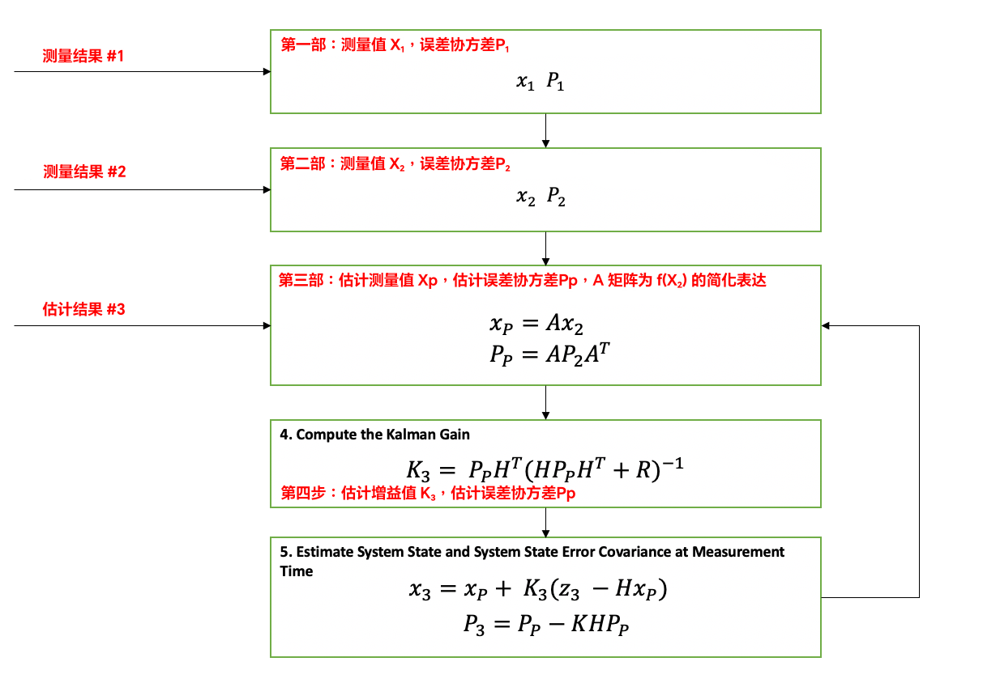

# Kalman Filter 教程 (卡爾曼濾波)

## 测量结果 #1

$$
x_1=\left[\begin{matrix} x_1 \\ y_1 \\ \hat{x_1} \\ \hat{y_1} \end{matrix} \right]=\left[\begin{matrix} x_1 \\ y_1 \\ 0 \\ 0 \end{matrix} \right]
$$

$\hat{x_1}，\hat{y_1}$ 分别为 X 轴及 Y 轴的速度。

$$
P_1=\left[\begin{matrix} 
\sigma_x^2 & \sigma_{xy} & 0 & 0 \\ 
\sigma_{xy} & \sigma_y^2 & 0 & 0 \\
0 & 0 & 0 & 0 \\
0 & 0 & 0 & 0
 \end{matrix}\right]
$$

## 测量结果 #2

$$
x_1=\left[\begin{matrix} x_2 \\ y_2 \\ \hat{x_2} \\ \hat{y_2} \end{matrix} \right]=\left[\begin{matrix} x_2 
\\ y_2 
\\ \frac{x_2-x_1}{\Delta{t}} 
\\ \frac{y_2-y_1}{\Delta{t}}  \end{matrix} \right]
$$

$\hat{x_2}，\hat{y_2}$ 分别为 X 轴及 Y 轴的速度，$\Delta{t}$ 为两组连续数据的时间差。

$$
P_1=\left[\begin{matrix} 
\sigma_x^2 & \sigma_{xy} & 0 & 0 \\ 
\sigma_{xy} & \sigma_y^2 & 0 & 0 \\
0 & 0 & 10^4 & 0 \\
0 & 0 & 0 & 10^4
 \end{matrix}\right]
$$

$10^4$ 为猜测的最初错误值，多次计算后会接近真实值。

## 测量结果 #3

$$
x_p=\left[\begin{matrix} x_2 + \hat{x_2} \Delta{t}
\\ y_2 + \hat{x_y} \Delta{t}
\\ \hat{x_2} 
\\ \hat{y_2} \end{matrix} \right]=\left[\begin{matrix}
1 & 0 & \Delta{t} & 0
\\ 0 & 1 & 0 & \Delta{t}
\\ 0 & 0 & 1 & 0 
\\ 0 & 0 & 0 & 1 
\end{matrix} \right] \times \left[\begin{matrix} x_2 
\\ y_2
\\ \hat{x_2} 
\\ \hat{y_2} \end{matrix} \right]=Ax_2
$$

$$
P_p=\left[\begin{matrix}
1 & 0 & \Delta{t} & 0
\\ 0 & 1 & 0 & \Delta{t}
\\ 0 & 0 & 1 & 0 
\\ 0 & 0 & 0 & 1 
\end{matrix} \right] \times  P_2 \times \left[\begin{matrix}
1 & 0 & 0 & 0
\\ 0 & 1 & 0 & 0
\\ \Delta{t} & 0 & 1 & 0 
\\ 0 & \Delta{t} & 0 & 1 
\end{matrix} \right]=A P_2 A^T 
$$

${x_p}，{P_p}$ 分别为估算的下一组数据及相对应协方差。

