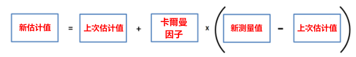

# Kalman Filter 教程 (卡爾曼濾波)

## 应用例子如下 (多维度卡尔曼计算)

输入测量仅包含位置信息。输出系统状态将包含物体的位置和速度。速度用线性近似来估计。

### 初值

$$
x_1=\left[\begin{matrix} x_1 \\ y_1 \\ \hat{x_1} \\ \hat{y_1} \end{matrix} \right]=\left[\begin{matrix} x_1 \\ y_1 \\ 0 \\ 0 \end{matrix} \right]
$$

$\hat{x_1}，\hat{y_1}$ 分别为 X 轴及 Y 轴的速度。

$$
P_1=\left[\begin{matrix} 
\sigma_x^2 & \sigma_{xy} & 0 & 0 \\ 
\sigma_{xy} & \sigma_y^2 & 0 & 0 \\
0 & 0 & 0 & 0 \\
0 & 0 & 0 & 0
 \end{matrix}\right]
$$

### 前值

$$
x_2=\left[\begin{matrix} x_2 \\ y_2 \\ \hat{x_2} \\ \hat{y_2} \end{matrix} \right]=\left[\begin{matrix} x_2 
\\ y_2 
\\ \frac{x_2-x_1}{\Delta{t}} 
\\ \frac{y_2-y_1}{\Delta{t}}  \end{matrix} \right]
$$

$\hat{x_2}，\hat{y_2}$ 分别为 X 轴及 Y 轴的速度，$\Delta{t}$ 为两组连续数据的时间差。

$$
P_2=\left[\begin{matrix} 
\sigma_x^2 & \sigma_{xy} & 0 & 0 \\ 
\sigma_{xy} & \sigma_y^2 & 0 & 0 \\
0 & 0 & 10^4 & 0 \\
0 & 0 & 0 & 10^4
 \end{matrix}\right]
$$

$10^4$ 为猜测的最初错误值，多次计算后会接近真实值。

### 目前状态

$$
x_3=\left[\begin{matrix} x_2 + \hat{x_2} \Delta{t}
\\ y_2 + \hat{x_y} \Delta{t}
\\ \hat{x_2} 
\\ \hat{y_2} \end{matrix} \right]=\left[\begin{matrix}
1 & 0 & \Delta{t} & 0
\\ 0 & 1 & 0 & \Delta{t}
\\ 0 & 0 & 1 & 0 
\\ 0 & 0 & 0 & 1 
\end{matrix} \right] \times \left[\begin{matrix} x_2 
\\ y_2
\\ \hat{x_2} 
\\ \hat{y_2} \end{matrix} \right]=Ax_2
$$

$$
P_3=\left[\begin{matrix}
1 & 0 & \Delta{t} & 0
\\ 0 & 1 & 0 & \Delta{t}
\\ 0 & 0 & 1 & 0 
\\ 0 & 0 & 0 & 1 
\end{matrix} \right] \times  P_2 \times \left[\begin{matrix}
1 & 0 & 0 & 0
\\ 0 & 1 & 0 & 0
\\ \Delta{t} & 0 & 1 & 0 
\\ 0 & \Delta{t} & 0 & 1 
\end{matrix} \right]=A P_2 A^T 
$$

${x_3}，{P_3}$ 分别为估算的下一组数据及相对应协方差。

### 计算卡爾曼因子及新估计值

#### 卡爾曼因子 (介於 `0` 到 `1` 之間)

$$
G= \frac{估计协防差}{估计协方差 + 测量协方差}= \frac{p_n}{p_n+R}
$$

 - **测量协方差** 是設備誤差在整個估計過程中是固定不變的 : $ R $

为了求出以上公式最优的 **新估计值**，唯一不知道的量就是卡爾曼因子 **G**。而衡量最优的解的条件是什么?
显然在概率统计中协方差越小，数据围绕真实值越集中。因此此时的目标就是寻找一个 **G** 的计算式，使估计协方差的值为最小。

#### 协方差佢阵 

如上图。因假设数据是高斯分布。所以协方差佢阵的意义是指。如参数无相互影响。即只有对角矩阵存在即 $\sigma_{12}=0$。否则就会有其它参数。反映其数值的相互影响，即正相关为 $\sigma_{12}>0$，负相关为 $\sigma_{12}<0$ 。在多位矩阵下也是用这种方法表示相关的差值。

### 一维卡尔曼计算例子 (A = 1)

建筑物真实高度为 50 米。

高度计测量误差（标准差）$\sigma$ 为 5 米。$R=\sigma^2=25 $ 是固定不变值。

测量数据如下为米

|1|2|3|4|5|6|7|8|9|10|
|:---:|:---:|:---:|:---:|:---:|:---:|:---:|:---:|:---:|:---:|
|49.03|48.44|55.21|49.98|50.6|52.61|45.87|42.64|48.26|55.84|

为了初始化目的，建筑物的估计高度为：60 米

现在初始化估计方差。人类估计的误差（标准差）约为 15 米：$σ=15m$。因此方差为 $225：σ^2=225m^2$。

 - 第一次估计
 
$$
G =\frac{P_3}{P_3 +R}=\frac{225}{225+25}=0.9， \\
\hat{x}_3 =x_3 + G \left( X_3 - x_3 \right) = 60+0.9 \left( 49.03-60 \right) = 50.13m， \\
\hat{P}_3 = (1-G)P_3=(1-0.9)\times 225=22.5m^2
$$

 - 第二次估计

$$
G =\frac{P_3}{P_3 +R} = \frac{22.5}{22.5+25} = 0.4737， \\
\hat{x}_3 = x_3 + G \left( X_3 - x_3 \right) = 50.13+0.4737 \left( 48.44-50.13 \right) = 49.33m， \\
\hat{P}_3 = (1-G)P_3 = (1-0.4737) \times 22.5 = 11.84m^2
$$

 - 第三次估计

$$
G = \frac{11.84}{11.84+25}= 0.3214， \\
\hat{x}_3 = 49.33+0.3214 \left( 55.21-49.33 \right) = 51.22m， \\
\hat{P}_3 = (1-0.3214)  11.84 = 8.04m^2
$$

 - 第四次估计

$$
G= \frac{8.04}{8.04+25}=0.2433，
\\
\hat{x}_3 = 51.22+0.2433 \left( 49.98 -51.22 \right) = 50.92m，\\
\hat{P}_3 = \left( 1-0.2433 \right) 8.04 = 6.08m^{2}
$$

 - 第五次估计

$$
G = \frac{6.08}{6.08+25}=0.1956，\\
\hat{x}_3 = 50.92+0.1956 \left( 50.6 -50.92 \right) = 50.86m，\\
\hat{P}_3 = \left( 1-0.1956 \right) 6.08 = 4.89m^{2}
$$

 - 第六次估计

$$
G = \frac{4.89}{4.89+25} = 0.1635，\\
\hat{x}_3 = 50.86 + 0.1635 \left( 52.61 -50.86 \right) =51.15m，\\
\hat{P}_3 =  \left( 1-0.1635 \right) 4.89=4.09m^{2}
$$

 - 第七次估计
 
$$
G = \frac{4.09}{4.09+25} = 0.1392，\\
\hat{x}_3 = 51.15 +0.1392 \left( 45.87 -51.15 \right) = 50.41m，\\
\hat{P}_3 = \left( 1-0.1392 \right) 4.09 = 3.52m^{2}
$$

 - 第八次估计

$$
G = \frac{3.52}{3.52+25} = 0.1234，\\
\hat{x}_3 = 50.41 +0.1234 \left( 42.64 -50.41 \right) = 49.45m，\\
\hat{P}_3 =  \left( 1-0.1234 \right) 3.52=3.08m^{2}
$$

 - 第九次估计

$$
G = \frac{3.08}{3.08+25}=0.1096，\\
\hat{x}_3 = 49.45 + 0.1096 \left( 48.26 - 49.45 \right) = 49.32m，\\
\hat{P}_3 =  \left( 1-0.1096 \right) 3.08 = 2.74m^{2}
$$

 - 第十次估计

$$
G = \frac{2.74}{2.74+25} = 0.0987，\\
\hat{x}_3 = 49.32 + 0.0987 \left( 55.84 - 49.32 \right) = 49.96m，\\
\hat{P}_3 =  \left( 1-0.0987 \right) 2.74 = 2.47m^{2}
$$

根据上述计算，建筑物的最终高度将是 49.96 米