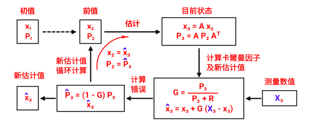

# Kalman Filter 教程 (卡爾曼濾波)

## 应用例子如下

输入测量仅包含位置信息。输出系统状态将包含物体的位置和速度。速度用线性近似来估计。

### 初值

$$
x_1=\left[\begin{matrix} x_1 \\ y_1 \\ \hat{x_1} \\ \hat{y_1} \end{matrix} \right]=\left[\begin{matrix} x_1 \\ y_1 \\ 0 \\ 0 \end{matrix} \right]
$$

$\hat{x_1}，\hat{y_1}$ 分别为 X 轴及 Y 轴的速度。

$$
P_1=\left[\begin{matrix} 
\sigma_x^2 & \sigma_{xy} & 0 & 0 \\ 
\sigma_{xy} & \sigma_y^2 & 0 & 0 \\
0 & 0 & 0 & 0 \\
0 & 0 & 0 & 0
 \end{matrix}\right]
$$

### 前值

$$
x_2=\left[\begin{matrix} x_2 \\ y_2 \\ \hat{x_2} \\ \hat{y_2} \end{matrix} \right]=\left[\begin{matrix} x_2 
\\ y_2 
\\ \frac{x_2-x_1}{\Delta{t}} 
\\ \frac{y_2-y_1}{\Delta{t}}  \end{matrix} \right]
$$

$\hat{x_2}，\hat{y_2}$ 分别为 X 轴及 Y 轴的速度，$\Delta{t}$ 为两组连续数据的时间差。

$$
P_2=\left[\begin{matrix} 
\sigma_x^2 & \sigma_{xy} & 0 & 0 \\ 
\sigma_{xy} & \sigma_y^2 & 0 & 0 \\
0 & 0 & 10^4 & 0 \\
0 & 0 & 0 & 10^4
 \end{matrix}\right]
$$

$10^4$ 为猜测的最初错误值，多次计算后会接近真实值。

### 目前状态

$$
x_3=\left[\begin{matrix} x_2 + \hat{x_2} \Delta{t}
\\ y_2 + \hat{x_y} \Delta{t}
\\ \hat{x_2} 
\\ \hat{y_2} \end{matrix} \right]=\left[\begin{matrix}
1 & 0 & \Delta{t} & 0
\\ 0 & 1 & 0 & \Delta{t}
\\ 0 & 0 & 1 & 0 
\\ 0 & 0 & 0 & 1 
\end{matrix} \right] \times \left[\begin{matrix} x_2 
\\ y_2
\\ \hat{x_2} 
\\ \hat{y_2} \end{matrix} \right]=Ax_2
$$

$$
P_3=\left[\begin{matrix}
1 & 0 & \Delta{t} & 0
\\ 0 & 1 & 0 & \Delta{t}
\\ 0 & 0 & 1 & 0 
\\ 0 & 0 & 0 & 1 
\end{matrix} \right] \times  P_2 \times \left[\begin{matrix}
1 & 0 & 0 & 0
\\ 0 & 1 & 0 & 0
\\ \Delta{t} & 0 & 1 & 0 
\\ 0 & \Delta{t} & 0 & 1 
\end{matrix} \right]=A P_2 A^T 
$$

${x_3}，{P_3}$ 分别为估算的下一组数据及相对应协方差。

### 计算卡爾曼因子及新估计值

#### 卡爾曼因子 (介於 `0` 到 `1` 之間)

$$
G= \frac{估计协防差}{估计协方差 + 测量协方差}= \frac{p_n}{p_n+R}
$$

 - **测量协方差** 是設備誤差在整個估計過程中是固定不變的 : $ R $

为了求出以上公式最优的 **新估计值**，唯一不知道的量就是卡爾曼因子 **G**。而衡量最优的解的条件是什么?
显然在概率统计中协方差越小，数据围绕真实值越集中。因此此时的目标就是寻找一个 **G** 的计算式，使估计协方差的值为最小。

### 例一

建筑物真实高度为 50 米。

高度计测量误差（标准差）为5米。$R=\sigma^2=25 $ 是固定不变值。

测量数据如下为米

|1|2|3|4|5|6|7|8|9|10|
|:---:|:---:|:---:|:---:|:---:|:---:|:---:|:---:|:---:|:---:|
|49.03|48.44|55.21|49.98|50.6|52.61|45.87|42.64|48.26|55.84|

为了初始化目的，建筑物的估计高度为：60 米

现在初始化估计方差。人类估计的误差（标准差）约为 15 米：$σ=15m$。因此方差为 $225：σ^2=225m^2$。