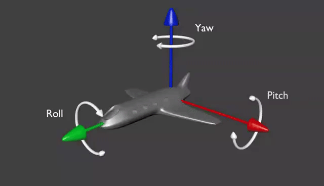

<style>
  table {
    width: 100%
    }
  td {
    vertical-align: center;
    text-align: center;
  }
  table.inputT{
    margin: 10px;
    width: auto;
    margin-left: auto;
    margin-right: auto;
    border: none;
  }
  input{
    text-align: center;
    padding: 0px 10px;
  }
  iframe{
    width: 100%;
    display: block;
    border-style:none;
  }
</style>


# 四元数 教程

旋转的表达方式有很多种，有欧拉角，旋转矩阵，轴角，四元素等。

四元数是通常用于 3D 旋转的矩阵方法的替代方法。 四元数表示 3D 空间中的轴和绕该轴的旋转。


利用四元数内插，应用程序可计算出从一个轴和方向到另一个轴和方向的平滑且合理的路径。


当要合成和内插一起使用时，看起来很复杂。四元数是简单的方法操作几何图形。例如，假设点要旋转到某个给定方向的几何图形。 知道想要绕轴2将其旋转 r₂ 度，然后绕轴1将其旋转 r₁ 度，但不知道最终的四元数。 通过使用合成，可将几何图形上的两个旋转组合以而获得单个四元数，即 **结果四元数**。 然后，可能从原四元数内插到合成的 **结果四元数** 以实现从一个四元数到另一个四元数的顺利转换。

四元数可以用来表示平移，具体方法是将四元数与一个点相乘，得到的结果即为平移后的点。

例如，对于一个点 $p$ 和一个四元数 $q$，可以使用以下公式计算出平移后的点：

$$
p^{'} = q * p * q^{-1}
$$




## C 头文件

```c
#pragma once
#include <stdbool.h>
#include <stdint.h>
#include <stdio.h>
#include <math.h>

#define Quat_EPS  (1e-4)

typedef struct Quat_t
{
	double w;		 
	double v[3];
} Quat_t;

typedef struct Euler_t
{
  double Pitch;
  double Roll;
  double Yaw;
} Euler_t;

double arctan2(double y, double x);

void Qu_print(char* info, Quat_t* q);
void Euler_print(char* info, Euler_t* e);
void Euler_print_RAD(char *info, Euler_t * e);
void Axis_print(char* info, double* axis, double angle);
void Qu_fprint(FILE* file, Quat_t* q);

void Qu_set(double w, double v1, double v2, double v3, Quat_t* output);
void Qu_setIdentity(Quat_t* q);
void Qu_copy(Quat_t* q, Quat_t* output);
bool Qu_equal(Quat_t* q1, Quat_t* q2);

void Qu_fromEulerZYX(double eulerZYX[3], Quat_t* output);
void Qu_toEulerZYX(Quat_t* q, double output[3]);
void Qu_fromXRotation(double angle, Quat_t* output);
void Qu_fromYRotation(double angle, Quat_t* output);
void Qu_fromZRotation(double angle, Quat_t* output);

double Qu_norm(Quat_t* q);
void Qu_normalize(Quat_t* q, Quat_t* output);
void Qu_conjugate(Quat_t* q, Quat_t* output);

void Qu_multiply(Quat_t* q1, Quat_t* q2, Quat_t* output);
void Qu_rotate(Quat_t* q, double v[3], double output[3]);

void Vector_Euler(double x, double y, double z, Euler_t* output);
void Euler_to_Qu(Euler_t* euler_angle, Quat_t* output);
void Qu_to_Eular(Quat_t* q, Euler_t* euler_angle);

void AxisAngle_Qu(double axis[3], double angle, Quat_t* output);
double Qu_AxisAngle(Quat_t* q, double output[3]);

void Qu_slerp(Quat_t* q1, Quat_t* q2, double t, Quat_t* output);
```

## C 源代码

```c
#include "quat.h"
#include <stdlib.h>
#include <assert.h>
#include <math.h>

#ifndef M_PI
#define M_PI 3.14159265358979323846
#endif

#define TO_RAD(x) (x / 180.0 * M_PI)
#define TO_DEG(x) (x * 180.0 / M_PI)

void Qu_print(char *info, Quat_t * q)
{
	printf("%s:w:%8.5f, x:%8.5f, y:%8.5f, z:%8.5f\n", info, q->w, q->v[0], q->v[1], q->v[2]);
}

void Euler_print(char *info, Euler_t * e)
{
	printf("%s: Roll:%5.2lf, Pitch:%5.2lf, Yaw:%5.2lf\n", info, TO_DEG(e->Roll), TO_DEG(e->Pitch), TO_DEG(e->Yaw));
}

void Euler_print_RAD(char *info, Euler_t * e)
{
	printf("%s: Roll:%8.5lf, Pitch:%8.5lf, Yaw:%8.5lf\n", info, e->Roll, e->Pitch, e->Yaw);
}

void Axis_print(char *info, double *axis, double angle)
{
	printf("%s:X:%5.2f, Y:%5.2f, Z:%5.2f : angle:%5.2f \n", info, axis[0], axis[1], axis[2],
		   TO_DEG(angle));
}

void Qu_fprint(FILE * file, Quat_t * q)
{
	fprintf(file, "(%.3f, %.3f, %.3f, %.3f)", q->w, q->v[0], q->v[1], q->v[2]);
}

void Qu_set(double w, double v1, double v2, double v3, Quat_t * output)
{
	assert(output != NULL);
	output->w = w;
	output->v[0] = v1;
	output->v[1] = v2;
	output->v[2] = v3;
}

void Qu_setIdentity(Quat_t * q)
{
	assert(q != NULL);
	Qu_set(1, 0, 0, 0, q);
}

void Qu_copy(Quat_t * q, Quat_t * output)
{
	Qu_set(q->w, q->v[0], q->v[1], q->v[2], output);
}

bool Qu_equal(Quat_t * q1, Quat_t * q2)
{
	bool equalW = fabs(q1->w - q2->w) <= Quat_EPS;
	bool equalV0 = fabs(q1->v[0] - q2->v[0]) <= Quat_EPS;
	bool equalV1 = fabs(q1->v[1] - q2->v[1]) <= Quat_EPS;
	bool equalV2 = fabs(q1->v[2] - q2->v[2]) <= Quat_EPS;
	return equalW && equalV0 && equalV1 && equalV2;
}

void AxisAngle_Qu(double axis[3], double angle, Quat_t * output)
{
	assert(output != NULL);
	output->w = cos(angle / 2.0);
	double c = sin(angle / 2.0);
	output->v[0] = c * axis[0];
	output->v[1] = c * axis[1];
	output->v[2] = c * axis[2];
}

double Qu_AxisAngle(Quat_t * q, double output[3])
{
	assert(output != NULL);
	double angle = 2.0 * acos(q->w);
	double divider = sqrt(1.0 - q->w * q->w);

	if (divider != 0.0)	
	{ // 计算轴
		output[0] = q->v[0] / divider;
		output[1] = q->v[1] / divider;
		output[2] = q->v[2] / divider;
	}
	else
	{	// 任意归一化轴
		output[0] = 1;
		output[1] = 0;
		output[2] = 0;
	}
	return angle;
}

void Qu_conjugate(Quat_t * q, Quat_t * output)
{
	assert(output != NULL);
	output->w = q->w;
	output->v[0] = -q->v[0];
	output->v[1] = -q->v[1];
	output->v[2] = -q->v[2];
}

double Qu_norm(Quat_t * q)
{
	assert(q != NULL);
	return sqrt(q->w * q->w + q->v[0] * q->v[0] + q->v[1] * q->v[1] + q->v[2] * q->v[2]);
}

void Qu_normalize(Quat_t * q, Quat_t * output)
{
	assert(output != NULL);
	double len = Qu_norm(q);
	Qu_set(q->w / len, q->v[0] / len, q->v[1] / len, q->v[2] / len, output);
}

void Qu_fromXRotation(double angle, Quat_t * output)
{
	assert(output != NULL);
	double axis[3] = { 1.0, 0, 0 };
	AxisAngle_Qu(axis, angle, output);
}

void Qu_fromYRotation(double angle, Quat_t * output)
{
	assert(output != NULL);
	double axis[3] = { 0, 1.0, 0 };
	AxisAngle_Qu(axis, angle, output);
}

void Qu_fromZRotation(double angle, Quat_t * output)
{
	assert(output != NULL);
	double axis[3] = { 0, 0, 1.0 };
	AxisAngle_Qu(axis, angle, output);
}

void Qu_fromEulerZYX(double eulerZYX[3], Quat_t * output)
{
	assert(output != NULL);
	double cy = cos(eulerZYX[2] * 0.5);
	double sy = sin(eulerZYX[2] * 0.5);
	double cr = cos(eulerZYX[0] * 0.5);
	double sr = sin(eulerZYX[0] * 0.5);
	double cp = cos(eulerZYX[1] * 0.5);
	double sp = sin(eulerZYX[1] * 0.5);
	output->w = cy * cr * cp + sy * sr * sp;
	output->v[0] = cy * sr * cp - sy * cr * sp;
	output->v[1] = cy * cr * sp + sy * sr * cp;
	output->v[2] = sy * cr * cp - cy * sr * sp;
}

void Qu_toEulerZYX(Quat_t * q, double output[3])
{
	assert(output != NULL);
	// Roll (X 轴旋转)
	double sinr_cosp = +2.0 * (q->w * q->v[0] + q->v[1] * q->v[2]);
	double cosr_cosp = +1.0 - 2.0 * (q->v[0] * q->v[0] + q->v[1] * q->v[1]);
	output[0] = atan2(sinr_cosp, cosr_cosp);
	// Pitch (Y 轴旋转)
	double sinp = +2.0 * (q->w * q->v[1] - q->v[2] * q->v[0]);
	// 如果超出范围，请使用90度
	if (fabs(sinp) >= 1) 
		output[1] = copysign(M_PI / 2, sinp);	
	else
		output[1] = asin(sinp);
	// Yaw (Z 轴旋转)
	double siny_cosp = +2.0 * (q->w * q->v[2] + q->v[0] * q->v[1]);
	double cosy_cosp = +1.0 - 2.0 * (q->v[1] * q->v[1] + q->v[2] * q->v[2]);
	output[2] = atan2(siny_cosp, cosy_cosp);
}

void Qu_multiply(Quat_t * q1, Quat_t * q2, Quat_t * output)
{
	assert(output != NULL);
	Quat_t result;
	result.w = q1->w * q2->w - q1->v[0] * q2->v[0] - q1->v[1] * q2->v[1] - q1->v[2] * q2->v[2];
	result.v[0] = q1->v[0] * q2->w + q1->w * q2->v[0] + q1->v[1] * q2->v[2] - q1->v[2] * q2->v[1];
	result.v[1] = q1->w * q2->v[1] - q1->v[0] * q2->v[2] + q1->v[1] * q2->w + q1->v[2] * q2->v[0];
	result.v[2] = q1->w * q2->v[2] + q1->v[0] * q2->v[1] - q1->v[1] * q2->v[0] + q1->v[2] * q2->w;
	*output = result;
}

void Qu_rotate(Quat_t * q, double v[3], double output[3])
{
	assert(output != NULL);
	double result[3];
	double ww = q->w * q->w;
	double xx = q->v[0] * q->v[0];
	double yy = q->v[1] * q->v[1];
	double zz = q->v[2] * q->v[2];
	double wx = q->w * q->v[0];
	double wy = q->w * q->v[1];
	double wz = q->w * q->v[2];
	double xy = q->v[0] * q->v[1];
	double xz = q->v[0] * q->v[2];
	double yz = q->v[1] * q->v[2];
	result[0] = ww * v[0] + 2 * wy * v[2] - 2 * wz * v[1] +
		xx * v[0] + 2 * xy * v[1] + 2 * xz * v[2] - zz * v[0] - yy * v[0];
	result[1] = 2 * xy * v[0] + yy * v[1] + 2 * yz * v[2] +
		2 * wz * v[0] - zz * v[1] + ww * v[1] - 2 * wx * v[2] - xx * v[1];
	result[2] = 2 * xz * v[0] + 2 * yz * v[1] + zz * v[2] -
		2 * wy * v[0] - yy * v[2] + 2 * wx * v[1] - xx * v[2] + ww * v[2];
	output[0] = result[0];
	output[1] = result[1];
	output[2] = result[2];
}

void Euler_to_Qu(Euler_t * euler_angle, Quat_t * output)
{
	double axis[3];
	axis[0] = euler_angle->Roll;
	axis[1] = euler_angle->Pitch;
	axis[2] = euler_angle->Yaw;
	Qu_fromEulerZYX(axis, output);
}

void Qu_to_Eular(Quat_t * q, Euler_t * euler_angle)
{
	double output[3];
	Qu_toEulerZYX(q, output);
	euler_angle->Roll = output[0];
	euler_angle->Pitch = output[1];
	euler_angle->Yaw = output[2];
}

void Qu_slerp(Quat_t * q1, Quat_t * q2, double t, Quat_t * output)
{
	Quat_t result;
	double cosHalfTheta =
		q1->w * q2->w + q1->v[0] * q2->v[0] + q1->v[1] * q2->v[1] + q1->v[2] * q2->v[2];
	if (fabs(cosHalfTheta) >= 1.0)
	{
		Qu_copy(q1, output);
		return;
	}
	double halfTheta = acos(cosHalfTheta);
	double sinHalfTheta = sqrt(1.0 - cosHalfTheta * cosHalfTheta);
	if (fabs(sinHalfTheta) < Quat_EPS)
	{
		result.w = (q1->w * 0.5 + q2->w * 0.5);
		result.v[0] = (q1->v[0] * 0.5 + q2->v[0] * 0.5);
		result.v[1] = (q1->v[1] * 0.5 + q2->v[1] * 0.5);
		result.v[2] = (q1->v[2] * 0.5 + q2->v[2] * 0.5);
	}
	else
	{
		double ratioA = sin((1 - t) * halfTheta) / sinHalfTheta;
		double ratioB = sin(t * halfTheta) / sinHalfTheta;
		result.w = (q1->w * ratioA + q2->w * ratioB);
		result.v[0] = (q1->v[0] * ratioA + q2->v[0] * ratioB);
		result.v[1] = (q1->v[1] * ratioA + q2->v[1] * ratioB);
		result.v[2] = (q1->v[2] * ratioA + q2->v[2] * ratioB);
	}
	*output = result;
}

double arctan2(double y, double x)
{
  double angle = 0;
  if (x == 0)
  {
    if (y == 0)
      angle = 0;
    else if (y > 0)
      angle = M_PI / 2;
      else
        angle = -M_PI / 2;
  }
  else
  {
    angle = atan(y / x);
    if (x < 0)
      if (y > 0)
        angle += M_PI;
      else if (y < 0)
          angle -= M_PI;
        else
          angle = M_PI;
  }
  return angle;
}

void Vector_Euler(double x, double y, double z, Euler_t* output)
{
double rotx, roty;
output->Yaw = rotx =  arctan2(y, x);
output->Pitch = roty = arctan2(x*cos(rotx), z);
output->Roll = arctan2(cos(rotx), sin(rotx)*sin(roty));
}
```