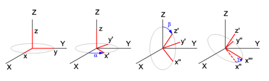

<style>
  table {
    width: 100%
    }
  td {
    vertical-align: center;
    text-align: center;
  }
  table.inputT{
    margin: 10px;
    width: auto;
    margin-left: auto;
    margin-right: auto;
    border: none;
  }
  input{
    text-align: center;
    padding: 0px 10px;
  }
  iframe{
    width: 100%;
    display: block;
    border-style:none;
  }
</style>


#  3D 向量與欧拉角转换


$$
\alpha = yaw = rot_x = arctan2 \left ( \frac {y}{x} \right )
$$

$$
\beta = pitch = rot_y = arctan2 \left ( \frac {x \cdot cos(rot_x)}{z} \right )
$$

$$
\gamma = roll = rot_z = arctan2 \left ( \frac {cos(rot_x)}{sin(rot_x)sin(rot_y)} \right )
$$




```c
typedef struct Euler_t
{
  float Pitch;
  float Roll;
  float Yaw;
} Euler_t;

double arctan2(double y, double x)
{
  double angle = 0;
  if (x == 0)
  {
    if (y == 0)
      angle = 0;
    else if (y > 0)
      angle = Math.PI / 2;
    else
      angle = -Math.PI / 2;
  }
  else
  {
    angle = Math.Atan(y / x);
    if (x < 0)
    {
      if (y > 0)
      {
        angle += Math.PI;
      }
      else if (y < 0)
      {
        angle -= Math.PI;
      }
      else
      {
        angle = Math.PI;
      }
    }
  }
  return angle;
}

void Vector_Euler(double x, double y, double z, Euler_t* output)
{
output->Yaw = arctan2(y, x);
output->Pitch = arctan2(x*Math.cos(rotx), z);
output->Roll = arctan2(Math.cos(rotx), Math.sin(rotx)*Math.sin(roty));
}
```