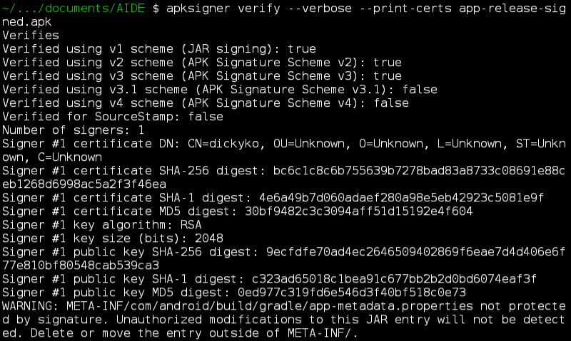

<style>
  table {
    width: 100%
    }
  td {
    vertical-align: center;
    text-align: center;
  }
  table.inputT{
    margin: 10px;
    width: auto;
    margin-left: auto;
    margin-right: auto;
    border: none;
  }
  input{
    text-align: center;
    padding: 0px 10px;
  }
  iframe{
    width: 100%;
    display: block;
    border-style:none;
  }
</style>

# Android IDE (Android 环境下)

## 参考脚本

```sh
#!/data/data/com.termux/files/usr/bin/bash

### 在termux環境中命令列輸入android sdk安裝
yes | apt update -y
yes | apt upgrade -y
yes | apt install wget -y
yes | apt install openjdk-17 -y
yes | apt install kotlin -y
yes | apt install gradle -y
yes | apt install aapt2
termux-setup-storage
cd ~
# 刪除先前安裝的 Android Sdk
rm -rf AndroidSdk
wget https://dl.google.com/android/repository/commandlinetools-linux-13114758_latest.zip
mkdir AndroidSdk
mkdir latest
unzip commandlinetools-linux-13114758_latest.zip -d AndroidSdk/
mv AndroidSdk/cmdline-tools/* latest/
mv latest AndroidSdk/cmdline-tools/
cd ~ && export ANDROID_HOME=$(pwd)/AndroidSdk
cd ~ && export JAVA_HOME=/data/data/com.termux/files/usr/lib/jvm/java-17-openjdk
ls $ANDROID_HOME
cd ~ && export PATH=$PATH:$(pwd)/AndroidSdk/cmdline-tools/latest/bin:$(pwd)/AndroidSdk/platform-tools
sdkmanager
sdkmanager --update
sdkmanager --list
yes | sdkmanager --licenses
yes | sdkmanager --licenses
sdkmanager "platform-tools" "platforms;android-34"
sdkmanager "build-tools;34.0.0"
rm -rf commandlinetools-linux*
```

 - 在 Linux 中，<font color="#FF1000">#!</font> 是一個特殊字元組合，表示一個脚本的解釋器路徑。 它通常位於脚本的開頭，用於告訴系統使用哪個程序來執行該脚本。
 - yes 指令通常被用作一種快速而簡單的方法來為互動式腳本提供输入。代替手动输入。
 - termux-setup-storage 用來配置對共享儲存的存取並設定這些符號連結以便快速存取各種儲存。
 - wget 用作下载所需要的 android 指令工具，通常红色部份序号需要更新 commandlinetools-linux-<font color="#FF0010">13114758</font>_latest.zip
 - unzip -d 将指定文件解压到指定目录。
 - export 可新增，修改或删除环境变量，供后续执行的程序使用。
 - platforms;android-<font color="#FF0010">34</font> 需要根据最新的发行版本更新。
 - build-tools;<font color="#FF0010">34.0.0</font> 需要根据最新的发行版本更新。


## 编译程序

```sh
// 编译 Debug 版程序
bash gradlew assembleDebug

// 编译 Release 版程序
bash gradlew assembleRelease

// 清理编译程序相关文件
bash gradlew clean
```

注：因 Release 版本要加金匙认证后才能安装使用。可按照需要用以下行步骤制作金匙。


## 装作软件金匙

将签名金匙制作在最上层 AIDE 目录。以方便用参考使用。

```sh
cd /data/data/com.termux/files/home/storage/documents/AIDE/
keytool -genkey -v -keystore release.keystore -alias example -keyalg RSA -keysize 2048 -validity 10000
```
 - release.keystore 为软件金匙名称。按照需要修改。
 - example 为别名需要修改

## 制作签名 Release 版本应用程式

将编译后的 Release 版本。移到最外层的 AIDE 目录。以方便用固定代码编译如下。

```
cd /data/data/com.termux/files/home/storage/documents/AIDE/
mv app-release-unsigned.apk app-release-signed.apk
apksigner sign --ks release.keystore app-release-signed.apk
```

 - app-release-signed.apk 为软件各称可以根据需要修改。

## 检测 APK 簽名资料

```sh
apksigner verify --verbose --print-certs app-release-signed.apk
```

 - 遇到的警告僅適用於 APK 簽名 v1，但由於 APK 檔案還包含 v2 和 v3 簽名，可以放心地忽略此訊息，因為 APK 檔案上的每個修改都可以透過較新的簽名方案檢測到（這適用於具有 APK 簽名 v2 支援的 Android 7.0 及以後新版本。
 - app-release-signed.apk 是已签名的应用程式名称，可以根据需要修改。



