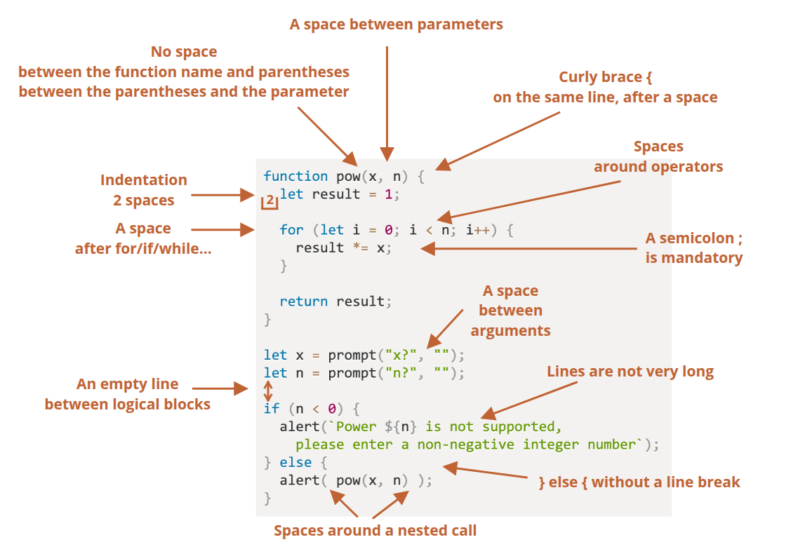

<style>
  table {
    width: 100%
    }
  td {
    vertical-align: center;
    text-align: center;
  }
  table.inputT{
    margin: 10px;
    width: auto;
    margin-left: auto;
    margin-right: auto;
    border: none;
  }
  input{
    text-align: center;
    padding: 0px 10px;
  }
  iframe{
    width: 100%;
    display: block;
    border-style:none;
  }
</style>


# AStyle 格式化代码 (Java / JavaScript)


**AStyle** 是一款强大的代码格式化工具，主要用于 C、C++、C++/CLI、Objective-C、C# 和 Java 等编程语言。

[网上代码下载](https://gitlab.com/saalen/astyle)

在网上下载代码後，可在 Android 系统下的 termux 软件上安装。但在安装 AStyle 前要安装以下软件，用以编译 AStyle 源代码。

```sh
pkg install clang
pkg install make
cd ./AStyle/build/gcc
make
```

在编译后，可在 bin 目录下找到 astyle 执行档案。并将这档案複製至 **/data/data/com.termux/files/usr/bin**。

## 一般格式风格介绍




## 基本命令行格式：

```sh
astyle [参数] [文件路径]
```

## 选项格式

 - 长选项（以“--”开头）
    - 必须一次写入一个。
  - 短选项（以“-”开头）
    - 可以附加在一起。 因此，-bps4 与 -b -p -s4 相同。


### 风格

只列出部分风格，详情请看不同版本的帮助信息。

|长指令名|短指令名|说明|
|:---:|:---:|:---|
|--style=bsd|-A1|Allman 样式格式/缩排。 断开的括号|
|--style=java|-A2|Java 样式格式/缩排。附加的括号|
|--style=kr|-A3|Kernighan & Ritchie 样式格式/缩排。Linux 括号|
|--style=gnu |-A7|GNU 样式格式/缩排。缩排 2 个空格|
|--style=linux |-A8|Linux 风格格式/缩排。缩排 8 个空|
|--style=lisp|-A12|Lisp 风格的格式/缩进。附加左括号和右括号。使用保持一行语句。|
|--style=google|-A14|Google 风格的格式/缩进。附加括号，缩进的类修饰符|
    
### 製表符和括號選項

|長指令名|短指令名|说明|
|:---:|:---:|:---|
|--indent=spaces=#|-s#|默认行缩进为4个空格, # 替换为缩进量|
|--indent=tab / --indent=tab=# |-t / -t#|行缩进用tab,默认 tab 长度与 4 个空格相等|
|--indent=force-tab=#|-T#|优先采用空格缩进|
|--brackets=break |-b|大括号与前一块隔开为两行|
|--brackets=attach|-a|大括号前一个与上一行在同一行|
|--brackets=linux |-l|定义块和函数块中的大括号都被处理|
|--brackets=stroustrup |-u|只处理函数中的大括号|

### 缩排选项

|长指令名|短指令名|说明|
|:---:|:---:|:---|
|--indent-classes|-C|缩进类定义中的 public private protected 标签缩排 'class' 区块缩排|
|--indent-switches|-S|缩进 switch 中的 case 块, case 和  switch 不在同一列|
|--indent-cases|-K|缩进 case 下面的语句。 从「case XXX:」标题开始缩排 case 区块|
|--indent-blocks|-G|给块添加缩进，包括大括号为整个区块（包括括号）添加额外的缩排|
|--indent-brackets|-B|给大括号添加缩进，为 “{” 和 “}” 区块括号添加额外的缩排|
|--indent-namespaces|-N|缩排命名空间区块的内容|
|--indent-labels|-L|标签缩进，使其比目前缩排等级少一个缩进，而不是完全向左对齐（这是预设值|
|--indent-preprocessor|-w|缩排多行 #define 语句|
|--max-instatement-indent=#|-M#|跨行缩进,比如函数定义中的参数处在多行,那么参数缩进到同一列，连续语句中最多缩排 # 个空格|
|--max-continuation-indent=#|-M#|设置最大缩进续行为 # 个空格|
|--min-conditional-indent=#|-m#|设置最少缩进续行为 # 个空格|

### 格式选项

|长指令名|短指令名|说明|
|:---:|:---:|:---|
|--break-blocks|-f|没有关系的类，标签插入空白行，(不包括函数块)|
|--break-blocks=all|-F|空行分隔无关系的块，包括 else catch。 等与 --break-blocks 类似，但在结束标头周围插入空白行（例如「else」、「catch」等）|
|--break-closing-brackets|-y|else catch 左边的大括号与 else catch 分隔。 在结束标头之前断开括号（例如 “else”、“catch”等）。 与 --brackets=attach、--brackets=linux / --brackets=stroustrup 一起使用|
|--break-elseifs|-e|将「else if()」语句分成两行|
|--delete-empty-lines|-x|删除函数或方法中的空白行。但不会删除由 break-blocks 选项新增的行|
|--pad-oper|-p|操作符两端插入一个空格|
|--pad-paren|-P|括号内外都插入空格|
|--pad-paren-out|-d|括号外部插入空格|
|--pad-paren-in|-D|括号外部插入空格|
|--unpad-paren|-U|移除括号两端多余空格|
|--keep-one-line-statements|-o|一行中的多个申明不分隔  int x;int y;int z 不被分为 3 行|
|--keep-one-line-blocks|-O|大括号中的单行语句不被分拆|
|--convert-tabs|-c|tab 转换为空格|
|--fill-empty-lines|-E|块间空行的换行符前插入一个空格|
|--mode=c||缩排 C 或 C++ 原始档（这是预设值）|
|--mode=java||缩排 java 文件|
|--mode=cs||缩排 c# 文件|


### 其他選擇


|长指令名|短指令名|说明|
|:---:|:---:|:---|
|--suffix=####||指定备份文件的后缀，默认生成 .orig 文件|
|--suffix=none|-n|不备份文件|
|--options=####||指定从 #### 文件读取选项信息|
|--options=none||禁止从文件读取选项信息，仅使用命令行参数|
|--recursive|-r/-R|递归处理子目录|
|--exclude=####||指定要排除在处理之外的文件或目录 ####|
|--errors-to-stdout|-X|将错误和帮助信息打印到标准输出，而不是标准错误|
|--preserve-date|-Z|修改的日期和时间不会在格式化的文件中改变|
|--verbose|-v|输出详细处理信息|
|--formatted|-Q|输出信息中只包括被修改的文件信息|
|--max-code-length=#|-xC#|代碼行最大長度|
|--quiet|-q|忽略所有错误|
|--version|-V|输出 astyle 版本号|
|--help|-h/-?|列印帮助信息|


注意： <font color="#FF1000">#</font> 代表数字，为长度或者个数，<font color="#FF1000">####</font> 为档案或目录名称。


## 默认选项文件

Artistic Style 按以下顺序查找默认选项文件：
 - 从 ARTISTIC_STYLE_OPTIONS 环境变量读取选项 
 - 从 /home 文件夹中的 .astylerc 文件读取选项 
 - 从 USERPROFILE 下的 .astylerc 文件读取选项

如果找到默认选项文件，则此文件中的选项将在命令行选项之前解析。默认选项文件中的长选项可以不带前缀 '--'


设定 .astylerc 例子如下：

```
-s2 -SKFxpUcn

#-s2 行缩进用 2 个空格
#-S  switch 与 case 不同列，case 缩进
#-K  缩进.case.下面的语句
#-F  空行分隔无关块
#-x  删除多余空行
#-p  操作符两端出入空格
#-U  移除括号两端多余空格
#-c  tab 转空格
#-n  不做备份
```

# 在 termux 目录循环使用 AStyle 格式化档案

## astyle.sh 脚本

```sh
filelist=`find . -type f -name "*.java"`
for file in $filelist
do
    astyle --style=google -s2 -n $file
done 
```


- 注解使用 \#，因为没有多行注解，所以需要使用多单行注解达到
- 若是值内有空白则需要使用 ' ' 或 " " 包裹起来
- 比较条件需要放在 [] 中，前后要留空白。例子 if [ $x \> $y ]; then
- 注意系统环境变数为全域变数、区域变数则为 Shell Script 内部程式使用，不能跨档案使用。


双引号 (\" \")
 - 在希望抑制单词拆分和通配符的上下文中。也适用于希望将字面量视为字符串而非正则表达式的上下文中。

单引号 (\' \')
 - 在希望抑制插值和反斜杠特殊处理的字符串字面量中。换句话说，在不适合使用双引号的情况下。

不使用引号
 - 在完全确定不存在单词拆分或通配符问题，或者确实需要单词拆分和通配符的上下文中。

重音符号 (\` \`)

- 旧式形式的指令替换等于 \&#36;() 语法。会在 shell 中执行命令，并将指令的输出替换 \&#36;() 表达式。这允许将一个命令的输出用作另一个变量的赋值或另一个指令的输入参数。


# HtmlTidy (HTML)

Tidy HTML 是一个用于清理、格式化 HTML 和 XHTML 文件的工具。  它能够自动检测并修正 HTML 错误，并将其格式化为更符合 W3C 标准的格式。

在 termux 安装方法如下

```sh
pkg install tidy
```

## 基本命令行格式：

tidy [参数] [文件路径]

```sh
tidy -config config.txt ######.html
```

### 设定档案 config.txt

因可以设定的功能太多，所以要使用设定档案。以下档案只包括部分设定，档案如下：

```sh
// HTML tidy 的配置文件示例
indent: auto
indent-with-tabs: no
indent-spaces: 4
tab-size: 4
vertical-space: yes
wrap: 72
markup: yes
output-xml: no
input-xml: no
show-filename: yes
show-info: no
show-warnings: no
show-errors: 0
numeric-entities: yes
quote-marks: yes
quote-nbsp: yes
quote-ampersand: no
break-before-br: no
uppercase-tags: no
uppercase-attributes: no
char-encoding: utf8
custom-tags: yes
new-inline-tags: 
new-blocklevel-tags: 
new-empty-tags: 
new-pre-tags: 
```

最后四个指令用作增加额外标签

 - new-inline-tags
    - 内联元素 (new-inline-tags) 不以新行开头的元素。并且仅占用必要的宽度（即定义 HTML 元素的标签所定义的空间），而不会中断内容流。\<a\>,\<abbr\>,\<acronym\>,\<b\>,\<bdo\>,\<big\>,\<br\> 是一些内联元素的示例。
 - new-blocklevel-tags
   - 块级元素 (new-blocklevel-tags) 是从新行开始的元素。块级元素会占据内容可用的全部宽度。块级元素的周围也有一个上下边距。与内联元素 (new-inline-tags)相比，块级元素会创建更大的结构。块级元素始终会利用整个可用宽度。\<address\>,<\article\>,\<aside\>,\<blockquote\>,\<canvas\> 和 \<div\> 都是块级元素的一些示例。
 - new-empty-tags
   - 空元素 (new-empty-tags) 是指没有任何嵌入元素或文本元素的组件。空标签仅包含起始标签，但它们会在网页中执行某些操作。例如，<br> 标签就是一个空标签。
 - new-pre-tags
   - 预格式元素 (new-pre-tags) 标签代表预格式化文本块。标签将保持输出格式与输入格式相同。当要显示文本时，如果排版格式会影响内容的含义（例如代码片段和诗歌），它会非常方便。
 
是用作增加新的标签。选项接受以空格或逗号分隔的标签名称列表。除非已声明新的标签，否则如果输入包含先前未知的标签，Tidy 将拒绝生成整理后的文件。此选项在 XML 模式下被忽略。如 custom-tags 为 yes 以上是四个指令将会被忽视。详细设定档案介绍，请参考 [网上 HTML-Tidy 资料](https://api.html-tidy.org/#part_quickref)


## tidy.sh 脚本

```sh
filelist=`find . -type f -name "*.html"`
for file in $filelist
do
    # Extract file 'name' only
    filename="${file%.*}"
    # Extract file 'extension' only
    extension="${file##*.}"
    tidy -config ~/config.txt $file > ${filename}.$extension
done 
```
$()：命令替换
 - $(command) 是“命令替换”。它运行命令，捕获其输出，这允许将一个命令的输出用作另一个变量的赋值或另一个指令的输入参数。

${}：变量
 - ${parameter name} 语法主要用于变量扩展和参数替换。它提供了一种访问和操作变量的方法，尤其是在处理位置参数或需要<font color="#FF1000">避免变量名歧义</font>时。

*：通配符
 - 用于文件路径或命令时，表示当前目录中的所有文件。例如，ls * 将列出目录中的所有文件。


字符串操作（删除）：
 - ${variable#pattern}：从变量<font color="#FF1000">开头</font>删除模式的<font color="#FF1000">最短</font>匹配。
 - ${variable##pattern}：从变量<font color="#FF1000">开头</font>删除模式的<font color="#FF1000">最长</font>匹配。
 - ${variable%pattern}：从变量<font color="#FF1000">末尾</font>删除模式的<font color="#FF1000">最短</font>匹配。
 - ${variable%%pattern}：从变量<font color="#FF1000">末尾</font>删除模式的<font color="#FF1000">最长</font>匹配。

字符串操作（替换）：
 - ${variable/pattern/replacement}：用替换项替换模式的<font color="#FF1000">第一个</font>匹配。
 - ${variable//pattern/replacement}：用替换项替换模式的<font color="#FF1000">所有</font>匹配。

例子如下：
 - ${filepath##*/} ： 从开头删除最长的 */ 匹配项，只保留<font color="#FF1000">带扩展名的文件名</font>。
 - ${filename_with_ext%.*} ： 从文件名末尾删除最短的 .* 匹配项，从而有效地<font color="#FF1000">删除扩展名</font>。
 - ${filename_with_ext##*.} ： 从文件名开头删除最长的 *. 匹配项，从而有效地<font color="#FF1000">提取扩展名</font>。