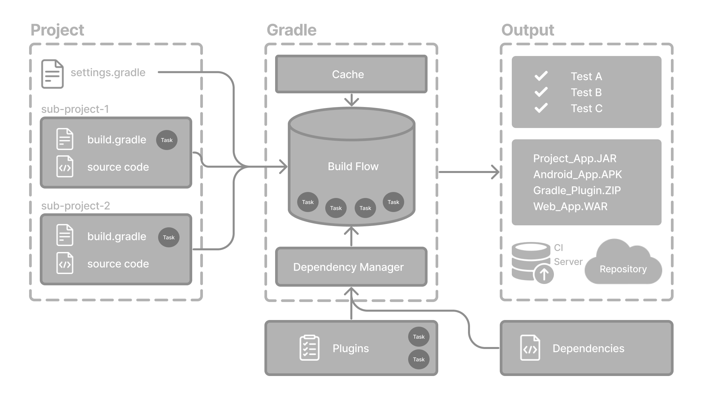
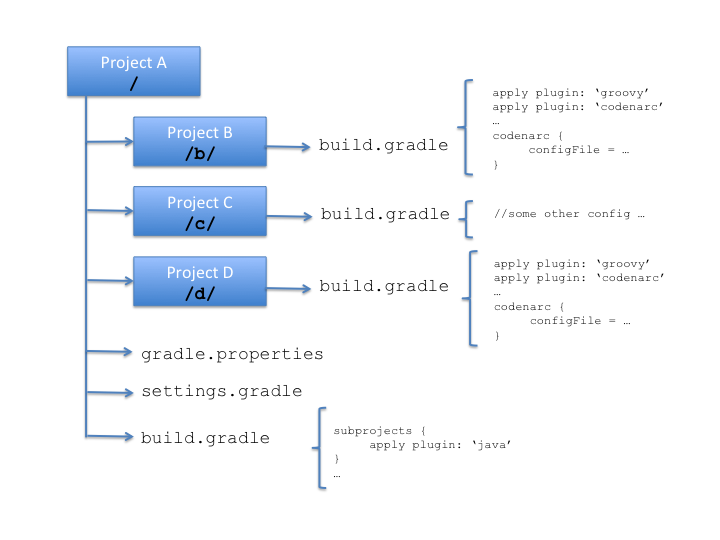

.---
category: [系统]
tags: [编程, 電子]
title: Gradle
date: 2025-07-06 1:00:00
---

<style>
  table {
    width: 100%
    }
  td {
    vertical-align: center;
    text-align: center;
  }
  td.left {
    vertical-align: left;
    text-align: center;
  }  
  table.inputT{
    margin: 10px;
    width: auto;
    margin-left: auto;
    margin-right: auto;
    border: none;
  }
  input{
    text-align: center;
    padding: 0px 10px;
  }
  iframe{
    width: 100%;
    display: block;
    border-style:none;
  }
</style>

# Gradle

Gradle 是一個基於 Apache Ant 和 Apache Maven 概念的專案自動化建構工具。Gradle 構建指令碼使用的是 Groovy 或 Kotlin 的特定領域語言來編寫的，而不是傳統的XML。

## 依赖项 - Dependencies

在 Gradle 中，“依赖项”是指项目编译、运行或测试所需的外部库、模块或其他资源。Gradle 的依赖项管理系统可自动执行声明、解析和管理这些外部资源的过程。依赖项在项目的 build.gradle（或 build.gradle.kts）文件的 dependency {} 块内声明。

依赖项与特定的配置相关联，这些配置定义了它们在构建过程中的使用范围。Java 项目的常见配置包括：

 - implementation：编译和运行项目生产代码所需的依赖项，但项目 API 仍<font color="#FF1000">未公开</font>。
 - api：编译和运行项目生产代码所需的依赖项，并作为项目 API 的一部分<font color="#FF1000">公开</font>。
 - compileOnly：仅在编译期间需要的依赖项，不包含在运行时类路径中。
 - testImplementation：编译和运行项目<font color="#FF1000">测试</font>代码所需的依赖项。



接下来介绍几个 Gradle 配置文件：

<table>
<tr><td rowspan="5" width="30%">

</td><td class="left">
build.gradle : 在项目的根目录中 build.gradle 文件。被称为顶级（项目级）build.gradle 文件。它包含应用于项目<font color="#FF1000">所有模块的设置</font>。
</td></tr>
<tr><td class="left">
gradle.properties : 这个文件中定义了一系列<font color="#FF1000">属性</font>。实际上，这个文件中定义了一系列供 build.gradle 使用的常量，比如 keystore 的存储路径、keyalias 等等。
</td></tr>
<tr><td class="left">
gradlew 与 gradlew.bat : gradlew 为 Linux 下的 shell 脚本，gradlew.<font color="#FF1000">bat 是 Windows 下的批处理文件</font>。gradlew 是 gradle wrapper 的缩写，也就是说它对 gradle 的命令进行了包装，比如进入到指定 Module 目录并执行 “gradlew.bat assemble” 即可完成对当前 Module 的构建（Windows系统下）。
</td></tr>
<tr><td class="left">
local.properties : 这个文件中定义了一些<font color="#FF1000">本地属性</font>，比如 SDK 的路径。
</td></tr>
<tr><td class="left">
settings.gradle : 假如项目包含了不只一个 Module 时，一次性构建所有 Module 以完成整个项目的构建，这时需要用到这个文件。比如项目包含了 ModuleA 和 ModuleB 这两个模块，则这个文件中会包含这样的语句：include ':ModuleA', ':ModuleB'。
</td>
</tr>
</table>


## 构建脚本

首先看一下工程目录下的 **build.gradle**，它指定了真个整个项目的构建规则，它的内容如下：

```
buildscript {
    repositories {
        //构建脚本中所依赖的库都在 jcenter 仓库下载
        jcenter() 
    }
    dependencies {
        //指定了 gradle 插件的版本
        classpath 'com.android.tools.build:gradle:1.5.0'
    }
}

allprojects {
    repositories {
        //当前项目所有模块所依赖的库都在 jcenter 仓库下载
        jcenter()
    }
}
``` 


