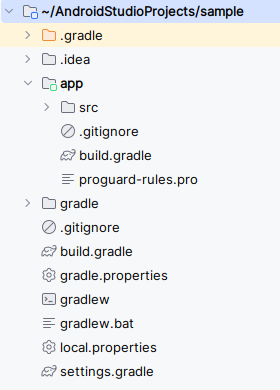

.---
category: [系统]
tags: [编程, 電子]
title: Gradle
date: 2025-07-06 1:00:00
---

<style>
  table {
    width: 100%
    }
  td {
    vertical-align: center;
    text-align: center;
  }
  td.left {
    vertical-align: center;
    text-align: left;
  }  
  table.inputT{
    margin: 10px;
    width: auto;
    margin-left: auto;
    margin-right: auto;
    border: none;
  }
  input{
    text-align: center;
    padding: 0px 10px;
  }
  iframe{
    width: 100%;
    display: block;
    border-style:none;
  }
</style>

# Gradle

Gradle 是一個基於 Apache Ant 和 Apache Maven 概念的專案自動化建構工具。Gradle 構建指令碼使用的是 Groovy 或 Kotlin 的特定領域語言來編寫的，而不是傳統的XML。

## 依赖项 - Dependencies

在 Gradle 中，“依赖项”是指项目编译、运行或测试所需的外部库、模块或其他资源。Gradle 的依赖项管理系统可自动执行声明、解析和管理这些外部资源的过程。依赖项在项目的 build.gradle（或 build.gradle.kts）文件的 dependency {} 块内声明。

依赖项与特定的配置相关联，这些配置定义了它们在构建过程中的使用范围。Java 项目的常见配置包括：

 - implementation：编译和运行项目生产代码所需的依赖项，但项目 API 仍<font color="#FF1000">未公开</font>。
 - api：编译和运行项目生产代码所需的依赖项，并作为项目 API 的一部分<font color="#FF1000">公开</font>。
 - compileOnly：仅在编译期间需要的依赖项，不包含在运行时类路径中。
 - testImplementation：编译和运行项目<font color="#FF1000">测试</font>代码所需的依赖项。


接下来介绍几个 Gradle 配置文件：

<table>
<tr><td rowspan="9" width="33%">

</td><td class="left">
gitignore 檔案來進行 git 定義「忽略清單」，主要的目的是排除一些不需要加入版控的檔案，列在裡面的檔名或路徑。
</td></tr>
<tr><td class="left">
build.gradle (模块级) : 应用模块目录中的 build.gradle 文件。它包含依赖项（模块所依赖的库）以及构建过程的说明。每个模块都定义了自己的 build.gradle 文件。
</td></tr>
<tr><td class="left">
proguard-rules.pro : 是一个用于配置 ProGuard 的文件，ProGuard 是一款用于优化和混淆 Java 字节码的工具。它位于模块的根目录中（例如，主应用模块的根目录为 app/ ）。此文件包含一些规则，用于指示 ProGuard 代码中的哪些部分需要保留、优化和混淆，以及哪些部分需要忽略。
</td></tr>
<tr><td class="left">
build.gradle (项目级) : 在项目的根目录中 build.gradle 文件。被称为顶级（项目级）build.gradle 文件。它包含应用于项目<font color="#FF1000">所有模块的设置</font>。
</td></tr>
<tr><td class="left">
gradle.properties : 这个文件中定义了一系列<font color="#FF1000">属性</font>。实际上，这个文件中定义了一系列供 build.gradle 使用的常量，比如 keystore 的存储路径、keyalias 等等。
</td></tr>
<tr><td class="left">
gradlew 与 gradlew.bat : gradlew 为 Linux 下的 shell 脚本，gradlew.<font color="#FF1000">bat 是 Windows 下的批处理文件</font>。gradlew 是 gradle wrapper 的缩写，也就是说它对 gradle 的命令进行了包装，比如进入到指定 Module 目录并执行 “gradlew.bat assemble” 即可完成对当前 Module 的构建（Windows系统下）。
</td></tr>
<tr><td class="left">
local.properties : 这个文件中定义了一些<font color="#FF1000">本地属性</font>，比如 SDK 的路径。
</td></tr>
<tr><td class="left">
settings.gradle : 假如项目包含了不只一个 Module 时，一次性构建所有 Module 以完成整个项目的构建，这时需要用到这个文件。比如项目包含了 ModuleA 和 ModuleB 这两个模块，则这个文件中会包含这样的语句：include ':ModuleA', ':ModuleB'。
</td>
</tr>
</table>


## 构建脚本

首先看一下工程目录下的 **build.gradle (项目级)**，它指定了真个整个项目的构建规则，它的内容如下：

```
buildscript {
    repositories {
        //构建脚本中所依赖的库都在 jcenter 仓库下载
        jcenter() 
    }
    dependencies {
        //指定了 gradle 插件的版本
        classpath 'com.android.tools.build:gradle:1.5.0'
    }
}

allprojects {
    repositories {
        //当前项目所有模块所依赖的库都在 jcenter 仓库下载
        jcenter()
    }
}
``` 

在 buildscript 代码块中，可以定义执行项目构建所需的设置如下：

 - repositories 代码块中，可以添加 Gradle 用来搜索使用的库的仓库名称。
 - dependencies 代码块包含必要的插件依赖项，在本例中是 Gradle 插件。请勿将模块依赖项放在此代码块中。
 - allprojects 代码块的结构与 buildscript 代码块类似，但此处所有模块定义仓库，而不是 Gradle 本身。通常无需为 allprojects 定义依赖项部分。每个模块的依赖项各不相同，应位于模块级的 build.gradle 文件中。


应用目录下的 **build.gradle (模块级)**，指定模块的构建规则，它的内容如下：

```
android {
    namespace 'com.dicky.sample'
    compileSdk 35

    defaultConfig {
        applicationId "com.dicky.sample"
        minSdk 29
        targetSdk 35
        versionCode 1
        versionName "1.0"
    }

    buildTypes {
        release {
            minifyEnabled false
            proguardFiles getDefaultProguardFile('proguard-android-optimize.txt'), 'proguard-rules.pro'
        }
    }
    compileOptions {
        sourceCompatibility JavaVersion.VERSION_17
        targetCompatibility JavaVersion.VERSION_17
    }
}

dependencies {
}
```