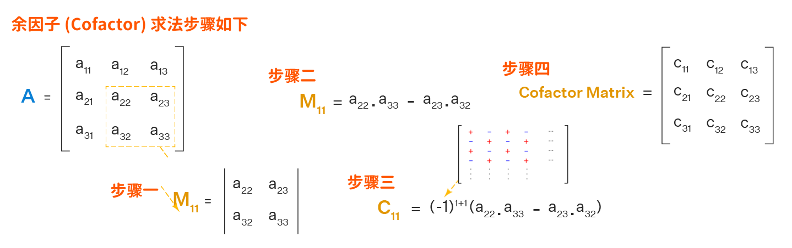
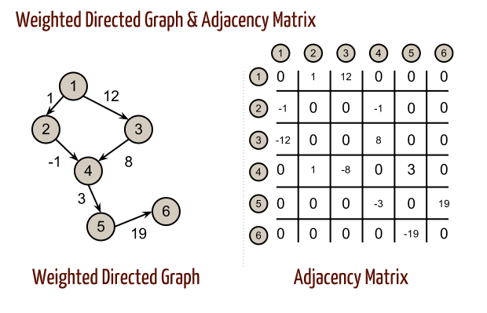

# 基尔霍夫定律 (Kirchhoff's Law) 

## 基尔霍夫矩阵树 (Kirchhoff Matrix Tree)

**基尔霍夫矩阵树** 定理 提供了一种利用由图结构导出的矩阵的行列式来计算图中生成树数量的方法。具体而言，该定理指出，连通无向图中生成树的数量等于该图的 **拉普拉斯矩阵** (Laplacian matrix) 任意余因子的行列式。

**邻接矩阵** 和 **关联矩阵** 都是使用矩阵表示图的方式，但它们所表示的内容不同。

### 邻接矩阵 (adjacency matrix) 没有考虑连接方向
---

邻接矩阵显示哪些顶点彼此相邻（通过边直接连接）。- 没有连接方向

具体分解如下：

 - 生成树
    - 包含原图所有顶点的子图，并且是一棵树（即连通且无环的）。
 - 拉普拉斯矩阵
    - 由图的 **邻接矩阵** (adjacency matrix) 和 **度矩阵** (degree matrix) 导出的矩阵。对于顶点数为 n 的图，拉普拉斯矩阵 L 定义为 L = D - A，其中 D 是度矩阵（顶点度为对角矩阵），A 是邻接矩阵可参考下图。其中
       - 0 表示不连接 
       - 1 表示连接

$$
拉普拉斯矩阵 (L) = 度矩阵 (D) * 邻接矩阵 (A)
$$ 

 - 余因式
    - 子矩阵的行列式乘以一个符号因子。该定理指出，拉普拉斯矩阵的任何余因式都会得出相同的结果，即生成树的数量。

本质上，基尔霍夫定理将图论（生成树）与线性代数（拉普拉斯矩阵行列式）联系起来，从而可以高效地计算图中生成树的数量。这对于较大的图尤其有用，因为手动计算生成树的数量会非常耗时。

### 关联矩阵 (Incidence Matrix) 有考虑连接方向
---

关联矩阵显示了顶点和边之间的关系，指示哪些顶点与哪些边关联（连接）- 有连接方向。

**关联矩阵** 由行和列组成，用小数 m 表示图中 **节点** (Node) 的总数，用小数 n 表示 **边** (Edge )的总数。将**关联矩阵**与其转置相乘可以得到**拉普拉斯矩阵**。关联矩阵中 
  - +1 = 离开顶点
  - -1 = 到达顶点
  -  0 = 未涉及顶点

$$
拉普拉斯矩阵 (L) = 关联矩阵 (E) * 关联矩阵 (E) ^T
$$ 

例子如下:

$$
关联矩阵 = E = \begin{bmatrix}
-1 & -1 & -1 & 0 & 0 \\
1 & 0 & 0 & -1 & 0 \\
0 & 1 & 0 & 0 & -1 \\
0 & 0 & 1 & 1 & 1 \\
\end{bmatrix}
$$

$$
拉普拉斯矩阵 = L = E \cdot E^T
$$

线性代数中。当列线性相关时，行列式为 0。所以 L 的行列式 (Determinant) 一定是 **0**。行列式为零的矩阵称为奇异矩阵。这意味着该矩阵不可逆，且其行和列线性相关。在求解线性方程时，奇异矩阵表示系统要么有无穷多个解，要么根本没有解。

### 加权图 (Weighted graphs) 

加权图可以用边的权重代替 1 来表示如下：

二维矩阵，行表示源顶点，列表示目标顶点。边和顶点的数据必须存储在外部。每对顶点之间只能存储一条边的代价。

#### 关联矩阵在工程中的应用

 - 最大流算法
    - 在流算法（例如 Ford-Fulkerson 方法）中，关联矩阵有助于表示顶点之间的货物或信息流。关联矩阵能够追踪方向和边的存在，这对于有向流网络建模非常有用。
      - Ford-Fulkerson 算法是一种在流网络中寻找最大流的方法。它的工作原理是迭代地在残差图中寻找增广路径，并沿着这些路径增加流量，直到找不到更多的增广路径。该算法是一种贪婪方法，它被认为是一种方法，而不是一种特定的算法，因为它寻找增广路径的方式可能有所不同，这可能会影响算法的效率。

 - 电网
    - 在电网中，关联矩阵用于模拟电路元件（顶点）及其连接（边）之间的关系。关联矩阵有助于分析网络内的电流、电压和电流的流动。

