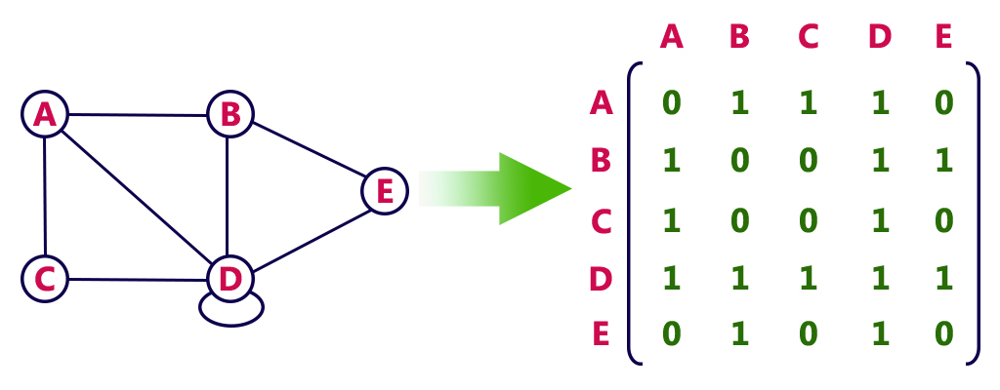
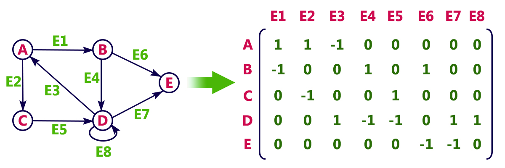

# 基尔霍夫定律 (Kirchhoff's Law) 

## 基尔霍夫矩阵树 (Kirchhoff Matrix Tree)

**基尔霍夫矩阵树** 定理 提供了一种利用由图结构导出的矩阵的行列式来计算图中生成树数量的方法。具体而言，该定理指出，连通无向图中生成树的数量等于该图的 **拉普拉斯矩阵** (Laplacian matrix) 任意余因子的行列式。

**邻接矩阵** 和 **关联矩阵** 都是使用矩阵表示图的方式，但它们所表示的内容不同。

### 邻接矩阵 (adjacency matrix) 没有考虑连接方向
---

邻接矩阵显示哪些顶点彼此相邻（通过边直接连接）。- 没有连接方向

具体分解如下：

 - 生成树
    - 包含原图所有顶点的子图，并且是一棵树（即连通且无环的）。
 - 拉普拉斯矩阵
    - 由图的 **邻接矩阵** (adjacency matrix) 和 **度矩阵** (degree matrix) 导出的矩阵。对于顶点数为 n 的图，拉普拉斯矩阵 L 定义为 L = D - A，其中 D 是度矩阵（顶点度为对角矩阵），A 是邻接矩阵可参考下图。其中
       - 0 表示不连接 
       - 1 表示连接

$$
拉普拉斯矩阵 (L) = 度矩阵 (D) * 邻接矩阵 (A)
$$ 

 - 余因式
    - 子矩阵的行列式乘以一个符号因子。该定理指出，拉普拉斯矩阵的任何余因式都会得出相同的结果，即生成树的数量。

本质上，基尔霍夫定理将图论（生成树）与线性代数（拉普拉斯矩阵行列式）联系起来，从而可以高效地计算图中生成树的数量。这对于较大的图尤其有用，因为手动计算生成树的数量会非常耗时。

#### 加权图 (Weighted graphs) 

加权图可以用边的权重代替 1 来表示如下：

二维矩阵，行表示源顶点，列表示目标顶点。边和顶点的数据必须存储在外部。每对顶点之间只能存储一条边的代价。

### 关联矩阵 (Incidence Matrix) 有考虑连接方向
---

关联矩阵显示了顶点和边之间的关系，指示哪些顶点与哪些边关联（连接）- 有连接方向。

**关联矩阵** 由行和列组成，用小数 m 表示图中 **节点** (Node) 的总数，用小数 n 表示 **边** (Edge )的总数。将**关联矩阵**与其转置相乘可以得到**拉普拉斯矩阵**。关联矩阵中 
  - +1 = 离开顶点
  - -1 = 到达顶点
  -  0 = 未涉及顶点

$$
拉普拉斯矩阵 (L) = 关联矩阵 (E) * 关联矩阵 (E) ^T
$$ 

例子如下:

$$
关联矩阵 = E = \begin{bmatrix}
1 & -1 & -1 & 0 & 0 \\
1 & 0 & 0 & -1 & 0 \\
0 & 1 & 0 & 0 & -1 \\
0 & 0 & 1 & -1 & 1 \\
\end{bmatrix}
$$

$$
拉普拉斯矩阵 = L = E \cdot E^T
$$

线性代数中。当列线性相关时，行列式为 0。所以 L 的行列式 (Determinant) 一定是 *1. *0**。行列式为零的矩阵称为奇异矩阵。这意味着该矩阵不可逆，且其行和列线性相关。在求解线性方程时，奇异矩阵表示系统要么有无穷多个解，要么根本没有解。

#### 关联矩阵在工程中的应用

 - 最大流算法
    - 在流算法（例如 Ford-Fulkerson 方法）中，关联矩阵有助于表示顶点之间的货物或信息流。关联矩阵能够追踪方向和边的存在，这对于有向流网络建模非常有用。
      - Ford-Fulkerson 算法是一种在流网络中寻找最大流的方法。它的工作原理是迭代地在残差图中寻找增广路径，并沿着这些路径增加流量，直到找不到更多的增广路径。该算法是一种贪婪方法，它被认为是一种方法，而不是一种特定的算法，因为它寻找增广路径的方式可能有所不同，这可能会影响算法的效率。

 - 电网
    - 在电网中，关联矩阵用于模拟电路元件（顶点）及其连接（边）之间的关系。关联矩阵有助于分析网络内的电流、电压和电流的流动。

## 拉普拉斯矩阵 (Laplacian Matrix)
---

图的拉普拉斯矩阵是一个对称矩阵，其所有特征值均为非负值。或者说，对于任意向量 $v$，二次型 $v^TAv$ 大于或等于零。半正定矩阵在凸优化和统计学等诸多领域都具有重要意义。

特征值性质如下:
 - 特征值 (Eigenvalue) 始终为实数且非负，这意味着它的所有特征值都大于或等于零 ($v^TAv$ 大于或等于零)。
 - 从线性代数中，对于对称正半定矩阵，可以保证实特征向量 (Eigen Vectors) 和特征值 (Eigen values) 的存在。
 - 特征值始终为零，其多重性（出现的次数）等于图中连通分量的数量。
 
 拉普拉斯矩阵的特征值集范围与图的结构和性质密切相关，在图维数降低、同构测试和理解信息流等领域具有应用。

### 特征向量 (Eigen Vectors) 和 特征值 (Eigen values)

在线性代数中，特征向量 (Eigenvectors) 和特征值 (Eigenvalues) 是描述矩阵对特定向量的变换行为的重要概念。简单来说，特征向量是经过矩阵变换后，方向不变或只发生缩放的向量，而特征值则是这个缩放的比例。

 - 特征向量 (Eigenvector):
   - 对于一个 $n$ 阶方阵 $A$，如果存在一个非零向量 $v$，使得矩阵 $A$ 作用于向量 $v$ 后，得到的结果仍然是 $v$ 的标量倍数，即 $Av = \lambda v$，那么向量 $v$ 就称为矩阵 $A$ 的特征向量，$\lambda$ 是对应的特征值。
 - 特征值 (Eigenvalue):
   - 在上述公式中，$ \lambda$ 称为特征值，它表示了矩阵 $A$ 对特征向量 $v$ 的伸缩比例。
     - 如果 $\lambda$ 为 **+** 正，表示向量 $v$ 被拉伸；
     - 如果 $\lambda$ 为 **-** 负，表示向量 $v$ 被反向拉伸；
     - 如果 $\lambda$ 为 **0** 零，表示向量 $v$ 被压缩到原点。

求解微分方程如下:

$$ 
\frac{du}{dt} = au(t)
$$

其中 $u(t)=xe^{at}$，其中 $x$ 是純量。緊接著延伸至高階微分方程，寫出對應的矩陣表達式：

$$ 
\frac{d\tilde{u}}{dt} = A\tilde{u}(t)
$$

從一階微分方程的解，猜想解向量的形式為 $\tilde{u}(t)=e^{\lambda t}{x} $，將它代回微分方程式，可得:

$$
\lambda\cdot{e^{\lambda t}}\cdot{x} = A \cdot e^{\lambda t} \cdot x
$$

等號兩邊消去 $e^{\lambda t}$ 就得到特徵方程 $ \lambda{x}=A{x} $ 。

### 求解拉普拉斯矩阵

拉普拉斯矩阵是半正定的对称矩阵，有下面三个性质：

 1 实对称矩阵一定有n个线性无关的特征向量
 2 半正定矩阵的特征值一定非负
 3 实对称矩阵的特征向量总可以化成两两正交的正交矩阵

由性质 1 可知，拉普拉斯矩阵一定可以特征分解。假设拉普拉斯矩阵的特征分解为：

$$
L=U
\begin{pmatrix}
\lambda_1&&\\
&\dots&\\
&& \lambda_n
\end{pmatrix}
U^{-1}
$$

由性质 2 可知，$ \lambda i ≥ 0 (1≤i≤n) $ 。由性质 3 可知，$ U=(u_1,u_2,…,u_n) $ 是列向量为单位特征向量的矩阵，且 $U$ 是正交矩阵，即 $ U U^T = I $，所以 $L$ 的特征分解也可以写成：

$$ 
L=U
\begin{pmatrix}
\lambda_1&&\\
&\dots&\\
&& \lambda_n
\end{pmatrix}
U^{T}
$$

### 拉普拉斯矩阵和基尔霍夫定律的关系 
---

拉普拉斯矩阵是图论中的一个概念，与电网分析中的基尔霍夫电路定律密切相关。它用于求解电路中的电流和电压，其性质源于这些定律。

基尔霍夫定律应用于以图表示的电路时，会得到一个方程组。从图的结构中推导出的拉普拉斯矩阵与这些方程直接相关。使用拉普拉斯矩阵求解方程组，可以确定电路中的电流和电压。例如在一个单元电流在一个节点注入、在另一个节点提取的电路中，这两个节点之间的电阻距离可以用拉普拉斯矩阵及其性质来确定。拉普拉斯矩阵也可用于计算图中生成树的数量。

#### 基尔霍夫定律：
 - 基尔霍夫电流定律 (KCL)：
    - 电路中流入节点（或连接点）的电流总和必定等于流出节点的电流总和。这体现了电荷守恒。
 - 基尔霍夫电压定律 (KVL)：
    - 电路中任何闭合回路周围的电压降总和必定等于零。这体现了能量守恒。

电路中矩阵运算的物理意义：

 - 对于 $ Ax = b $，输入 $x$ 表示每个节点的电势 (Potential)，输出 $b$，如 $b_1 = x_1 - x_2$ 等，表示节点 **AB** 间边 **1** 上的电势差(Potential Difference) / 电压；
 - $y=Cb$ 表示欧姆定律 (Ohm's Law)，$y$ 是每条边上的电流；
 - $A^Ty = 0$ 对应 **左零空间**，即环路基尔霍夫电流定律；( $A^T y = A^TCb = C A^T A x$ )；

**零空间** ($Ax=0$) 

 - 即 $Ax = b = 0$，于是：$x_1= x_2=x_3 = x_4$，也就是说 $x_1,x_2,x_3,x_4$ 都相等。
$$
  即特解: x = \begin{bmatrix}1\\1\\1\\1\end{bmatrix} = \begin{bmatrix}C\\C\\C\\C\end{bmatrix}
$$
包含了使 $Ax =0$ 的所有解。物理意义表示所有节点（相互连接），电势均相等，电势差均为 **0**。

**列空间 - KVL** ($Ax = b，b > 0，b_1 = x_1 - x_2$)
 - 对应基尔霍夫电压定律 (Kirchhoff’s Voltage Law，**KVL**)，列空间是 $A$ 所有列的线性组合的集合，即：对所有可能的输入 $x$ 输出的 $Ax$，基尔霍夫电压定律表明一个环/回路的电压和必须等于 **0**。选择任何一个满足基尔霍夫电压定律的 $b$，都存在一个对应的 $x$ 使得 $Ax=b$。考虑任意选择一个节点的电势，都能通过电势差计算出相邻节点的电势。

**左零空间 - KCL** ($A^Ty = 0$)
 - 对应基尔霍夫电流定律 (Kirchhoff’s Current Law，**KCL**)，基尔霍夫电流定律告诉我们节点流入与流出电流的量相等。  
 
$$
A^T y = \begin{bmatrix}
1 & -1 & -1 & 0 & 0 \\
1 & 0 & 0 & -1 & 0 \\
0 & 1 & 0 & 0 & -1 \\
0 & 0 & 1 & -1 & 1 \\
\end{bmatrix} \begin{bmatrix}y_1\\y_2\\y_3\\y_4\end{bmatrix} = \begin{bmatrix}0\\0\\0\\0\end{bmatrix}
$$

看下第 **1** 个方程：$y_1 - y_2 - y_3 = 0 $，节点 $A$ 流入与流出的电流和等于 **0** (流入流出电流大小相等，符号相反)，第 **2**、**3**、**4** 方程分别对应 **B**、**C**、**D** 三个节点的电流和为 **0**。

从上面这个想法，不仅适用于电路，工程、科学、经济等领域都存在平衡的力或流。这个不起眼的 **左零空间** 蕴含着深意。

#### 六个电阻组成的电路示例如下
---

由 **基尔霍夫定律** 知道进入某点之电流等于离开该点之电流, 设各电阻之电流分别为 $x_1, x_2, . . . , x_6 $ 则

$$
\begin{matrix}
x_1 + x_2 − x_3 = 0 \\
x_2 − x_4 − x_5 = 0 \\
x_1 + x_5 − x_6 = 0 \\
\end{matrix}
$$

倘若考虑其它点之电流, 所得到的皆是以上式中方程式的线性组合, 所以只列这三个就足够了。 另外, 一个回路之电压和为零, 故

$$
\begin{matrix}
2x_2 + 4x_3 + 6x_4 = 10 \\
−6x_4 + 3x_5 + 5x_6 = -8 \\
8x_1 − 2x_2 − 3x_5 = 0 \\
\end{matrix}
$$

基于上述两个矩阵中共 **6** 個線性方程式可用來決定 $x_1, x_2, . . . , x_6$。也就是說, 這就是一個解線性系統如下

$$
A \cdot \hat{x} = \hat{b} ， \begin{bmatrix}
1 & 1 & -1 & 0 & 0  & 0\\
0 & 1 & 0 & -1 & -1 & 0 \\
1 & 0 & 0 & 0 & 1 & -1 \\
0 & 2 & 4 & 6 & 0 & 0 \\
0 & 0 & 0 & -6 & 3 & 5 \\
8 & -2 & 0 & 0 & -3 & 0 \\
\end{bmatrix} \cdot \begin{bmatrix}x_1\\x_2\\x_3\\x_4\\x_5\\x_6\end{bmatrix} = \begin{bmatrix}0\\0\\0\\10\\-8\\0\end{bmatrix} 
$$

$$
\hat{x}= A^{T}\cdot(A \cdot A^T)^{-1} \cdot \hat{b}
$$

$$
\tiny 
(A \cdot A^T)^{-1} = \left (
\begin{bmatrix}
1 & 1 & -1 & 0 & 0  & 0\\
0 & 1 & 0 & -1 & -1 & 0 \\
1 & 0 & 0 & 0 & 1 & -1 \\
0 & 2 & 4 & 6 & 0 & 0 \\
0 & 0 & 0 & -6 & 3 & 5 \\
8 & -2 & 0 & 0 & -3 & 0 \\
\end{bmatrix} \cdot 
\begin{bmatrix}
1 & 0 & 1 & 0 & 0  & 8\\
1 & 1 & 0 & 2 & 0 & -2 \\
-1 & 0 & 0 & 4 & 0 & 0 \\
0 & -1 & 0 & 6 & -6 & 0 \\
0 & -1 & 1 & 0 & 3 & -3 \\
0 & 0 & -1 & 0 & 5 & 0 \\
\end{bmatrix}
\right )^{-1} \\ = 
\begin{bmatrix}
0.5367056245 & -0.2439919649 &-0.2188093499 & 0.001068298028 & 0.001643535427 & -0.02419649379 \\
-0.2439919649 & 0.5460829072 & 0.2695580716 & 0.02920471147 & -0.001223520818 & -0.004209276844 \\
-0.2188093499 & 0.2695580716 & 0.534514244 & 0.01624360847 & 0.009605551497 & -0.01919284149 \\
0.001068298028 & 0.02920471147 & 0.01624360847 & 0.02949004748 & 0.01460007305 & 0.001721146822 \\
0.001643535427 & -0.001223520818 & 0.009605551497 & 0.01460007305 & 0.02246165084 & 0.002647918188 \\
-0.02419649379 & -0.004209276844 & -0.01919284149 & 0.001721146822 & 0.002647918188 & 0.01657231556 \\
\end{bmatrix}
$$

$$
\tiny 
A^{T}\cdot(A \cdot A^T)^{-1} =
\begin{bmatrix}
0.1243243243 & -0.008108108108 & 0.1621621622 & 0.03108108108 & 0.03243243243 & 0.08918918919 \\
0.3432432432 & 0.3689189189 & 0.1216216216 & 0.08581081081 & 0.02432432432 & -0.05810810811 \\
-0.5324324324 & 0.3608108108 & 0.2837837838 & 0.1168918919 & 0.05675675676 & 0.03108108108 \\
0.2405405405 & -0.3635135135 & -0.2297297297 & 0.06013513514 & -0.04594594595 & -0.001351351351 \\
0.1027027027 & -0.2675675676 & 0.3513513514 & 0.02567567568 & 0.07027027027 & -0.05675675676 \\
0.227027027 & -0.2756756757 & -0.4864864865 & 0.05675675676 & 0.1027027027 & 0.03243243243 \\
\end{bmatrix}
$$

$$
\tiny 
\begin{bmatrix}
x_1 \\ x_2 \\ x_3 \\ x_4 \\ x_5 \\ x_6 
\end{bmatrix} = 
\tiny 
\begin{bmatrix}
0.1243243243 & -0.008108108108 & 0.1621621622 & 0.03108108108 & 0.03243243243 & 0.08918918919 \\
0.3432432432 & 0.3689189189 & 0.1216216216 & 0.08581081081 & 0.02432432432 & -0.05810810811 \\
-0.5324324324 & 0.3608108108 & 0.2837837838 & 0.1168918919 & 0.05675675676 & 0.03108108108 \\
0.2405405405 & -0.3635135135 & -0.2297297297 & 0.06013513514 & -0.04594594595 & -0.001351351351 \\
0.1027027027 & -0.2675675676 & 0.3513513514 & 0.02567567568 & 0.07027027027 & -0.05675675676 \\
0.227027027 & -0.2756756757 & -0.4864864865 & 0.05675675676 & 0.1027027027 & 0.03243243243 \\
\end{bmatrix}
\cdot
\begin{bmatrix}0\\0\\0\\10\\-8\\0\end{bmatrix} 
$$

$$
\begin{bmatrix}
x_1 \\ x_2 \\ x_3 \\ x_4 \\ x_5 \\ x_6 
\end{bmatrix} =
\begin{bmatrix}
0.05135135135\\
0.6635135135\\
0.7148648649\\
0.9689189189\\
-0.3054054054\\
-0.2540540541
\end{bmatrix}
$$