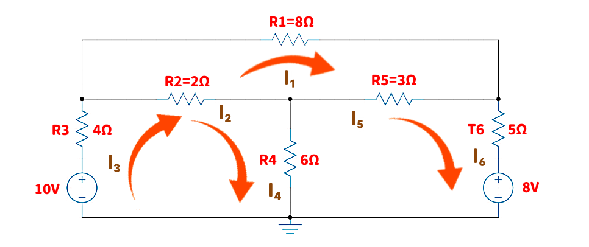

# 基尔霍夫定律应用例子

## 注意事项

以下计算理论是基于 [基尔霍夫定律](https://hkdickyko.github.io/%E6%95%B0%E5%AD%A6/klaw)

以下计算求解方法是基于 [最小平方法(伪逆)](https://hkdickyko.github.io/%E6%95%B0%E5%AD%A6/lsqsphere) ，计算公式如下：

$$
\hat{x}= A^{T}\cdot(A \cdot A^T)^{-1} \cdot \hat{b}
$$

相关的电流计算答案如下所示。

## 六个电阻组成的电路示例如下

由 **基尔霍夫定律** 知道进入某点之电流等于离开该点之电流, 设各电阻之电流分别为 $x_1, x_2, . . . , x_6 $ (+1 = 离开顶点 ，-1 = 到达顶点) 则
一些方程可以显示所有变量函数，如下所示：

$$
\begin{matrix}
x_1 + x_2 − x_3 = 0 \\
x_2 − x_4 − x_5 = 0 \\
x_1 + x_5 − x_6 = 0 \\
\end{matrix}
$$

倘若考虑其它点之电流, 所得到的皆是以上式中方程式的线性组合, 所以只列这三个就足够了。 

另外, 一个回路之电压和为零, 由于电流乘以电阻等于电阻两端的电压。根据此关系，电压方程如下：

$$
\begin{matrix}
2x_2 + 4x_3 + 6x_4 = 10 \\
−6x_4 + 3x_5 + 5x_6 = -8 \\
8x_1 − 2x_2 − 3x_5 = 0 \\
\end{matrix}
$$

基于上述两个矩阵中共 **6** 個線性方程式可用來決定 $x_1, x_2, . . . , x_6$。也就是說, 這就是一個解線性系統如下：

$$
A \cdot \hat{x} = \hat{b} ， \begin{bmatrix}
1 & 1 & -1 & 0 & 0  & 0\\
0 & 1 & 0 & -1 & -1 & 0 \\
1 & 0 & 0 & 0 & 1 & -1 \\
0 & 2 & 4 & 6 & 0 & 0 \\
0 & 0 & 0 & -6 & 3 & 5 \\
8 & -2 & 0 & 0 & -3 & 0 \\
\end{bmatrix} \cdot \begin{bmatrix}x_1\\x_2\\x_3\\x_4\\x_5\\x_6\end{bmatrix} = \begin{bmatrix}0\\0\\0\\10\\-8\\0\end{bmatrix} 
$$

$$
\hat{x}= A^{T}\cdot(A \cdot A^T)^{-1} \cdot \hat{b}
$$

$$
(A \cdot A^T)^{-1} = \tiny \left (
\begin{bmatrix}
1 & 1 & -1 & 0 & 0  & 0\\
0 & 1 & 0 & -1 & -1 & 0 \\
1 & 0 & 0 & 0 & 1 & -1 \\
0 & 2 & 4 & 6 & 0 & 0 \\
0 & 0 & 0 & -6 & 3 & 5 \\
8 & -2 & 0 & 0 & -3 & 0 \\
\end{bmatrix} \cdot 
\begin{bmatrix}
1 & 0 & 1 & 0 & 0  & 8\\
1 & 1 & 0 & 2 & 0 & -2 \\
-1 & 0 & 0 & 4 & 0 & 0 \\
0 & -1 & 0 & 6 & -6 & 0 \\
0 & -1 & 1 & 0 & 3 & -3 \\
0 & 0 & -1 & 0 & 5 & 0 \\
\end{bmatrix}
\right )^{-1} 
$$

$$ 
\tiny = 
\begin{bmatrix}
0.5367056245 & -0.2439919649 &-0.2188093499 & 0.001068298028 & 0.001643535427 & -0.02419649379 \\
-0.2439919649 & 0.5460829072 & 0.2695580716 & 0.02920471147 & -0.001223520818 & -0.004209276844 \\
-0.2188093499 & 0.2695580716 & 0.534514244 & 0.01624360847 & 0.009605551497 & -0.01919284149 \\
0.001068298028 & 0.02920471147 & 0.01624360847 & 0.02949004748 & 0.01460007305 & 0.001721146822 \\
0.001643535427 & -0.001223520818 & 0.009605551497 & 0.01460007305 & 0.02246165084 & 0.002647918188 \\
-0.02419649379 & -0.004209276844 & -0.01919284149 & 0.001721146822 & 0.002647918188 & 0.01657231556 \\
\end{bmatrix}
$$

$$
\tiny A^{T}\cdot(A \cdot A^T)^{-1} =
\tiny
\begin{bmatrix}
0.1243243243 & -0.008108108108 & 0.1621621622 & 0.03108108108 & 0.03243243243 & 0.08918918919 \\
0.3432432432 & 0.3689189189 & 0.1216216216 & 0.08581081081 & 0.02432432432 & -0.05810810811 \\
-0.5324324324 & 0.3608108108 & 0.2837837838 & 0.1168918919 & 0.05675675676 & 0.03108108108 \\
0.2405405405 & -0.3635135135 & -0.2297297297 & 0.06013513514 & -0.04594594595 & -0.001351351351 \\
0.1027027027 & -0.2675675676 & 0.3513513514 & 0.02567567568 & 0.07027027027 & -0.05675675676 \\
0.227027027 & -0.2756756757 & -0.4864864865 & 0.05675675676 & 0.1027027027 & 0.03243243243 \\
\end{bmatrix}
$$

$$
\tiny 
\begin{bmatrix}
x_1 \\ x_2 \\ x_3 \\ x_4 \\ x_5 \\ x_6 
\end{bmatrix} = 
\tiny 
\begin{bmatrix}
0.1243243243 & -0.008108108108 & 0.1621621622 & 0.03108108108 & 0.03243243243 & 0.08918918919 \\
0.3432432432 & 0.3689189189 & 0.1216216216 & 0.08581081081 & 0.02432432432 & -0.05810810811 \\
-0.5324324324 & 0.3608108108 & 0.2837837838 & 0.1168918919 & 0.05675675676 & 0.03108108108 \\
0.2405405405 & -0.3635135135 & -0.2297297297 & 0.06013513514 & -0.04594594595 & -0.001351351351 \\
0.1027027027 & -0.2675675676 & 0.3513513514 & 0.02567567568 & 0.07027027027 & -0.05675675676 \\
0.227027027 & -0.2756756757 & -0.4864864865 & 0.05675675676 & 0.1027027027 & 0.03243243243 \\
\end{bmatrix}
\cdot
\begin{bmatrix}0\\0\\0\\10\\-8\\0\end{bmatrix} 
$$

$$
\begin{bmatrix}
x_1 \\ x_2 \\ x_3 \\ x_4 \\ x_5 \\ x_6 
\end{bmatrix} =
\begin{bmatrix}
0.05135135135\\
0.6635135135\\
0.7148648649\\
0.9689189189\\
-0.3054054054\\
-0.2540540541
\end{bmatrix}
$$

## 环路导向方法 (Node-oriented methods)

环路导向方法在于

 - 管道网络中每个轮廓的能量平衡（第二基尔霍夫定律）应始终得到满足；
 - 而每个节点的质量平衡（第一基尔霍夫定律）需要在计算结束时实现。

# 伪逆矩阵 (Pseudo Inverse Matrix)

对任意矩阵存在唯一的伪逆矩阵必须满足下列四个条件：

$$\begin{array}{l}
1.&A{A^\dagger}A = A\\
2.&{A^\dagger}A{A^\dagger} = {A^\dagger}\\
3.&{(A{A^\dagger})^T} = A{A^\dagger}\\
4.&{({A^\dagger}A)^T} = {A^\dagger}A
\end{array}
$$

1. 若 $A$ 矩阵有线性独立的 columns 则上述 Pseudo inverse matrix $\bbox[yellow]{A^\dagger}$ 与以下定义等价

$$A^\dagger := (A^T A)^{-1}A^T$$

 - 其中 $A^T A$ 必须为 nonsingular，基于此等价定义满足前述标准定义的四个条件。

2. 一般而言，拟反矩阵又称 **广义反矩阵** (Generalized Inverse Matrix)

3. 伪逆 Pseudo inverse 对任意矩阵皆存在

4. 上述的 Pseudo Inverse 来自最小二次平方问题，简述如下：

$$Ax = b$$

 - 其中行列的长度不相等。此时 $A$ 矩阵并非方阵，故不存在反矩阵，不能直接求逆 $A^{-1}$。但可用以下公式。详细请参考网上资料。

$$
x^* = (A^T A)^{-1}A^Tb = A^\dagger b
$$

 - 若 $A^T A$ 为非奇异矩阵，则可求解 $x$ 并令 $x^*:=x$ 可得以上公式。

## 计算方法

首先考虑矩阵 $A$ 满秩的情况，即 $A$ 的秩 $= min(m,n)$。

伪逆矩阵 $A^+$ 是一个 $n × m$ 矩阵，具有以下性质：

 - 如果 $m ≥ n$，则 $A^TA$ 可逆，且 $A^+ = (A^TA)^{-1}A^T$，因此 $A^+A = I$，即 $A^+$ 是 $A$ 的左逆。

 - 如果 $m ≤ n$，则 $AA^T$ 可逆，且 $A^+ = A^T(AA^T)^{-1}$，因此 $AA^+ = I$，即 $A^+$ 是 $A$ 的右逆。

 - 如果 $A$ 可逆，则 $A^+ = A^{-1}$。

注意，给定一个表示为 $AX = C$ 的线性方程组，可以通过 $X = A^+AX = A^+C$ 来获得解。

## 总结

 - 拟反矩阵常见于统计学中的回归分析，给定一组量测资料，试求一条 **曲线**/**直线** 使得该线与量测资料之间的平方误差最小。
 - 关于最小这个观点其实应在做二阶充分条件 (Second Order Sufficient Condition)检验，事实上若  $A^TA$ 为正定矩阵 (positive definite) 则不难检验  $x^*$ 确实为 local 最佳解。 另外上述的二次平方成本函数为凸函数，故此最佳解为全域最佳 (global minimum)。