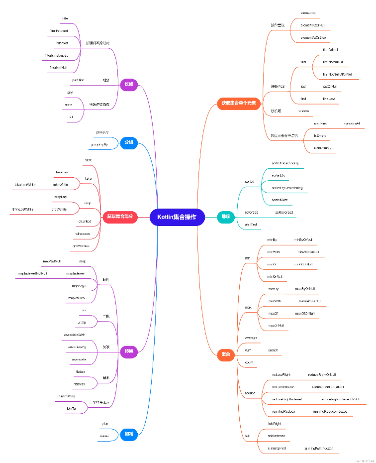

<style>
  table {
    width: 100%
    }
  td {
    vertical-align: center;
    text-align: center;
  }
  td.left {
    vertical-align: center;
    text-align: left;
  }  
  table.inputT{
    margin: 10px;
    width: auto;
    margin-left: auto;
    margin-right: auto;
    border: none;
  }
  input{
    text-align: center;
    padding: 0px 10px;
  }
  iframe{
    width: 100%;
    display: block;
    border-style:none;
  }
</style>

# Kotlin

**Kotlin** 是一种运行在 Java 虚拟机 (JVM) 上的静态类型编程语言，也可以编译成 JavaScript。 它被设计成可以与 Java 代码无缝协作，并且提供了更简洁、更安全的语法。

## 变量
 
而 **Kotlin** 中定义一个变量，只允许在变量前声明两种关键字： **val** 和 **var**。
 - val（value 的简写）用来声明一个不可变的变量，这种变量在初始赋值之后就再也不能重新赋值，对应 Java 中的 <font color="#FF1000">final</font> 变量。
 - var（variable 的简写）用来声明一个可变的变量，这种变量在初始赋值之后仍然可以再被重新赋值，对应 Java 中的<font color="#FF1000">非 final</font> 变量。

小诀窍，永远优先使用 val 来声明一个变量，而当 val 没有办法满足你的需求时再使用 var。这样设计出来的程序会更加健壮，也更加符合高质量的编码规范。声明变量方法如下：

```kotlin
// 隐式声明 (不设定数据类型)
val a = 10

// 显式声明 (设定数据类型)
val a: Int = 10
```

|Java基本数据类型|Kotlin对象数据类型|数据类型说明|
|:---:|:---:|:---:|
|int|Int|整型|
|long|Long|长整型|
|short|Short|短整型|
|float|Float|单精度浮点型|
|double|Double|双精度浮点型|
|boolean|Boolean|布尔型|
|char|Char|字符型|
|byte|Byte|字节型|

## 函数

fun（function 的简写）是定义函数的关键字，无论定义什么函数，都一定要使用 **fun** 来声明。函数名后面紧跟着一对括号，里面可以声明该函数接收什么参数，参数的数量可以是任意个数。最后函数可返回一个类型的数据。例子如下：


```kotlin
fun largerNumber(num1: Int, num2: Int): Int 
{    
   return max(num1, num2)
}
```

### Kotlin 语法糖

当一个函数中只有一行代码时，Kotlin 允许不必编写函数体，可以直接将唯一的一行代码写在函数定义的尾部，中间用等号连接即可。使用这种语法，return 关键字也可以省略了，等号足以表达返回值的意思。

```kotlin
fun largerNumber(num1: Int, num2: Int): Int = max(num1, num2)
```

## 逻辑控制

主要分为 **2** 种：条件语句和循环语句。

### 条件语句（ if， when ）

**if** - if 语句和 Java 中的 if 语句几乎没有任何区别。

**when** - 远比 Java 中的 switch 语句强大。格式是：匹配值 -> { 执行逻辑 }，示例如下：

```kotlin
fun getScore(name: String) = when (name) 
{     
    "Tom" -> 86
    "Jim" -> 77
    "Jack" -> 95
    "Lily" -> 100
    else -> 0 
}
```

除了精确匹配之外，**when** 语句还允许进行类型匹配。

```kotlin
fun checkNumber(num: Number) 
{   
  when (num) {         
    is Int -> println("number is Int")               
    is Double -> println("number is Double")         
    else -> println("number not support")     
  } 
}
```

when 语句还有一种不带参数的用法，有些场景必须使用这种写法才能实现。举个例子：


```kotlin
fun getScore(name: String) = when {     
  name.startsWith("Tom") -> 86
  name == "Jim" -> 77     
  name == "Jack" -> 95     
  name == "Lily" -> 100     
  else -> 0 
}
```

## 循环语句（ while，for-in / until / step / downTo ）

**while** 循环不管是在语法还是使用技巧上都和 Java中的 while 循环没有任何区别。

**for-in** 循环来遍历这个区间

```kotlin
fun main() {
  for (i in 0..10) {
     pprintln(i)     
  } 
}
```

使用 until 关键字来创建一个左闭右开的区间。代码表示创建了一个 **0** 到 **10** 的左闭右开区间，它的数学表达方式是 [0, 10)。main() 函数中的代码，使用 until 替代 .. 关键字，就会发现最后一行 10 不会再打印出来。结合 step 关键字，就能够实现一些更加复杂的循环逻辑。

```kotlin
fun main() {
  for (i in 0 until 10 step 2) {         
    println(i)
  } 
}
```

想创建一个降序的区间，可以使用 downTo 关键字，用法如下：

```kotlin
fun main() {
  for (i in 10 downTo 1) {        
    println(i)     
  } 
}
```

# 面向对象编程

面向对象的语言是可以创建类的。类就是对事物的一种封装，通过类的封装，就可以在适当的时候创建该类的对象，然后调用对象中的字段和函数来满足实际编程的需求，就相等于电子零件中的集成电路。当然面向对象编程还有很多其他特性，如继承、多态等。


## **Class** 表示创建一个非抽象类

```kotlin
class Person { 
  ...
}
```

实例化一个类的方式和 Java 是基本类似的，只是去掉了 new 关键字而已。代码如下所示：

```kotlin
val p = Person()
```

## **open Class** 表示创建一个抽象类

Kotlin 在设计的时默认所有非抽象类都是不可以被继承的。之所以这里一直在说非抽象类，是因为抽象类本身是无法创建实例的，一定要由子类去继承它才能创建实例，因此抽象类必须可以被继承才行，要不然就没有意义了。

只有加上 **open** 关键字之后，就是在主动告诉Kotlin 编译器，这个类是专门为继承而设计的，

```kotlin
open class Person {
  ...
}
```

在 Java 中继承的关键字是 extends，而在 Kotlin 中变成了一个冒号，写法如下：


```kotlin
class Student(val sno: String, val grade: Int, name: String, age: Int) 
  : Person(name, age) 
{ 
  ...
}
```

Student 类的主构造函数中增加 name 和 age 这两个字段时，不能再将它们声明成 val，因为在主构造函数中声明成 val 或者 var 的参数将自动成为该类的字段，这就会导致和父类中同名的 name 和 age 字段造成冲突。因此，这里的 name 和 age 参数前面不用加任何关键字，让它的作用域仅限定在主构造函数当中即可。

### 次构造函数

次构造函数是通过 constructor 关键字来定义的，这里定义了两个次构造函数：
 - 第一个次构造函数接收 name 和 age 参数，然后它又通过 this 关键字调用了主构造函数，并将 sno 和 grade 这两个参数赋值成初始值；
 - 第二个次构造函数不接收任何参数，它通过 this 关键字调用了我们刚才定义的第一个次构造函数， name 和 age 参数也赋值成初始值，由于第二个次构造函数间接调用了主构造函数，因此这仍然是合法的。


```kotlin
class Student(val sno: String, val grade: Int, name: String, age: Int) 
  : Person(name, age) {     
  constructor(name: String, age: Int) 
    : this("", 0, name, age) {
      ...
    } 
  constructor() : this("", 0) {
    ...
  } 
}
```

一种非常特殊的情况：类中只有次构造函数，没有主构造函数。由于没有主构造函数，次构造函数只能直接调用父类的构造函数，上述代码也是将 this 关键字换成了 super 关键字，这部分就很好理解了，因为和 Java 比较像如下：


```kotlin
class Student : Person {     
   constructor(name: String, age: Int) 
     : super(name, age) 
   { 
      ... 
   } 
}
```

现在 Student 类是没有主构造函数的。那么既然没有主构造函数，继承 Person 类的时候也就不需要再加上括号。


## 接口

Kotlin 中的接口部分和 Java 几乎是完全一致。


```kotlin
interface Study {
    fun readBooks()
    fun doHomework() 
}
```

接下来就可以让 Student 类去实现 Study 接口。


```kotlin
class Student(name: String, age: Int) 
  : Person(name, age), Study {
  override fun readBooks() {         
    println(name + " 在阅读。")
  }     
  override fun doHomework() {         
    println(name + " 在做功课。")     
  } 
}
```

Java 中继承使用的关键字是 extends，实现接口使用的关键字是 implements，而 Kotlin 中统一使用 <font color="#FF1000">：</font> 冒号，中间用 <font color="#FF1000">，</font> 逗号进行分隔。上述代码就表示 Student 类继承了 Person 类，同时还实现了 Study 接口。另外接口的后面不用加上括号，因为它没有构造函数可以去调用。

**override** 关键字是用来重写父类或者实现接口中的函数。如果接口中的一个函数拥有了函数体，这个函数体中的内容就是它的默认实现。不需要用一定用 **override** 关键字是用来重写。


Kotlin 中也有 <font color="#FF1000">4</font> 种，分别是 **public**、**private**、**protected** 和 **internal**，需要使用哪种修饰符时，直接定义在fun关键字的前面即可。下面我详细介绍。


|修饰符|Java|Kotlin|
|:---:|:---:|:---:|
|public|所有类可见|所有类可见（默认）|
|private|当前类可见|当前类可见|
|protected|当前类、子类、同一包路径下的类可见|当前类、子类可见|
|default|同一包路径下的类可见（默认）|无|
|internal|无|同一模块中的类可见|


## 数据类

数据类通常占据着非常重要的角色，它们用于将服务器端或数据库中的数据映射到内存中，为编程逻辑提供数据模型的支持。


数据类通常需要重写 equals()、hashCode()、toString() 这几个方法。其中，equals() 方法用于判断两个数据类是否相等。hashCode() 方法作为 equals() 的配套方法，也需要一起重写，否则会导致 HashMap、HashSet 等 hash 相关的系统类无法正常工作。toString() 方法用于提供更清晰的输入日志。

```kotlin
data class Cellphone(val brand: String, val price: Double)
```

data 这个关键字，当在一个类前面声明了 data 关键字时，就表明这个类是一个数据类。Kotlin会根据主构造函数中的参数帮你将 equals()、hashCode()、 toString() 等固定且无实际逻辑意义的方法自动生成，从而大大减少了开发的工作量。


## 单例类

单例类是最常用、最基础的设计模式之一，它可以用于避免创建重复的对象。比如某个类在全局最多只能拥有一个实例，这时就可以使用单例模式。

```kotlin
object Singleton { 
  fun singletonTest() {         
    println("单例类")
  }
}
```

只需要把 class 关键字改成 object 关键字，一个单例类就创建完成了。而调用单例类中的函数也很简单，比较类似于Java中静态方法的调用方式。


```kotlin
Singleton.singletonTest()
```

## Lambda编程

### 集合的创建与遍历

集合主要就是 List 和 Set，再广泛一点的话，像 Map 这样的键值对数据结构也可以包含进来。
 - List 的主要实现类是 ArrayList 和 LinkedList；
 - Set 的主要实现类是 HashSet；
 - Map 的主要实现类是 HashMap。


#### List

 - listOf() 是一个不可变的集合就是该集合，只能用于读取，无法对集合进行添加、修改或删除操作。是 Kotlin 用来简化初始化集合的写法，如下所示：

```kotlin
val list = listOf("Apple", "Banana", "Orange", "Pear", "Grape")
```

 - mutableListOf() 为可变的集合就是该集合。示例如下：


```kotlin
fun main() {
  val list = mutableListOf("Apple", "Banana", "Orange", "Pear", "Grape")
  list.add("Watermelon") 
  for (fruit in list) {         
     println(fruit)     
  } 
}
```

#### Set

Set 集合中是不可以存放重复元素，如果存放了多个相同的元素，只会保留其中一份。当然这部分知识属于数据结构相关的内容，这里就不讨论。List 集合的用法，实际上 Set 集合的用法几乎与此一模一样，只是将创建集合的方式换成了 setOf() 和 mutableSetOf() 函数而已。

  - setOf
  - mutableSetOf

```kotlin
val set = setOf("Apple", "Banana", "Orange", "Pear", "Grape") 
for (fruit in set) {   
  println(fruit) 
}
```

#### Map

Map 是一种键值对形式的数据结构，因此在用法上和 List 、 Set 集合有较大的不同。传统的 Map 用法是先创建一个 HashMap 的实例，然后将一个个键值对数据添加到 Map 中。


```kotlin
val map = HashMap<String, Int>()
  map["Apple"] = 1
  map["Banana"] = 2 
  map["Orange"] = 3
```

mapOf() 和 mutableMapOf() 函数来继续简化 Map 的用法。在 mapOf() 函数中，可以直接传入初始化的键值对组合来完成对 Map 集合的创建：


```kotlin
val map = mapOf("Apple" to 1, "Banana" to 2, "Orange" to 3, "Pear" to 4, "Grape" to 5)
```

to 并不是关键字，而是一个 infix 函数。




### Java 函数式 API 的使用方法


++Lambda 表达式的语法++

{参数名1: 参数类型, 参数名2: 参数类型 -> 函数体}

首先最外层是一对大括号，如果有参数传入到 Lambda 表达式中的话，还需要声明参数列表，参数列表的结尾使用一个 <font color="#FF1000">-></font> 符号，表示参数列表的结束以及函数体的开始，函数体中可以编写任意行代码（虽然不建议编写太长的代码），并且最后一行代码会自动作为Lambda表达式的返回值。


Java 代码创建并执行一个子线程：

```kotlin
new Thread(new Runnable() {
   @Override public void run() {         
      System.out.println("Thread is running");     
   }
}).start();
```

直接将这段代码翻译成 Kotlin ，写法将如下所示：

```kotlin
Thread(object : Runnable {     
  override fun run() {       
    println("Thread is running")     
  } 
}).start()
```

 - 省略 object 因是单例类
 - 省略 Runnable
    - 无需明确创建实现 Runnable 的匿名对象，编译器会自动将此 lambda 转换为 Runnable 的实例。
 - 省略 run 因是唯一方法
    - 因为 Runnable 类中只有一个待实现方法，即使没有显式地重写 run() 方法，编译器会自动明白 Runnable 后面的表达式在 run() 方法中实现。
 - 省略 最外层括号，因 Lambda 表达式是
    - 最后一个参数，可以将表达式移到方法<font color="#FF1000">括号</font>的外面。
    - 唯一参数，可以省略<font color="#FF1000">括号</font>。

最终简化结果如下：

```kotlin
Thread{
 println("Thread is running")
}.start()
```

## 空指针检查及使用

因崩溃率最高的异常类型就是空指针异常（NullPointerException）。Kotlin 利用编译时判空检查的机制几乎杜绝了空指针异常。如有机会使用到空指针可用 <font color="#FF1000">?</font>。如 Int 表示不可为空的整型，而 Int<font color="#FF1000">?</font> 就表示可为空的整型； String 表示不可为空的字符串，而  String<font color="#FF1000">?</font> 就表示可为空的字符串。


## 判空辅助工具

当对象不为空时正常调用相应的方法，当对象为空时则什么都不做。比如以下的判空处理代码：


```kotlin
if (a != null) { 
  a.doSomething() 
}
```

用 **?.** 当 a 为空指針事则退出，可以简化成：

```kotlin
a?.doSomething()
```
当对象不为空时正常调用选择的方法，当对象为空时则选择 c = b 。比如以下的判空处理代码：

```kotlin
val c = if (a ! = null) 
  { a } 
else 
  { b }
```

用 **?:** 另一个当 a 为空指針事作选择。可以简化成：

```kotlin
val c = a ?: b
```

## let 与 it

let 函数属于 Kotlin 中的标准函数，可以处理全局变量的判空问题。

```kotlin
fun doStudy(study: Study?) {     
  study?.let { stu ->         
    stu.readBooks() 
    stu.doHomework()
  } 
}
```

?. 操作符表示对象为空时什么都不做，对象不为空时就调用 **let** 函数，而 let 函数会将对象本身作为参数传递到 Lambda 表达式中，此时的有个好s对象肯定不为空，就能放心地调用它的任意方法了。

当 Lambda 表达式的参数列表中只有一个参数时，可以不用声明参数名，直接使用 **it** 关键字来代替即可，那么代码就可以进一步简化成：

```kotlin
fun doStudy(study: Study?) {     
  study?.let { 
    it.readBooks()         
    it.doHomework()
  } 
}
```

## 字符串内嵌表达式

Kotlin 允许在字符串里嵌入 ${} 这种语法结构的表达式，并在运行时使用表达式执行的结果替代这一部分内容。

```kotlin
"hello, ${obj.name}. nice to meet you!"
```

当表达式中仅有一个变量的时候，还可以将两边的大括号省略，如下所示：

```kotlin
"hello, $name. nice to meet you!"
```


## 函数的参数默认值


在定义函数的时候给任意参数设定一个默认值，这样当调用此函数时就不会强制要求调用方为此参数传值，在没有传值的情况下会自动使用参数的默认值。观察如下代码：

```kotlin
fun printParams(num: Int, str: String = "hello") {   
  println("num is $num , str is $str") 
}
```

可以通过键值对的方式来传参，从而不必像传统写法那样按照参数定义的顺序来传参。比如调用printParams() 函数，还可以这样写：


```kotlin
fun printParams(num: Int = 100, str: String) {    
  println("num is $num , str is $str") 
} 

fun main() {   
  printParams(str = "world") 
}
```


