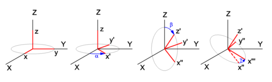

# 3D 變換实例

参考资料 [3D 變換數學 (四元数)](https://hkdickyko.github.io/%E6%95%B8%E5%AD%B8/3d)

# 矩陣

## 平移變換

$$ T_{(x,y,z)} = \begin{bmatrix}
 1 & 0 & 0 & x_t \\
 0 & 1 & 0 & y_t \\
 0 & 0 & 1 & z_t \\
 0 & 0 & 0 & 1 \\
\end{bmatrix} $$

## 旋轉變換

### YZ 平面旋轉

$$ R_x(\theta) = \begin{bmatrix}
 1 & 0 & 0 & 0 \\
 0 & cos\theta & -sin\theta & 0 \\
 0 & sin\theta & cos\theta & 0 \\
 0 & 0 & 0 & 1 \\
\end{bmatrix} $$

### ZX 平面旋轉

$$ R_y(\phi) = \begin{bmatrix}
 cos\phi & 0 & sin\phi & 0 \\
 0 & 1 & 0 & 0 \\
 -sin\phi & 0 & cos\phi & 0 \\
 0 & 0 & 0 & 1 \\
\end{bmatrix} $$

### XY 平面旋轉

$$ R_z(\psi) = \begin{bmatrix}
 cos\psi & -sin\psi & 0 & 0 \\
 sin\psi & cos\psi & 0 & 0 \\
 0 & 0 & 1 & 0 \\
 0 & 0 & 0 & 1 \\
\end{bmatrix} $$

### 三轴旋轉

$$
\small 
R_{zyx}(\psi,\phi,\theta)=
\begin{bmatrix}
 cos(\phi)cos(\psi)  & sin(\theta)sin(\phi)cos(\psi)-cos(\theta)sin(\psi) & cos(\theta)sin(\phi)cos(\psi)+sin(\theta)sin(\psi) & 0 \\
 cos(\phi)sin(\psi)  & sin(\theta)sin(\phi)sin(\psi)+cos(\theta)cos(\psi)& cos(\theta)sin(\phi)sin(\psi)-sin(\theta)cos(\psi) & 0 \\
-sin(\phi) & sin(\theta)cos(\phi) & cos(\theta)cos(\phi) & 0 \\
 0 & 0 & 0 & 1 \\
\end{bmatrix}
$$

## 3D 直线

$$
x = x_1 + t \cdot (x_2 - x_1) \\
y = y_1 + t \cdot (y_2 - y_1) \\
z = z_1 + t \cdot (z_2 - z_1)
$$

## 3D 矩阵转换

先将特定的空间点转移到点 $[0,0,0]$，假设最初的点为 $ x_t, y_t, z_t $。

$$ T_{(x,y,z)} = \begin{bmatrix}
 1 & 0 & 0 & -x_t \\
 0 & 1 & 0 & -y_t \\
 0 & 0 & 1 & - z_t \\
 0 & 0 & 0 & 1 \\
\end{bmatrix} $$

## 3D 向量與欧拉角转换

$$
\psi = yaw = rot_x = arctan2 \left ( \frac {y}{x} \right )
$$

$$
\phi = pitch = rot_y = arctan2 \left ( \frac {x \cdot cos(\psi)}{z} \right )
$$

$$
\theta = roll = rot_z = arctan2 \left ( \frac {cos(\psi)}{sin(\psi)sin(\phi)} \right )
$$

