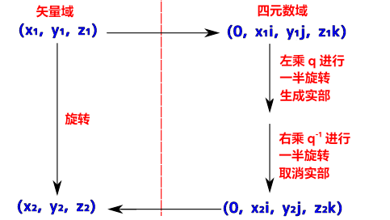
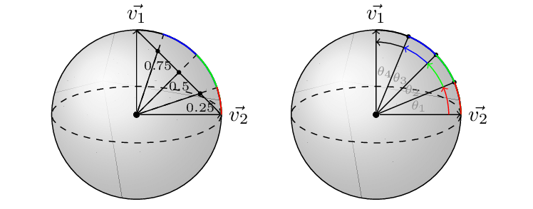
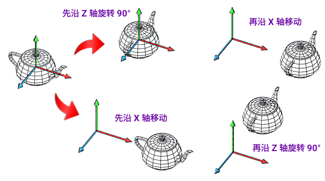

# 3D 空间变换应用

参考资料 [3D 變換數學 (四元数)](https://hkdickyko.github.io/%E6%95%B8%E5%AD%B8/3d)

互联网上的 [3D旋转转换器](https://www.andre-gaschler.com/rotationconverter)

# 矩阵 (Matrix)

## 平移变换

$$ T_{(x,y,z)} = \begin{bmatrix}
 1 & 0 & 0 & x_t \\
 0 & 1 & 0 & y_t \\
 0 & 0 & 1 & z_t \\
 0 & 0 & 0 & 1 \\
\end{bmatrix} $$

## 旋转变换

### XY 平面旋转

$$ yaw = R_z(\psi) = \begin{bmatrix}
 cos\psi & -sin\psi & 0 & 0 \\
 sin\psi & cos\psi & 0 & 0 \\
 0 & 0 & 1 & 0 \\
 0 & 0 & 0 & 1 \\
\end{bmatrix} $$

### ZX 平面旋转

$$ pitch = R_y(\phi) = \begin{bmatrix}
 cos\phi & 0 & sin\phi & 0 \\
 0 & 1 & 0 & 0 \\
 -sin\phi & 0 & cos\phi & 0 \\
 0 & 0 & 0 & 1 \\
\end{bmatrix} $$

### YZ 平面旋转

$$ roll = R_x(\theta) = \begin{bmatrix}
 1 & 0 & 0 & 0 \\
 0 & cos\theta & -sin\theta & 0 \\
 0 & sin\theta & cos\theta & 0 \\
 0 & 0 & 0 & 1 \\
\end{bmatrix} $$

### 三轴旋转

$$
\small 
R_{zyx}(\psi,\phi,\theta)=
\begin{bmatrix}
 cos(\phi)cos(\psi)  & sin(\theta)sin(\phi)cos(\psi)-cos(\theta)sin(\psi) & cos(\theta)sin(\phi)cos(\psi)+sin(\theta)sin(\psi) & 0 \\
 cos(\phi)sin(\psi)  & sin(\theta)sin(\phi)sin(\psi)+cos(\theta)cos(\psi)& cos(\theta)sin(\phi)sin(\psi)-sin(\theta)cos(\psi) & 0 \\
-sin(\phi) & sin(\theta)cos(\phi) & cos(\theta)cos(\phi) & 0 \\
 0 & 0 & 0 & 1 \\
\end{bmatrix}
$$

# 四元数 (Quaternion)

[四元数简介](https://hkdickyko.github.io/%E6%95%B8%E5%AD%B8/Quaternions)

四元数只能用来代替矩阵保存旋转信息，平移无法代替。
四元数的旋转信息就是轴和角，所以对任意 **2** 个朝向，可以直接找到一个轴并使一方绕轴旋转一定角度获得另一方，也就是说 **2** 个朝向可以通过一次旋转进行转换，这也是轴角旋转的原理（欧拉旋转定律）。

 - 可以避免万向节锁现象；
 - 只需要一个4维的四元数就可以执行绕任意过原点的向量的旋转，方便快捷，在某些实现下比旋转矩阵效率更高；
 - 可以提供平滑插值；

## 纯四元四元数 - 单一向量找四元数

$$
(0, ai, bi, ck)
$$

， 其中 $(a, b, c)$ 为点向量值即相对 $x, y, z$ 值。

## 四元四元数 - 由 2 向量 (v, u) 找四元数

 - Normalize (归一化)

$$
q = (w, a x, b y, c z) \\
|q| = \sqrt{w^2 + a^2 + b^2 + c^2} \\
$$

$$
q_n = (\frac {w}{|q|},\frac {a}{|q|}x,\frac {b}{|q|}y,\frac {c}{|q|}z)
$$

互联网上的 [矢量幅度计算器](https://onlinemschool.com/math/assistance/vector/length/)

 - Cross Product (叉积)

$$
cross(v, u) = \begin{bmatrix} C_x \\ C_y \\ C_z \end{bmatrix} \Rightarrow \begin{bmatrix}
v_y \cdot u_z - v_z \cdot u_y \\
v_z \cdot u_x - v_x \cdot u_z \\
v_x \cdot u_y - v_y \cdot u_x
\end{bmatrix}
$$

注： $ cross(v,u) = -cross(u,v) $

互联网上的 [叉积计算器](https://onlinemschool.com/math/assistance/vector/multiply1/)

 - Dot Product (点积)

$$
dot(v, u) = \sum_{i=0}^{n} v_i\cdot u_i 
$$

互联网上的 [点积计算器](https://onlinemschool.com/math/assistance/vector/multiply/)

### 罗德里格旋转公式 (Rodrigues' rotation formula) 计算出四元数

 1. 计算前准备 (根据公式 8)：
     - 先归一化两个输入向量。
 2. 计算旋转轴 (根据公式 9)：
     - 计算第一个向量 $(v1)$ 和第二个向量 $(v2)$ 的叉积及对计出来的轴向量进行归一化。这是从 $v1$ 旋转到 $v2$ 。 注意一定要归一化叉积的计算结果，否则在最终计算中会出错。
     
$$
axis = cross(v1, v2) = \begin{bmatrix} axis.x\\ axis.y\\  axis.z \end{bmatrix}
$$

$$
axis_n = \begin{bmatrix} \frac{axis.x}{|axis|},\frac{axis.y}{|axis|},\frac{axis.z}{|axis|}\end{bmatrix}
$$

 2. 计算旋转角度 (根据公式 10)：
     - 使用两个归一化后的向量点积计算角度的余弦。
     
$$
cos(angle) = dot(v1, v2) \\ \\
angle = cos^{-1}(dot(v1, v2))
$$
 
 3. 构造四元数：
     - 四元数可以使用公式 $q = (cos(\frac {angle}{2}), sin(\frac {angle}{2}) \cdot axis_n)$ 构造。
     - 在代码中，对比四元数如下： 

$$
q = quaternion(w, ax, by,cz) \Rightarrow \begin{matrix}w=cos(\frac {angle}{2})\\ a=sin(\frac {angle}{2}) \cdot axis_n.x\\ b=sin(\frac {angle}{2}) \cdot axis_n.y\\ c=sin(\frac {angle}{2}) \cdot axis_n.z \end{matrix}
$$

任意向量 $v$ 沿着以单位向量定义的旋转轴 $\color{RED} u$ 旋转 $ \theta$ 度之后的 $\hat v$ 可以使用四元数乘法来获得．

$$q = (cos(\frac {\theta}{2}), sin(\frac {\theta}{2}) \cdot \color{RED} u \color {black})$$

根据上面的结论，在四元数的定义中，对于虚部 $i、j、k$ 本身的几何意义可以理解为一种旋转，其中

 - $i$ 旋转代表X轴与Y轴相交平面中X轴正向向Y轴正向的旋转，
 - $j$ 旋转代表Z轴与X轴相交平面中Z轴正向向X轴正向的旋转，
 - $k$ 旋转代表Y轴与Z轴相交平面中Y轴正向向Z轴正向的旋转，

## <b>结论：</b> 四元数是使用超平面重新定义旋转轴，让旋转轴垂直于超平面，从而保持所有旋转只需要一个角度 $\theta$

所以如假设有一个单位四元数$ q = [a,b] $，实部 $w$ 则是一个角度 $\theta$ 的余弦值

 - 对应旋转的角度 $\theta$ 计算

$$
 \frac {\theta}{2} = cos^{-1}(a)
$$ 

 - 对应旋转轴 $u$ 计算，需要将 $b$ 的每一项都除以 $ sin(\frac{\theta}{2}) $ 

$$
u =\frac {b} {sin(\frac{\theta}{2})}
$$

概念示例如下：

假设有两个向量：$ v1 = (1, 0, 0), v2 = (0, 1, 0) $

 - 归一化要计算的向量：(根据公式 7)。

 - 计算轴向量：(根据公式 8)，并要在计算完成后归一化向量。

$$axis = cross(v1, v2) = (0, 0, 1)$$ 

 - 计算角度：(根据公式 9)，最终结果为 $90°$ 或 $\pi$ 弧度。

$$ dot(v1, v2) = 0 \\ cos(angle) = 0\\ angle = 90° = \pi$$

 - 计算四元数：(根据公式 12)，当使用此四元数旋转一个点时，该点将从 $v1$ 旋转到 $v2$ 。

$$q = (cos(\frac{\pi}{2}), sin(\frac{\pi}{2})\cdot 0,sin(\frac{\pi}{2})\cdot 0, sin(\frac{\pi}{2})\cdot 1) $$ 

$$q = (cos(45°), 0, 0, sin(45°)) = (0.707, 0, 0, 0.707)$$ 

## 四元数的逆 (Inverse Quaternion)

$$
q^{-1} = (w, -ai, -bi, -ck)
$$

## 四元数运算

互联网上的 [四元数算器](https://www.allmath.com/quaternion-calculator.php)

## 四元数 3D 空间定点旋转

$$
\hat {v} = q v q^{-1}
$$

以上 $q$ 为带旋转的四元数。

  - 输入四元数 $ v = (0, x_1i, jy_1, z_1k)$ 是空间向量的四元数形式即纯四元数，而输入向量为 3D 空间点 $(x_1, y_1, z_1) $。 
  - 输出四元数 $ \hat {v} = (0, x_2i, y_2j, z_2k) $，而输出向量为 3D 空间点 $(x_2, y_2, z_2) $ 即删除之前是加上的零。 

## 四元数插值

j

### 正规化线性插值 (Nlerp)

因 *Lerp* 插值出来的 $q_t$ 因不是单位四元数，所以要将 $q_t$ 除以它的模 $q_t$ 。  将其转化为单位四元数。 即归一化线性插值（Normalized Linear Interpolation)，NLerp 的输入也一定要是单位向量，否则插值出来的结果不会经过初始和最终向量，其公式如下：

$$ Nlerp_{(q_0,q_1,t)} = q_t = \frac {(1-t)q_0+tq_1}{\left \| (1-t)q_0+tq_1 \right \|} $$

以上插值方法存在一定的问题，当需要插值的弧比较大时，$v_t$ 的角速度会有显著的变化。 在转动时会形成不平均的感觉。

### 球面線形插值 (Slerp)

球面线性插值是一个对四元数在四维超球面上的旋转计算值，角速度㑹均衡分布，公式如下:

$$ Slerp_{(q_0,q_1,t)} = q_t = \frac {sin[(1-t)\theta]q_0+sin[t\theta]q_1}{sin\theta} $$

 - 当 $\theta$ 太小时，可以用四元数归一化线性插值
 - 四元数最短路径的角度，用点积法测试，如果结果值为负即夹角大于90°，将 $q_0$ 或 $q_1$ 其中一个取反可以保证这个旋转走的是最短路径即夹角小于90°。

$$ q_t = \frac {sin[(1-t)\theta]{q_0}^{-1}+sin[t\theta]q_1}{sin\theta} = \frac {sin[(1-t)\theta]q_0+sin[t\theta]{q_1}^{-1}}{sin\theta} $$

# 四元数與矩阵之关係

$$
q = (w, xi, yj, zk)
$$

## 四元数转矩阵

$$
\begin{bmatrix}
M_{11} & M_{12} & M_{13} & 0\\
M_{21} & M_{22} & M_{23} & 0\\
M_{311} & M_{32} & M_{33} & 0 \\
0 & 0 & 0 & 1
\end{bmatrix} ＝ 
\begin{bmatrix} 
1-2\cdot(y^2+z^2) & 2\cdot(xy-wz) & 2\cdot(xz+wy) & 0\\
2\cdot(xy+wz) & 1-2\cdot(x^2+z^2) & 2\cdot(yz-wx) & 0\\
2\cdot(xz-wy) & 2\cdot(yz+wx) & 1-2\cdot(x^2+y^2) &0\\
0 & 0 & 0 & 1
\end{bmatrix}
$$

## 矩阵转四元数

$$
w = \frac {\sqrt{M_{11} + M_{22} + M_{33} + 1}} {2} \\
x = \frac {M_{32} - M_{23}}{4w} \\
y = \frac {M_{13} - M_{31}}{4w} \\
z = \frac {M_{21} - M_{12}}{4w}
$$

需要满足以下条件 $ w \neq 0 ，1+M_{11}+M_{22}+M_{33} >0 $。

# 计算欧拉角 

$$
\psi = yaw = arctan2 \left (y, x \right )
$$

$$
\phi = pitch = arctan2 \left (z, a \right ) = arctan2 \left (z, \sqrt{x^2 + y^2} \right )
$$

$$
\theta = roll = arctan2 \left ( \frac {cos(\psi)}{sin(\psi)sin(\phi)} \right )
$$

# 3D 矩阵转换

如将多个矩阵组合起来，每个矩阵都编码一个变换，这就是在不同空间之间变换向量的方法。接下来将创建一个组合了旋转和平移、平移旋转的变换矩阵，并创建了用于在不同坐标系之间变换的变换矩阵。

先将特定的空间点转移到点 $[0,0,0]$，假设最初的点为 $ x_t, y_t, z_t $。再 $Z$ 轴旋转 $\psi$ 度。然后回到原来为位置。即相等于这件物件在指定点 $ x_t, y_t, z_t$ 对 $Z$ 轴旋转 $\psi$ 度。

$$ 
\begin{bmatrix}
 1 & 0 & 0 & x_t \\
 0 & 1 & 0 & y_t \\
 0 & 0 & 1 & z_t \\
 0 & 0 & 0 & 1 
\end{bmatrix} \cdot \begin{bmatrix}
 cos\psi & -sin\psi & 0 & 0 \\
 sin\psi & cos\psi & 0 & 0 \\
 0 & 0 & 1 & 0 \\
 0 & 0 & 0 & 1 
\end{bmatrix} \cdot \begin{bmatrix}
 1 & 0 & 0 & -x_t \\
 0 & 1 & 0 & -y_t \\
 0 & 0 & 1 & - z_t \\
 0 & 0 & 0 & 1 
\end{bmatrix} $$

$$
\begin{bmatrix} x_1 \\ y_1 \\ z_1 \\ 1 \end{bmatrix} = (T \cdot R \cdot -T) \cdot \begin{bmatrix} x_0 \\ y_0 \\ z_0 \\ 1 \end{bmatrix}
$$

更多例子如下:

在图的上部分，先旋转后移动。

$$
\begin{bmatrix} x_1 \\ y_1 \\ z_1 \\ 1 \end{bmatrix} = (T \cdot R) \cdot \begin{bmatrix} x_0 \\ y_0 \\ z_0 \\ 1 \end{bmatrix}
$$

在图的下部分，先移动后旋转。

$$
\begin{bmatrix} x_1 \\ y_1 \\ z_1 \\ 1 \end{bmatrix} = (R \cdot T) \cdot \begin{bmatrix} x_0 \\ y_0 \\ z_0 \\ 1 \end{bmatrix}
$$

根据以上形式。可发现。先计算的部分比较接近要计算的点坐标。计算公式是由右至左叠加。即计：
 - 计算公式是 由右向左是计算公式顺序。
 - 计算矩阵是 由左至右是矩阵乘法顺序。

根据以上计算，可以只使用四元数及矩阵作 **3D** 旋转互换计算。已足够解决大部分的 **3D** 旋转问题。
 - 如知道转动角度。可直接计算相关旋转联阵
 - 知道两点，可转换为向量再求出相关四元数。再转为计算相关旋转联阵
 - 如要在两点间旋转，可将点转换为向量再求出相关四元数。再用四元数插值方法。计算出当中连续的四元素组合。用作计算相关转换矩阵，以避免万向锁问题。

万向节锁 (Gimbal lock) 是 3D 旋转系统中发生的一种现象，特别是在使用欧拉角时，可能会发生自由度的损失，从而导致意外行为并使得旋转控制变得困难。当两个旋转轴对齐时会发生这种情况，将系统 **锁定** 在减小的维度空间内旋转。